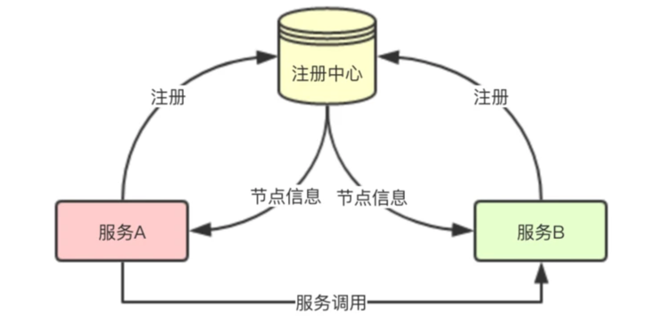
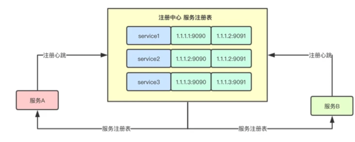
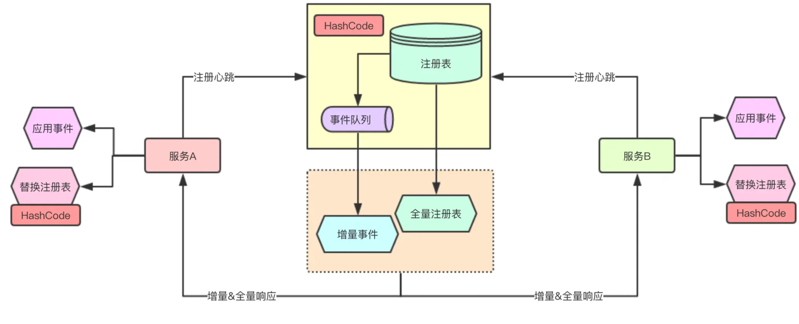
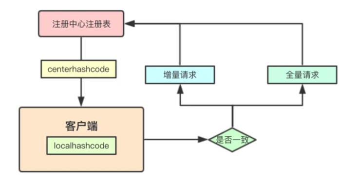

# Consul


## 基本概念
- Agent: 代理是 consul 集群中每个成员的基本单位，他们以守护进程的形式存在，代理有 客户端 以及 服务端 两种角色运行。
所有的节点都必须运行一个代理，它们相互之间通过 DNS 或者 HTTP 接口保持健康检查并同步数据。
- Client: 客户端 是代理的其中一种角色，它会将所有的 RPC 请求转发到 服务端 代理，而 客户端 本身是 无状态 的，而且只会占用非常少的资源并消耗少量的 网络带宽 ，建议每个应用节点都运行一个 客户端
- Server: 服务端 相对而言是一个非常重的代理，它的主要工作包括参与 raft仲裁 、 维护集群状态 、 响应RPC查询 、与其他的数据中心 交换数据、将 查询转发给Leader / 其他数据中心 等。
可以说，服务端是 consul 集群中最重要的角色，所以建议将其放置在相对独立的主机上，并且一个集群（数据中心）中至少需要 3 个以上的 服务端 才能保证 最终一致性 。
- Datacenter: 数据中心 很好理解，其实就是一个 低延迟、高带宽 的私有网络环境，一个稳定的数据中心环境对 raft协议 来说非常重要，否则及其可能出现数据不同步、服务质量下降等情况
- Gossip: 一种保证 最终一致性 的分布式协议，常用于 点对点通信 ，模拟人与人之间的交流从而达到理想中的 最终一致性 。而 consul 通过 UDP 使用该协议提供 成员管理 、失败检测 、事件广播 等功能。

## 节点分类:
1. Consul 分为 Client 和 Server两种节点(所有的节点也被称为Agent)；
2. 其中Server 节点存储和处理请求，同时将数据同步至其他server节点；
3. Client 转发服务注册、服务发现请求到server节点，同时还负责服务的健康检查；
4. 所有的 Server 节点组成了一个集群，他们之间运行 Raft 协议，通过共识仲裁选举出 Leader。所有的业务数据都通过 Leader 写入到集群中做持久化，
当有半数以上的节点存储了该数据后，Server集群才会返回ACK，从而保障了数据的强一致性。所有的 Follower 会跟随 Leader 的脚步，保证其有最新的数据副本

## 数据中心内部通信:
Consul 数据中心内部的所有节点通过 Gossip 协议（8301端口）维护成员关系，这也被叫做LAN GOSSIP。
当数据中心内部发生拓扑变化时，存活的节点们能够及时感知，比如Server节点down掉后，Client 就会将对应Server节点从可用列表中剥离出去。
集群内数据的读写请求既可以直接发到Server，也可以通过 Client 转发到Server，请求最终会到达 Leader 节点。
在允许数据轻微陈旧的情况下，读请求也可以在普通的Server节点完成，集群内数据的读写和复制都是通过8300端口完成

## 跨数据中心通信:
Consul支持多数据中心，上图中有两个 DataCenter，他们通过网络互联，注意为了提高通信效率，只有Server节点才加入跨数据中心的通信。
跨数据中心的 Gossip 协议使用8302端口，也被称为WAN GOSSIP，是全局范围内唯一的。
通常情况下，不同的Consul数据中心之间不会复制数据。当请求另一个数据中心的资源时，Server 会将其转发到目标数据中心的随机Server 节点，该节点随后可以转发给本地 Leader 处理

## 端口说明：

| 端口 | 作用 |
| ------ | ------ |
|8300       |server rpc 端口，同一数据中心 consul server 之间通过该端口通信      |     
|8301       |serf lan 端口，同一数据中心 consul client 通过该端口通信      |     
|8302       |serf wan 端口，不同数据中心 consul server 通过该端口通信       |
|8500       |HTTP API 和 Web 接口使用       |
|8600       |dns 端口，用于服务发现       |

## docker简单安装
```shell
docker run --name consul1 -d -p 8500:8500 -p 8300:8300 -p 8301:8301 -p 8302:8302 -p 8600:8600 consul:latest agent -server -bootstrap-expect 1 -ui -bind=0.0.0.0 -client=0.0.0.0
```
- agent: 表示启动 Agent 进程。
- client：表示启动 Consul Client 模式。
- bind： 监听网口，0.0.0.0 表示所有网口，如果不指定默认未127.0.0.1，则无法和容器通信 
- client 0.0.0.0 -ui 启动Web UI管理工具 
- bootstrap-expect 1

## consul 为我们提供的四大组件
Service Discovery: 当某个应用可用的时候，可以向 consul 客户端注册自己，或者让 consul 客户端通过配置发现自己，这样，如果有需要这个应用的其他应用就可以通过 consul 快速找到一个可用的应用了。

Health Check: consul 客户端提供任意数量的健康检查，包括对应用保持心跳、主机物理资源监控等。健康检查可以被 operator 检测并操作，防止流量进入不健康的主机。

KV Store: 应用按需使用 consul 的 KV存储 ，可以用于动态配置、功能标记、协调、领袖选举等，通过客户端的 HTTP 接口可以灵活方便使用。

Multi Datacenter: consul 提供开箱即用的多数据中心，这意味着用户不需要担心需要建立额外的抽象层让业务扩展到多个区域。


## 注册中心



所有的服务都启动后都通过注册中心来注册自己，同时把注册中心里面的服务信息拉回本地，后续调用，就直接检查本地的服务和节点信息来进行服务节点的调用

每个服务节点都会来注册中心进行服务注册，那数据如何在服务端进行保存呢，其实就是注册表，其实等同于windows 里面的注册表，每个服务都来注册，
把自己的信息上报上来，然后注册中心吧注册表，返回给client端，那服务之间就知道要调用服务的节点啦


微服务注册注册中心通常会大量的服务注册， 那不能每次客户端来请求的时候，服务端都返回全量的数据，在数据传输的设计中，通常会有一种增量同步，其实在注册中心中也类似
注册中心通过将最近的服务变更事件保存在一个事件队列中，后续每次客户端拉取只返回增量数据，这样服务端的忘了压力就会小很多

### 注册中心hashcode

增量数据有一个问题就是，如果客户端错过啦某些事件，比如事件队列满了，则客户端与注册中心的注册表就会不一致， 所以eureka里面引入了一个hashcode的概念，通过比对hashcode是否相同， 如果不同则客户端需要重新全量拉取


## 源码分析


