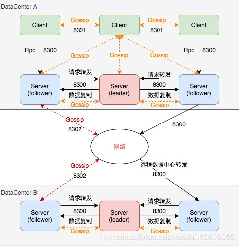

#Consul

##节点分类:
1. Consul 分为 Client 和 Server两种节点(所有的节点也被称为Agent)；
2. 其中Server 节点存储和处理请求，同时将数据同步至其他server节点；
3. Client 转发服务注册、服务发现请求到server节点，同时还负责服务的健康检查；
4. 所有的 Server 节点组成了一个集群，他们之间运行 Raft 协议，通过共识仲裁选举出 Leader。所有的业务数据都通过 Leader 写入到集群中做持久化，
当有半数以上的节点存储了该数据后，Server集群才会返回ACK，从而保障了数据的强一致性。所有的 Follower 会跟随 Leader 的脚步，保证其有最新的数据副本

##数据中心内部通信:
Consul 数据中心内部的所有节点通过 Gossip 协议（8301端口）维护成员关系，这也被叫做LAN GOSSIP。
当数据中心内部发生拓扑变化时，存活的节点们能够及时感知，比如Server节点down掉后，Client 就会将对应Server节点从可用列表中剥离出去。
集群内数据的读写请求既可以直接发到Server，也可以通过 Client 转发到Server，请求最终会到达 Leader 节点。
在允许数据轻微陈旧的情况下，读请求也可以在普通的Server节点完成，集群内数据的读写和复制都是通过8300端口完成

##跨数据中心通信:
Consul支持多数据中心，上图中有两个 DataCenter，他们通过网络互联，注意为了提高通信效率，只有Server节点才加入跨数据中心的通信。
跨数据中心的 Gossip 协议使用8302端口，也被称为WAN GOSSIP，是全局范围内唯一的。
通常情况下，不同的Consul数据中心之间不会复制数据。当请求另一个数据中心的资源时，Server 会将其转发到目标数据中心的随机Server 节点，该节点随后可以转发给本地 Leader 处理

##端口说明：

| 端口 | 作用 |
| ------ | ------ |
|8300       |RPC 调用       |     
|8301       |数据中心内部 GOSSIP 协议使用       |     
|8302       |跨数据中心 GOSSIP 协议使用       |
|8500       |HTTP API 和 Web 接口使用       |
|8600       |用于 DNS 服务端       |

