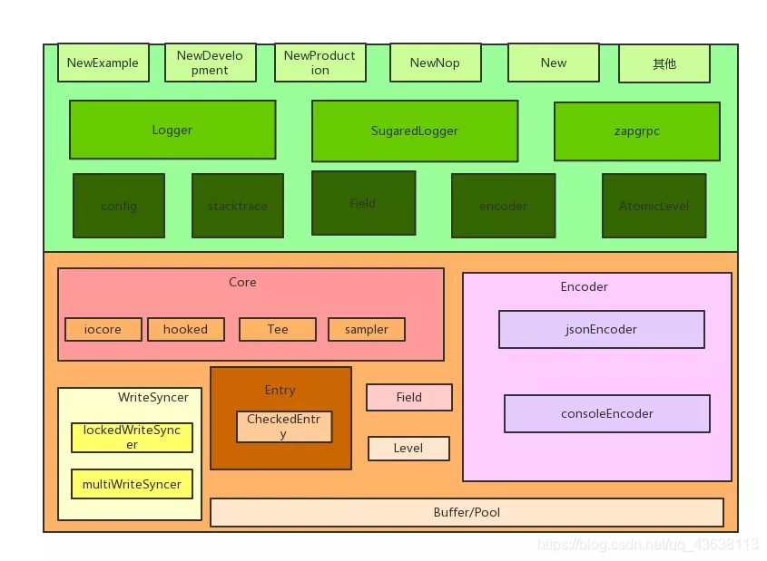

# zap
Zap 跟 logrus 以及目前主流的 Go 语言 log 类似，提倡采用结构化的日志格式，而不是将所有消息放到消息体中，

日志属于 io 密集型的组件, 规避反射 这种类型操作是贯穿在整个 zap 的逻辑中.
zap 每打印1条日志，至少需要2次内存分配:
1. 创建 field 时分配内存。
2. 将组织好的日志格式化成目标 []byte 时分配内存

   zap 通过 sync.Pool 提供的对象池，复用了大量可以复用的对象，避开了 gc 这个大麻烦
## zap结构


通过 zap 打印一条结构化的日志大致包含5个过程：

1. 分配日志 Entry: 创建整个结构体，此时虽然没有传参(fields)进来，但是 fields 参数其实创建了

2. 检查级别，添加core: 如果 logger 同时配置了 hook，则 hook 会在 core check 后把自己添加到 cores 中

3. 根据选项添加 caller info 和 stack 信息: 只有大于等于级别的日志才会创建checked entry

4. Encoder 对 checked entry 进行编码: 创建最终的 byte slice，将 fields 通过自己的编码方式(append)编码成目标串

5. Write 编码后的目标串，并对剩余的 core 执行操作， hook也会在这时被调用


## 日志
日志有两个概念：字段和消息。字段用来结构化输出错误相关的上下文环境，而消息简明扼要的阐述错误本身
```go
//用户不存在的错误消息可以这么打印
log.Error("User does not exist", zap.Int("uid", uid))
```
User does not exist 是消息， 而 uid 是字段

既然是打印日志，一定需要一个接口或者结构体来实现日志打印的功能，在zap中，对外呈现的实现日志打印方法的是Logger结构体而不是接口，这个其实与常见的用接口定义API的模式有点不同。
在zap的设计理念中，Logger虽然是结构体，但Logger中的core却是接口，这个接口可以有不同的实现，core中的方法才是真正实现日志的编码和输出的地方。
而zap.core和Logger几乎是完全解耦的，也为我们按模块学习zap的实现提供了便利

## 源码分析

结构体logger
```go
type Logger struct {
	core zapcore.Core

	development bool
	addCaller   bool
	onFatal     zapcore.CheckWriteAction // default is WriteThenFatal

	name        string
	errorOutput zapcore.WriteSyncer

	addStack zapcore.LevelEnabler

	callerSkip int
}
```


1. 初始化    
zap提供了两类构造Logger的方式，一类是使用了建造者模式的Build方法，一类是接收Option参数的New方法，这两类方法提供的能力完全相同，只是给用户提供了不同的选择

配置结构体
```go

//Config这个结构体每个字段都有json和yaml的标注, 也就是说这些配置不仅仅可以在代码中赋值，也可以从配置文件中直接反序列化得到
type Config struct {
	// Level是用来配置日志级别的，即日志的最低输出级别，这里的AtomicLevel虽然是个结构体，但是如果使用配置文件直接反序列化
	Level AtomicLevel `json:"level" yaml:"level"`
	// 这个字段的含义是用来标记是否为开发者模式，在开发者模式下，日志输出的一些行为会和生产环境上不同
	Development bool `json:"development" yaml:"development"`
	// 用来标记是否开启行号和文件名显示功能。
	// 默认都是标记的
	DisableCaller bool `json:"disableCaller" yaml:"disableCaller"`
	// 标记是否开启调用栈追踪能力，即在打印异常日志时，是否打印调用栈. 
	//By default, stacktraces are captured for WarnLevel and above logs in
	// development and ErrorLevel and above in production.
	DisableStacktrace bool `json:"disableStacktrace" yaml:"disableStacktrace"`
	// Sampling实现了日志的流控功能，或者叫采样配置，主要有两个配置参数，Initial和Thereafter，
	//实现的效果是在1s的时间单位内，如果某个日志级别下同样内容的日志输出数量超过了Initial的数量，
	//那么超过之后，每隔Thereafter的数量，才会再输出一次。是一个对日志输出的保护功能
	Sampling *SamplingConfig `json:"sampling" yaml:"sampling"`
	// 用来指定日志的编码器，也就是用户在调用日志打印接口时，zap内部使用什么样的编码器将日志信息编码为日志条目，日志的编码也是日志组件的一个重点。
	// 默认支持两种配置，json和console，用户可以自行实现自己需要的编码器并注册进日志组件，实现自定义编码的能力
	Encoding string `json:"encoding" yaml:"encoding"`
	// EncoderConfig sets options for the chosen encoder. See
	// zapcore.EncoderConfig for details.
	EncoderConfig zapcore.EncoderConfig `json:"encoderConfig" yaml:"encoderConfig"`
	// 用来指定日志的输出路径，不过这个路径不仅仅支持文件路径和标准输出，还支持其他的自定义协议，
	//当然如果要使用自定义协议，也需要使用RegisterSink方法先注册一个该协议对应的工厂方法，该工厂方法实现了Sink接口
	OutputPaths []string `json:"outputPaths" yaml:"outputPaths"`
	// 与OutputPaths类似，不过用来指定的是错误日志的输出，不过要注意，这个错误日志不是业务的错误日志，
	// 而是zap中出现的内部错误，将会被定向到这个路径下.
	ErrorOutputPaths []string `json:"errorOutputPaths" yaml:"errorOutputPaths"`
	// InitialFields is a collection of fields to add to the root logger.
	InitialFields map[string]interface{} `json:"initialFields" yaml:"initialFields"`
}
```

```go
logger,_ := zap.NewDevelopment()  //开发环境
```
- 第一种：建造者模式分析
```go
// 初始化
func NewDevelopment(options ...Option) (*Logger, error) {
	return NewDevelopmentConfig().Build(options...)
}


// 初始化配置
func NewDevelopmentConfig() Config {
	return Config{
		Level:            NewAtomicLevelAt(DebugLevel),
		Development:      true,
		Encoding:         "console",
		EncoderConfig:    NewDevelopmentEncoderConfig(),
		OutputPaths:      []string{"stderr"},
		ErrorOutputPaths: []string{"stderr"},
	}
}

// 压缩配置
func NewDevelopmentEncoderConfig() zapcore.EncoderConfig {
	return zapcore.EncoderConfig{
		// Keys can be anything except the empty string.
		TimeKey:        "T",
		LevelKey:       "L",
		NameKey:        "N",
		CallerKey:      "C",
		FunctionKey:    zapcore.OmitKey,
		MessageKey:     "M",
		StacktraceKey:  "S",
		LineEnding:     zapcore.DefaultLineEnding,
		EncodeLevel:    zapcore.CapitalLevelEncoder,
		EncodeTime:     zapcore.ISO8601TimeEncoder,
		EncodeDuration: zapcore.StringDurationEncoder,
		EncodeCaller:   zapcore.ShortCallerEncoder,
	}
}
```
开始构造
```go
func (cfg Config) Build(opts ...Option) (*Logger, error) {
	enc, err := cfg.buildEncoder()
	if err != nil {
		return nil, err
	}

	sink, errSink, err := cfg.openSinks()
	if err != nil {
		return nil, err
	}

	if cfg.Level == (AtomicLevel{}) {
		return nil, fmt.Errorf("missing Level")
	}

	log := New(
		zapcore.NewCore(enc, sink, cfg.Level),
		cfg.buildOptions(errSink)...,
	)
	if len(opts) > 0 {
		log = log.WithOptions(opts...)
	}
	return log, nil
}

//  构建编码
func (cfg Config) buildEncoder() (zapcore.Encoder, error) {
   return newEncoder(cfg.Encoding, cfg.EncoderConfig)
}

// 打开路径
func (cfg Config) openSinks() (zapcore.WriteSyncer, zapcore.WriteSyncer, error) {
	sink, closeOut, err := Open(cfg.OutputPaths...)
	if err != nil {
		return nil, nil, err
	}
	errSink, _, err := Open(cfg.ErrorOutputPaths...)
	if err != nil {
		closeOut()
		return nil, nil, err
	}
	return sink, errSink, nil
}
```


3. 打印案例
```go
logger.Error("logger", zap.String("name", "修华师"))
```
分析
```go
/**
入口方法，参数信息如下：
msg：消息
fields :结构字段信息，可以是0-N个
*/
func (log *Logger) Error(msg string, fields ...Field) {
    //校验是否需要输出 ErrorLevel 日志
	if ce := log.check(ErrorLevel, msg); ce != nil {
		ce.Write(fields...)
	}
}

// 校验等级
func (log *Logger) check(lvl zapcore.Level, msg string) *zapcore.CheckedEntry {
	// 定义skip，这是为了打印日志caller的信息(通过runtime.Caller(skip))获取
	const callerSkipOffset = 2

	//如果lvl<定义的日志级别，则直接返回
	if lvl < zapcore.DPanicLevel && !log.core.Enabled(lvl) {
		return nil
	}

	// 封装日志entry，包含了日志的基本信息：time，level，msg，name
	ent := zapcore.Entry{
		LoggerName: log.name,
		Time:       time.Now(),
		Level:      lvl,
		Message:    msg,
	}
    //从对象池中取出CheckedEntry信息，并将core对象和上面的entry对象赋值给CheckedEntry对象
	ce := log.core.Check(ent, nil)
	willWrite := ce != nil

	// 定义输出后的行为，如果是PanicLevel，FatalLevel 输出完日志后，直接退出
    //如果是DPanicLevel，则只有在定义了development=true的环境下，才会退出
	switch ent.Level {
	case zapcore.PanicLevel:
		ce = ce.Should(ent, zapcore.WriteThenPanic)
	case zapcore.FatalLevel:
		onFatal := log.onFatal
		// Noop is the default value for CheckWriteAction, and it leads to
		// continued execution after a Fatal which is unexpected.
		if onFatal == zapcore.WriteThenNoop {
			onFatal = zapcore.WriteThenFatal
		}
		ce = ce.Should(ent, onFatal)
	case zapcore.DPanicLevel:
		if log.development {
			ce = ce.Should(ent, zapcore.WriteThenPanic)
		}
	}

	// Only do further annotation if we're going to write this message; checked
	// entries that exist only for terminal behavior don't benefit from
	// annotation.
	if !willWrite {
		return ce
	}

	// 将错误输出赋值给CheckedEntry对象
	ce.ErrorOutput = log.errorOutput
    //是否需要输出调用者信息，如：行号，文件等
	if log.addCaller {
		frame, defined := getCallerFrame(log.callerSkip + callerSkipOffset)
		if !defined {
			fmt.Fprintf(log.errorOutput, "%v Logger.check error: failed to get caller\n", time.Now().UTC())
			log.errorOutput.Sync()
		}

		ce.Entry.Caller = zapcore.EntryCaller{
			Defined:  defined,
			PC:       frame.PC,
			File:     frame.File,
			Line:     frame.Line,
			Function: frame.Function,
		}
	}
	// 是否需要将调用者信息记录到stack中
	if log.addStack.Enabled(ce.Entry.Level) {
		ce.Entry.Stack = StackSkip("", log.callerSkip+callerSkipOffset).String
	}

	return ce
}
```

```go
func (ce *CheckedEntry) Write(fields ...Field) {
	if ce == nil {
		return
	}

	//是否是二次输出，如果是，则会警告是Unsafe，直接返回
    //之所以这么做是为了避免从对象池中拿到的CheckedEntry做了多次的write
	if ce.dirty {
		if ce.ErrorOutput != nil {
			// Make a best effort to detect unsafe re-use of this CheckedEntry.
			// If the entry is dirty, log an internal error; because the
			// CheckedEntry is being used after it was returned to the pool,
			// the message may be an amalgamation from multiple call sites.
			fmt.Fprintf(ce.ErrorOutput, "%v Unsafe CheckedEntry re-use near Entry %+v.\n", time.Now(), ce.Entry)
			ce.ErrorOutput.Sync()
		}
		return
	}
	ce.dirty = true

	var err error
    //开始输出，zap可以允许有多个输出终端，所以会有多个core的情况
	for i := range ce.cores {
		// 输出的终端是有用户定义，
		err = multierr.Append(err, ce.cores[i].Write(ce.Entry, fields))
	}
	if ce.ErrorOutput != nil {
		if err != nil {
			fmt.Fprintf(ce.ErrorOutput, "%v write error: %v\n", time.Now(), err)
			ce.ErrorOutput.Sync()
		}
	}

	should, msg := ce.should, ce.Message
	putCheckedEntry(ce)

	switch should {
	case WriteThenPanic:
		panic(msg)
	case WriteThenFatal:
		exit.Exit()
	case WriteThenGoexit:
		runtime.Goexit()
	}
}
```


