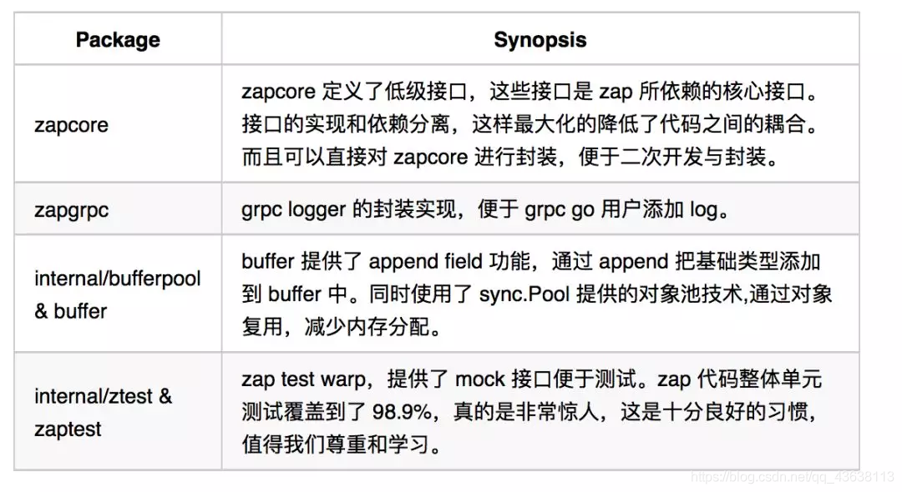
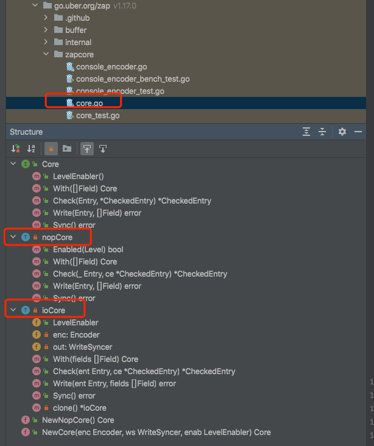

<!-- START doctoc generated TOC please keep comment here to allow auto update -->
<!-- DON'T EDIT THIS SECTION, INSTEAD RE-RUN doctoc TO UPDATE -->
**Table of Contents**  *generated with [DocToc](https://github.com/thlorenz/doctoc)*

- [zap](#zap)
  - [zap结构](#zap%E7%BB%93%E6%9E%84)
  - [日志](#%E6%97%A5%E5%BF%97)
  - [源码分析](#%E6%BA%90%E7%A0%81%E5%88%86%E6%9E%90)
    - [结构体logger](#%E7%BB%93%E6%9E%84%E4%BD%93logger)
    - [1. 初始化](#1-%E5%88%9D%E5%A7%8B%E5%8C%96)
      - [1. 第一种：建造者模式分析](#1-%E7%AC%AC%E4%B8%80%E7%A7%8D%E5%BB%BA%E9%80%A0%E8%80%85%E6%A8%A1%E5%BC%8F%E5%88%86%E6%9E%90)
      - [2. 第二种: 自定义的new方法](#2-%E7%AC%AC%E4%BA%8C%E7%A7%8D-%E8%87%AA%E5%AE%9A%E4%B9%89%E7%9A%84new%E6%96%B9%E6%B3%95)
    - [zapcore](#zapcore)
    - [打印案例](#%E6%89%93%E5%8D%B0%E6%A1%88%E4%BE%8B)

<!-- END doctoc generated TOC please keep comment here to allow auto update -->

# zap
Zap 跟 logrus 以及目前主流的 Go 语言 log 类似，提倡采用结构化的日志格式，而不是将所有消息放到消息体中，

日志属于 io 密集型的组件, 规避反射 这种类型操作是贯穿在整个 zap 的逻辑中.
zap 每打印1条日志，至少需要2次内存分配:
1. 创建 field 时分配内存。
2. 将组织好的日志格式化成目标 []byte 时分配内存

zap 通过 sync.Pool 提供的对象池，复用了大量可以复用的对象，避开了 gc 这个大麻烦

## zap结构



通过 zap 打印一条结构化的日志大致包含5个过程：

1. 分配日志 Entry: 创建整个结构体，此时虽然没有传参(fields)进来，但是 fields 参数其实创建了

2. 检查级别，添加core: 如果 logger 同时配置了 hook，则 hook 会在 core check 后把自己添加到 cores 中

3. 根据选项添加 caller info 和 stack 信息: 只有大于等于级别的日志才会创建checked entry

4. Encoder 对 checked entry 进行编码: 创建最终的 byte slice，将 fields 通过自己的编码方式(append)编码成目标串

5. Write 编码后的目标串，并对剩余的 core 执行操作， hook也会在这时被调用


## 日志
日志有两个概念：字段和消息。字段用来结构化输出错误相关的上下文环境，而消息简明扼要的阐述错误本身
```go
//用户不存在的错误消息可以这么打印
log.Error("User does not exist", zap.Int("uid", uid))
```
User does not exist 是消息， 而 uid 是字段

既然是打印日志，一定需要一个接口或者结构体来实现日志打印的功能，在zap中，对外呈现的实现日志打印方法的是Logger结构体而不是接口，这个其实与常见的用接口定义API的模式有点不同。
在zap的设计理念中，Logger虽然是结构体，但Logger中的core却是接口，这个接口可以有不同的实现，core中的方法才是真正实现日志的编码和输出的地方。
而zap.core和Logger几乎是完全解耦的，也为我们按模块学习zap的实现提供了便利

## 源码分析

### 结构体logger
```go
type Logger struct {
	core zapcore.Core  //定义了输出日志核心接口

	development bool
	addCaller   bool //是否输出调用者的信息
	onFatal     zapcore.CheckWriteAction // default is WriteThenFatal

	name        string
	errorOutput zapcore.WriteSyncer // 错误输出终端，注意区别于zapcore中的输出，这里一般是指做运行过程中，发生错误记录日志（如：参数错误，未定义错误等），默认是os.Stderr

	addStack zapcore.LevelEnabler //需要记录stack信息的日志级别

	callerSkip int //调用者的层级：用于指定记录哪个调用者信息
}
```
Note: 定义了与输出相关的基本信息，比如：name，stack，core等，我们可以看到这些属性都是不对外公开的，所以不能直接初始化结构体.
zap为我们提供了New，Build两种方式来初始化Logger。除了core以外，其他的都可以通过Option来设置。


### 1. 初始化    
zap提供了两类构造Logger的方式，一类是使用了建造者模式的Build方法，一类是接收Option参数的New方法，这两类方法提供的能力完全相同，只是给用户提供了不同的选择


```go
logger,_ := zap.NewDevelopment()  //开发环境
```
#### 1. 第一种：建造者模式分析
```go
//开发环境下的Logger
func NewDevelopment(options ...Option) (*Logger, error) {
    return NewDevelopmentConfig().Build(options...)
}
//生产环境下的Logger
func NewProduction(options ...Option) (*Logger, error) {
    return NewProductionConfig().Build(options...)
}
//测试环境下的Logger
func NewExample(options ...Option) *Logger {
    encoderCfg := zapcore.EncoderConfig{
        MessageKey:     "msg",
        LevelKey:       "level",
        NameKey:        "logger",
        EncodeLevel:    zapcore.LowercaseLevelEncoder,
        EncodeTime:     zapcore.ISO8601TimeEncoder,
        EncodeDuration: zapcore.StringDurationEncoder,
    }
    core := zapcore.NewCore(zapcore.NewJSONEncoder(encoderCfg), os.Stdout, DebugLevel)
    return New(core).WithOptions(options...)
}
```
不同的构造方式，唯一不同的就是Config.
```go

//Config这个结构体每个字段都有json和yaml的标注, 也就是说这些配置不仅仅可以在代码中赋值，也可以从配置文件中直接反序列化得到
type Config struct {
	// Level是用来配置日志级别的，即日志的最低输出级别，这里的AtomicLevel虽然是个结构体，但是如果使用配置文件直接反序列化
	Level AtomicLevel `json:"level" yaml:"level"`
	// 这个字段的含义是用来标记是否为开发者模式，在开发者模式下，日志输出的一些行为会和生产环境上不同
	Development bool `json:"development" yaml:"development"`
	// 用来标记是否开启行号和文件名显示功能。
	// 默认都是标记的
	DisableCaller bool `json:"disableCaller" yaml:"disableCaller"`
	// 标记是否开启调用栈追踪能力，即在打印异常日志时，是否打印调用栈. 
	//By default, stacktraces are captured for WarnLevel and above logs in
	// development and ErrorLevel and above in production.
	DisableStacktrace bool `json:"disableStacktrace" yaml:"disableStacktrace"`
	// Sampling实现了日志的流控功能，或者叫采样配置，主要有两个配置参数，Initial和Thereafter，
	//实现的效果是在1s的时间单位内，如果某个日志级别下同样内容的日志输出数量超过了Initial的数量，
	//那么超过之后，每隔Thereafter的数量，才会再输出一次。是一个对日志输出的保护功能
	Sampling *SamplingConfig `json:"sampling" yaml:"sampling"`
	
	// 用来指定日志的编码器，也就是用户在调用日志打印接口时，zap内部使用什么样的编码器将日志信息编码为日志条目，日志的编码也是日志组件的一个重点。
	// 默认支持两种配置，json和console，用户可以自行实现自己需要的编码器并注册进日志组件，实现自定义编码的能力
	Encoding string `json:"encoding" yaml:"encoding"`
	

	// 定义了输出样式
	EncoderConfig zapcore.EncoderConfig `json:"encoderConfig" yaml:"encoderConfig"`
	
	// 用来指定日志的输出路径，不过这个路径不仅仅支持文件路径和标准输出，还支持其他的自定义协议，
	//当然如果要使用自定义协议，也需要使用RegisterSink方法先注册一个该协议对应的工厂方法，该工厂方法实现了Sink接口
	OutputPaths []string `json:"outputPaths" yaml:"outputPaths"`
	
	// 与OutputPaths类似，不过用来指定的是错误日志的输出，不过要注意，这个错误日志不是业务的错误日志，
	// 而是zap中出现的内部错误，将会被定向到这个路径下.
	ErrorOutputPaths []string `json:"errorOutputPaths" yaml:"errorOutputPaths"`
	
	// 初始化的Fields，每行日志都会爱上这些Field
	InitialFields map[string]interface{} `json:"initialFields" yaml:"initialFields"`
}
```

zapcore.EncoderConfig
```go
type EncoderConfig struct {
    //*Key：设置的是在结构化输出时，value对应的key
    MessageKey    string `json:"messageKey" yaml:"messageKey"`
    LevelKey      string `json:"levelKey" yaml:"levelKey"`
    TimeKey       string `json:"timeKey" yaml:"timeKey"`
    NameKey       string `json:"nameKey" yaml:"nameKey"`
    CallerKey     string `json:"callerKey" yaml:"callerKey"`
    StacktraceKey string `json:"stacktraceKey" yaml:"stacktraceKey"`
    //日志的结束符
    LineEnding    string `json:"lineEnding" yaml:"lineEnding"`
    
    //Level的输出样式，比如 大小写，颜色等
    EncodeLevel    LevelEncoder    `json:"levelEncoder" yaml:"levelEncoder"`
    
    //日志时间的输出样式
    EncodeTime     TimeEncoder     `json:"timeEncoder" yaml:"timeEncoder"`
    
    //消耗时间的输出样式
    EncodeDuration DurationEncoder `json:"durationEncoder" yaml:"durationEncoder"`
    
    //Caller的输出样式，比如 全名称，短名称
    EncodeCaller   CallerEncoder   `json:"callerEncoder" yaml:"callerEncoder"`
    
    // Unlike the other primitive type encoders, EncodeName is optional. The
    // zero value falls back to FullNameEncoder.
    EncodeName NameEncoder `json:"nameEncoder" yaml:"nameEncoder"`
}
```

拿开发环境进行讲解
```go
// 初始化
func NewDevelopment(options ...Option) (*Logger, error) {
	return NewDevelopmentConfig().Build(options...)
}


// 初始化配置
func NewDevelopmentConfig() Config {
	return Config{
		Level:            NewAtomicLevelAt(DebugLevel),
		Development:      true,
		Encoding:         "console",
		EncoderConfig:    NewDevelopmentEncoderConfig(), //序列化配置
		OutputPaths:      []string{"stderr"},
		ErrorOutputPaths: []string{"stderr"},
	}
}

// 序列化配置
func NewDevelopmentEncoderConfig() zapcore.EncoderConfig {
	return zapcore.EncoderConfig{
		// Keys can be anything except the empty string.
		TimeKey:        "T",
		LevelKey:       "L",
		NameKey:        "N",
		CallerKey:      "C",
		FunctionKey:    zapcore.OmitKey,
		MessageKey:     "M",
		StacktraceKey:  "S",
		LineEnding:     zapcore.DefaultLineEnding,
		EncodeLevel:    zapcore.CapitalLevelEncoder,
		EncodeTime:     zapcore.ISO8601TimeEncoder,
		EncodeDuration: zapcore.StringDurationEncoder,
		EncodeCaller:   zapcore.ShortCallerEncoder,
	}
}
```
开始构造
```go
func (cfg Config) Build(opts ...Option) (*Logger, error) {
	enc, err := cfg.buildEncoder()
	if err != nil {
		return nil, err
	}

	sink, errSink, err := cfg.openSinks()
	if err != nil {
		return nil, err
	}

	if cfg.Level == (AtomicLevel{}) {
		return nil, fmt.Errorf("missing Level")
	}

	log := New(
		zapcore.NewCore(enc, sink, cfg.Level),
		cfg.buildOptions(errSink)...,
	)
	if len(opts) > 0 {
		log = log.WithOptions(opts...)
	}
	return log, nil
}

//  构建编码
func (cfg Config) buildEncoder() (zapcore.Encoder, error) {
   return newEncoder(cfg.Encoding, cfg.EncoderConfig)
}

// 打开路径
func (cfg Config) openSinks() (zapcore.WriteSyncer, zapcore.WriteSyncer, error) {
	sink, closeOut, err := Open(cfg.OutputPaths...)
	if err != nil {
		return nil, nil, err
	}
	errSink, _, err := Open(cfg.ErrorOutputPaths...)
	if err != nil {
		closeOut()
		return nil, nil, err
	}
	return sink, errSink, nil
}
```

#### 2. 第二种: 自定义的new方法
```go
func New(core zapcore.Core, options ...Option) *Logger {
	if core == nil {
		return NewNop()
	}
	log := &Logger{
		core:        core,
		errorOutput: zapcore.Lock(os.Stderr),
		addStack:    zapcore.FatalLevel + 1,
	}
	return log.WithOptions(options...)
}
```
option
```go
// An Option configures a Logger.
type Option interface {
	apply(*Logger)
}

// optionFunc wraps a func so it satisfies the Option interface.
type optionFunc func(*Logger)

func (f optionFunc) apply(log *Logger) {
	f(log)
}

// 以下是实现option
//设置成开发模式
func Development() Option {
    return optionFunc(func(log *Logger) {
        log.development = true
    })
}
//自定义错误输出路径
func ErrorOutput(w zapcore.WriteSyncer) Option {
    return optionFunc(func(log *Logger) {
        log.errorOutput = w
    })
}
//Logger的结构化字段，每条日志都会打印这些Filed信息
func Fields(fs ...Field) Option {
    return optionFunc(func(log *Logger) {
        log.core = log.core.With(fs)
    })
}
//日志添加调用者信息
func AddCaller() Option {
    return WithCaller(true)
}
func WithCaller(enabled bool) Option {
    return optionFunc(func(log *Logger) {
        log.addCaller = enabled
    })
}

//设置skip，用户runtime.Caller的参数
func AddCallerSkip(skip int) Option {
    return optionFunc(func(log *Logger) {
        log.callerSkip += skip
    })
}

//设置stack
func AddStacktrace(lvl zapcore.LevelEnabler) Option {
    return optionFunc(func(log *Logger) {
        log.addStack = lvl
    })
}
```

zap还为我们添加了hook，让我们在每次打印日志的时候，可以调用hook方法：比如可以统计打印日志的次数、统计打印字段等.
```go
func Hooks(hooks ...func(zapcore.Entry) error) Option {
    return optionFunc(func(log *Logger) {
        log.core = zapcore.RegisterHooks(log.core, hooks...)
    })
}
```

### zapcore
zapcore是一个接口，之所以定义成接口，是因为zap需要提供不同的实现，做到接口与实现解耦，充分体现了面向接口编程的设计思路。
```go
type Core interface {
    //level接口：是用来根据日志级别判断日志是否应该输出
    LevelEnabler

    //添加结构化字段的方法
    With([]Field) Core
    
    //从对象池取出CheckedEntry对象，并关联输出实体entry和core信息
    Check(Entry, *CheckedEntry) *CheckedEntry
    
    //写入日志的方法
    Write(Entry, []Field) error
    
    //刷新到终端的方法
    Sync() error
}
```

实现


初始化
```go
// NewCore creates a Core that writes logs to a WriteSyncer.
func NewCore(enc Encoder, ws WriteSyncer, enab LevelEnabler) Core {
	return &ioCore{
		LevelEnabler: enab,
		enc:          enc,
		out:          ws,
	}
}

type ioCore struct {
	LevelEnabler //继承 Enabled(Level) bool方法
	enc Encoder // zapcore.NewConsoleEncoder 非结构化日志,zapcore.NewJSONEncoder 结构化日志
    out WriteSyncer
}
```

为了线程问题，我们在里面可以看到大量的clone方法，这一点值得我们借鉴
```go
func (c *ioCore) With(fields []Field) Core {
    clone := c.clone()
    addFields(clone.enc, fields)
    return clone
}
func (c *ioCore) clone() *ioCore {
    return &ioCore{
        LevelEnabler: c.LevelEnabler,
        enc:          c.enc.Clone(),
        out:          c.out,
    }
}
```

hooked提供钩子方法
```go
type hooked struct {
    Core  //组合了其他的Core，比如：multiCore，ioCore等
    funcs []func(Entry) error //钩子方法，在Write时，会调用该方法
}

func (h *hooked) Write(ent Entry, _ []Field) error {
    var err error
    for i := range h.funcs {
        err = multierr.Append(err, h.funcs[i](ent))
    }
    return err
}
```

使用
```go
logger = zap.New(core, zap.AddCaller(), zap.AddStacktrace(zap.WarnLevel), zap.Hooks(func(entry zapcore.Entry) error {//定义钩子函数
        fmt.Println("hooked called")
        return nil
    })) 
//打印日志
logger.Info("logger", zap.String("name", "修华师"))

// 结果
// {"level":"INFO","ts":"2020-05-18 15:20:56","file":"test/main.go:35","msg":"logger","name":"修华师"}
//hooked called
```


### 打印案例
```go
logger.Error("logger", zap.String("name", "修华师"))
```
分析
```go
/**
入口方法，参数信息如下：
msg：消息
fields :结构字段信息，可以是0-N个
*/
func (log *Logger) Error(msg string, fields ...Field) {
    //校验是否需要输出 ErrorLevel 日志
	if ce := log.check(ErrorLevel, msg); ce != nil {
		ce.Write(fields...)
	}
}

// 校验等级
func (log *Logger) check(lvl zapcore.Level, msg string) *zapcore.CheckedEntry {
	// 定义skip，这是为了打印日志caller的信息(通过runtime.Caller(skip))获取
	const callerSkipOffset = 2

	//如果lvl<定义的日志级别，则直接返回
	if lvl < zapcore.DPanicLevel && !log.core.Enabled(lvl) {
		return nil
	}

	// 封装日志entry，包含了日志的基本信息：time，level，msg，name
	ent := zapcore.Entry{
		LoggerName: log.name,
		Time:       time.Now(),
		Level:      lvl,
		Message:    msg,
	}
    //从对象池中取出CheckedEntry信息，并将core对象和上面的entry对象赋值给CheckedEntry对象
	ce := log.core.Check(ent, nil)
	willWrite := ce != nil

	// 定义输出后的行为，如果是PanicLevel，FatalLevel 输出完日志后，直接退出
    //如果是DPanicLevel，则只有在定义了development=true的环境下，才会退出
	switch ent.Level {
	case zapcore.PanicLevel:
		ce = ce.Should(ent, zapcore.WriteThenPanic)
	case zapcore.FatalLevel:
		onFatal := log.onFatal
		// Noop is the default value for CheckWriteAction, and it leads to
		// continued execution after a Fatal which is unexpected.
		if onFatal == zapcore.WriteThenNoop {
			onFatal = zapcore.WriteThenFatal
		}
		ce = ce.Should(ent, onFatal)
	case zapcore.DPanicLevel:
		if log.development {
			ce = ce.Should(ent, zapcore.WriteThenPanic)
		}
	}

	// Only do further annotation if we're going to write this message; checked
	// entries that exist only for terminal behavior don't benefit from
	// annotation.
	if !willWrite {
		return ce
	}

	// 将错误输出赋值给CheckedEntry对象
	ce.ErrorOutput = log.errorOutput
    //是否需要输出调用者信息，如：行号，文件等
	if log.addCaller {
		frame, defined := getCallerFrame(log.callerSkip + callerSkipOffset)
		if !defined {
			fmt.Fprintf(log.errorOutput, "%v Logger.check error: failed to get caller\n", time.Now().UTC())
			log.errorOutput.Sync()
		}

		ce.Entry.Caller = zapcore.EntryCaller{
			Defined:  defined,
			PC:       frame.PC,
			File:     frame.File,
			Line:     frame.Line,
			Function: frame.Function,
		}
	}
	// 是否需要将调用者信息记录到stack中
	if log.addStack.Enabled(ce.Entry.Level) {
		ce.Entry.Stack = StackSkip("", log.callerSkip+callerSkipOffset).String
	}

	return ce
}
```

```go
func (ce *CheckedEntry) Write(fields ...Field) {
	if ce == nil {
		return
	}

	//是否是二次输出，如果是，则会警告是Unsafe，直接返回
    //之所以这么做是为了避免从对象池中拿到的CheckedEntry做了多次的write
	if ce.dirty {
		if ce.ErrorOutput != nil {
			// Make a best effort to detect unsafe re-use of this CheckedEntry.
			// If the entry is dirty, log an internal error; because the
			// CheckedEntry is being used after it was returned to the pool,
			// the message may be an amalgamation from multiple call sites.
			fmt.Fprintf(ce.ErrorOutput, "%v Unsafe CheckedEntry re-use near Entry %+v.\n", time.Now(), ce.Entry)
			ce.ErrorOutput.Sync()
		}
		return
	}
	ce.dirty = true

	var err error
    //开始输出，zap可以允许有多个输出终端，所以会有多个core的情况
	for i := range ce.cores {
		// 输出的终端是有用户定义，
		err = multierr.Append(err, ce.cores[i].Write(ce.Entry, fields))
	}
	if ce.ErrorOutput != nil {
		if err != nil {
			fmt.Fprintf(ce.ErrorOutput, "%v write error: %v\n", time.Now(), err)
			ce.ErrorOutput.Sync()
		}
	}

	should, msg := ce.should, ce.Message
	putCheckedEntry(ce)

	switch should {
	case WriteThenPanic:
		panic(msg)
	case WriteThenFatal:
		exit.Exit()
	case WriteThenGoexit:
		runtime.Goexit()
	}
}
```


