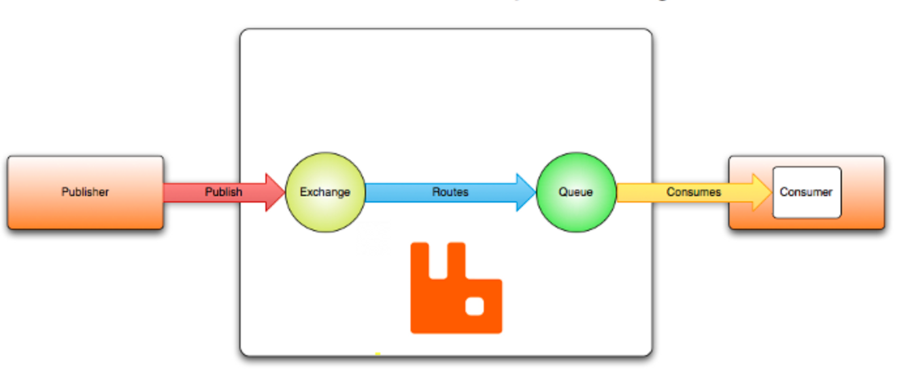
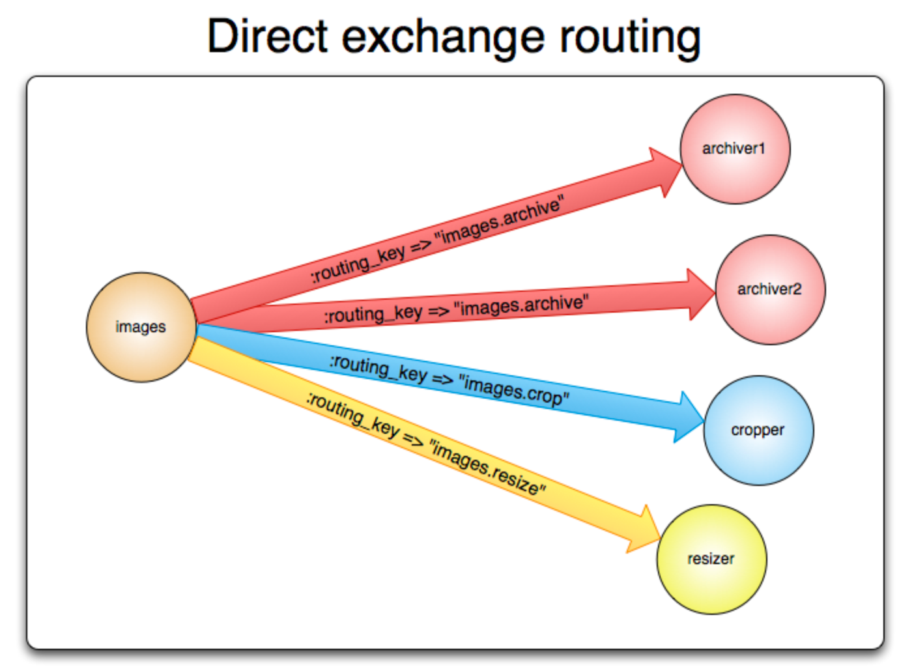
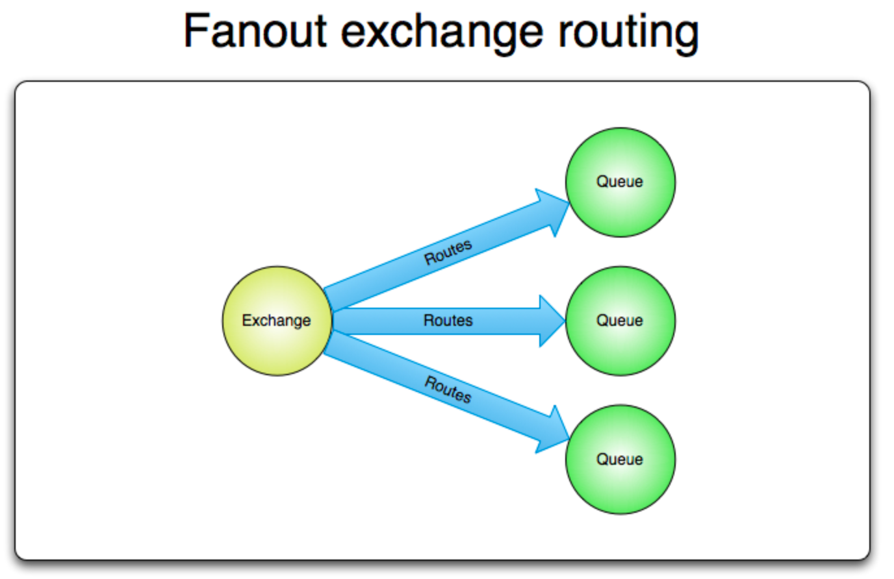
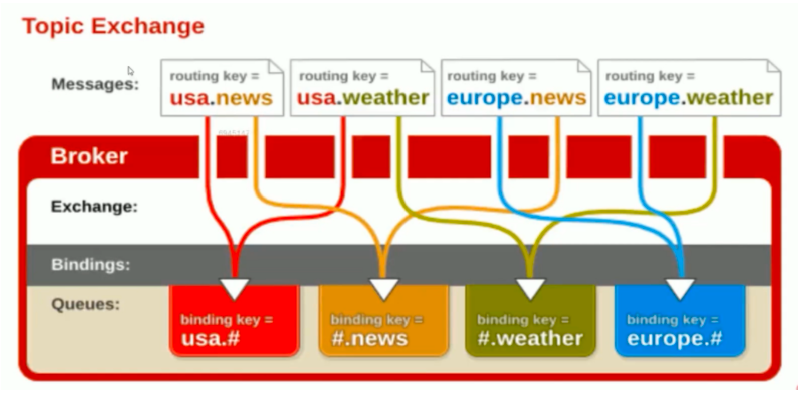
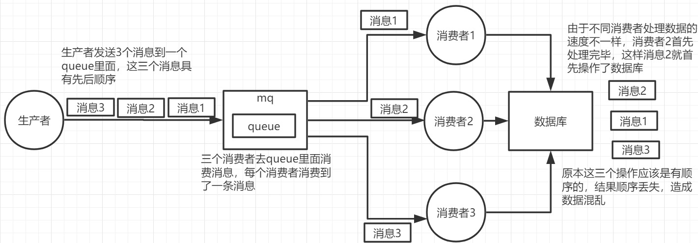
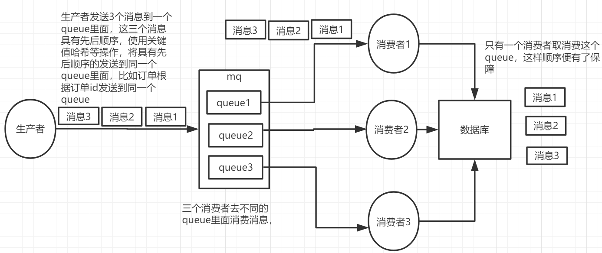
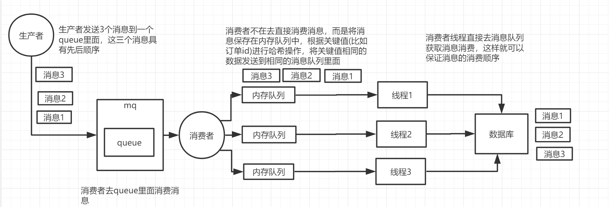
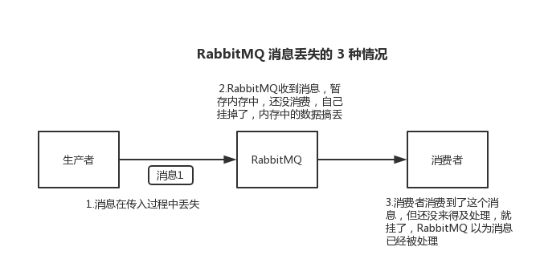

<!-- START doctoc generated TOC please keep comment here to allow auto update -->
<!-- DON'T EDIT THIS SECTION, INSTEAD RE-RUN doctoc TO UPDATE -->
**Table of Contents**  *generated with [DocToc](https://github.com/thlorenz/doctoc)*

- [RabbitMq 简介](#rabbitmq-%E7%AE%80%E4%BB%8B)
  - [docker安装](#docker%E5%AE%89%E8%A3%85)
  - [工作流程](#%E5%B7%A5%E4%BD%9C%E6%B5%81%E7%A8%8B)
  - [交换机](#%E4%BA%A4%E6%8D%A2%E6%9C%BA)
    - [1. 直连型交换机（ Direct Exchange）](#1-%E7%9B%B4%E8%BF%9E%E5%9E%8B%E4%BA%A4%E6%8D%A2%E6%9C%BA-direct-exchange)
    - [2. 扇型交换机 （ Fanout Exchange）](#2-%E6%89%87%E5%9E%8B%E4%BA%A4%E6%8D%A2%E6%9C%BA--fanout-exchange)
    - [3. 主题交换机（ Topic Exchanges）](#3-%E4%B8%BB%E9%A2%98%E4%BA%A4%E6%8D%A2%E6%9C%BA-topic-exchanges)
    - [4. 头交换机 (Headers exchange)](#4-%E5%A4%B4%E4%BA%A4%E6%8D%A2%E6%9C%BA-headers-exchange)
  - [队列（ Queue)](#%E9%98%9F%E5%88%97-queue)
  - [消息确认 (acknowledgement)](#%E6%B6%88%E6%81%AF%E7%A1%AE%E8%AE%A4-acknowledgement)
  - [消息](#%E6%B6%88%E6%81%AF)
  - [连接 (Connection)](#%E8%BF%9E%E6%8E%A5-connection)
  - [通道 （channels）](#%E9%80%9A%E9%81%93-channels)
  - [虚拟主机 (vhost)](#%E8%99%9A%E6%8B%9F%E4%B8%BB%E6%9C%BA-vhost)
  - [消息的顺序性](#%E6%B6%88%E6%81%AF%E7%9A%84%E9%A1%BA%E5%BA%8F%E6%80%A7)
    - [出现消费顺序错乱的情况](#%E5%87%BA%E7%8E%B0%E6%B6%88%E8%B4%B9%E9%A1%BA%E5%BA%8F%E9%94%99%E4%B9%B1%E7%9A%84%E6%83%85%E5%86%B5)
  - [消息的可靠性](#%E6%B6%88%E6%81%AF%E7%9A%84%E5%8F%AF%E9%9D%A0%E6%80%A7)
    - [丢失的场景](#%E4%B8%A2%E5%A4%B1%E7%9A%84%E5%9C%BA%E6%99%AF)
    - [保证消息可靠性的方法](#%E4%BF%9D%E8%AF%81%E6%B6%88%E6%81%AF%E5%8F%AF%E9%9D%A0%E6%80%A7%E7%9A%84%E6%96%B9%E6%B3%95)

<!-- END doctoc generated TOC please keep comment here to allow auto update -->

# RabbitMq 简介

## docker安装
```shell script
docker run -d --hostname my-rabbit --name rmq -p 15672:15672 -p 5672:5672 -p 25672:25672 -e RABBITMQ_DEFAULT_USER=用户名 -e RABBITMQ_DEFAULT_PASS=密码 rabbitmq:3-management
```

通过命令可以看出，一共映射了三个端口，简单说下这三个端口是干什么的。
5672：连接生产者、消费者的端口。
15672：WEB管理页面的端口。
25672：分布式集群的端口

## 工作流程



1. 消息（Message）被发布者（Publisher）发送给交换机（Exchange）
2. 交换机（Exchange）可以理解成邮局，交换机将收到的消息根据路由规则分发给绑定的队列（Queue）
3. 最后，AMQP代理会将消息投递给订阅了此队列的消费者（Consumer），或者消费者按照需求自行获取。

## 交换机
交换机 用来传输消息的，交换机拿到一个消息之后将它路由给一个队列。
```css

Name（交换机类型）	        默认名称
Direct exchange（直连交换机）	(空字符串),amq.direct
Fanout exchange（扇型交换机）	amq.fanout
Topic exchange（主题交换机）	amq.topic
Headers exchange（头交换机）	amq.match (and amq.headers in RabbitMQ)

```
交换机状态

    交换机可以有两个状态：持久（durable）、暂存（transient）。持久化的交换机会在消息代理（broker）重启后依旧存在，而暂存的交换机则不会
### 1. 直连型交换机（ Direct Exchange）

工作流程

* 将一个队列绑定到某个交换机上，同时赋予该绑定（Binding）一个路由键（routing key）
* 当一个携带着路由键为 “key1” 的消息被发送给直连交换机时，交换机会把它路由给 “Binding名称等于 key1” 的队列。

### 2. 扇型交换机 （ Fanout Exchange）

不管 消息的Routing Key，广播给这个交换机下的所有绑定队列。

### 3. 主题交换机（ Topic Exchanges）

工作流程

    *为绑定的 Routing Key 指定一个 “主题”。模式匹配用用 *, # 等字符进行模糊匹配。比如 usa.# 表示 以 usa.开头的多个消息 到这里来。
    *交换机将按消息的 Routing Key 的值的不同路由到 匹配的主题队列

### 4. 头交换机 (Headers exchange)
头交换机使用多个消息属性来代替路由键建立路由规则。通过判断消息头的值能否与指定的绑定相匹配来确立路由规则。
  

## 队列（ Queue)
    队列 存储着即将被应用消费掉的消息

队列持久化

    持久化队列（Durable queues）会被存储在磁盘上，当消息代理（broker）重启的时候，它可以被重新恢复。
    没有被持久化的队列称作暂存队列（Transient queues）

## 消息确认 (acknowledgement)
什么时候删除消息才是正确的？有两种情况

    *自动确认模式：当消息代理（broker）将消息发送给应用后立即删除。
    *显式确认模式：待应用（application）发送一个确认回执（acknowledgement）后再删除消息。
在显式模式下，由消费者来选择什么时候发送确认回执（acknowledgement）。

1. 应用可以在收到消息后立即发送
2. 或将未处理的消息存储后发送
3. 或等到消息被处理完毕后再发送确认回执

## 消息
消息的组成：

* 消息属性
* 消息主体（有效载荷）

消息属性（Attributes）常见的有：

- Content type（内容类型）
- Content encoding（内容编码）
- Routing key（路由键）
- Delivery mode (persistent or not) 投递模式（持久化 或 非持久化）
- Message priority（消息优先权）
- Message publishing timestamp（消息发布的时间戳）
- Expiration period（消息有效期）
- Publisher application id（发布应用的ID

消息体：

    消息体即消息实际携带的数据，消息代理不会检查或者修改有效载荷。
    消息可以只包含属性而不携带有效载荷。
    它通常会使用类似JSON这种序列化的格式数据。
    常常约定使用"content-type" 和 "content-encoding" 这两个字段分辨消息

## 连接 (Connection)
    AMQP 连接通常是长连接。AMQP是一个使用TCP提供可靠投递的应用层协议。AMQP使用认证机制并且提供TLS（SSL）保护。
    
    当一个应用不再需要连接到AMQP代理的时候，需要优雅的释放掉AMQP连接，而不是直接将TCP连接关闭。

## 通道 （channels）
    AMQP 提供了通道（channels）来处理多连接，可以把通道理解成共享一个TCP连接的多个轻量化连接。
    
    这可以应对有些应用需要建立多个连接的情形，开启多个TCP连接会消耗掉过多的系统资源。
    
    在多线程/进程的应用中，为每个线程/进程开启一个通道（channel）是很常见的，并且这些通道不能被线程/进程共享
通道号

    通道之间是完全隔离的，因此每个AMQP方法都需要携带一个通道号，这样客户端就可以指定此方法是为哪个通道准备的。

## 虚拟主机 (vhost)
    为了在一个单独的代理上实现多个隔离的环境（用户、用户组、交换机、队列 等），AMQP提供了一个虚拟主机（virtual hosts - vhosts）的概念。
    
    这跟Web servers虚拟主机概念非常相似，这为AMQP实体提供了完全隔离的环境。当连接被建立的时候，AMQP客户端来指定使用哪个虚拟主机


## 消息的顺序性

    消息在投入到queue的时候是有顺序，如果只是单个消费者来处理对应的单个queue，是不会出现消息错乱的问题。但是在消费的时候有可能多个消费者消费同一个queue，由于各个消费者处理消息的时间不同，导致消息未能按照预期的顺序处理。

### 出现消费顺序错乱的情况
为了提高处理效率，一个queue存在多个consumer

一个queue只存在一个consumer，但是为了提高处理效率，consumer中使用了多线程进行处理


###保证消息顺序性的方法
将原来的一个queue拆分成多个queue，每个queue都有一个自己的consumer。该种方案的核心是生产者在投递消息的时候根据业务数据关键值（例如订单ID哈希值对订单队列数取模）来将需要保证先后顺序的同一类数据（同一个订单的数据） 发送到同一个queue当中


一个queue就一个consumer，在consumer中维护多个内存队列，根据业务数据关键值（例如订单ID哈希值对内存队列数取模）将消息加入到不同的内存队列中，然后多个真正负责处理消息的线程去各自对应的内存队列当中获取消息进行消费。



## 消息的可靠性
### 丢失的场景

生产者弄丢了消息

    生产者在将数据发送到MQ的时候，可能由于网络等原因造成消息投递失败

MQ自身弄丢了消息

    未开启RabbitMQ的持久化，数据存储于内存，服务挂掉后队列数据丢失；
    开启了RabbitMQ持久化，消息写入后会持久化到磁盘，但是在落盘的时候挂掉了，

消费者弄丢了消息

    消费者刚接收到消息还没处理完成，结果消费者挂掉了…

### 保证消息可靠性的方法
生产者弄丢消息时的解决方法

    方法一：生产者在发送数据之前开启RabbitMQ的事务

MQ自身弄丢消息时的解决方法
  
    第一步： 创建queue时设置为持久化队列，这样可以保证RabbitMQ持久化queue的元数据，此时还是不会持久化queue里的数据
    第二步： 发送消息时将消息的deliveryMode设置为持久化，此时queue中的消息才会持久化到磁盘。

消费者自身弄丢消息时的解决方法

    关闭自动ACK，使用手动ACK

借助备用交换机、TTL+DLX代替mandatory、immediate方案：
1. P发送msg给Ex，Ex无法把msg路由到Q，则会把路由转发给ErrEx。
2. msg暂存在Q上之后，如果C不能及时消费msg，则msg会转发到DlxEx。
3. TTL为msg在Q上的暂存时间，单位为毫秒。

通过设置参数，可以设置Ex的备用交换器ErrEx
创建Exchange时，指定Ex的Args – “alternate-exchange”:”ErrEx”。
其中ErrEx为备用交换器名称

通过设置参数，可以设置Q的DLX交换机DlxEX
创建Queue时，指定Q的Args参数：
“x-message-ttl”:0 //msg超时时间，单位毫秒
“x-dead-letter-exchange”:”dlxExchange” //DlxEx名称
“x-dead-letter-routing-key”:”dlxQueue” //DlxEx路由键
