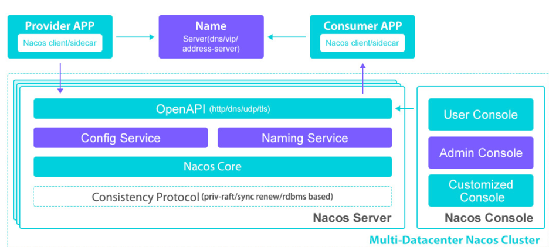

# Nacos

Nacos 是阿里巴巴推出来的一个新开源项目，这是一个更易于构建云原生应用的动态服务发现、配置管理和服务管理平台。

## nacos版本
Nacos2.0版本相比1.X新增了gRPC的通信方式，因此需要增加2个端口。新增端口是在配置的主端口(server.port)基础上，进行一定偏移量自动生成。
## 关键特性
1. 服务发现和服务健康监测


    Nacos 支持基于 DNS 和基于 RPC 的服务发现。服务提供者使用 原生SDK、OpenAPI、或一个独立的Agent TODO注册 Service 后，服务消费者可以使用DNS TODO 或HTTP&API查找和发现服务。
    
    Nacos 提供对服务的实时的健康检查，阻止向不健康的主机或服务实例发送请求。Nacos 支持传输层 (PING 或 TCP)和应用层 (如 HTTP、MySQL、用户自定义）的健康检查。
    对于复杂的云环境和网络拓扑环境中（如 VPC、边缘网络等）服务的健康检查，Nacos 提供了 agent 上报模式和服务端主动检测2种健康检查模式。
    Nacos 还提供了统一的健康检查仪表盘，帮助您根据健康状态管理服务的可用性及流量

2. 动态配置服务


    动态配置服务可以让您以中心化、外部化和动态化的方式管理所有环境的应用配置和服务配置。
    
    动态配置消除了配置变更时重新部署应用和服务的需要，让配置管理变得更加高效和敏捷。
    
    配置中心化管理让实现无状态服务变得更简单，让服务按需弹性扩展变得更容易。
    
3. 动态 DNS 服务  

    
    动态 DNS 服务支持权重路由，让您更容易地实现中间层负载均衡、更灵活的路由策略、流量控制以及数据中心内网的简单DNS解析服务。
    动态DNS服务还能让您更容易地实现以 DNS 协议为基础的服务发现，以帮助您消除耦合到厂商私有服务发现 API 上的风险。

4. 服务及其元数据管理


    Nacos 能让您从微服务平台建设的视角管理数据中心的所有服务及元数据，包括管理服务的描述、生命周期、服务的静态依赖分析、服务的健康状态、服务的流量管理、路由及安全策略、服务的 SLA 以及最首要的 metrics 统计数据。

## nacos源码分析
应用配置管理（Application Configuration Management，简称 ACM）
客户端配置
```go
constant.ClientConfig{
	TimeoutMs            uint64 // 请求Nacos服务端的超时时间，默认是10000ms
	NamespaceId          string // ACM的命名空间Id
	Endpoint             string // 当使用ACM时，需要该配置. https://help.aliyun.com/document_detail/130146.html
	RegionId             string // ACM&KMS的regionId，用于配置中心的鉴权
	AccessKey            string // ACM&KMS的AccessKey，用于配置中心的鉴权
	SecretKey            string // ACM&KMS的SecretKey，用于配置中心的鉴权
	OpenKMS              bool   // 是否开启kms，默认不开启，kms可以参考文档 https://help.aliyun.com/product/28933.html
	                            // 同时DataId必须以"cipher-"作为前缀才会启动加解密逻辑
	CacheDir             string // 缓存service信息的目录，默认是当前运行目录
	UpdateThreadNum      int    // 监听service变化的并发数，默认20
	NotLoadCacheAtStart  bool   // 在启动的时候不读取缓存在CacheDir的service信息
	UpdateCacheWhenEmpty bool   // 当service返回的实例列表为空时，不更新缓存，用于推空保护
	Username             string // Nacos服务端的API鉴权Username
	Password             string // Nacos服务端的API鉴权Password
	LogDir               string // 日志存储路径
	RotateTime           string // 日志轮转周期，比如：30m, 1h, 24h, 默认是24h
	MaxAge               int64  // 日志最大文件数，默认3
	LogLevel             string // 日志默认级别，值必须是：debug,info,warn,error，默认值是info
}
```
服务端配置
```go
constant.ServerConfig{
	ContextPath string // Nacos的ContextPath
	IpAddr      string // Nacos的服务地址
	Port        uint64 // Nacos的服务端口
	Scheme      string // Nacos的服务地址前缀
}
```
Note：我们可以配置多个ServerConfig，客户端会对这些服务端做轮询请求