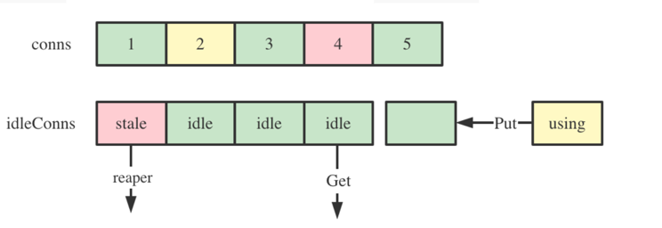
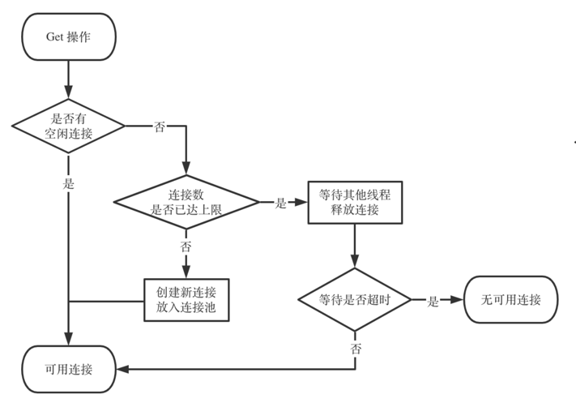

#go-redis源码分析

##连接池分析
常见问题
```go
// 键不存在时返回内容
const Nil = proto.Nil
```
DialTimeout： dial tcp 127.0.0.1:6379: i/o timeout
PoolTimeout ： error:redis: connection pool timeout
ReadTimeout ： read tcp 127.0.0.1:43267->127.0.0.1:6379: i/o timeout
WriteTimeout ： write tcp 127.0.0.1:43290->127.0.0.1:6379: i/o timeout


Go-Redis 的链接池链接池有三种：
    
    StickyConnPool：只含 1 个 “有状态” 连接的连接池 ，为确保事务相关命令都走同一条连接读写
    SingleConnPool：包含 1 条 “无状态” 连接，用于配合 Pipeline 初始化物理连接
    ConnPool： 实现了真的连接池
这里我们重点说明 ConnPool，因为 StickyConnPool 和 SingleConnPool 是根据 ConnPool 封装出来的。

###连接池的三种状态

using 正在使用中、idle 闲置待命中、stale 已失效待回收（闲置时间过长、存活时间过长）；conns队列中的连接按创建时间排序，而idleConns队列则面向 Get, Put, reaper 操作，顺序不定

一个典型的链接池设计都会包含以下几个功能：连接建立、管理连接、连接释放


连接池接口
```go
type Pooler interface {
    NewConn(context.Context) (*Conn, error) // 创建连接
    CloseConn(*Conn) error // 关闭连接

    Get(context.Context) (*Conn, error) // 获取连接
    Put(*Conn) // 放回连接
    Remove(*Conn, error) // 移除连接

    Len() int // 连接池长度
    IdleLen() int // 空闲连接数量
    Stats() *Stats // 连接池统计

    Close() error // 关闭连接池
}
```
连接池结构体
```go
type ConnPool struct {
    opt *Options // 连接池配置

    dialErrorsNum uint32 // 连接错误次数，atomic

    lastDialErrorMu sync.RWMutex // 上一次连接错误锁，读写锁
    lastDialError   error // 上一次连接错误

    queue chan struct{} // 工作连接队列

    connsMu      sync.Mutex // 连接队列锁
    conns        []*Conn // 全局连接队列，面向新建和关闭连接
    idleConns    []*Conn // 闲置连接队列，面向 Get,Put,reaper 操作
    poolSize     int // 连接池大小
    idleConnsLen int // 空闲连接队列长度

    stats Stats // 连接池命中率、错误率等统计信息

    _closed  uint32 // 连接池关闭标志，atomic
    closedCh chan struct{} // 通知连接池关闭通道
}
```
连接池选项
```go
type Options struct {
    Dialer  func() (net.Conn, error) // 如何建立连接函数
    OnClose func(*Conn) error // 关闭连接时的回调函数
 
    PoolSize           int // 总连接数上限，默认值为 CPU 数量的 10 倍（非计算密集型应用）
    MinIdleConns       int // 最少空闲连接数
    MaxConnAge         time.Duration  // 连接最大存活时间，默认 0
    PoolTimeout        time.Duration  // 无可用连接的等待超时时间，默认 4s
    IdleTimeout        time.Duration  // 连接空闲最大时长，默认 5min
    IdleCheckFrequency time.Duration   // 连接空闲检测周期，默认 1min 
}

```
###初始化
```go
var _ Pooler = (*ConnPool)(nil)
func NewConnPool(opt *Options) *ConnPool {
    p := &ConnPool{
        opt: opt,
 
        queue:     make(chan struct{}, opt.PoolSize), // 链接池的队列大小，ConnPool 用Channel来限制链接池的大小
        conns:     make([]*Conn, 0, opt.PoolSize), // 连接
        idleConns: make([]*Conn, 0, opt.PoolSize), // 空闲连接
    }
 
    for i := 0; i < opt.MinIdleConns; i++ {
        p.checkMinIdleConns() // 新建一些空闲连接，空闲连接的大小是不会记录在 queue 的长度里面的，所以，如果有设置最小空闲的连接，则会一开始就建立好连接
    }
 
    if opt.IdleTimeout > 0 && opt.IdleCheckFrequency > 0 {
        go p.reaper(opt.IdleCheckFrequency) //释放空闲连接
    }
 
    return p
}

```
    1。创建连接池，传入连接池配置选项参数 opt，工厂函数根据 opt 创建连接池实例。连接池主要依靠以下四个数据结构实现管理和通信：
        queue： 存储工作连接的缓冲通道
        conns：存储所有连接的切片
        idleConns：存储空闲连接的切片
        closed：用于通知所有协程连接池已经关闭的通道
    2。检查连接池的空闲连接数量是否满足最小空闲连接数量要求，若不满足，则创建足够的空闲连接。
    3。若连接池配置选项规定了空闲连接超时和检查空闲连接频率，则开启一个清理空闲连接的协程
    
###关闭
```go
func (p *ConnPool) Close() error {
    if !atomic.CompareAndSwapUint32(&p._closed, 0, 1) {
        return ErrClosed
    }
    close(p.closedCh)

    var firstErr error
    p.connsMu.Lock()
    for _, cn := range p.conns {
        if err := p.closeConn(cn); err != nil && firstErr == nil {
            firstErr = err
        }
    }
    p.conns = nil
    p.poolSize = 0
    p.idleConns = nil
    p.idleConnsLen = 0
    p.connsMu.Unlock()

    return firstErr
}
```
    1。原子性检查连接池是否已经关闭，若没关闭，则将关闭标志置为1
    2。关闭 closedCh 通道，连接池中的所有协程都可以通过判断该通道是否关闭来确定连接池是否已经关闭。
    3。连接队列锁上锁，关闭队列中的所有连接，并置空所有维护连接池状态的数据结构，解锁。
###连接管理
```go
type Pooler interface {
    Get(context.Context) (*Conn, error)   // 取 // 操作前 connsMu 加锁保证线程安全
    Put(context.Context, *Conn)           // 写 // 约定 Context 为第一个参数做超时控制
    Remove(context.Context, *Conn, error) // 删
}
```
####连接建立
连接的建立会先判断是否需要熔断，如果不需要，则会进行连接的建立，将连接包装为自己的conn，记录使用的时间，
熔断机制：当所有连接都失败后，再新建连接将直接返回错误；同时在单独的 goroutine 中轮询探测服务端可用性，若成功则及时终止熔断
```go
func (p *ConnPool) newConn(pooled bool) (*Conn, error) {
    if p.closed() {
        return nil, ErrClosed
    }
 
    // 如果建立连接的错误数量大于链接池的数量，则直接返回错误，开始熔断，触发可用性探测
     if atomic.LoadUint32(&p.dialErrorsNum) >= uint32(p.opt.PoolSize) {
        return nil, p.getLastDialError()
    }
    // 建立连接
    netConn, err := p.opt.Dialer()
    if err != nil {
        p.setLastDialError(err)
        if atomic.AddUint32(&p.dialErrorsNum, 1) == uint32(p.opt.PoolSize) {
             // 尝试建立连接，建立连接则会把 dialErrorsNum 赋值为0
             go p.tryDial()
        }
        return nil, err
    }
    // 包装为自己的conn
    cn := NewConn(netConn)
    cn.pooled = pooled
    return cn, nil
}

```
####从连接池获取
信号量


    连接池是典型的信号量资源，Get 操作先到先得否则等待。但由于 sync.semaphore 仅支持 contenxt 控制超时，Get 操作还需实现 PoolTimeout 等待超时，
    故用缓冲 channel 实现了信号量的 accquire, release 逻辑；
```go
// accquire
func (p *ConnPool) waitTurn(ctx context.Context) error {
    select {
    case <-ctx.Done(): // 操作超时及时返回
        return ctx.Err()
    default:
    }
    select {
    case p.queue <- struct{}{}: // 优化：尝试直接 accquire
        return nil
    default:
    }

    timer := timers.Get().(*time.Timer) // sync.Pool 优化过的高频临时对象
    timer.Reset(p.opt.PoolTimeout)
    select {
    case <-ctx.Done(): // 1. 操作超时
        if !timer.Stop() { <-timer.C }
        timers.Put(timer)
        return ctx.Err()
    case p.queue <- struct{}{}: // 2. accquire 成功
        if !timer.Stop() { <-timer.C }
        timers.Put(timer)
        return nil
    case <-timer.C: // 3. 等待超时
        timers.Put(timer)
        return ErrPoolTimeout
    }
}

// release
func (p *ConnPool) freeTurn() {
    <-p.queue
}
```
    
先从idleConns队列取 idle 连接，若实为 stale 连接则回收，若无可用的 idle 连接则穿透新建连接
```go
func (p *ConnPool) Get() (*Conn, error) {
    if p.closed() {
        return nil, ErrClosed
    }
    // 获取queue令牌：往 p.queue 中写入一条数据，如果能够写入，则说明有空闲的连接
    // 如果不能，则会等待 p.opt.PoolTimeout 时间，超过这个时间，则会返回 ErrPoolTimeout = errors.New("redis: connection pool timeout")
    err := p.waitTurn()
    if err != nil {
        return nil, err
    }
    // 从空闲的连接中拿到一条连接，则直接返回，否则会使用 _NewConn 新建一条连接
    for {
        p.connsMu.Lock()
        cn := p.popIdle()
        p.connsMu.Unlock()
 
        if cn == nil {
            break
        }
 
        if p.isStaleConn(cn) {
            _ = p.CloseConn(cn)
            continue
        }
 
        atomic.AddUint32(&p.stats.Hits, 1)
        return cn, nil
    }
 
    atomic.AddUint32(&p.stats.Misses, 1)
    // true 表示这条连接会被放回连接池中，当连接池的大小>p.opt.PoolSize时，pooled 会被修改为 false，表示不会返回到连接池中
    newcn, err := p._NewConn(true)
    if err != nil {
        p.freeTurn()
        return nil, err
    }
 
    return newcn, nil
}

```
####放回连接池
完成命令请求并读取响应后，如果时需要放回连接池的，则将连接放回idleConns 队列，而且释放一个令牌
```go
func (p *ConnPool) Put(cn *Conn) {
    if !cn.pooled {
        p.Remove(cn, nil)
        return
    }
 
    p.connsMu.Lock()
    p.idleConns = append(p.idleConns, cn)
    p.idleConnsLen++
    p.connsMu.Unlock()
    p.freeTurn()
}

//连接释放
func (p *ConnPool) Remove(cn *Conn, reason error) {
    // 从连接池中移除连接
    p.removeConn(cn)
    p.freeTurn()
    // 关闭连接
    _ = p.closeConn(cn)
}

```
####过滤
```go
func (p *ConnPool) Filter(fn func(*Conn) bool) error {
    var firstErr error
    p.connsMu.Lock()
    for _, cn := range p.conns {
        if fn(cn) {
            if err := p.closeConn(cn); err != nil && firstErr == nil {
                firstErr = err
            }
        }
    }
    p.connsMu.Unlock()
    return firstErr
// 实质上是遍历连接池中的所有连接，并调用传入的 fn 过滤函数作用在每个连接上，过滤出符合业务要求的连接。
```
####清理
```go
func (p *ConnPool) reaper(frequency time.Duration) {
    ticker := time.NewTicker(frequency)
    defer ticker.Stop()

    for {
        select {
        case <-ticker.C:
            // It is possible that ticker and closedCh arrive together,
            // and select pseudo-randomly pick ticker case, we double
            // check here to prevent being executed after closed.
            if p.closed() {
                return
            }
            _, err := p.ReapStaleConns()
            if err != nil {
                internal.Logger.Printf("ReapStaleConns failed: %s", err)
                continue
            }
        case <-p.closedCh:
            return
        }
    }
}

func (p *ConnPool) ReapStaleConns() (int, error) {
    var n int
    for {
        p.getTurn()

        p.connsMu.Lock()
        cn := p.reapStaleConn()
        p.connsMu.Unlock()
        p.freeTurn()

        if cn != nil {
            _ = p.closeConn(cn)
            n++
        } else {
            break
        }
    }
    atomic.AddUint32(&p.stats.StaleConns, uint32(n))
    return n, nil
}

func (p *ConnPool) reapStaleConn() *Conn {
    if len(p.idleConns) == 0 {
        return nil
    }

    cn := p.idleConns[0]
    if !p.isStaleConn(cn) {
        return nil
    }

    p.idleConns = append(p.idleConns[:0], p.idleConns[1:]...)
    p.idleConnsLen--
    p.removeConn(cn)

    return cn
}
```

    1.开启一个用于检查并清理过期连接的 goroutine 每隔 frequency 时间遍历检查连接池中是否存在过期连接，并清理。
    2.创建一个时间间隔为 frequency 的计时器，在连接池关闭时关闭该计时器
    3.循环判断计时器是否到时和连接池是否关闭
    4.移除空闲连接队列中的过期连接

总结
    优秀设计：用缓冲 channel 模拟信号量实现精确的超时控制、用连接错误数实现了穿透熔断、用 reaper goroutine 定时回收 stale 连接

