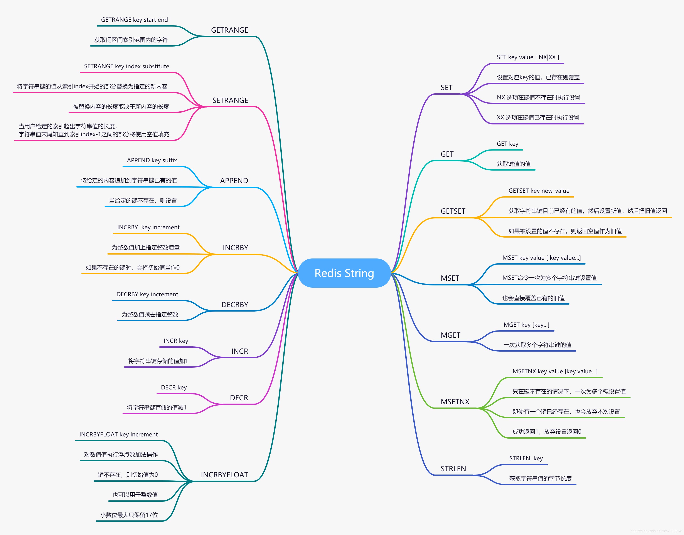
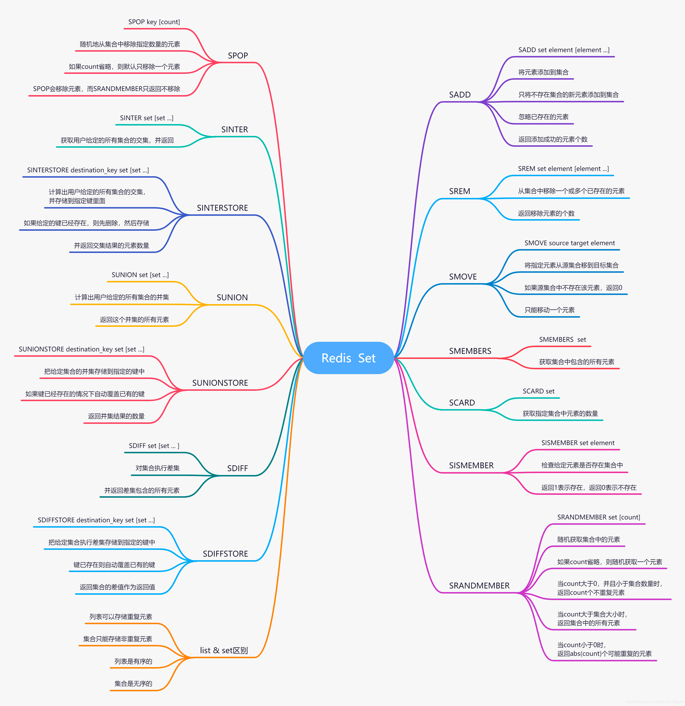

#Redis:

	Remote Dictionary Server, 翻译为远程字典服务. Redis是一个完全开源的基于Key-Value的NoSQL存储系统，他是一个使用ANSIC语言编写的，
	遵守BSD协议，支持网络、可基于内存的可持久化的日志型、Key-Value数据库,并提供多种语言的API.
执行原理：

	# 1. 客户端发送命令后，Redis服务器将为这个客户端链接创造一个'输入缓存'，将命令放到里面
	# 2. 再由Redis服务器进行分配挨个执行，顺序是随机的，这将不会产生并发冲突问题，也就不需要事务了.
	# 3. 再将结果返回到客户端的'输出缓存'中，输出缓存先存到'固定缓冲区',如果存满了，就放入'动态缓冲区',客户端再获得信息结果

	# 如果数据时写入命令，例如set name:1  zhangsan 方式添加一个字符串.
	# Redis将根据策略，将这对key:value来用内部编码格式存储，好处是改变内部编码不会对外有影响，正常操作即可,
	# 同时不同情况下存储格式不一样，发挥优势.
为什么需要Redis?

	传统数据库在存储数据时，需要先定义schema，以确定类型(字节宽度)，并以行存储，所以每行所占的字节宽度是一致的（便于索引数据）。
	数据库内部数据分为多个datapage(一般是4kb)存储，随着数据量的增大，数据库查询速度会越来越慢，其主要瓶颈在于磁盘I/O。
	由于数据量增大查找datapage的时间也会变长，所以索引出现了。索引是一个B+T，存储在内存中，根据索引记录的信息，可以快速定位到datapage的位置。索引虽然会大大加快查询速度，但是因为增删改需要维护索引的B+T，所以会把增删改的速度拖慢，所以索引不适合频繁写的表。
	此外，当数据库高并发查询的情况下，单位时间内所需的数据量也是很大的，此时可能会受到磁盘带宽的影响，影响磁盘的查询速度。
	在I/O上，内存相比较于磁盘，拥有较好的性能;
	出现了一批基于内存的关系型数据库，比如SAP HAHA数据库，其物理机器内存2T，包含软件以及服务，购买需要1亿元,由于内存关系型数据库的昂贵价格，
	所以大部分公司采用了折中的方案,使用磁盘关系型数据库+内存缓存,比如 Oracle+Memcached,Mysql+Redis
单线程的Redis为什么这么快?

	# 1. 基于内存的访问，非阻塞I/O，Redis使用事件驱动模型epoll多路复用实现，连接，读写，关闭都转换为事件不在网络I/O上浪费过多的时间.
	# 2. 单线程避免高并发的时候，多线程有锁的问题和线程切换的CPU开销问题.《虽然是单线程，但可以开多实例弥补》
	# 3. 使用C语言编写，更好的发挥服务器性能，并且代码简介，性能高
Redis五种数据类型应用场景

	1.String: 常规的set/get操作,因为string 类型是二进制安全的，可以用来存放图片，视频等内容，另外由于Redis的高性能读写功能，
		而string类型的value也可以是数字，一般做一些复杂的计数功能的缓存,还可以用作计数器（INCR,DECR），
		比如分布式环境中统计系统的在线人数，秒杀等
		

	2. hash: value 存放的是键值对结构化后的对象，比较方便操作其中某个字段，比如可以做单点登录存放用户信息,以cookiele作为key，
		设置30分钟为缓存过期时间，能很好的模拟出类似session的效
		

	3. list: 可以实现简单的消息队列，另外可以利用lrange命令，做基于redis的分页功能,性能极佳，用户体验好
	

	4. set:由于底层是字典实现的，查找元素特别快，另外set 数据类型不允许重复，利用这两个特性我们可以进行全局去重，
		比如在用户注册模块，判断用户名是否注册；另外就是利用交集、并集、差集等操作，可以计算共同喜好，全部的喜好，自己独有的喜好等功能

		

	5. Zset:有序的集合，可以做范围查找，排行榜应用，取 TOP N 操作等,还可以做延时任务

PipeLine:

	Redis的pipeline功能的原理是 Client通过一次性将多条redis命令发往Redis Server，减少了每条命令分别传输的IO开销。
	同时减少了系统调用的次数，因此提升了整体的吞吐能力。
	我们在主-从模式的Redis中，pipeline功能应该用的很多，但是Cluster模式下，估计还没有几个人用过。
	我们知道 redis cluster 默认分配了 16384 个slot，当我们set一个key 时，会用CRC16算法来取模得到所属的slot，
	然后将这个key 分到哈希槽区间的节点上，具体算法就是：CRC16(key) % 16384。如果我们使用pipeline功能，
	一个批次中包含的多条命令，每条命令涉及的key可能属于不同的slot
	
持久化方式

    RDB(redis database)：以快照的形式将数据持久化到磁盘
    
    AOF(append only file)：以日志的形式记录每个操作，将Redis执行过的所有指令全部记录下来（读操作不记录），只许追加文件但不可以修改文件，
        Redis启动时会读取AOF配置文件重构数据

Redis集群特点

    1. 多个redis节点网络互联，数据共享  
    2. 所有的节点都是一主一从（也可以是一主多从），其中从不提供服务，仅作为备用  
    3. 不支持同时处理多个key（如MSET/MGET），因为redis需要把key均匀分布在各个节点上，
    并发量很高的情况下同时创建key-value会降低性能并导致不可预测的行为  
    4. 支持在线增加、删除节点  
    5. 客户端可以连任何一个主节点进行读写

