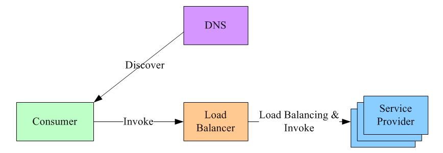
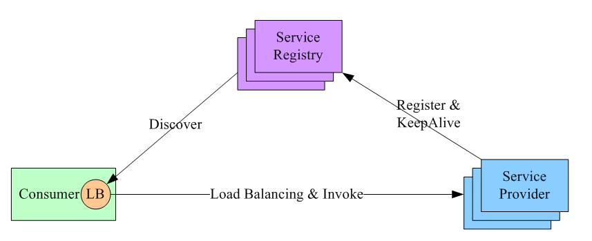
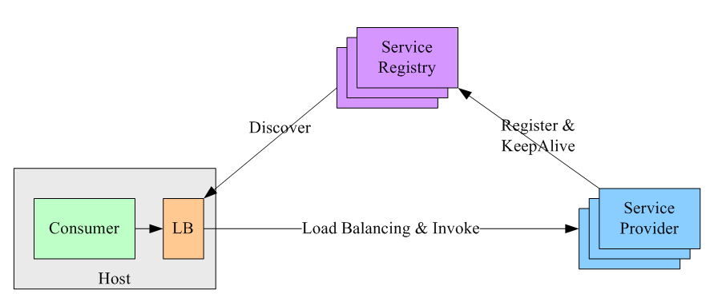

# load balance负载均衡

## 负载均衡策略
### 1. 集中式load balance
首先，服务的消费方和提供方不直接耦合，而是在服务消费者和服务提供者之间有一个独立的LB（LB通常是专门的硬件设备如F5，或者基于软件如LVS，HAproxy等实现）

LB上有所有服务的地址映射表，通常由运维配置注册，当服务消费方调用某个目标服务时，它向LB发起请求，由LB以某种策略（比如Round-Robin）做负载均衡后将请求转发到目标服务。
LB一般具备健康检查能力，能自动摘除不健康的服务实例。

服务消费方如何发现LB呢？通常的做法是通过DNS，运维人员为服务配置一个DNS域名，这个域名指向LB。
这种方案基本可以否决，因为它有致命的缺点：所有服务调用流量都经过load balance服务器，所以load balance服务器成了系统的单点，一旦LB发生故障对整个系统的影响是灾难性的。为了解决这个问题，必然需要对这个load balance部件做分布式处理（部署多个实例，冗余，然后解决一致性问题等全家桶解决方案），但这样做会徒增非常多的复杂度。

### 2. 进程内load balance

进程内load balance。将load balance的功能和算法以sdk的方式实现在客户端进程内

可看到引入了第三方：服务注册中心。它做两件事：
a. 维护服务1. 提供方的节点列表，并检测这些节点的健康度。检测的方式是：每个节点部署成功，都通知服务注册中心；然后一直和注册中心保持心跳。
b. 允许服务2. 调用方注册感兴趣的事件，把服务提供方的变化情况推送到服务调用方。
这种方案下，整个load balance的过程是这样的：
a. 服务注册中心维护所有节点的情况。
b. 任何一个节点想要订阅其他服务提供方的节点列表，向服务注册中心注册。
c. 服务注册中心将服务提供方的列表（以长连接的方式）推送到消费方。
d. 消费方接收到消息后，在本地维护一份这个列表，并自己做load balance。
可见，服务注册中心充当什么角色？它是唯一一个知道整个集群内部所有的节点情况的中心。所以对它的可用性要求会非常高，这个组件可以用Zookeeper实现。
这种方案的缺点是：每个语言都要研究一套sdk，如果公司内的服务使用的语言五花八门的话，这方案的成本会很高。第二点是：后续如果要对客户库进行升级，势必要求服务调用方修改代码并重新发布，所以该方案的升级推广有不小的阻力。

### 3. 独立进程load balance

该方案是针对第二种方案的不足而提出的一种折中方案，原理和第二种方案基本类似，不同之处是，他将LB和服务发现功能从进程内移出来，变成主机上的一个独立进程，
主机上的一个或者多个服务要访问目标服务时，他们都通过同一主机上的独立LB进程做服务发现和负载均衡.

这个方案解决了上一种方案的问题，不需要为不同语言开发客户库，LB的升级不需要服务调用方改代码。
但新引入的问题是：这个组件本身的可用性谁来维护？还要再写一个watchdog去监控这个组件？另外，多了一个环节，就多了一个出错的可能，线上出问题了，也多了一个需要排查的环节。

## 负载均衡算法
在分布式系统中，多台服务器同时提供一个服务，并统一到服务配置中心进行管理，消费者通过查询服务配置中心，获取到服务到地址列表，需要选取其中一台来发起RPC远程调用。
如何选择，则取决于具体的负载均衡算法，对应于不同的场景，选择的负载均衡算法也不尽相同。负载均衡算法的种类有很多种，常见的负载均衡算法包括轮询法、随机法、源地址哈希法、加权轮询法、加权随机法、最小连接法等，应根据具体的使用场景选取对应的算法。

## 
grpc负载均衡官方参考文档：https://github.com/grpc/grpc/blob/master/doc/load-balancing.md