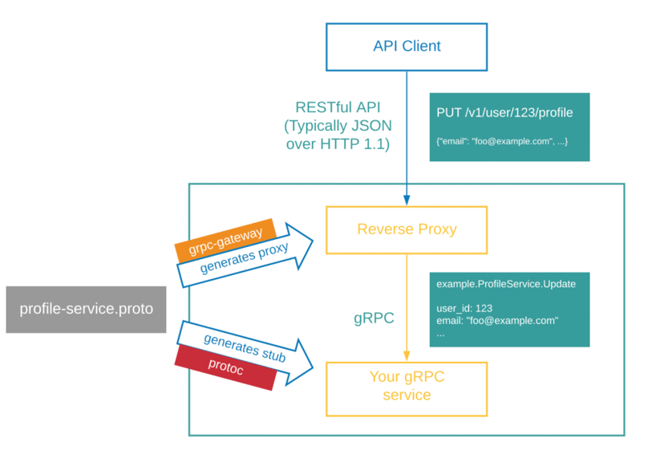

# gRPC-Gateway

是Google protocol buffers compiler(protoc)的一个插件。读取 protobuf 定义然后生成反向代理服务器，将 RESTful HTTP API 转换为 gRPC。

换句话说就是将 gRPC 转为 RESTful HTTP API。

## 应用
etcd v3 改用 gRPC 后为了兼容原来的 API，同时要提供 HTTP/JSON 方式的API，为了满足这个需求，要么开发两套 API，要么实现一种转换机制，他们选择了后者，而我们选择跟随他们的脚步。

## 流程


当 HTTP 请求到达 gRPC-Gateway 时，它将 JSON 数据解析为 Protobuf 消息。然后，它使用解析的 Protobuf 消息发出正常的 Go gRPC 客户端请求。
Go gRPC 客户端将 Protobuf 结构编码为 Protobuf 二进制格式，然后将其发送到 gRPC 服务器。

gRPC 服务器处理请求并以 Protobuf 二进制格式返回响应。
Go gRPC 客户端将其解析为 Protobuf 消息，并将其返回到 gRPC-Gateway，后者将 Protobuf 消息编码为 JSON 并将其返回给原始客户端。

## 环境准备

环境主要分为 3 部分：

1. Protobuf 相关 
    - Go 
    - Protocol buffer compile（protoc） 
    - Go Plugins
    
2. gRPC相关
    - gRPC Lib
    - gRPC Plugins
3. gRPC-Gateway 


## 使用
1. 第一步引入annotations.proto

目录
```shell
proto
├── google
│   └── api
│       ├── annotations.proto
│       └── http.proto
└── helloworld
    └── hello_world.proto
```
2. 增加 http 相关注解
```protobuf
 rpc SayHello (HelloRequest) returns (HelloReply) {
    option (google.api.http) = {
      get: "/v1/greeter/sayhello"
      body: "*"
    };
  }
```
每个方法都必须添加 google.api.http 注解后 gRPC-Gateway 才能生成对应 http 方法。

其中post为 HTTP Method，即 POST 方法，/v1/greeter/sayhello 则是请求路径。


3. 编译 增加 --grpc-gateway_out

- Go Plugins 用于生成 .pb.go 文件
- gRPC Plugins 用于生成 _grpc.pb.go
- gRPC-Gateway 则是 pb.gw.go


## 源码分析
```go
// 08_grpc/10_grpc_gateway/proto/helloworld/hello_world.pb.gw.go
func RegisterGreeterHandler(ctx context.Context, mux *runtime.ServeMux, conn *grpc.ClientConn) error {
	return RegisterGreeterHandlerClient(ctx, mux, NewGreeterClient(conn))
}

func RegisterGreeterHandlerClient(ctx context.Context, mux *runtime.ServeMux, client GreeterClient) error {

	mux.Handle("POST", pattern_Greeter_SayHello_0, func(w http.ResponseWriter, req *http.Request, pathParams map[string]string) {
		ctx, cancel := context.WithCancel(req.Context())
		defer cancel()
		inboundMarshaler, outboundMarshaler := runtime.MarshalerForRequest(mux, req)
		var err error
		ctx, err = runtime.AnnotateContext(ctx, mux, req, "/helloworld.Greeter/SayHello", runtime.WithHTTPPathPattern("/v1/greeter/sayhello"))
		if err != nil {
			runtime.HTTPError(ctx, mux, outboundMarshaler, w, req, err)
			return
		}
		resp, md, err := request_Greeter_SayHello_0(ctx, inboundMarshaler, client, req, pathParams)
		ctx = runtime.NewServerMetadataContext(ctx, md)
		if err != nil {
			runtime.HTTPError(ctx, mux, outboundMarshaler, w, req, err)
			return
		}

		forward_Greeter_SayHello_0(ctx, mux, outboundMarshaler, w, req, resp, mux.GetForwardResponseOptions()...)

	})

	return nil
}
```