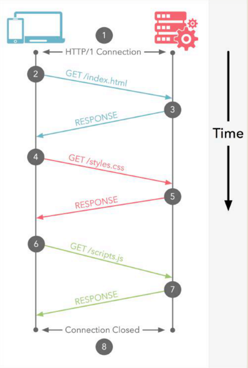
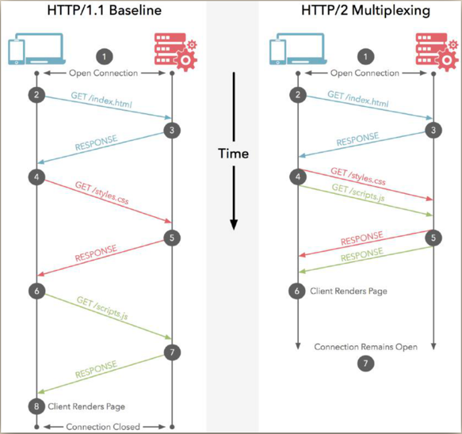
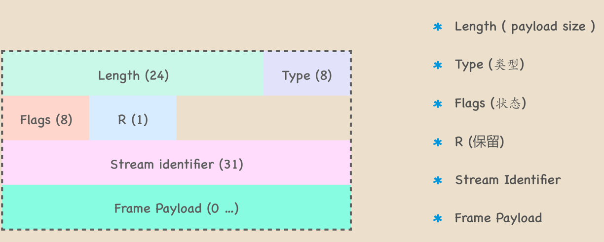
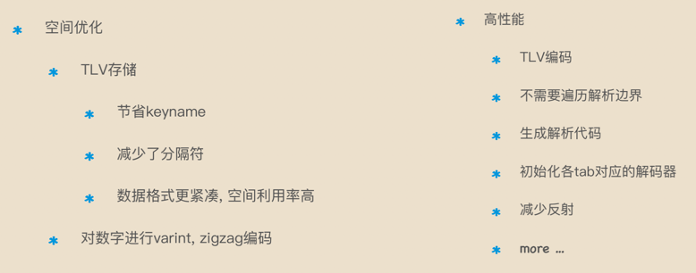
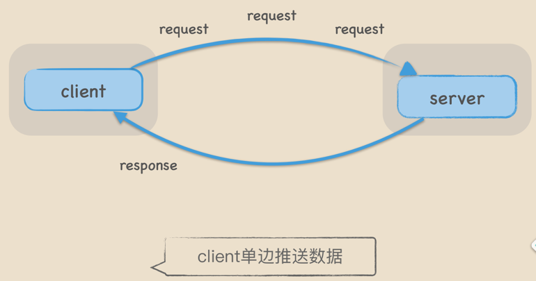
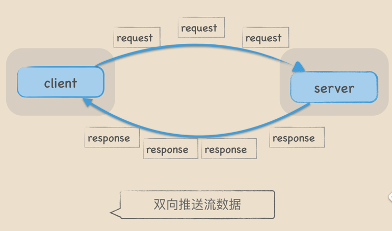

#Grpc
参考使用连接：https://github.com/grpc/grpc-go/tree/master/examples/features

##RTT


    RTT (Round Trip Time)
    Round trip time for a packet
    rtt = recvtime - sendtime
##http1.1


    Head-of-Line Blocking (No Pipelining) 
    一个连接同一时间只能处理一个请求
    如果当前请求阻塞，那么该连接就无法复用


    *未完全解决head of line blocking 
    *fifo原则, 需要等待最后的响应
    *多数http proxy不支持
    *多数浏览器默认关闭 h1.1 pipeline
##http2.0



优点：

    多路复用
    header压缩
    流控
    优先级
    服务端推送
定义

二进制分帧层

多路复用multiplex


    并行交错地发送多个请求，请求之间互不影响。
    并行交错地发送多个响应，响应之间互不干扰。
    使用一个连接并行发送多个请求和响应。
  
frame  


frame types类型


    1.Magic
    Magic 帧的主要作用是建立 HTTP/2 请求的前言。在 HTTP/2 中，要求两端都要发送一个连接前言，作为对所使用协议的最终确认，并确定 HTTP/2 连接的初始设置，客户端和服务端各自发送不同的连接前言。
    
    Magic 帧是客户端的前言之一，内容为 PRI * HTTP/2.0\r\n\r\nSM\r\n\r\n，以确定启用 HTTP/2 连接。
    2.Settings连接级参数
    SETTINGS 帧的主要作用是设置这一个连接的参数，作用域是整个连接而并非单一的流。
    
    3.Headers
    HEADERS 帧的主要作用是存储和传播 HTTP 的标头信息。我们关注到 HEADERS 里有一些眼熟的信息，分别如下：
    
    method：POST
    scheme：http
    path：/proto.SearchService/Search
    authority：:10001
    content-type：application/grpc
    user-agent：grpc-go/1.20.0-dev
    
    4.Data
    DATA 帧的主要作用是装填主体信息，是数据帧
    
    5.PING/PONG
    主要作用是判断当前连接是否仍然可用，也常用于计算往返时间。
    
    6.WINDOW_UPDATE流量控制
    主要作用是管理和流的窗口控制。
    
    7.GOAWAY停止
    

header frame

data frame


#http3


#proto
##v2 和 v3 主要区别
    *删除原始值字段的字段存在逻辑  
    *删除 required 字段  
    *删除 optional 字段，默认就是  
    *删除 default 字段  
    *删除扩展特性，新增 Any 类型来替代它  
    *删除 unknown 字段的支持  
    *新增 JSON Mapping  
    *新增 Map 类型的支持  
    *修复 enum 的 unknown 类型  
    *repeated 默认使用 packed 编码  
    *引入了新的语言实现（C＃，JavaScript，Ruby，Objective-C）
    
##protobuf优化


wiretype


#protoc
protoc是protobuf文件（.proto）的编译器，可以借助这个工具把 .proto 文件转译成各种编程语言对应的源码，包含数据类型定义、调用接口等。

通过查看protoc的源码（参见github库）可以知道，protoc在设计上把protobuf和不同的语言解耦了，底层用c++来实现protobuf结构的存储，然后通过插件的形式来生成不同语言的源码。可以把protoc的编译过程分成简单的两个步骤
    
    1.解析.proto文件，转译成protobuf的原生数据结构在内存中保存；    
    
    2.把protobuf相关的数据结构传递给相应语言的编译插件，由插件负责根据接收到的protobuf原生结构渲染输出特定语言的模板

#protoc-gen-go
protoc-gen-go是protobuf编译插件系列中的Go版本
由于protoc-gen-go是Go写的，所以安装它变得很简单，只需要运行 go get -u github.com/golang/protobuf/protoc-gen-go

#生成
参考scripts脚本

#gogoprotobuf
在go中使用protobuf，有两个可选用的包goprotobuf（go官方出品）和gogoprotobuf。gogoprotobuf完全兼容google protobuf，
它生成的代码质量和编解码性能均比goprotobuf高一些。
主要是它在goprotobuf之上extend了一些option。这些option也是有级别区分的，有的option只能修饰field，有的可以修饰enum，有的可以修饰message，有的是修饰package（即对整个文件都有效)

gogoprotobuf有两个插件可以使用

protoc-gen-gogo：和protoc-gen-go生成的文件差不多，性能也几乎一样(稍微快一点点)
protoc-gen-gofast：生成的文件更复杂，性能也更高(快5-7倍)

```shell
#安装 the protoc-gen-gofast binary
go get github.com/gogo/protobuf/protoc-gen-gofast
#生成
protoc --gofast_out=. myproto.proto
```

#protobuf源码分析
```go
//message接口
type Message = protoiface.MessageV1
type MessageV1 interface {
    Reset()
    String() string
    ProtoMessage()
}
```
proto编译成的Go结构体都是符合Message接口的，从Marshal可知Go结构体有3种序列化方式：
```go
func Marshal(pb Message) ([]byte, error) {
	if m, ok := pb.(newMarshaler); ok {
		siz := m.XXX_Size()
		b := make([]byte, 0, siz)
		return m.XXX_Marshal(b, false)
	}
	if m, ok := pb.(Marshaler); ok {
		// If the message can marshal itself, let it do it, for compatibility.
		// NOTE: This is not efficient.
		return m.Marshal()
	}
	// in case somehow we didn't generate the wrapper
	if pb == nil {
		return nil, ErrNil
	}
	var info InternalMessageInfo
	siz := info.Size(pb)
	b := make([]byte, 0, siz)
	return info.Marshal(b, pb, false)
}
//newMarshaler接口
type newMarshaler interface {
    XXX_Size() int
    XXX_Marshal(b []byte, deterministic bool) ([]byte, error)
}
//Marshaler接口
type Marshaler interface {
    Marshal() ([]byte, error)
}
```

    1.pb Message满足newMarshaler接口，则调用XXX_Marshal()进行序列化。   
    2.pb满足Marshaler接口，则调用Marshal()进行序列化，这种方式适合某类型自定义序列化规则的情况。   
    3.否则，使用默认的序列化方式，创建一个Warpper，利用wrapper对pb进行序列化，后面会介绍方式1实际就是使用方式3。
    
##grpc分类
    1。unary


    2。client streaming
    

    3。server streaming


    4。bidi streaming   


##拦截器


##grpc调优
    GRPC默认的参数对于传输大数据块来说不够友好，我们需要进行特定参数的调优。
    
    MaxSendMsgSizeGRPC最大允许发送的字节数，默认4MiB，如果超过了GRPC会报错。Client和Server我们都调到4GiB。
    
    MaxRecvMsgSizeGRPC最大允许接收的字节数，默认4MiB，如果超过了GRPC会报错。Client和Server我们都调到4GiB。
    
    InitialWindowSize基于Stream的滑动窗口，类似于TCP的滑动窗口，用来做流控，默认64KiB，吞吐量上不去，Client和Server我们调到1GiB。
    
    InitialConnWindowSize基于Connection的滑动窗口，默认16 * 64KiB，吞吐量上不去，Client和Server我们也都调到1GiB。
    
    KeepAliveTime每隔KeepAliveTime时间，发送PING帧测量最小往返时间，确定空闲连接是否仍然有效，我们设置为10S。
    
    KeepAliveTimeout超过KeepAliveTimeout，关闭连接，我们设置为3S。
    
    PermitWithoutStream如果为true，当连接空闲时仍然发送PING帧监测，如果为false，则不发送忽略。我们设置为true


