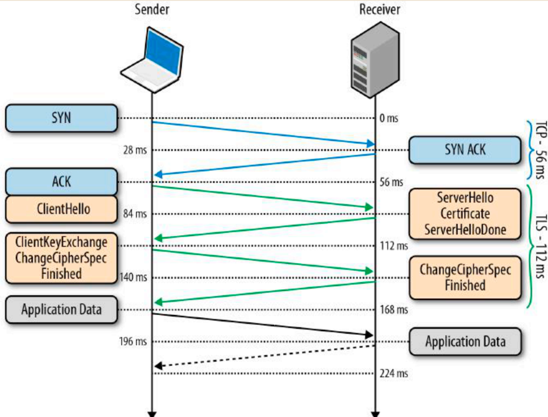
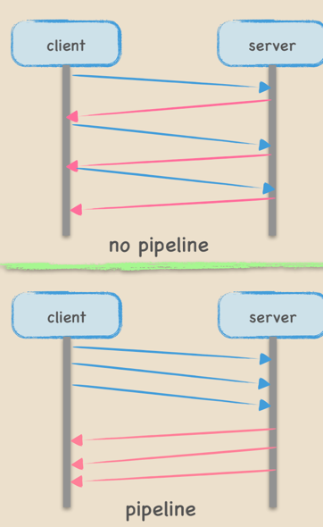
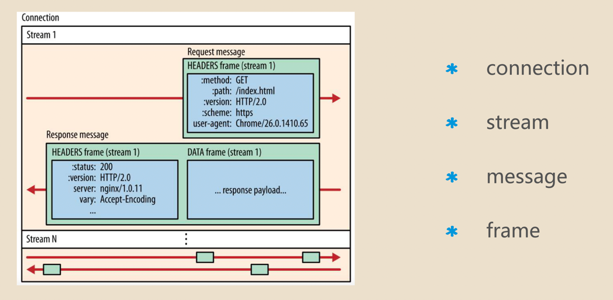
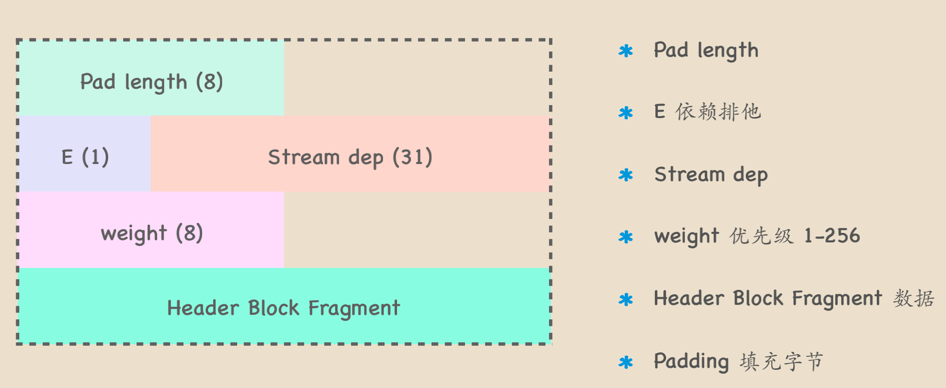
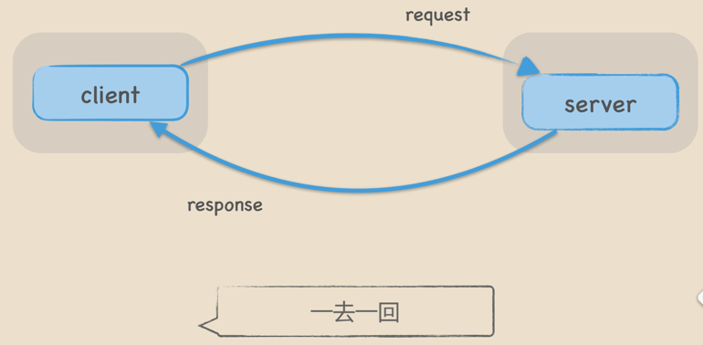
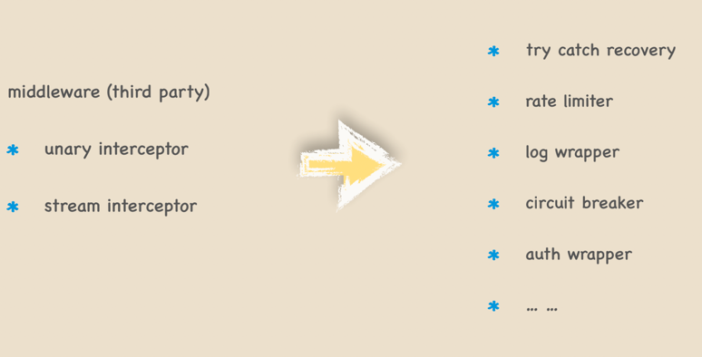

# Grpc
参考使用连接：https://github.com/grpc/grpc-go/tree/master/examples/features

## RTT(Round Trip Time)

解释：Round trip time for a packet

公式： rtt = recvtime - sendtime

## http1.1

* Head-of-Line Blocking (No Pipelining) 
* 一个连接同一时间只能处理一个请求
* 如果当前请求阻塞，那么该连接就无法复用

* 未完全解决head of line blocking 
* fifo原则, 需要等待最后的响应
* 多数http proxy不支持
* 多数浏览器默认关闭 h1.1 pipeline

## http2.0

优点：
- 多路复用
- header压缩
- 流控
- 优先级
- 服务端推送
### 定义    

### 二进制分帧层    

### 多路复用multiplex   

- 并行交错地发送多个请求，请求之间互不影响。
- 并行交错地发送多个响应，响应之间互不干扰。
- 使用一个连接并行发送多个请求和响应。
  
### frame      

#### frame types类型     

1. Magic:
Magic 帧的主要作用是建立 HTTP/2 请求的前言。在 HTTP/2 中，要求两端都要发送一个连接前言，作为对所使用协议的最终确认，并确定 HTTP/2 连接的初始设置，客户端和服务端各自发送不同的连接前言。

Magic 帧是客户端的前言之一，内容为 PRI * HTTP/2.0\r\n\r\nSM\r\n\r\n，以确定启用 HTTP/2 连接。
2. Settings连接级参数
SETTINGS 帧的主要作用是设置这一个连接的参数，作用域是整个连接而并非单一的流。

3. Headers
HEADERS 帧的主要作用是存储和传播 HTTP 的标头信息。我们关注到 HEADERS 里有一些眼熟的信息，分别如下：

method：POST
scheme：http
path：/proto.SearchService/Search
authority：:10001
content-type：application/grpc
user-agent：grpc-go/1.20.0-dev

4. Data
DATA 帧的主要作用是装填主体信息，是数据帧

5. PING/PONG
主要作用是判断当前连接是否仍然可用，也常用于计算往返时间。

6. WINDOW_UPDATE流量控制
主要作用是管理和流的窗口控制。

7. GOAWAY停止
    

#### header frame  

#### data frame

# http3.0

## grpc分类
### 1. unary

### 2. client streaming
    

### 3. server streaming

### 4. bidi streaming   

## 拦截器

## grpc调优
* GRPC默认的参数对于传输大数据块来说不够友好，我们需要进行特定参数的调优。

* MaxSendMsgSizeGRPC最大允许发送的字节数，默认4MiB，如果超过了GRPC会报错。Client和Server我们都调到4GiB。

* MaxRecvMsgSizeGRPC最大允许接收的字节数，默认4MiB，如果超过了GRPC会报错。Client和Server我们都调到4GiB。

* InitialWindowSize基于Stream的滑动窗口，类似于TCP的滑动窗口，用来做流控，默认64KiB，吞吐量上不去，Client和Server我们调到1GiB。

* InitialConnWindowSize基于Connection的滑动窗口，默认16 * 64KiB，吞吐量上不去，Client和Server我们也都调到1GiB。

* KeepAliveTime每隔KeepAliveTime时间，发送PING帧测量最小往返时间，确定空闲连接是否仍然有效，我们设置为10S。

* KeepAliveTimeout超过KeepAliveTimeout，关闭连接，我们设置为3S。

* PermitWithoutStream如果为true，当连接空闲时仍然发送PING帧监测，如果为false，则不发送忽略。我们设置为true

