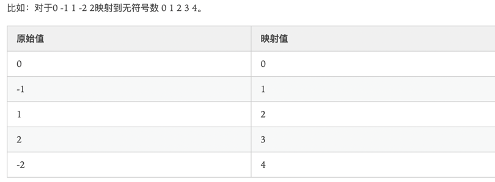
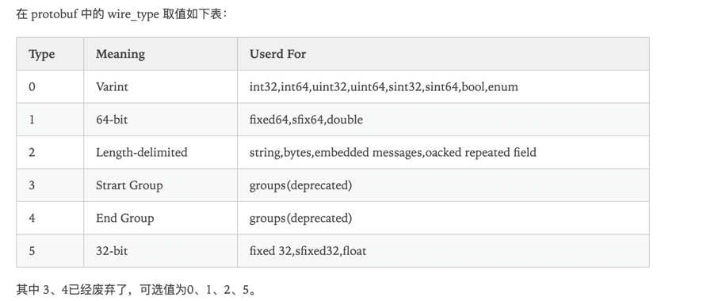
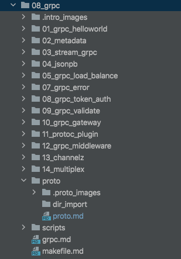
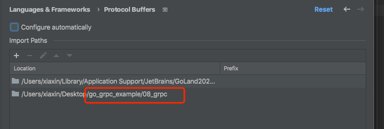
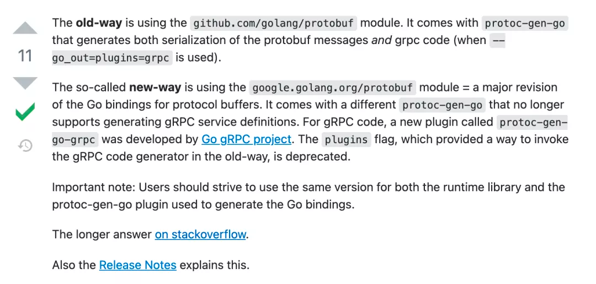

# Protobuf
    
Protocol buffers 是一种语言无关、平台无关的可扩展机制或者说是数据交换格式，用于序列化结构化数据。
与 XML、JSON 相比，Protocol buffers 序列化后的码流更小、速度更快、操作更简单。
## v2 和 v3 主要区别
* 删除原始值字段的字段存在逻辑
* 删除 required 字段
* 删除 optional 字段，默认就是
* 删除 default 字段
* 删除扩展特性，新增 Any 类型来替代它
* 删除 unknown 字段的支持
* 新增 JSON Mapping
* 新增 Map 类型的支持
* 修复 enum 的 unknown 类型
* repeated 默认使用 packed 编码
* 引入了新的语言实现（C＃，JavaScript，Ruby，Objective-C）

## 核心编码原理(包括 Varint 编码、ZigZag编码及 protobuf 特有的 Message Structure 编码结构等)
### 1. Varint编码:protobuf 编码主要依赖于 Varint 编码

Varint是一种使用一个或多个字节序列化整数的方法，会把整数编码为变长字节。
对于32位整型数据经过Varint编码后需要1~5个字节，小的数字使用1个byte，大的数字使用5个bytes。64位整型数据编码后占用1~10个字节。
在实际场景中小数字的使用率远远多于大数字，因此通过Varint编码对于大部分场景都可以起到很好的压缩效果。

#### 原理
Varint 中的每个字节（最后一个字节除外）都设置了最高有效位（most significant bit - msb）。
msb为1则表明后面的字节还是属于当前数据的,如果是0那么这是当前数据的最后一个字节数据
每个字节的低7位用于以7位为一组存储数字的二进制补码表示，最低有效组在前，或者叫最低有效字节在前。这表明varint编码后数据的字节是按照小端序排列的。

#### 编码方式

1. 转换为二进制表示
2. 每个字节保留后7位，去掉最高位
3. 因为 protobuf 使用的是小端序，所以要将大端序转为小端序
   - 每次从低向高取7位再加上最高有效位(最后一个字节高位补0，其余各字节高位补1)组成编码后的数据。 
4. 最后转成10进制

Note: 最高位为1代表后面7位仍然表示数字，否则为0，后面7位用原码补齐。

如果用不到 1 个字节，那么最高有效位设为 0 ，如下面这个例子，1 用一个字节就可以表示，所以 msb 为 0.
```
0000 0001
```

1. 123456用二进制表示为1 11100010 01000000，
2. 每次从低向高取7位再加上最高有效位变成1100 0000 11000100 00000111
3. 所以经过varint编码后123456占用三个字节分别为192 196 7。

解码的过程就是将字节依次取出，去掉最高有效位，因为是小端排序所以先解码的字节要放在低位，
之后解码出来的二进制位继续放在之前已经解码出来的二进制的高位最后转换为10进制数完成varint编码的解码过程。

#### 缺点
负数需要10个字节显示（因为计算机定义负数的符号位为数字的最高位）。
具体是先将负数是转成了long类型，再进行varint编码，这就是占用10个字节的原因了。

protobuf 采取的解决方式：使用 sint32/sint64 类型表示负数，通过先采用 Zigzag 编码，将正数、负数和0都映射到无符号数，最后再采用varints编码。

#### github.com/golang/protobuf/proto源码
编码encode
```go
const maxVarintBytes = 10 // maximum length of a varint

// 返回Varint类型编码后的字节流
func EncodeVarint(x uint64) []byte {
	var buf [maxVarintBytes]byte
	var n int
	// 下面的编码规则需要详细理解:
	// 1.每个字节的最高位是保留位, 如果是1说明后面的字节还是属于当前数据的,如果是0,那么这是当前数据的最后一个字节数据
	//  看下面代码,因为一个字节最高位是保留位,那么这个字节中只有下面7bits可以保存数据
	//  所以,如果x>127,那么说明这个数据还需大于一个字节保存,所以当前字节最高位是1,看下面的buf[n] = 0x80 | ...
	//  0x80说明将这个字节最高位置为1, 后面的x&0x7F是取得x的低7位数据, 那么0x80 | uint8(x&0x7F)整体的意思就是
	//  这个字节最高位是1表示这不是最后一个字节,后面7为是正式数据! 注意操作下一个字节之前需要将x>>=7
	// 2.看如果x<=127那么说明x现在使用7bits可以表示了,那么最高位没有必要是1,直接是0就ok!所以最后直接是buf[n] = uint8(x)
	//
	// 如果数据大于一个字节(127是一个字节最大数据), 那么继续, 即: 需要在最高位加上1
	for n = 0; x > 127; n++ {
	    // x&0x7F表示取出下7bit数据, 0x80表示在最高位加上1
		buf[n] = 0x80 | uint8(x&0x7F)
		// 右移7位, 继续后面的数据处理
		x >>= 7
	}
	// 最后一个字节数据
	buf[n] = uint8(x)
	n++
	return buf[0:n]
}
```
- 0x7F的二进制表示是0111 1111 ，所以x & 0x7F 与操作时，得到x二进制表示的最后7个bit位（前面的bit位通过与0做位与运算都被舍弃了）
- 0x80 的二进制表示是 1000 0000 ，所以 0x80 | uint8(x&0x7F)是在取出的x的后7个bit位前加上1（msb）

解码decode
```go
func DecodeVarint(buf []byte) (x uint64, n int) {
	for shift := uint(0); shift < 64; shift += 7 {
		if n >= len(buf) {
			return 0, 0
		}
		b := uint64(buf[n])
		n++
    // 下面这个分成三步走:
		// 1: b & 0x7F 获取下7bits有效数据
		// 2: (b & 0x7F) << shift 由于是小端序, 所以每次处理一个Byte数据, 都需要向高位移动7bits
		// 3: 将数据x和当前的这个字节数据 | 在一起
		x |= (b & 0x7F) << shift
		if (b & 0x80) == 0 {
			return x, n
		}
	}

	// The number is too large to represent in a 64-bit value.
	return 0, 0
}
```


### 2. ZigZag编码
ZigZag 是将符号数统一映射到无符号号数的一种编码方案，具体映射函数为：
```
Zigzag(n) = (n << 1) ^ (n >> 31), n 为 sint32 时

Zigzag(n) = (n << 1) ^ (n >> 63), n 为 sint64 时
```



### 3.  Message Structure 编码
protocol buffer 中 message 是一系列键值对。message 的二进制版本只是使用字段号(field’s number 和 wire_type)作为 key。
每个字段的名称和声明类型只能在解码端通过引用消息类型的定义（即 .proto 文件）来确定。这一点也是人们常常说的 protocol buffer 比 JSON，XML 安全一点的原因，
如果没有数据结构描述 .proto 文件，拿到数据以后是无法解析成正常的数据的。

1. wire_type


2. Tag
key 是使用该字段的 field_number 与wire_type 取|(或运算)后的值，field_number 是定义 proto 文件时使用的 tag 序号
```go
(field_number << 3)|wire_type
```
左移3位是因为wire_type最大取值为5，需要占3个bit，这样左移+或运算之后得到的结果就是，高位为field_number，低位为wire_type。

比如下面这个 message
```protobuf
message Test {
  required int32 a = 1;
} 
```
field_number=1，wire_type=0，按照公式计算（1«3|0） ,结果就是 1000。

低三位 000 表示wire_type = 0；

高位 1 表示 field_number = 1。

再使用 Varints 编码后结果就是 08

### 4. Signed Integers 编码
Google Protocol Buffer 定义了 sint32 这种类型，采用 zigzag 编码。将所有整数映射成无符号整数，然后再采用 varint 编码方式编码，这样，绝对值小的整数，编码后也会有一个较小的 varint 编码值。

### 5. Non-varint Numbers

Non-varint 数字比较简单，double 、fixed64 的 wire_type 为 1，在解析时告诉解析器，该类型的数据需要一个 64 位大小的数据块即可。同理，float 和 fixed32 的 wire_type 为5，给其 32 位数据块即可。两种情况下，都是高位在后，低位在前。

说 Protocol Buffer 压缩数据没有到极限，原因就在这里，因为并没有压缩 float、double 这些浮点类型。

### 6.  字符串
wire_type 类型为 2 的数据，是一种指定长度的编码方式：key + length + content，
key 的编码方式是统一的，length 采用 varints 编码方式，content 就是由 length 指定长度的 Bytes。

```protobuf
message Test2 {
  optional string b = 2;
}
```
设置该值为"testing"，二进制格式查看：
```shell
12 07 74 65 73 74 69 6e 67
```
- 12 07 74 65 73 74 69 6e 67是“testing”的 UTF8 代码。
- 12-->按照公式计算（2«3|2)=12
- 07-->长度为7


### 7. 嵌入式 message
```shell
message Test3 {
  optional Test1 c = 3;
}
```
设置字段为整数150，编码后的字节为：
```shell
1a 03 08 96 01
```
- 08 96 01 这三个代表的是 150
- 1a ->按照公式计算（3«3|2)=12
- 3 -> length 为 3，代表后面有 3 个字节，即 08 96 01

### 8. Packed Repeated Fields
在 proto3 中 Repeated 字段默认就是以这种方式处理。对于 packed repeated 字段，如果 message 中没有赋值，则不会出现在编码后的数据中。
否则的话，该字段所有的元素会被打包到单一一个 key-value 对中，且它的 wire_type=2，长度确定。
```shell
message Test4 {
  repeated int32 d = 4 [packed=true];
}
```
构造一个 Test4 字段，并且设置 repeated 字段 d 3个值：3，270和86942，编码后：
```shell
22 // tag 0010 0010(field number 010 0 = 4, wire type 010 = 2)

06 // payload size (设置的length = 6 bytes)
 
03 // first element (varint 3)
 
8E 02 // second element (varint 270)
 
9E A7 05 // third element (varint 86942)
```
形成了 Tag - Length - Value - Value - Value …… 对。


## 使用
参考目录：github.com/golang/protobuf@v1.5.2/internal/testprotos
### 基本定义
```protobuf
option go_package = "{out_path};out_go_package"; // 前一个参数用于指定生成文件的位置，后一个参数指定生成的 .go 文件的 package
package import; // 表示当前 protobuf 文件属于 import包，这个package不是 Go 语言中的那个package
```

### 1. 引入其他proto文件
```shell
pwd 
# /Users/xiaxin/Desktop/go_package_example
cd 08_grpc
```
目录结构   


Note: Goland proto插件展示问题，需要手动添加路径，不添加也不影响(这是插件问题)  
   
解决方式:解决后   



### 生成protobuf
参考scripts脚本
```makefile
.PHONY: proto
proto:
	protoc --proto_path=. --go_out=. --go-grpc_out=. ./proto/dir_import/*.proto
```

1) --proto_path =.  指定在当前目录(go_package_example/08_grpc)寻找 import 的文件
```protobuf
// 08_grpc/proto/dir_import/computer.proto
import "proto/dir_import/component.proto";
```
所以最终会去找 go_package_example/08_grpc/proto/dir_import/component.proto

2）–go_out=.
指定将生成文件放在当前目录( go_package_example/08_grpc)，同时因为 proto 文件中也指定了目录为protobuf/import,具体如下：
```protobuf
option go_package = "proto/dir_import;proto";
```
所以最终生成目录为--go_out+go_package= go_package_example/08_grpc/proto/dir_import.   
生成的文件名: 规则是filename.pb.go

Note:  可以通过参数 --go_opt=paths=source_relative 来指定使用绝对路径，从而忽略掉 proto 文件中的 go_package 路径，直接生成在 –go_out 指定的路径

3）./protobuf/import/*.proto 

指定编译 import 目录下的所有 proto 文件，由于有文件的引入所以需要一起编译才能生效。

Note: 当然也可以一个一个编译，只要把相关文件都编译好即可。


#### 插件解析
  
```makefile
.PHONY: proto1
proto1:
	protoc --proto_path=. --go_out=. --go-grpc_out=. ./proto/dir_import/*.proto
	
.PHONY: proto2
proto2:	
	protoc --proto_path=. --go_out=plugins=grpc:. ./proto/dir_import/*.proto
```
- go_out 对应 protoc-gen-go 插件；
- go-grpc_out 对应 protoc-gen-go-grpc 插件

总结:
1. 插件名字：*_out 对应 protoc-gen-* 插件.
2. 当使用参数 --go_out=plugins=grpc:xxx 生成时，生成的文件 *.pb.go 包含消息序列化代码和 gRPC 代码。
3. 当使用参数 --go_out=xxx --go-grpc_out=xxx 生成时，会生成两个文件 *.pb.go 和 *._grpc.pb.go ，它们分别是消息序列化代码和 gRPC 代码.


### wiretype     


## 工具
- protoc v3.18.1
- protoc-gen-go v1.27.1
- protoc-gen-go-grpc v1.1.0
- grpc v1.41.0
- protobuf v1.27.1

查看版本
```shell

protoc-gen-go-grpc --version
# protoc-gen-go-grpc 1.2.0


```

### protoc
   
protoc是protobuf文件（.proto）的编译器，可以借助这个工具把 .proto 文件转译成各种编程语言对应的源码，包含数据类型定义、调用接口等。

通过查看protoc的源码（参见github库）可以知道，protoc在设计上把protobuf和不同的语言解耦了，底层用c++来实现protobuf结构的存储，然后通过插件的形式来生成不同语言的源码。可以把protoc的编译过程分成简单的两个步骤

1. 解析.proto文件，转译成protobuf的原生数据结构在内存中保存；    

2. 把protobuf相关的数据结构传递给相应语言的编译插件，由插件负责根据接收到的protobuf原生结构渲染输出特定语言的模板

Note:包含的插件有 csharp、java、js、objectivec、php、python、ruby等多种,不包含go.

### protoc-gen-go
   
地址：https://github.com/golang/protobuf/tree/master/protoc-gen-go  v1.5.2
原生protoc并不包含Go版本的插件,protoc-gen-go是protobuf编译插件系列中的Go版本。
由于protoc-gen-go是Go写的，所以安装它变得很简单，只需要运行 go get -u github.com/golang/protobuf/protoc-gen-go

#### protoc-gen-go 源码目录分析
```css
│  main.go                               // main 函数，与 protoc 进程交互、 代码生成过程。写自己 protoc 插件时，通常会完全拷贝其内容
│
├─descriptor                             // 一个 proto 文件中的所有信息，通过 descriptor.proto 来定义
│      descriptor.pb.go
│    
│
├─generator                              // proto 协议类生成过程。这个部分可以复用。generator 中定义了插件的方式，让你扩展自己的代码
│  │  generator.go // 包含了大部分由protobuf原生结构到Go语言文件的渲染方法，其中 func (g *Generator) P(str ...interface{}) 这个方法会把渲染输出到generator的output（generator匿名嵌套了bytes.Buffer，因此有Buffer的方法）。
│  │  name_test.go // 测试，主要包含generator中名称相关方法的测试。
│  │
│  └─internal
│      |  工具类，略
│
├─grpc                                   // grpc service 定义过程，grpc 相关定义、函数。也是如何编写自己逻辑的参考例子
│      grpc.go //与generator相似，但是包含了很多生成grpc相关方法的方法，比如渲染转译protobuf中定义的rpc方法（在generator中不包含，其默认不转译service的定义）
│
├─plugin                                 // 与 protoc 进程数据交互的数据格式定义
│      plugin.pb.go //包含plugin的描述文件（.proto文件及其对应的Go编译文件），其中proto文件来自于proto库
│ 
│   
│
└─

```
1. main.go
```go
func main(){
	// ...
   protogen.Options{
      ParamFunc:         flags.Set,
      ImportRewriteFunc: importRewriteFunc,
   }.Run(func(gen *protogen.Plugin) error {
   	//...
})
}
```
实际的run函数
```go
func run(opts Options, f func(*Plugin) error) error {
	if len(os.Args) > 1 {
		return fmt.Errorf("unknown argument %q (this program should be run by protoc, not directly)", os.Args[1])
	}
	// protoc会把二进制写入stdin ,然后protoc-gen-go获取数据
	in, err := ioutil.ReadAll(os.Stdin)
	if err != nil {
		return err
	}
	// 解析数据到CodeGeneratorRequest{}
	req := &pluginpb.CodeGeneratorRequest{}
	if err := proto.Unmarshal(in, req); err != nil {
		return err
	}
	gen, err := opts.New(req)
	if err != nil {
		return err
	}
	if err := f(gen); err != nil {
		// Errors from the plugin function are reported by setting the
		// error field in the CodeGeneratorResponse.
		//
		// In contrast, errors that indicate a problem in protoc
		// itself (unparsable input, I/O errors, etc.) are reported
		// to stderr.
		gen.Error(err)
	}
	// 生成的数据填充到CodeGeneratorResponse
	resp := gen.Response()
	
	// 转化成二进制数据
	out, err := proto.Marshal(resp)
	if err != nil {
		return err
	}
	// protoc-gen-go写入stdout,protoc获取二进制数据
	if _, err := os.Stdout.Write(out); err != nil {
		return err
	}
	return nil
}
```

3. descriptor/descriptor.pb.go
```go
// Code generated by protoc-gen-go. DO NOT EDIT.
// source: github.com/golang/protobuf/protoc-gen-go/descriptor/descriptor.proto

package descriptor
```
protoc-gen-go依赖descriptor.pb.go代码实现编译
descriptor/descriptor.pb.go依赖protoc-gen-go生成

2. generator/generator.go  
plugin插件接口定义 
```go
// A Plugin provides functionality to add to the output during Go code generation,
// such as to produce RPC stubs.
type Plugin interface {
	Name() string   // 插件名字

	Init(g *Generator)  // 初始化函数，保存到Generator对象中

	Generate(file *FileDescriptor) // 生成自己逻辑代码，

	GenerateImports(file *FileDescriptor) // 生成自己需要引入的头文件
}
func RegisterPlugin(p Plugin) {
   plugins = append(plugins, p)
}
```
Note:对应的grpc/grpc.go就是对应的实现  

```go
func init() {
	generator.RegisterPlugin(new(grpc))
}
```

Generator结构体定义
```go
// Generator is the type whose methods generate the output, stored in the associated response structure.
type Generator struct {
	*bytes.Buffer

	Request  *plugin.CodeGeneratorRequest  // 请求
	Response *plugin.CodeGeneratorResponse // 回应

	Param             map[string]string // 命令行参数
	PackageImportPath string            // Go import path of the package we're generating code for
	ImportPrefix      string            // String to prefix to imported package file names.
	ImportMap         map[string]string // Mapping from .proto file name to import path

	Pkg map[string]string // The names under which we import support packages

	outputImportPath GoImportPath                   // Package we're generating code for.
	allFiles         []*FileDescriptor              // All files in the tree
	allFilesByName   map[string]*FileDescriptor     // All files by filename.
	genFiles         []*FileDescriptor              // 生成的文件
	file             *FileDescriptor                // 现在解析的文件
	packageNames     map[GoImportPath]GoPackageName // Imported package names in the current file.
	usedPackages     map[GoImportPath]bool          // Packages used in current file.
	usedPackageNames map[GoPackageName]bool         // Package names used in the current file.
	addedImports     map[GoImportPath]bool          // Additional imports to emit.
	typeNameToObject map[string]Object              // Key is a fully-qualified name in input syntax.
	init             []string                       // Lines to emit in the init function.
	indent           string
	pathType         pathType // How to generate output filenames.
	writeOutput      bool
	annotateCode     bool                                       // 注释是否保存
	annotations      []*descriptor.GeneratedCodeInfo_Annotation // annotations to store
}
```

### protoc-gen-go-grpc
安装参考
```shell
git clone -b v1.30.0 https://github.com/grpc/grpc-go  
cd cmd/protoc-gen-go-grpc  
go install .
```

### protoc-gen-go的替代版本:gogoprotobuf

在go中使用protobuf，有两个可选用的包goprotobuf（go官方出品）和gogoprotobuf。gogoprotobuf完全兼容google protobuf，
它生成的代码质量和编解码性能均比goprotobuf高一些。
主要是它在goprotobuf之上extend了一些option。这些option也是有级别区分的，有的option只能修饰field，有的可以修饰enum，有的可以修饰message，有的是修饰package（即对整个文件都有效)

gogoprotobuf有两个插件可以使用

protoc-gen-gogo：和protoc-gen-go生成的文件差不多，性能也几乎一样(稍微快一点点)
protoc-gen-gofast：生成的文件更复杂，性能也更高(快5-7倍)

```shell
#安装 the protoc-gen-gofast binary
go get github.com/gogo/protobuf/protoc-gen-gofast
#生成
protoc --gofast_out=. myproto.proto
```


## 生成的protobuf.pb.go源码分析
CodeC：定义了Marshal和Unmarshal的接口，在grpc底层实现是proto
```go
import (
	"github.com/gogo/protobuf/proto"
)

type Codec interface {
	Marshal(v interface{}) ([]byte, error)
	Unmarshal(data []byte, v interface{}) error
	String() string
}
```

proto.Message类型
```go
//message接口
type Message = protoiface.MessageV1
type MessageV1 interface {
    Reset()
    String() string
    ProtoMessage()
}
```
proto编译成的Go结构体都是符合Message接口的，从Marshal可知Go结构体有3种序列化方式：
```go
func Marshal(pb Message) ([]byte, error) {
	if m, ok := pb.(newMarshaler); ok {
		siz := m.XXX_Size()
		b := make([]byte, 0, siz)
		return m.XXX_Marshal(b, false)
	}
	if m, ok := pb.(Marshaler); ok {
		// If the message can marshal itself, let it do it, for compatibility.
		// NOTE: This is not efficient.
		return m.Marshal()
	}
	// in case somehow we didn't generate the wrapper
	if pb == nil {
		return nil, ErrNil
	}
	var info InternalMessageInfo
	siz := info.Size(pb)
	b := make([]byte, 0, siz)
	return info.Marshal(b, pb, false)
}
//newMarshaler接口
type newMarshaler interface {
    XXX_Size() int
    XXX_Marshal(b []byte, deterministic bool) ([]byte, error)
}
//Marshaler接口
type Marshaler interface {
    Marshal() ([]byte, error)
}
```

1. pb Message满足newMarshaler接口，则调用XXX_Marshal()进行序列化。   
2. pb满足Marshaler接口，则调用Marshal()进行序列化，这种方式适合某类型自定义序列化规则的情况。   
3. 否则，使用默认的序列化方式，创建一个Warpper，利用wrapper对pb进行序列化，后面会介绍方式1实际就是使用方式3。