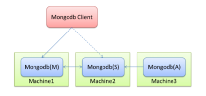
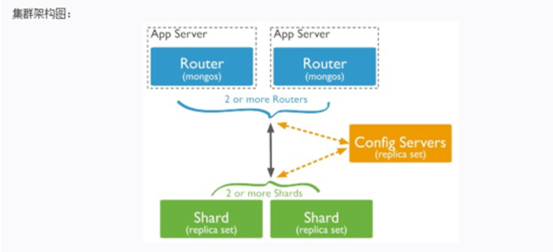

# mongo

MongoDB 是由C++语言编写的，是一个基于分布式文件存储的开源数据库系统.

MongoDB 是一个介于关系数据库和非关系数据库之间的产品，是非关系数据库当中功能最丰富，最像关系数据库的。

MongoDB stores BSON documents, i.e. data records, in collections; the collections in databases.


## 集群搭建的方式
mongodb集群搭建有三种方式。
1. Master-Slave模式
2. Replica-Set方式
3. Sharding方式

第一种方式基本没什么意义，官方也不推荐这种方式搭建。另外两种分别就是副本集和分片的方式。

###  Replica-Set方式


Mongodb(M)表示主节点Primary server，Mongo db(S)表示备节点Secondary，Mongodb(A)表示仲裁节点arbiter。主备节点存储数据，仲裁节点不存储数据。客户端同时连接主节点与备节点，不连接仲裁节点.

仲裁节点是一种特殊的节点，它本身并不存储数据，主要的作用是决定哪一个备节点在主节点挂掉之后提升为主节点，所以客户端不需要连接此节点。

在MongoDB副本集中，主节点负责处理客户端的读写请求，备份节点则负责映射主节点的数据。

备份节点的工作原理过程可以大致描述为，备份节点定期轮询主节点上的数据操作，然后对自己的数据副本进行这些操作，从而保证跟主节点的数据同步。至于主节点上的所有 数据库状态改变 的操作，都会存放在一张特定的系统表中。备份节点则是根据这些数据进行自己的数据更新。

上面提到的 数据库状态改变 的操作，称为oplog（operation log，主节点操作记录）。oplog存储在local数据库的"oplog.rs"表中。副本集中备份节点异步的从主节点同步oplog，然后重新执行它记录的操作，以此达到了数据同步的作用

Oplog注意点：

    Oplog的大小是固定的，当集合被填满的时候，新的插入的文档会覆盖老的文档。
    
    Oplog同步数据
    
    初始化：这个过程发生在当副本集中创建一个新的数据库或其中某个节点刚从宕机中恢复，或者向副本集中添加新的成员的时候，默认的，副本集中的节点会从离它最近的节点复制oplog来同步数据，这个最近的节点可以是primary也可以是拥有最新oplog副本的secondary节点。

replication set模式下同时支持访问控制，那么多节点之间也需要进行内部认证，有几种方式，即设置配置文件中的security.clusterAuthMode，这里我使用其默认的keyFile方式，所以需要事先准备一个保存有密钥的keyFile文件


### Sharding方式

sharding通过将数据集分布于多个也称作分片(shard)的节点上来降低单节点的访问压力。
每个分片都是一个独立的数据库，所有的分片组合起来构成一个逻辑上的完整意义的数据库。因此，分片机制降低了每个分片的数据操作量及需要存储的数据量。

1. shards:分片，即数据结点，存储数据和执行计算。为了保证高可用和数据一致性，生产环境中shards应该做成replicasets(防止丢失数据)。集群中有一个primary shards，执行非分片的任务。
2. mongos(query routers):查询路由，负责client的连接，并把任务分给shards，然后收集结果。一个集群中可以有多个query routers(replica sets)，以分担客户端请求(负载均衡)。
3. config server:配置服务器。保存了集群的元数据(比如数据放在哪个shards上)，query router通过config server中的配置信 息决定把任务分配到哪个shards上。从3.2开始，config servers可以做成replica sets

## MongoDB的应用场景

    1）表结构不明确且数据不断变大
    MongoDB是非结构化文档数据库，扩展字段很容易且不会影响原有数据。内容管理或者博客平台等，例如圈子系统，存储用户评论之类的。
    2）更高的写入负载
    MongoDB侧重高数据写入的性能，而非事务安全，适合业务系统中有大量"低价值"数据的场景。本身存的就是json格式数据。例如做日志系统。
    3）数据量很大或者将来会变得很大
    Mysql单表数据量达到5-10G时会出现明细的性能降级，需要做数据的水平和垂直拆分、库的拆分完成扩展，MongoDB内建了sharding、很多数据分片的特性，容易水平扩展，比较好的适应大数据量增长的需求。
    4）高可用性
    自带高可用，自动主从切换（副本集）

## 不适用的场景

    1）MongoDB不支持事务操作，需要用到事务的应用建议不用MongoDB。
    2）MongoDB目前不支持join操作，需要复杂查询的应用也不建议使用MongoDB

## 概念
### 1. 数据库 Databases

一个mongodb中可以建立多个数据库。

MongoDB的默认数据库为"db"，该数据库存储在data目录中。

MongoDB的单个实例可以容纳多个独立的数据库，每一个都有自己的集合和权限，不同的数据库也放置在不同的文件中。
```shell
# 显示所有数据的列表
show dbs

# 连接到一个指定的数据库，不存在会创建
use myD
```


### 2. 文档  document
文档是一个键值(key-value)对(即BSON)。MongoDB 的文档不需要设置相同的字段，并且相同的字段不需要相同的数据类型，这与关系型数据库有很大的区别，也是 MongoDB 非常突出的特点。

需要注意的是：

1、文档中的键/值对是有序的。

2、文档中的值不仅可以是在双引号里面的字符串，还可以是其他几种数据类型（甚至可以是整个嵌入的文档)。

3、MongoDB区分类型和大小写。

4、MongoDB的文档不能有重复的键。

5、文档的键是字符串。除了少数例外情况，键可以使用任意UTF-8字符。

#### bson简介

BSON是一种类json的一种二进制形式的存储格式，简称Binary JSON，它和JSON一样，支持内嵌的文档对象和数组对象，但是BSON有JSON没有的一些数据类型，如Date和BinData类型。

MongoDB使用了BSON这种结构来存储数据和网络数据交换。把这种格式转化成一文档这个概念(Document)，
因为BSON是schema-free的，所以在MongoDB中所对应的文档也有这个特征，这里的一个Document也可以理解成关系数据库中的一条记录(Record)，
只是这里的Document的变化更丰富一些，如Document可以嵌套


### 3. 集合 collection
集合就是 MongoDB 文档组，类似于 RDBMS （关系数据库管理系统：Relational Database Management System)中的表格 table。

集合存在于数据库中，集合没有固定的结构，这意味着你在对集合可以插入不同格式和类型的数据，但通常情况下我们插入集合的数据都会有一定的关联性。


### 4. 索引

索引通常能够极大的提高查询的效率，如果没有索引，MongoDB在读取数据时必须扫描集合中的每个文件并选取那些符合查询条件的记录。这种扫描全集合的查询效率是非常低的，特别在处理大量的数据时，查询可以要花费几十秒甚至几分钟，这对网站的性能是非常致命的。

索引是特殊的数据结构，索引存储在一个易于遍历读取的数据集合中，索引是对数据库表中一列或多列的值进行排序的一种结构。

建索引过程会阻塞其它数据库操作，background可指定以后台方式创建索引，即增加 "background" 可选参数。 "background" 默认值为false。

例如：db.xbqTable.ensureIndex({name:1},{background:true})，意思是 在name字段上建立一个升序的索引。

## CRUD
### 1. 聚合通道

MongoDB中聚合的方法使用aggregate()。聚合就是可以对数据查询进行多次过滤操作，以达到复杂查询的目的。
聚合查询函数接收一个数组，数组里面是若干个对象，每个对象就是一次查询的步骤。前一个查询的查询结果，作为后一个查询的筛选内容。
```shell
db.getCollection("student").aggregate(
    [
        { 
            "$match" : {
                "age" : {
                    "$gt" : 20.0
                }
            }
        }, 
        { 
            "$lookup" : {
                "from" : "room", 
                "localField" : "class", 
                "foreignField" : "name", 
                "as" : "num"
            }
        }, 
        { 
            "$unwind" : {
                "path" : "$num", 
                "includeArrayIndex" : "l", 
                "preserveNullAndEmptyArrays" : false
            }
        }, 
        { 
            "$project" : {
                "num.name" : 1.0
            }
        }, 
        { 
            "$count" : "cou"
        }
    ]


```
常用的管道查询操作：

- $project：修改输入文档的结构。可以用来重命名、增加或删除域，也可以用于创建计算结果以及嵌套文档。
- m a t c h ： 用 于 过 滤 数 据 ， 只 输 出 符 合 条 件 的 文 档 。 match：用于过滤数据，只输出符合条件的文档。match：用于过滤数据，只输出符合条件的文档。match使用MongoDB的标准查询操作。
- $limit：用来限制MongoDB聚合管道返回的文档数。
- $skip：在聚合管道中跳过指定数量的文档，并返回余下的文档。
- $unwind：将文档中的某一个数组类型字段拆分成多条，每条包含数组中的一个值。
- $group：将集合中的文档分组，可用于统计结果。
- $sort：将输入文档排序后输出。
- $geoNear：输出接近某一地理位置的有序文档。
- $lookup：连表查询

## readPreference读策略
readPreference 主要控制客户端 Driver 从复制集的哪个节点读取数据，这个特性可方便的配置读写分离、就近读取等策略。结合Tag，可以进一步细分控制读取策略。
    
- primary （只主）只从 primary 节点读数据，这个是默认设置
- primaryPreferred （先主后从）优先从 primary 读取，primary 不可服务，从 secondary 读
- secondary （只从）只从 scondary 节点读数据
- secondaryPreferred （先从后主）优先从 secondary 读取，没有 secondary 成员时，从 primary 读取
- nearest （就近）根据网络距离就近读取，根据客户端与服务端的PingTime实现

## 参考资料
1. [mongo 4.2 官方文档](https://www.mongodb.com/docs/v4.2/introduction/)


