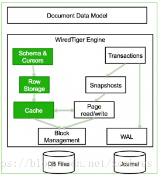
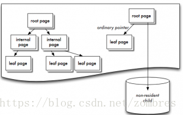
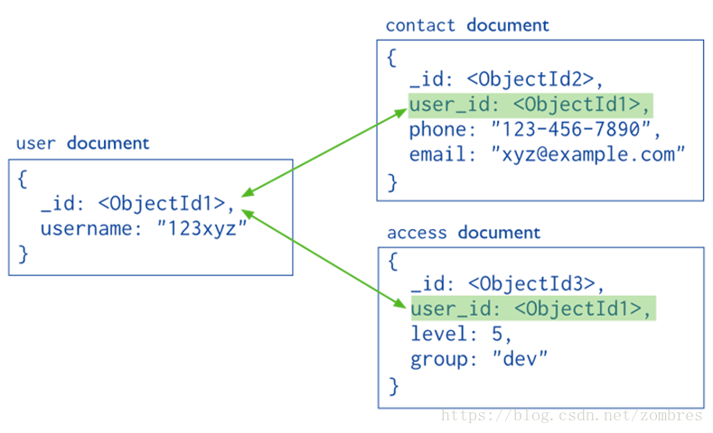

# mongo
    MongoDB 是由C++语言编写的，是一个基于分布式文件存储的开源数据库系统

    MongoDB 是一个介于关系数据库和非关系数据库之间的产品，是非关系数据库当中功能最丰富，最像关系数据库的。


## 关系型数据库和非关系型数据库的应用场景对比

关系型数据库适合存储结构化数据，如用户的帐号、地址：
    
    1）这些数据通常需要做结构化查询，比如join，这时候，关系型数据库就要胜出一筹
    2）这些数据的规模、增长的速度通常是可以预期的
    3）事务性、一致性

NoSQL适合存储非结构化数据，如文章、评论：

    1）这些数据通常用于模糊处理，如全文搜索、机器学习
    2）这些数据是海量的，而且增长的速度是难以预期的，
    3）根据数据的特点，NoSQL数据库通常具有无限（至少接近）伸缩性
    4）按key获取数据效率很高，但是对join或其他结构化查询的支持就比较差

优点：

    1）社区活跃，用户较多，应用广泛。
    2）MongoDB在内存充足的情况下数据都放入内存且有完整的索引支持，查询效率较高。
    3）MongoDB的分片机制，支持海量数据的存储和扩展。
缺点：

    1）不支持事务
    2）不支持join、复杂查询

## Mysql和MongoDB内存结构   
### 1、InnoDb内存使用机制

    
    Innodb关于查询效率有影响的两个比较重要的参数分别是innodb_buffer_pool_size，innodb_read_ahead_threshold。
    
    innodb_buffer_pool_size指的是Innodb缓冲池的大小，本例中Innodb缓冲池大小为20G，该参数的大小可通过命令指定innodb_buffer_pool_size 20G。
    缓冲池使用改进的LRU算法进行管理，维护一个LRU列表、一个FREE列表，FREE列表存放空闲页，数据库启动时LRU列表是空的，
    当需要从缓冲池分页时，首先从FREE列表查找空闲页，有则放入LRU列表，否则LRU执行淘汰，淘汰尾部的页分配给新页。
    
    innodb_read_ahead_threshold相对应的是数据预加载机制，innodb_read_ahead_threshold 30表示的是如果一个extent中的被顺序读取的page超过或者等于该参数变量的，
    Innodb将会异步的将下一个extent读取到buffer pool中，比如该参数的值为30，那么当该extent中有30个pages被sequentially的读取，则会触发innodb linear预读，将下一个extent读到内存中；
    在没有该变量之前，当访问到extent的最后一个page的时候，Innodb会决定是否将下一个extent放入到buffer pool中；可以在Mysql服务端通过show innodb status中的Pages read ahead和evicted without access两个值来观察预读的情况：
    
    Innodb_buffer_pool_read_ahead：表示通过预读请求到buffer pool的pages；
    Innodb_buffer_pool_read_ahead_evicted：表示由于请求到buffer pool中没有被访问，而驱逐出内存的页数。
    
    可以看出来，Mysql的缓冲池机制是能充分利用内存且有预加载机制，在某些条件下目标数据完全在内存中，也能够具备非常好的查询性能
### 2、MongoDB的存储结构及数据模型
#### 1）MongoDB使用的储存引擎是WiredTiger，WiredTiger的结构如图所示


    
    Wiredtiger的Cache采用Btree的方式组织，每个Btree节点为一个page，root page是btree的根节点，internal page是btree的中间索引节点，leaf page是真正存储数据的叶子节点；btree的数据以page为单位按需从磁盘加载或写入磁盘。
    可以通过在配置文件中指定storage.wiredTiger.engineConfig.cacheSizeGB参数设定引擎使用的内存量。此内存用于缓存工作集数据（索引、namespace，未提交的write，query缓冲等）。
#### 2）数据模型
##### 内嵌

内嵌类型支持一组相关的数据存储在一个文档中，这样的好处就是，应用程序可以通过比较少的的查询和更新操作来完成一些常规的数据的查询和更新工作。
当遇到以下情况的时候，我们应该考虑使用内嵌类型：

    如果数据关系是一种一对一的包含关系，例如下面的文档，每个人都有一个contact字段来描述这个人的联系方式。像这种一对一的关系，使用内嵌类型可以很方便的进行数据的查询和更新。
```json
{
    "_id": 1,
    "name": "Wilber",
    "contact": {
    "phone": "12345678",
    "email": "wilber@shanghai.com"
   }
}
```

    如果数据的关系是一对多，那么也可以考虑使用内嵌模型。例如下面的文档，用posts字段记录所有用户发布的博客。
    在这种情况中，如果应用程序会经常通过用户名字段来查询改用户发布的博客信息。那么，把posts作为内嵌字段会是一个比较好的选择，这样就可以减少很多查询的操作.

```json
{
"_id":1,
"name": "Wilber",
"contact": {
    "phone": "12345678",
    "email": "wilber@shanghai.com"
},
"posts": [
    {
        "title": "Indexes in MongoDB",
        "created": "12/01/2014",
        "link": "www.linuxidc.com"
    },
    {
        "title": "Replication in MongoDB",
        "created": "12/02/2014",
        "link": "www.linuxidc.com"
    },
    {
        "title": "Sharding in MongoDB",
        "created": "12/03/2014",
        "link": "www.linuxidc.com"
    }
]
}
```

    内嵌模型可以给应用程序提供很好的数据查询性能，因为基于内嵌模型，可以通过一次数据库操作得到所有相关的数据。同时，内嵌模型可以使数据更新操作变成一个原子写操作。然而，内嵌模型也可能引入一些问题，比如说文档会越来越大，这样就可能会影响数据库写操作的性能，还可能会产生数据碎片（data fragmentation）
##### 引用模型又称规格化模型（Normalized data models)

当我们遇到以下情况的时候，就可以考虑使用引用模型了：

    使用内嵌模型往往会带来数据的冗余，却可以提升数据查询的效率。但是，当应用程序基本上不通过内嵌模型查询，或者说查询效率的提升不足以弥补数据冗余带来的问题时，我们就应该考虑引用模型了。
    当需要实现复杂的多对多关系的时候，可以考虑引用模型。比如我们熟知的例子，学生-课程-老师关系，如果用引用模型来实现三者的关系，可能会比内嵌模型更清晰直观，同时会减少很多冗余数据。
    当需要实现复杂的树形关系的时候，可以考虑引用模型
## MongoDB的应用场景
    1）表结构不明确且数据不断变大
    MongoDB是非结构化文档数据库，扩展字段很容易且不会影响原有数据。内容管理或者博客平台等，例如圈子系统，存储用户评论之类的。
    2）更高的写入负载
    MongoDB侧重高数据写入的性能，而非事务安全，适合业务系统中有大量"低价值"数据的场景。本身存的就是json格式数据。例如做日志系统。
    3）数据量很大或者将来会变得很大
    Mysql单表数据量达到5-10G时会出现明细的性能降级，需要做数据的水平和垂直拆分、库的拆分完成扩展，MongoDB内建了sharding、很多数据分片的特性，容易水平扩展，比较好的适应大数据量增长的需求。
    4）高可用性
    自带高可用，自动主从切换（副本集）

## 不适用的场景
    1）MongoDB不支持事务操作，需要用到事务的应用建议不用MongoDB。
    2）MongoDB目前不支持join操作，需要复杂查询的应用也不建议使用MongoDB

# bson简介

    BSON是一种类json的一种二进制形式的存储格式，简称Binary JSON，它和JSON一样，支持内嵌的文档对象和数组对象，但是BSON有JSON没有的一些数据类型，如Date和BinData类型。

    MongoDB使用了BSON这种结构来存储数据和网络数据交换。把这种格式转化成一文档这个概念(Document)，
    因为BSON是schema-free的，所以在MongoDB中所对应的文档也有这个特征，这里的一个Document也可以理解成关系数据库中的一条记录(Record)，
    只是这里的Document的变化更丰富一些，如Document可以嵌套

# 聚合查询
## 1.聚合通道
    MongoDB中聚合的方法使用aggregate()。聚合就是可以对数据查询进行多次过滤操作，以达到复杂查询的目的。
    聚合查询函数接收一个数组，数组里面是若干个对象，每个对象就是一次查询的步骤。前一个查询的查询结果，作为后一个查询的筛选内容。
```shell
db.getCollection("student").aggregate(
    [
        { 
            "$match" : {
                "age" : {
                    "$gt" : 20.0
                }
            }
        }, 
        { 
            "$lookup" : {
                "from" : "room", 
                "localField" : "class", 
                "foreignField" : "name", 
                "as" : "num"
            }
        }, 
        { 
            "$unwind" : {
                "path" : "$num", 
                "includeArrayIndex" : "l", 
                "preserveNullAndEmptyArrays" : false
            }
        }, 
        { 
            "$project" : {
                "num.name" : 1.0
            }
        }, 
        { 
            "$count" : "cou"
        }
    ]


```
常用的管道查询操作：

    $project：修改输入文档的结构。可以用来重命名、增加或删除域，也可以用于创建计算结果以及嵌套文档。
    m a t c h ： 用 于 过 滤 数 据 ， 只 输 出 符 合 条 件 的 文 档 。 match：用于过滤数据，只输出符合条件的文档。match：用于过滤数据，只输出符合条件的文档。match使用MongoDB的标准查询操作。
    $limit：用来限制MongoDB聚合管道返回的文档数。
    $skip：在聚合管道中跳过指定数量的文档，并返回余下的文档。
    $unwind：将文档中的某一个数组类型字段拆分成多条，每条包含数组中的一个值。
    $group：将集合中的文档分组，可用于统计结果。
    $sort：将输入文档排序后输出。
    $geoNear：输出接近某一地理位置的有序文档。
    $lookup：连表查询

## readPreference读策略
readPreference 主要控制客户端 Driver 从复制集的哪个节点读取数据，这个特性可方便的配置读写分离、就近读取等策略。结合Tag，可以进一步细分控制读取策略。
    
- primary （只主）只从 primary 节点读数据，这个是默认设置
- primaryPreferred （先主后从）优先从 primary 读取，primary 不可服务，从 secondary 读
- secondary （只从）只从 scondary 节点读数据
- secondaryPreferred （先从后主）优先从 secondary 读取，没有 secondary 成员时，从 primary 读取
- nearest （就近）根据网络距离就近读取，根据客户端与服务端的PingTime实现


