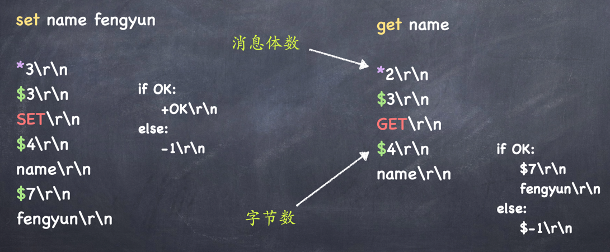

#Redis协议

Redis客户端使用RESP（Redis的序列化协议）协议与Redis的服务器端进行通信。 虽然该协议是专门为Redis设计的，但是该协议也可以用于其他 客户端-服务器 （Client-Server）软件项目。RESP是对以下几件事情的折中实现：

    1、实现简单
    
    2、解析快速
    
    3、人类可读
RESP实际上是一个支持以下数据类型的序列化协议：简单字符串（Simple Strings），错误（Errors），整数（Integers），块字符串（Bulk Strings）和数组（Arrays）

    RESP可以序列化不同的数据类型，如整数（integers），字符串（strings），数组（arrays）。它还使用了一个特殊的类型来表示错误（errors）。
    请求以字符串数组的形式来表示要执行命令的参数从客户端发送到Redis服务器。Redis使用命令特有（command-specific）数据类型作为回复。
    
    RESP协议是二进制安全的，并且不需要处理从一个进程传输到另一个进程的块数据的大小，因为它使用前缀长度（prefixed-length）的方式来传输块数据的
在Redis中,RESP用作 请求-响应 协议的方式如下：

    1、客户端将命令作为批量字符串的RESP数组发送到Redis服务器。
    
    2、服务器（Server）根据命令执行的情况返回一个具体的RESP类型作为回复。

在RESP协议中，有些的数据类型取决于第一个字节：

    1、对于简单字符串，回复的第一个字节是“+”
    
    2、对于错误，回复的第一个字节是“ - ”
    
    3、对于整数，回复的第一个字节是“：”
    
    4、对于批量字符串，回复的第一个字节是“$”
    
    5、对于数组，回复的第一个字节是“*”

