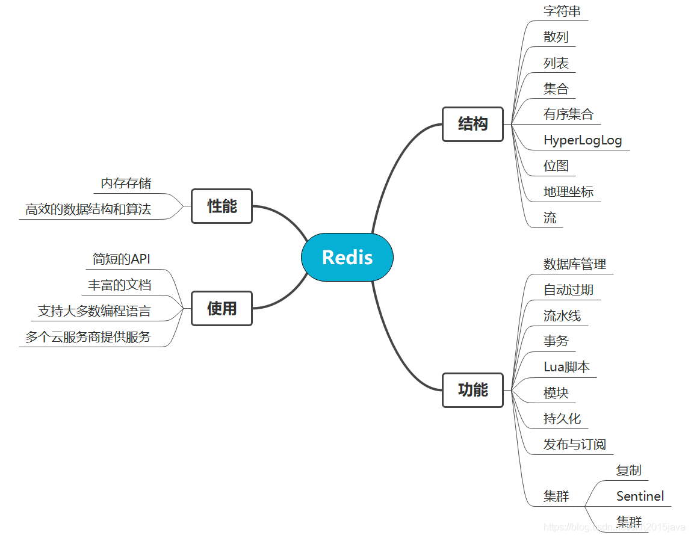
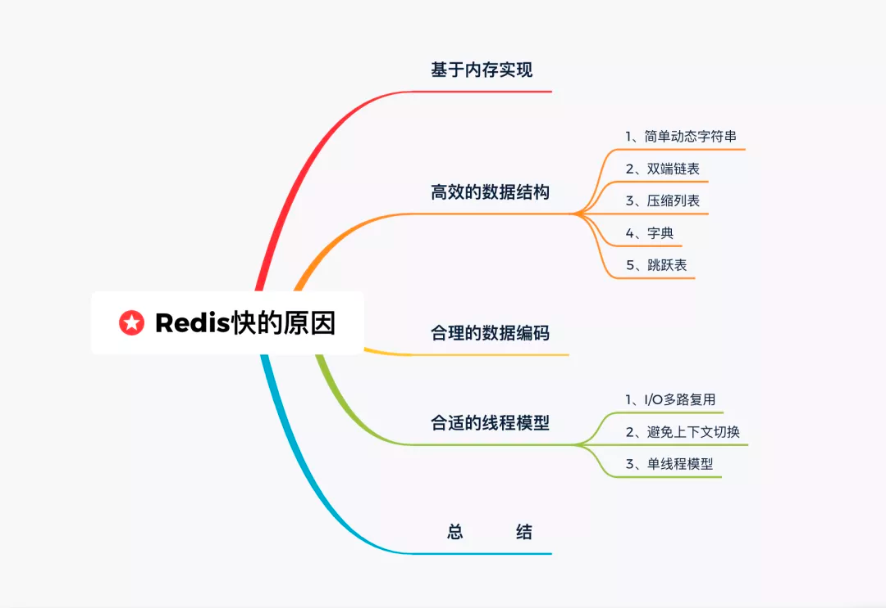
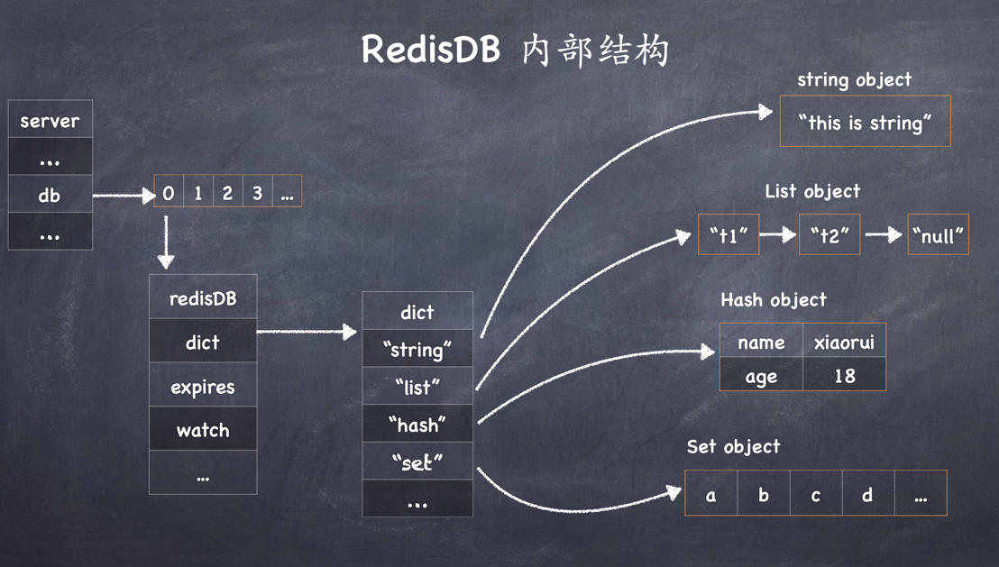
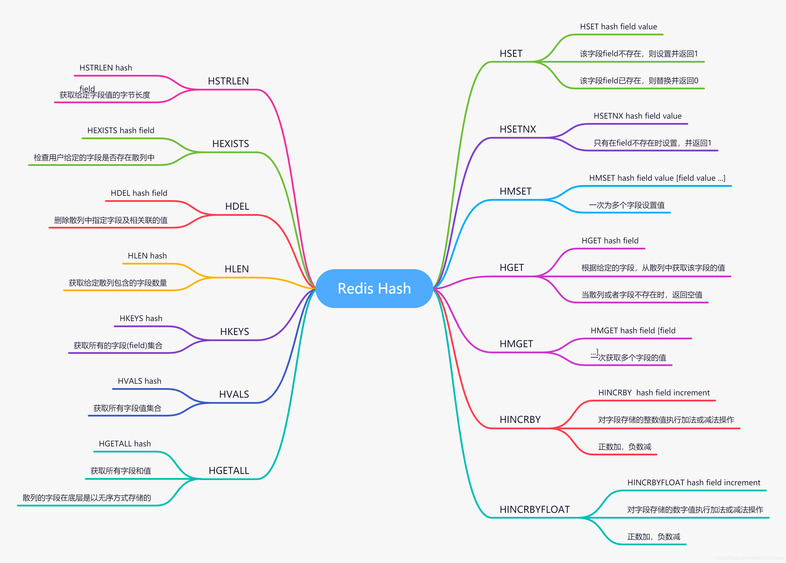
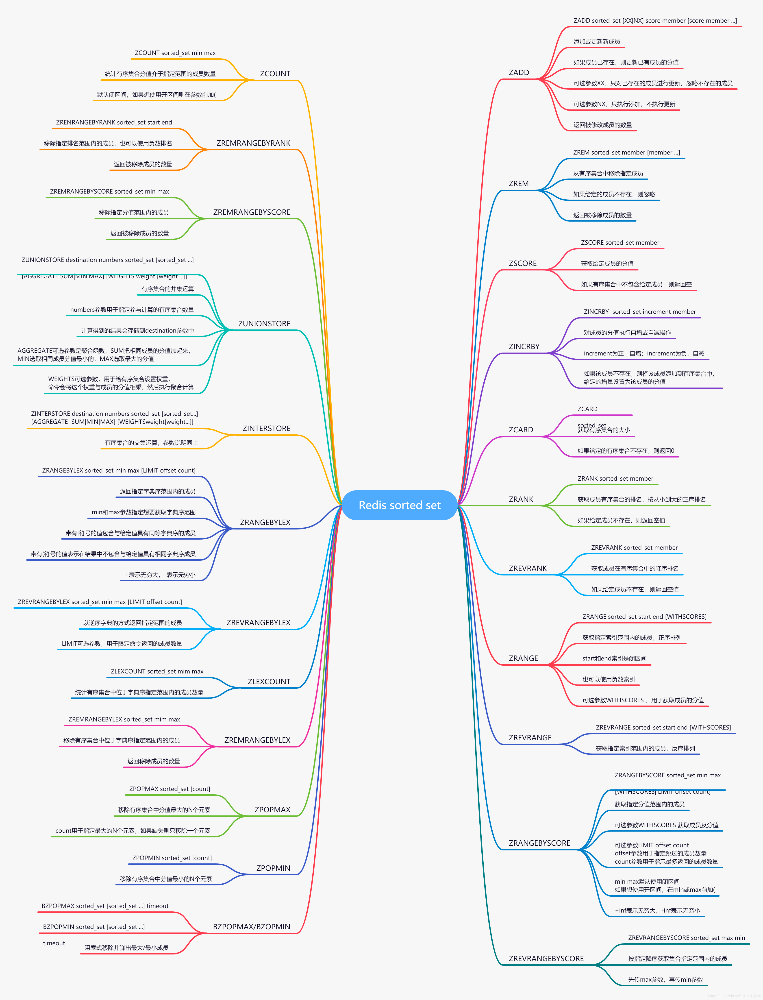
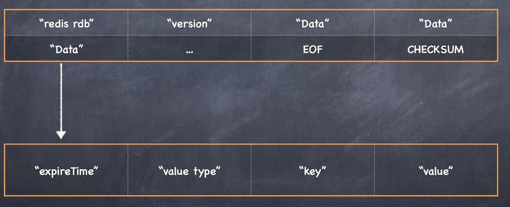
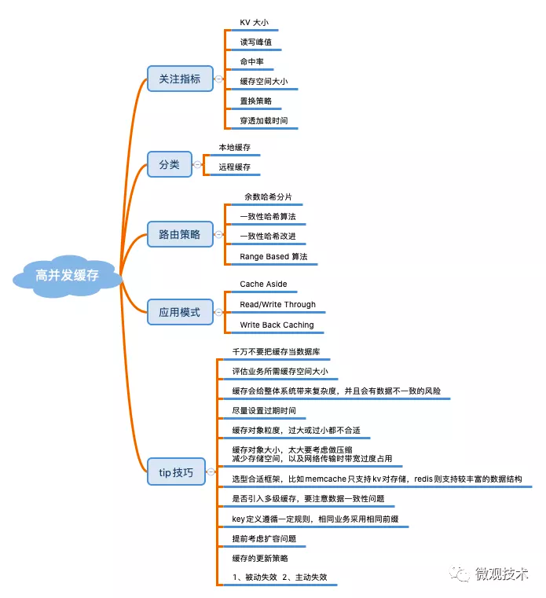

<!-- START doctoc generated TOC please keep comment here to allow auto update -->
<!-- DON'T EDIT THIS SECTION, INSTEAD RE-RUN doctoc TO UPDATE -->
**Table of Contents**  *generated with [DocToc](https://github.com/thlorenz/doctoc)*

- [Redis](#redis)
  - [为什么需要Redis?](#%E4%B8%BA%E4%BB%80%E4%B9%88%E9%9C%80%E8%A6%81redis)
  - [Reactor 单线程的Redis为什么这么快?](#reactor-%E5%8D%95%E7%BA%BF%E7%A8%8B%E7%9A%84redis%E4%B8%BA%E4%BB%80%E4%B9%88%E8%BF%99%E4%B9%88%E5%BF%AB)
  - [Redis五种数据类型应用场景](#redis%E4%BA%94%E7%A7%8D%E6%95%B0%E6%8D%AE%E7%B1%BB%E5%9E%8B%E5%BA%94%E7%94%A8%E5%9C%BA%E6%99%AF)
    - [扩展：](#%E6%89%A9%E5%B1%95)
  - [持久化方式](#%E6%8C%81%E4%B9%85%E5%8C%96%E6%96%B9%E5%BC%8F)
    - [1. RDB(redis database)：](#1-rdbredis-database)
    - [2. AOF(append only file)](#2-aofappend-only-file)
  - [Redis集群特点](#redis%E9%9B%86%E7%BE%A4%E7%89%B9%E7%82%B9)
  - [高并发缓存](#%E9%AB%98%E5%B9%B6%E5%8F%91%E7%BC%93%E5%AD%98)

<!-- END doctoc generated TOC please keep comment here to allow auto update -->

# Redis

	Remote Dictionary Server, 翻译为远程字典服务. Redis是一个完全开源的基于Key-Value的NoSQL存储系统，他是一个使用ANSIC语言编写的，
	遵守BSD协议，支持网络、可基于内存的可持久化的日志型、Key-Value数据库,并提供多种语言的API.
执行原理：

	# 1. 客户端发送命令后，Redis服务器将为这个客户端链接创造一个'输入缓存'，将命令放到里面
	# 2. 再由Redis服务器进行分配挨个执行，顺序是随机的，这将不会产生并发冲突问题，也就不需要事务了.
	# 3. 再将结果返回到客户端的'输出缓存'中，输出缓存先存到'固定缓冲区',如果存满了，就放入'动态缓冲区',客户端再获得信息结果

	# 如果数据时写入命令，例如set name:1  zhangsan 方式添加一个字符串.
	# Redis将根据策略，将这对key:value来用内部编码格式存储，好处是改变内部编码不会对外有影响，正常操作即可,
	# 同时不同情况下存储格式不一样，发挥优势.
## 为什么需要Redis?

	传统数据库在存储数据时，需要先定义schema，以确定类型(字节宽度)，并以行存储，所以每行所占的字节宽度是一致的（便于索引数据）。
	数据库内部数据分为多个datapage(一般是4kb)存储，随着数据量的增大，数据库查询速度会越来越慢，其主要瓶颈在于磁盘I/O。
	由于数据量增大查找datapage的时间也会变长，所以索引出现了。索引是一个B+T，存储在内存中，根据索引记录的信息，可以快速定位到datapage的位置。
    索引虽然会大大加快查询速度，但是因为增删改需要维护索引的B+T，所以会把增删改的速度拖慢，所以索引不适合频繁写的表。
    
	此外，当数据库高并发查询的情况下，单位时间内所需的数据量也是很大的，此时可能会受到磁盘带宽的影响，影响磁盘的查询速度。
	在I/O上，内存相比较于磁盘，拥有较好的性能;
	出现了一批基于内存的关系型数据库，比如SAP HAHA数据库，其物理机器内存2T，包含软件以及服务，购买需要1亿元,由于内存关系型数据库的昂贵价格，
	所以大部分公司采用了折中的方案,使用磁盘关系型数据库+内存缓存,比如 Oracle+Memcached,Mysql+Redis

## Reactor 单线程的Redis为什么这么快?

	* 1. 基于内存的访问，非阻塞I/O，Redis使用事件驱动模型epoll多路复用实现，连接，读写，关闭都转换为事件不在网络I/O上浪费过多的时间.
	* 2. 单线程避免高并发的时候，多线程有锁的问题和线程切换的CPU开销问题.《虽然是单线程，但可以开多实例弥补》
	* 3. 使用C语言编写，更好的发挥服务器性能，并且代码简介，性能高
	
Redis6.0后引入多线程提速：

    读写网络的read/write系统耗时 >> Redis运行执行耗时，Redis的瓶颈主要在于网络的 IO 消耗, 优化主要有两个方向:
    
    a.提高网络 IO 性能，典型的实现比如使用 DPDK 来替代内核网络栈的方式
        使用多线程充分利用多核，典型的实现比如 Memcached
        
    b.可以充分利用服务器 CPU 资源，目前主线程只能利用一个核
        多线程任务可以分摊 Redis 同步 IO 读写负荷
关于多线程

    Redis 6.0 版本 默认多线程是关闭的 io-threads-do-reads no
    Redis 6.0 版本 开启多线程后线程数也要谨慎设置。
    多线程可以使得性能翻倍，但是多线程只是用来处理网络数据的读写和协议解析，执行命令仍然是单线程顺序执行
    
	
## Redis五种数据类型应用场景

	1.String(sds,simple dynamic string简单动态字符串): 常规的set/get操作,因为string 类型是二进制安全的,可以用来存放图片，视频等内容.
	    C 中字符串遇到 '\0' 会结束，那 '\0' 之后的数据就读取不上了。但在 SDS 中，是根据 len 长度来判断字符串结束的,这样二进制安全的问题就解决了.
	    
        另外由于Redis的高性能读写功能，而string类型的value也可以是数字，一般做一些复杂的计数功能的缓存,还可以用作计数器（INCR,DECR），
		比如分布式环境中统计系统的在线人数，秒杀等

	2. hash(hash table): value 存放的是键值对结构化后的对象，将一些相关的数据存储在一起，比如用户的购物车。
	    比较方便操作其中某个字段，比如可以做单点登录存放用户信息,以cookiele作为key，
		设置30分钟为缓存过期时间，能很好的模拟出类似session的效
		
		这里需要明确一点： Redis中只有一个K，一个V。其中 K 绝对是字符串对象，而 V 可以是String、List、Hash、Set、ZSet任意一种
		

	3. list(deque): 发布和订阅、慢查询、监视器等都用到了链表，Redis服务器本身还是用链表来保存多个客户端的状态信息，以及使用链表来构建客户端输出缓冲区。
    另外可以利用lrange命令，做基于redis的分页功能,性能极佳，用户体验好
	

	4. set(intset+dict):由于底层是字典实现的，查找元素特别快，另外set 数据类型不允许重复，利用这两个特性我们可以进行全局去重，
		比如在用户注册模块，判断用户名是否注册；另外就是利用交集、并集、差集等操作，可以计算共同喜好，全部的喜好，自己独有的喜好等功能

		

	5. Zset(skip list + hash table):有序的集合，可以做范围查找，排行榜应用，取 TOP N 操作等,还可以做延时任务
	
### 扩展：
1.bitmap
    
    BitMap 原本的含义是用一个比特位来映射某个元素的状态。由于一个比特位只能表示 0 和 1 两种状态，所以 BitMap 能映射的状态有限，
    但是使用比特位的优势是能大量的节省内存空间。
    
    在 Redis 中BitMap 底层是基于字符串类型实现的，可以把 Bitmaps 想象成一个以比特位为单位的数组，数组的每个单元只能存储0和1，
    数组的下标在 Bitmaps 中叫做偏移量，BitMap 的 offset 值上限 2^32 - 1。
    
用途

    签到： key = 年份：用户id offset = （今天是一年中的第几天） % （今年的天数）
    统计活跃用户: 使用日期作为 key，然后用户 id 为 offset 设置不同offset为0 1 即可。
    
    
2.HyperLogLog

    是一种概率数据结构，它使用概率算法来统计集合的近似基数。而它算法的最本源则是伯努利过程 + 分桶 + 调和平均数。
    
    功能：误差允许范围内做基数统计 (基数就是指一个集合中不同值的个数) 的时候非常有用，每个HyperLogLog的键可以计算接近2^64不同元素的基数，
    而大小只需要12KB。错误率大概在0.81%。所以如果用做 UV 统计很合适
    
    HyperLogLog底层 一共分了 2^14 个桶，也就是 16384 个桶。每个(registers)桶中是一个 6 bit 的数组，
    这里有个骚操作就是一般人可能直接用一个字节当桶浪费2个bit空间，但是Redis底层只用6个然后通过前后拼接实现对内存用到了极致，最终就是 16384*6/8/1024 = 12KB。
    
3.Bloom Filter

    使用布隆过滤器得到的判断结果： 不存在的一定不存在，存在的不一定存在。
    

	
## 持久化方式

### 1. RDB(redis database)：
    以快照的形式将数据持久化到磁盘

    手段(会丢一部分最新数据) 
        * 每个Redis实例只会存一份rdb文件
        * 可以通过Save以及BGSAVE 来调用 
        * 二进制文件, lzf
    
### 2. AOF(append only file)
    
    以日志的形式记录每个操作，将Redis执行过的所有指令全部记录下来（读操作不记录）， 只许追加文件但不可以修改文件， Redis启动时会读取AOF配置文件重构数据

    每次操作都需要fsync, 前台线程阻塞
    aof的内容就是redis标准协议

意义 
    将同一个key的反复操作，全部转为最后的值或multi集合(<64)

no-appendfsync-on-rewrite yes

    正导出rdb快照的过程中,要不要停止同步fsync 
auto-aof-rewrite-min-size 3000mb

    aof文件,至少超过3000M时, 再执行aof重写 
auto-aof-rewrite-percentage 80

    aof文件大小比起上次重写时的大小,增长率80%时,执行aof重写

## Redis集群特点

1. 多个redis节点网络互联，数据共享  
2. 所有的节点都是一主一从（也可以是一主多从），其中从不提供服务，仅作为备用  
3. 不支持同时处理多个key（如MSET/MGET），因为redis需要把key均匀分布在各个节点上，并发量很高的情况下同时创建key-value会降低性能并导致不可预测的行为  
4. 支持在线增加、删除节点  
5. 客户端可以连任何一个主节点进行读写

## 高并发缓存

