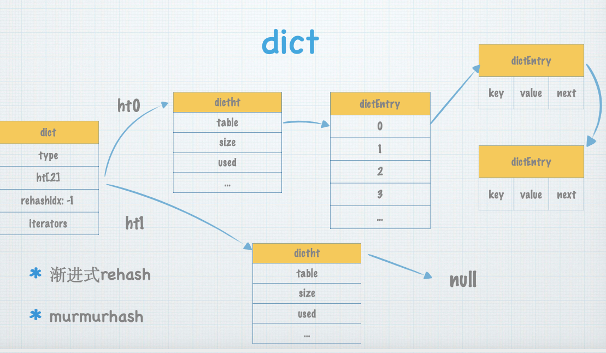
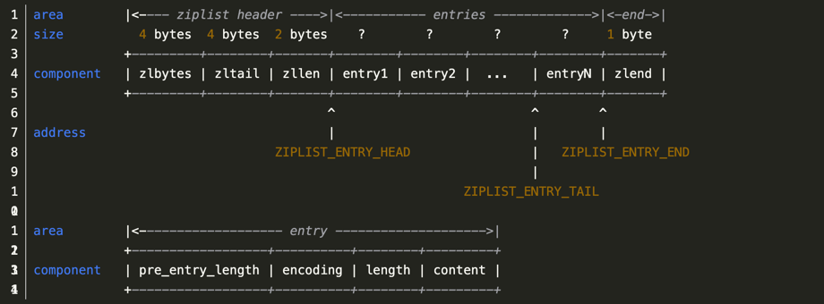
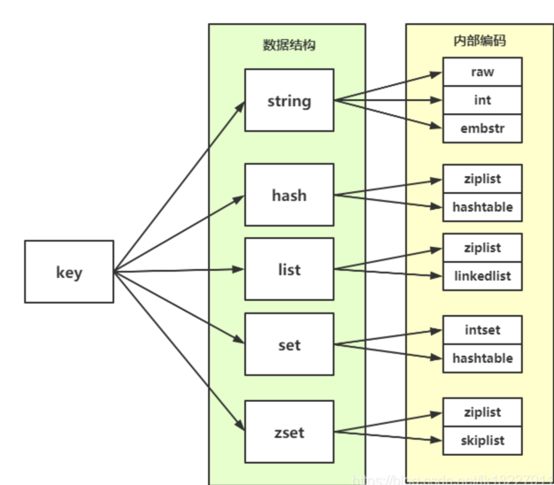
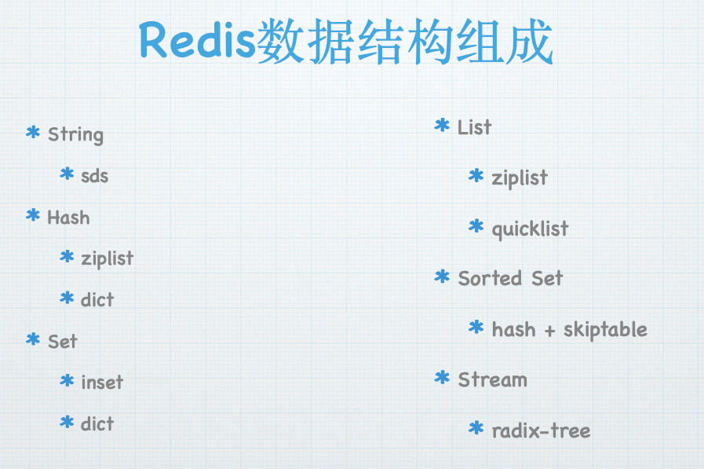
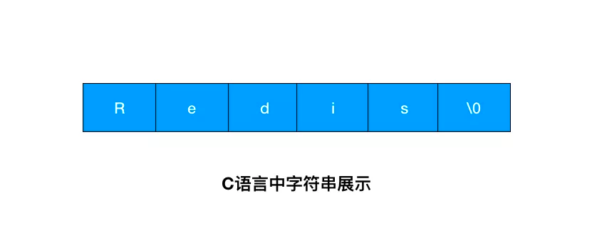
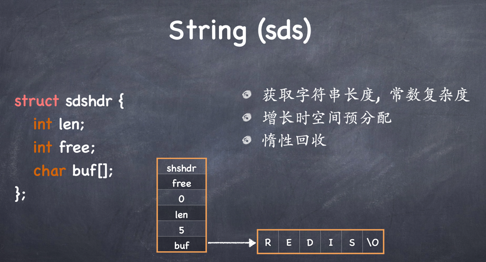

# redis数据类型与11zh3ong编码方式

## 1.redis核心对象结构
### Redis object对象的数据结构,具有五种属性
```cgo
// src/server.h
typedef struct redisObject {
    unsigned type:4;  // 类型对应基本数据类型,占4位
    unsigned encoding:4;  // 编码,对应了11中编码方式
    unsigned lru:LRU_BITS; /* LRU time (relative to global lru_clock) or
                            * LFU data (least significant 8 bits frequency
                            * and most significant 16 bits access time). */
                            // 最近最少使用
    int refcount; //引用数
    void *ptr; // 指针
} robj;
```

    [1] type ====> 类型对应基本数据类型。例如Redis_String 对应字符串，Redis_List对应列表
    [2] encoding ====> 编码。编码方式决定了对象的底层的数据结构，一个对象至少有两种编码方式
    [3] prt ====> 指针。指向由编码决定的数据结构，数据结构中往往包含有所存的数据
    [4] refcount ====> 引用计数。这个属性主要是为了实现redis中的内存回收机制
    [5] lru ====> 最近最少使用。用来解决对象的空转时长，同时也会被用于当缓冲达到最大值，再向其中添加数据时，应该删除什么数据。

#### 基本数据类型
```cgo
/* The actual Redis Object */
#define OBJ_STRING 0    /* String object. */
#define OBJ_LIST 1      /* List object. */
#define OBJ_SET 2       /* Set object. */
#define OBJ_ZSET 3      /* Sorted set object. */
#define OBJ_HASH 4      /* Hash object. */
```


#### encoding编码方式
```cgo
#define OBJ_ENCODING_RAW 0     /* Raw representation */
#define OBJ_ENCODING_INT 1     /* Encoded as integer 整数*/
#define OBJ_ENCODING_HT 2      /* Encoded as hash table 哈希表 */
#define OBJ_ENCODING_ZIPMAP 3  /* Encoded as zipmap */
#define OBJ_ENCODING_LINKEDLIST 4 /* No longer used: old list encoding. 不再使用*/
#define OBJ_ENCODING_ZIPLIST 5 /* Encoded as ziplist */
#define OBJ_ENCODING_INTSET 6  /* Encoded as intset */
#define OBJ_ENCODING_SKIPLIST 7  /* Encoded as skiplist 跳表 */
#define OBJ_ENCODING_EMBSTR 8  /* Embedded sds string encoding */
#define OBJ_ENCODING_QUICKLIST 9 /* Encoded as linked list of ziplists */
#define OBJ_ENCODING_STREAM 10 /* Encoded as a radix tree of listpacks */
```
##### 1.  OBJ_ENCODING_RAW
RAW编码方式使用简单动态字符串来保存字符串对象


```c   
typedef char *sds;
```
sds字符串根据字符串的长度，划分了五种结构体sdshdr5、sdshdr8、sdshdr16、sdshdr32、sdshdr64,分别对应的类型为SDS_TYPE_5、SDS_TYPE_8、SDS_TYPE_16、SDS_TYPE_32、SDS_TYPE_64
每个sds 所能存取的最大字符串长度为：

    sdshdr5最大为32(2^5)
    sdshdr8最大为0xff(2^8-1)
    sdshdr16最大为0xffff(2^16-1)
    sdshdr32最大为0xffffffff(2^32-1)
    sdshdr64最大为(2^64-1)
SDS_TYPE_8结构体
```c
struct __attribute__ ((__packed__)) sdshdr8 {
    // 已使用字符串长度
    uint8_t len; /* used */
    // 一共分配了多少字节
    uint8_t alloc; /* excluding the header and null terminator */
    unsigned char flags; /* 3 lsb of type, 5 unused bits */
    // 字节数组
    char buf[];
};

```
##### 2.OBJ_ENCODING_HT 哈希表


a. 哈希表节点key/value结构体定义，真正的数据节点

```c
typedef struct dictEntry {
	//键
	// Redis 的哈希表使用链地址法(separate chaining)来解决键冲突：
    void *key;
    //值
    union {
        void *val;
        uint64_t u64;
        int64_t s64;
        double d;
    } v;
     // 每个哈希表节点都有一个 next 指针， 多个哈希表节点可以用 next 指针构成一个单向链表，
     // 被分配到同一个索引上的多个节点可以用这个单向链表连接起来， 这就解决了键冲突的问题。
    struct dictEntry *next;
} dictEntry
```

b. 哈希表结构体,数据 dictEntry 类型的数组，每个数组的item可能都指向一个链表。
```c
/* This is our hash table structure. */
typedef struct dictht {
	//哈希表数组,对应的是多个哈希表节点dictEntry
    dictEntry **table;
    //哈希表大小
    unsigned long size;

   	//哈希表大小的掩码,用于计算索引值
   	//总是等于size-1
    unsigned long sizemask;

   	//已有节点的数量
    unsigned long used;
} dictht;
```

c. 字典的结构体
```c
//dict.h
typedef struct dict {

    // 包括一些自定义函数，这些函数使得key和value能够存储
    dictType *type;

    void *privdata;
    // ht是一个长度为2的数组，对应的是两个哈希表，一般使用使用ht[0],ht[1]主要在扩容和缩容时使用。
    dictht ht[2];

    long rehashidx; /* 是一个标志量，如果为-1说明当前没有扩容，如果不为 -1 则记录扩容位置 */
    unsigned long iterators; /*当前字典正在进行中的迭代器 */
} dict;


typedef struct dictType {
    // 用于计算Hash的函数指针
    unsigned int (*hashFunction)(const void *key);
    void *(*keyDup)(void *privdata，const void *key);
    void *(*valDup)(void *privdata，const void *obj);
    int (*keyCompare)(void *privdata，const void *key1，const void *key2);
    void (*keyDestructor)(void *privdata，void *key);
    void (*valDestructor)(void *privdata，void *obj);
} dictType;

```

##### 5. OBJ_ENCODING_ZIPLIST 压缩列表

    链表(List),哈希(Hash),有序集合(Sorted Set)在成员较少，成员值较小的时候都会采用压缩列表(ZIPLIST)编码方式进行存储。
    
    这里成员"较少"，成员值"较小"的标准可以通过配置项进行配置:
```cgo

hash-max-ziplist-entries 512
hash-max-ziplist-value 64
list-max-ziplist-entries 512
list-max-ziplist-value 64
zset-max-ziplist-entries 128
zset-max-ziplist-value 64
```





    如果在一个链表节点中存储一个小数据，比如一个字节。那么对应的就要保存头节点，前后指针等额外的数据。
 
    这样就浪费了空间，同时由于反复申请与释放也容易导致内存碎片化。这样内存的使用效率就太低了。
    
    并且压缩列表的内存是连续分配的，遍历的速度很快。

##### 6.OBJ_ENCODING_INTSET整数集合

当一个集合只包含整数值元素，并且这个集合的元素数量不多时，Redis就会使用整数集合键的底层实现。
```c
typedef struct intset {
	//编码方式
    uint32_t encoding;
    //集合包含的元素数量
    uint32_t length;
    //保存元素的数组
    int8_t contents[];
} intset;
```
contents数组是整数集合的底层实现：整数集合的每个元素都是contents数组的一个数据项(item),各个项在数组中按值得大小从小到大有序得排列，并且数组中不包含任何重复项

虽然intset结构将contents属性声明为int8_t类型的数组，但实际上contents并不保存任何int8_t类型的值，contents数组得真正类型取决于encoding属性的值:

    如果encoding属性得值为INTSET_ENC_INT16，那么contents就是一个int16_t类型的数组，数组里得每个项都是一个int16_t类型的整数值(最小值为-32768,最大值为32767)。
    
    如果encoding属性得值为INTSET_ENC_INT32，那么contents就是一个int32_t类型的数组，数组里的每个项都是一个int32_t类型的整数值(最小值为-2147483648,最大值为2147483648)。
    
    如果encoding属性的值为INTSET_ENC_INT64,那么contents就是一个int64_t类型的数组，数组里的每个项都是一个int64_t类型得整数值(最小值为-9223372036854775808,9223372036854775808)
length属性记录了整数集合包含得元素数量，也即是contents数组得长度。


##### 7.OBJ_ENCODING_SKIPLIST跳跃表
为有序集合对象专用，有序集合对象采用了字典+跳跃表的方式实现
```cgo
typedef struct zset {
    dict *dict;
    zskiplist *zsl;
} zset;
```
其中字典里面保存了有序集合中member与score的键值对，跳跃表则用于实现按score排序的功能


跳跃表的结构
```c
//定义在server.h/zskiplist
typedef struct zskiplistNode {
    sds ele;//成员对象
    double score;//分数
    struct zskiplistNode *backward;  //  后退指针，方便 zrev 系列的逆序操作
    //层
    struct zskiplistLevel {
    	//前进指针
        struct zskiplistNode *forward;
        //跨度
        unsigned long span;
    } level[];
    
} zskiplistNode;

typedef struct zskiplist {
    struct zskiplistNode *header, *tail;
    unsigned long length; // 跳跃表的长度
    int level; // 记录跳跃表内，层数最大的那个节点的层数
} zskiplist;
```
跳表就是多层链表的结合体，跳表分为许多层(level)，每一层都可以看作是数据的索引，这些索引的意义就是加快跳表查找数据速度

没有跳表查询时,查询数据37

有跳表查询37时


与一般的跳跃表实现相比，有序集合中的跳跃表有以下特点：

    * 允许重复的 score 值：多个不同的 member 的 score 值可以相同。
    * 进行对比操作时，不仅要检查 score 值，还要检查 member：当 score 值可以重复时，单靠 score 值无法判断一个元素的身份，所以需要连 member 域都一并检查才行。
    * 每个节点都带有一个高度为1层的后退指针，用于从表尾方向向表头方向迭代：当执行 ZREVRANGE 或ZREVRANGEBYSCORE这类以逆序处理有序集的命令时，就会用到这个属性

##### 8.  OBJ_ENCODING_EMBSTR(embedded string)
从Redis 3.0版本开始字符串引入了EMBSTR编码方式，长度小于OBJ_ENCODING_EMBSTR_SIZE_LIMIT的字符串将以EMBSTR方式存储
```cgo
robj *createStringObject(const char *ptr, size_t len) {
    if (len <= OBJ_ENCODING_EMBSTR_SIZE_LIMIT)
        return createEmbeddedStringObject(ptr,len);
    else
        return createRawStringObject(ptr,len);
}
```
EMBSTR方式的意思是 embedded string ，字符串的空间将会和redisObject对象的空间一起分配，两者在同一个内存块中

    Redis中内存分配使用的是jemalloc，jemalloc分配内存的时候是按照8,16,32,64作为chunk的单位进行分配的。
    为了保证采用这种编码方式的字符串能被jemalloc分配在同一个chunk中，该字符串长度不能超过64，
    故字符串长度限制OBJ_ENCODING_EMBSTR_SIZE_LIMIT = 64 - sizeof('0') - sizeof(robj)为16 - sizeof(struct sdshdr)为8 = 39

##### 9.OBJ_ENCODING_QUICKLIST

在Redis 3.2版本之前，一般的链表使用LINKDEDLIST编码。

在Redis 3.2版本开始，所有的链表都是用QUICKLIST编码。

两者都是使用基本的双端链表数据结构，区别是QUICKLIST每个节点的值都是使用ZIPLIST进行存储的。
```cgo
// 3.2版本之前
typedef struct list {
    listNode *head;
    listNode *tail;
    void *(*dup)(void *ptr);
    void (*free)(void *ptr);
    int (*match)(void *ptr，void *key);
    unsigned long len;
} list;

typedef struct listNode {
    struct listNode *prev;
    struct listNode *next;
    void *value;
} listNode;


// 3.2版本
typedef struct quicklist {
    quicklistNode *head;
    quicklistNode *tail;
    unsigned long count;        /* total count of all entries in all ziplists */
    unsigned int len;           /* number of quicklistNodes */
    int fill : 16;              /* fill factor for individual nodes */
    unsigned int compress : 16; /* depth of end nodes not to compress;0=off */
} quicklist;

typedef struct quicklistNode {
    struct quicklistNode *prev;
    struct quicklistNode *next;
    unsigned char *zl;
    unsigned int sz;             /* ziplist size in bytes */
    unsigned int count : 16;     /* count of items in ziplist */
    unsigned int encoding : 2;   /* RAW==1 or LZF==2 */
    unsigned int container : 2;  /* NONE==1 or ZIPLIST==2 */
    unsigned int recompress : 1; /* was this node previous compressed? */
    unsigned int attempted_compress : 1; /* node can't compress; too small */
    unsigned int extra : 10; /* more bits to steal for future usage */
} quicklistNode;
```

### client、redisServer对象
```cgo
struct client {
    int fd;// Client socket.
    sds querybuf;//Buffer we use to accumulate client queries.
    int argc;//当前命令的参数个数
    robj **argv;//当前命令redisObject对象
    redisDb *db;//当前选择的db
    int flags;
    user *user;//connection关联的用户
    list *reply;//List of reply objects to send to the client.
    char buf[PROTO_REPLY_CHUNK_BYTES];//Response buffer
    char slave_ip[NET_IP_STR_LEN];//slave ip
    ... many other fields ...
}
struct redisServer {
    /* General */
    pid_t pid;                  /* Main process pid. */
    redisDb *db;
    dict *commands;             /* Command table */
/* Networking */
    int port;                   /* TCP listening port */
    int tcp_backlog;            /* TCP listen() backlog */
    list *clients;              /* List of active clients */
    list *slaves, *monitors;    /* List of slaves and MONITORs */
}
```

## 2.操作
```
// 查看数据的编码类型
object encoding key
```

### RedisDB内部结构




### 1.string


c语言自带的字符串,不过是一个以0结束的字符数组.想要获取 「Redis」的长度，需要从头开始遍历，直到遇到 '\0' 为止。
其主要原因是C的字符串是底层的API，存在以下问题：（1）没有记录字符串长度，故需要O(n)复杂度获取字符串长度；（2）由于没有记录字符串长度，故容易出现缓冲区溢出问题；（3）每次对字符串拓容都需要使用系统调用，没有预留空间（4）C的字符串只能保存字符。


在redis中，sds提供简单动态字符串,（1）通过len记录字符串长度，实现O(1)复杂度获取；（2）内部字符串数组预留了空间，减少字符串的内存重分配次数，同时实现了自动拓容避免缓冲区溢出问题；（3）内部字符数组基于字节来保存数据，故可以保存字符和二进制数据

具体分配规则

    1、int：8个字节的长整型
    
    2、embstar：小于等于 39 字节的字符串
    
    3、raw：大于 39 字节的字符串
### 2.hash(ziplist+dict)

### 3.set(intset+dict)

### 4.list双端链表

### 5.Sort Set(dict+zskiplist)
```cgo
typedef struct zset {
    dict *dict;
    zskiplist *zsl;
} zset;
```
其中字典里面保存了有序集合中member与score的键值对，跳跃表则用于实现按score排序的功能


### 6.stream(radix-tree)

PipeLine:

	Redis的pipeline功能的原理是 Client通过一次性将多条redis命令发往Redis Server，减少了每条命令分别传输的IO开销。
	同时减少了系统调用的次数，因此提升了整体的吞吐能力。
	我们在主-从模式的Redis中，pipeline功能应该用的很多，但是Cluster模式下，估计还没有几个人用过。
	我们知道 redis cluster 默认分配了 16384 个slot，当我们set一个key 时，会用CRC16算法来取模得到所属的slot，
	然后将这个key 分到哈希槽区间的节点上，具体算法就是：CRC16(key) % 16384。如果我们使用pipeline功能，
	一个批次中包含的多条命令，每条命令涉及的key可能属于不同的slot