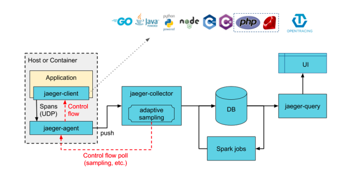

# jaeger

## 架构

* Jaeger Client - 为不同语言实现了符合 OpenTracing 标准的 SDK。应用程序通过 API 写入数据，client library 把 trace 信息按照应用程序指定的采样策略传递给 jaeger-agent。
* Agent - 它是一个监听在 UDP 端口上接收 span 数据的网络守护进程，它会将数据批量发送给 collector。它被设计成一个基础组件，部署到所有的宿主机上。
  Agent 将 client library 和 collector 解耦，为 client library 屏蔽了路由和发现 collector 的细节。
* Collector - 接收 jaeger-agent 发送来的数据，然后将数据写入后端存储。Collector 被设计成无状态的组件，因此您可以同时运行任意数量的 jaeger-collector。
* Data Store - 后端存储被设计成一个可插拔的组件，支持将数据写入 cassandra、elastic search。
* Jaeger Query - 接收查询请求，然后从后端存储系统中检索 trace 并通过 UI 进行展示。Query 是无状态的，您可以启动多个实例，把它们部署在 nginx 这样的负载均衡器后面

## Jaeger端口统计

### Agent
- 5775 UDP协议，接收兼容zipkin的协议数据
- 6831 UDP协议，接收兼容jaeger的兼容协议
- 6832 UDP协议，接收jaeger的二进制协议
- 5778 HTTP协议，数据量大不建议使用


### Collector
- 14267 tcp agent发送jaeger.thrift格式数据
- 14250 tcp agent发送proto格式数据（背后gRPC)
- 14268 http 直接接受客户端数据
- 14269 http 健康检查

### Query
16686 http jaeger的前端，放给用户的接口
16687 http 健康检查

## Jaeger解决的问题
- 分布式事务监控
- 性能和延迟优化
- 根本原因分析
- 服务依赖性分析
- 分布式上下文传播

## 安装方式
### 1. docker-compose安装
```shell
[root@k8s-master01 jaeger]# ls 
docker-compose-jaeger.yml  elasticsearch
[root@k8s-master01 jaeger]# cat elasticsearch/conf/elasticsearch.yml 
cluster.name: "docker-cluster"
#任意服务器都可以访问
network.host: 0.0.0.0
#配置宿主机ip地址,这样其他应用才:能访问到es
network.publish_host: 10.0.16.12
[root@k8s-master01 jaeger]# cat docker-compose-jaeger.yml 
version: '3'
networks:
  jaeger:
  
  
services:

  collector:
    image: jaegertracing/jaeger-collector:1.18
    container_name: collector
    restart: always
    environment:
      - SPAN_STORAGE_TYPE=elasticsearch
      - ES_SERVER_URLS=http://10.0.16.12:9200
      - LOG_LEVEL=debug
    networks:
      - jaeger
    ports:
      - "14269"
      - "14268:14268"
      - "14267"
      - "14250:14250"
      - "9411:9411"

  agent:
    image: jaegertracing/jaeger-agent:1.18
    container_name: agent
    restart: always
    environment:
      - REPORTER_GRPC_HOST_PORT=collector:14250
      - LOG_LEVEL=debug
    ports:
      - "5775:5775/udp"
      - "5778:5778"
      - "6831:6831/udp"
      - "6832:6832/udp"
    networks:
      - jaeger
    depends_on:
      - collector
  query:
    image: jaegertracing/jaeger-query:1.18
    restart: always
    container_name: query
    environment:
      - SPAN_STORAGE_TYPE=elasticsearch
      - ES_SERVER_URLS=http://10.0.16.12:9200
      - LOG_LEVEL=debug
    ports:
      - 16686:16686
    networks:
      - jaeger
      
  elasticsearch:
    image: docker.elastic.co/elasticsearch/elasticsearch:7.2.0
    restart: always
    volumes:
      - ./elasticsearch/conf/elasticsearch.yml:/usr/share/elasticsearch/config/elasticsearch.yml
    environment:
      - "discovery.type=single-node"
    expose:
      - "9200"
    ports:
      - "9200:9200"
```

#### 安装结果


### 2. Jaeger-Operator
Jaeger Operator是Kubernetes operator的实现。
```shell
[root@VM-0-123-centos jaeger]# kubectl create -n jaeger -f https://raw.githubusercontent.com/jaegertracing/jaeger-operator/master/deploy/crds/jaegertracing.io_jaegers_crd.yaml 
[root@VM-0-123-centos jaeger]# kubectl create -n jaeger -f https://raw.githubusercontent.com/jaegertracing/jaeger-operator/master/deploy/service_account.yaml
[root@VM-0-123-centos jaeger]# kubectl create -n jaeger -f https://raw.githubusercontent.com/jaegertracing/jaeger-operator/master/deploy/role.yaml
[root@VM-0-123-centos jaeger]# kubectl create -n jaeger -f https://raw.githubusercontent.com/jaegertracing/jaeger-operator/master/deploy/role_binding.yaml
[root@VM-0-123-centos jaeger]# kubectl create -n jaeger -f https://raw.githubusercontent.com/jaegertracing/jaeger-operator/master/deploy/operator.yaml
```


## 参考链接
1. 官方：https://github.com/jaegertracing/jaeger/tree/main/examples/hotrod