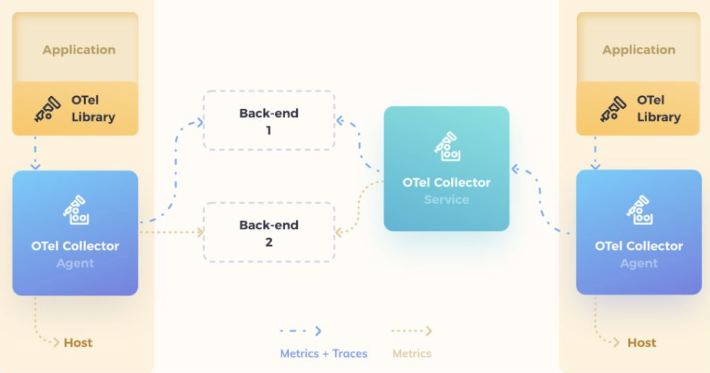
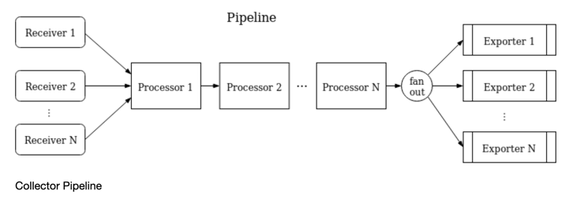

<!-- START doctoc generated TOC please keep comment here to allow auto update -->
<!-- DON'T EDIT THIS SECTION, INSTEAD RE-RUN doctoc TO UPDATE -->
**Table of Contents**  *generated with [DocToc](https://github.com/thlorenz/doctoc)*

- [OpenTelemetry](#opentelemetry)
  - [OpenTelemetry 诞生](#opentelemetry-%E8%AF%9E%E7%94%9F)
    - [openTelemetry架构](#opentelemetry%E6%9E%B6%E6%9E%84)
    - [1. 收集、转换、转发遥测数据的工具 Collector](#1-%E6%94%B6%E9%9B%86%E8%BD%AC%E6%8D%A2%E8%BD%AC%E5%8F%91%E9%81%A5%E6%B5%8B%E6%95%B0%E6%8D%AE%E7%9A%84%E5%B7%A5%E5%85%B7-collector)
    - [2. 自动监测客户端与第三方库 Instrumentation & Contrib](#2-%E8%87%AA%E5%8A%A8%E7%9B%91%E6%B5%8B%E5%AE%A2%E6%88%B7%E7%AB%AF%E4%B8%8E%E7%AC%AC%E4%B8%89%E6%96%B9%E5%BA%93-instrumentation--contrib)
  - [分布式跟踪(distributed trace) 基础概念](#%E5%88%86%E5%B8%83%E5%BC%8F%E8%B7%9F%E8%B8%AAdistributed-trace-%E5%9F%BA%E7%A1%80%E6%A6%82%E5%BF%B5)
    - [Trace(一种数据结构，代表了分布式跟踪链路)](#trace%E4%B8%80%E7%A7%8D%E6%95%B0%E6%8D%AE%E7%BB%93%E6%9E%84%E4%BB%A3%E8%A1%A8%E4%BA%86%E5%88%86%E5%B8%83%E5%BC%8F%E8%B7%9F%E8%B8%AA%E9%93%BE%E8%B7%AF)
    - [Span(一种数据结构，代表了Trace中的某一个片段)](#span%E4%B8%80%E7%A7%8D%E6%95%B0%E6%8D%AE%E7%BB%93%E6%9E%84%E4%BB%A3%E8%A1%A8%E4%BA%86trace%E4%B8%AD%E7%9A%84%E6%9F%90%E4%B8%80%E4%B8%AA%E7%89%87%E6%AE%B5)
    - [SpanContext(Span上下文)](#spancontextspan%E4%B8%8A%E4%B8%8B%E6%96%87)
    - [Span之间的Links(链接)](#span%E4%B9%8B%E9%97%B4%E7%9A%84links%E9%93%BE%E6%8E%A5)
    - [Attributes](#attributes)
    - [events](#events)
    - [Annotation: 注解,用来记录请求特定事件相关信息(例如时间)](#annotation-%E6%B3%A8%E8%A7%A3%E7%94%A8%E6%9D%A5%E8%AE%B0%E5%BD%95%E8%AF%B7%E6%B1%82%E7%89%B9%E5%AE%9A%E4%BA%8B%E4%BB%B6%E7%9B%B8%E5%85%B3%E4%BF%A1%E6%81%AF%E4%BE%8B%E5%A6%82%E6%97%B6%E9%97%B4)
    - [Propagator(传播者)](#propagator%E4%BC%A0%E6%92%AD%E8%80%85)
    - [Baggage](#baggage)
    - [Resources](#resources)
  - [代码案例 :svc1和svc2整合](#%E4%BB%A3%E7%A0%81%E6%A1%88%E4%BE%8B-svc1%E5%92%8Csvc2%E6%95%B4%E5%90%88)
    - [链路描述](#%E9%93%BE%E8%B7%AF%E6%8F%8F%E8%BF%B0)
  - [参考文档](#%E5%8F%82%E8%80%83%E6%96%87%E6%A1%A3)

<!-- END doctoc generated TOC please keep comment here to allow auto update -->

# OpenTelemetry 

## OpenTelemetry 诞生
OpenTelemetry 源于 OpenTracing 与 OpenCensus 两大开源社区的合并而来。OpenTracing 在 2016 年由 Ben Sigelman 发起，旨在解决开源 Tracing 实现重复开发监测客户端， 数据模型不统一， Tracing 后端兼容成本高的问题。
OpenCensus 则是由 Google 内部实践而来，结合了 Tracing 和 Metrics 的监测客户端开源工具包。

由于两大开源社区各自的影响力都不小，而存在两个或多个 Tracing 的标准这个事情本身跟社区组建的主旨相违背。于是两大开源社区一拍即合，成立了 OpenTelemetry。


### openTelemetry架构



组成： 

Specification：这个组件是语言无关的，主要是定义了规范，如 API 的规范，SDK 的开发规范，data数据规范。使用不同开发源于开发具体 SDK 的时候会按照标准开发，保证了规范性。

Proto：这个组件是语言无关的，主要是定义了 OpenTelemetry 的 OTLP 协议定义，OTLP 协议是 OpenTelemetry 中数据传输的重要部分。如 SDK 到Collector，Collector 到 Collector，Collector 到 Backend这些过程的数据传输都是遵循了 OTLP 协议。

Instrumentation Libraries：是根据 SDK 的开发规范开发的支持不同语言的 SDK，如 java，golang，c 等语言的 SDK。客户在构建观测性的时候，可以直接使用社区提供的已经开发好的 SDK 来构建观测能力。社区也在此基础上提供了一些工具，这些工具已经集成了常见软件的对接

Collector：负责收集观测数据，处理观测数据，导出观测数据。OpenTelemetry服务由两个主要的模型：Agent(一个本地代理)和Collector(一个独立运行的服务)。

架构介绍：

- Application： 一般的应用程序，同时使用了 OpenTelemetry 的 Library (实现了 API 的 SDK)。

- OTel Library：也称为 SDK，负责在客户端程序里采集观测数据，包括 metrics，traces，logs，对观测数据进行处理，之后观测数据按照 exporter 的不同方式，通过 OTLP 方式发送到 Collector 或者直接发送到 Backend 中

- OTel Collector：负责根据 OpenTelemetry 的协议收集数据的组件，以及将观测数据导出到外部系统。这里的协议指的是 OTLP (OpenTelemetry Protocol)。
  不同的提供商要想能让观测数据持久化到自己的产品里，需要按照 OpenTelemetry 的标准 exporter 的协议接受数据和存储数据。
  同时社区已经提供了常见开源软件的输出能力，如 Prometheus，Jaeger，Kafka，zipkin 等。图中看到的不同的颜色的 Collector，Agent Collector 是单机的部署方式，
  每一个机器或者容器使用一个，避免大规模的 Application 直接连接 Service Collector；Service Collector 是可以多副本部署的，可以根据负载进行扩容。
  
- Backend： 负责持久化观测数据，Collector 本身不会去负责持久化观测数据，需要外部系统提供，在 Collector 的 exporter 部分，需要将 OTLP 的数据格式转换成 Backend 能识别的数据格式。
  目前社区的已经集成的厂商非常多，除了上述的开源的，常见的厂商包括 AWS，阿里，Azure，Datadog，Dynatrace，Google，Splunk，VMWare 等都实现了 Collector 的 exporter 能力。
  

### 1. 收集、转换、转发遥测数据的工具 Collector

从架构层面来说，Collector 有两种模式。

1. 一种是把 Collector 部署在应用相同的主机内（如 K8S 的 DaemonSet）， 或者部署在应用相同的 Pod 里面 （如 K8S 中的 Sidecar），应用采集到的遥测数据，直接通过回环网络传递给 Collector。这种模式统称为 Agent 模式。

2. 另一种模式是把 Collector 当作一个独立的中间件，应用把采集到的遥测数据往这个中间件里面传递。这种模式称之为 Gateway 模式。


在 Collector 内部设计中，一套数据的流入、处理、流出的过程称为 pipeline。一个 pipeline 有三部分组件组合而成，它们分别是 receiver/ processor/ exporter。

- receiver:
  负责按照对应的协议格式监听接收遥测数据，并把数据转给一个或者多个 processor
- processor:
  负责做遥测数据加工处理，如丢弃数据，增加信息，转批处理等，并把数据传递给下一个 processor 或者传递给一个或多个 exporter
- exporter:
  负责把数据往下一个接收端发送（一般是遥测后端），exporter 可以定义同时从多个不同的 processor 中获取遥测数据

### 2. 自动监测客户端与第三方库 Instrumentation & Contrib
如果单纯使用监测客户端 API & SDK 包，许多的操作是需要修改应用代码的。
如添加 Tracing 监测点，记录字段信息，元数据在进程/服务间传递的装箱拆箱等。这种方式具有代码侵入性，不易解耦，而且操作成本高，增加用户使用门槛。
这个时候就可以利用公共组件的设计模式或语言特性等来降低用户使用门槛。

利用公共组件的设计模式，例如在 Golang 的 Gin 组件，实现了 Middleware 责任链设计模式。
我们可以引用 github.com/gin-gonic/gin 库，创建一个 otelgin.Middleware，手动添加到 Middleware 链中，实现 Gin 的快速监测，


## 分布式跟踪(distributed trace) 基础概念

一条分布式跟踪是一系列事件(Event)的顺序集合。这些事件分布在不同的应用程序中，可以 跨进程、网络和安全边界。例如，该链路可以从用户点击一个网页的按钮开始，在这种情况下，该跟踪会包含从点击按钮开始，所经过的所有下游服务， 最终串起来形成一条链路。


### Trace(一种数据结构，代表了分布式跟踪链路)
Traces 在OpenTelemetry中是通过Spans来进一步定义的. 我们可以把一个Trace想像成由 Spans组成的有向无环图（DAG）, 图的每条边代表了Spans之间的关系——父子关系。

下图示例表示了一个由8个span组成的tracer:
```css
        [Span A]  ←←←(the root span)
            |
     +------+------+
     |             |
 [Span B]      [Span C] ←←←(Span C is a `ChildOf` Span A)
     |             |
 [Span D]      +---+-------+
               |           |
           [Span E]    [Span F] >>> [Span G] >>> [Span H]
                                       ↑
                                       ↑
                                       ↑
                         (Span G `FollowsFrom` Span F)
```
时间轴的展现方式
```css
––|–––––––|–––––––|–––––––|–––––––|–––––––|–––––––|–––––––|–> time
 [Span A···················································]
   [Span B··············································]
      [Span D··········································]
    [Span C········································]
         [Span E·······]        [Span F··] [Span G··] [Span H··]
```


### Span(一种数据结构，代表了Trace中的某一个片段)
Span是一条追踪链路中的基本组成要素，一个span表示一个独立的工作单元，比如可以表示一次函数调用，一次http请求等等。span会记录如下基本要素:
- 服务名称（operation name）
- 服务的开始时间和结束时间
- Key:Value形式的属性集合，Key必须是字符串，Value可以是字符串、布尔或者数字类型
- 0个或者多个事件(Event), 每个事件都是一个Key:Value Map和一个时间戳
- 该Span的父Span ID
- Links(链接)到0个或多个有因果关系的Spans (通过那些Spans的SpanContext).
- 一个Span的SpanContext ID


### SpanContext(Span上下文)
包含所有能够识别Trace中某个Span的信息，而且该信息必须要跨越进程边界传播到子Span中。 一个SpanContext包含了将会由父Span传播到子Span的跟踪ID和一些设置选项

- TraceId 是一条Trace的全局唯一ID，由16个随机生成的字节组成,TraceID用来把该次请求链路的所有Spans组合到一起
  SpanId 是Span的全局唯一ID，由8个随机生成的字节组成，当一个SpanID被传播到子Span时，该ID就是子Span的父SpanID
- TraceFlags 代表了一条Trace的设置标志，由一个字节组成(里面8个bit都是设置位)
  例如采样Bit位 - 设置了该Trace是否要被采样（掩码0x1).
- Tracestate 携带了具体的跟踪内容，表现为[{key:value}]的键指对形式,Tracestate 允许不同的APM提供商加入额外的自定义内容和对于旧ID的转换处理

### Span之间的Links(链接)
一个Span可以和多个其它Span产生具有因果关系的链接(通过SpanContext定义)。

这些链接可以指向某一个Trace内部的SpanContexts，也可以指向其它的Traces。


### Attributes
Attributes以K/V键值对的形式保存用户自定义标签，主要用于链路追踪结果的查询过滤。例如： http.method="GET",http.status_code=200。
其中key值必须为字符串，value必须是字符串，布尔型或者数值型。 span中的Attributes仅自己可见，不会随着 SpanContext传递给后续span。

设置Attributes方式例如
```go
span.SetAttributes(
    label.String("http.remote", conn.RemoteAddr().String()),
    label.String("http.local", conn.LocalAddr().String()),
)
```

### events

Events与Attributes类似，也是K/V键值对形式。与Attributes不同的是，Events还会记录写入Events的时间，因此Events主要用于记录某些事件发生的时间。
Events的key值同样必须为字符串，但对value类型则没有限制

```go
span.AddEvent("http.request", trace.WithAttributes(
    label.Any("http.request.header", headers),
    label.Any("http.request.baggage", gtrace.GetBaggageMap(ctx)),
    label.String("http.request.body", bodyContent),
))
```

### Annotation: 注解,用来记录请求特定事件相关信息(例如时间)
通常包含四个注解信息：   
(1) cs：Client Start,表示客户端发起请求

(2) sr：Server Receive,表示服务端收到请求

(3) ss：Server Send,表示服务端完成处理，并将结果发送给客户端

(4) cr：Client Received,表示客户端获取到服务端返回信息

### Propagator(传播者)

Propagator传播器用于端对端的数据编码/解码，例如：Client到Server端的数据传输，TraceId、SpanId和Baggage也是需要通过传播器来管理数据传输。
业务端开发者往往对Propagator无感知，只有中间件/拦截器的开发者需要知道它的作用。

OpenTelemetry的标准协议实现库提供了常用的TextMapPropagator，用于常见的文本数据端到端传输。
此外，为保证TextMapPropagator中的传输数据兼容性，不应当带有特殊字符


### Baggage
除了Trace传播之外，OpenTelemetry还提供了一个简单的机制来传播键值对，这一机制被称为Baggage。

Baggage可以为一个服务查看可观测事件提供索引， 其属性则是由同一个事务的前一个服务提供。这有助于在各个事件之间建立因果关系

OpenTelemetry Baggage 是一个简单但通用的键值系统。一旦数据被添加为 Baggage，它就可以被所有下游服务访问。
这允许有用的信息，如账户和项目 ID，在事务的后期变得可用，而不需要从数据库中重新获取它们。

例如，一个使用项目 ID 作为索引的前端服务可以将其作为 Baggage 添加，允许后端服务也通过项目 ID 对其跨度和指标进行索引。
这信息添加到了http header中，进行上下文传递，因此每增加一个项目都必须被编码为一个头，每增加一个项目都会增加事务中每一个后续网络请求的大小，因此不建议在将大量的非重要的信息添加到Baggage中。

### Resources
Resource记录当前发生采集的实体的信息(虚拟机、容器等)，例如，Metrics如果是通过Kubernetes容器导出的，那么resource可以记录 Kubernetes集群、命名空间、Pod和容器名称等信息。


## 代码案例 :svc1和svc2整合
### 链路描述

1. C代表客户端，S代表服务端，F代表方法
2. 会有两个服务端S代表代码中的svc1，S’代表代码中的svc2
3. S收到请求后会开协程调用Fa，然后调用Fb
4. Fb会去跨服务请求S’的接口
5. S’收到请求后执行Fc

## 参考文档
1. [官网文档](https://opentelemetry.io/docs/concepts/what-is-opentelemetry/)
1. [opentelemetry 官方 github 文档](https://opentelemetry.io/docs/concepts/what-is-opentelemetry/)
1. [opentelemetry 官方 github 中文文档](https://github.com/open-telemetry/docs-cn/blob/main/specification/Readme.md)