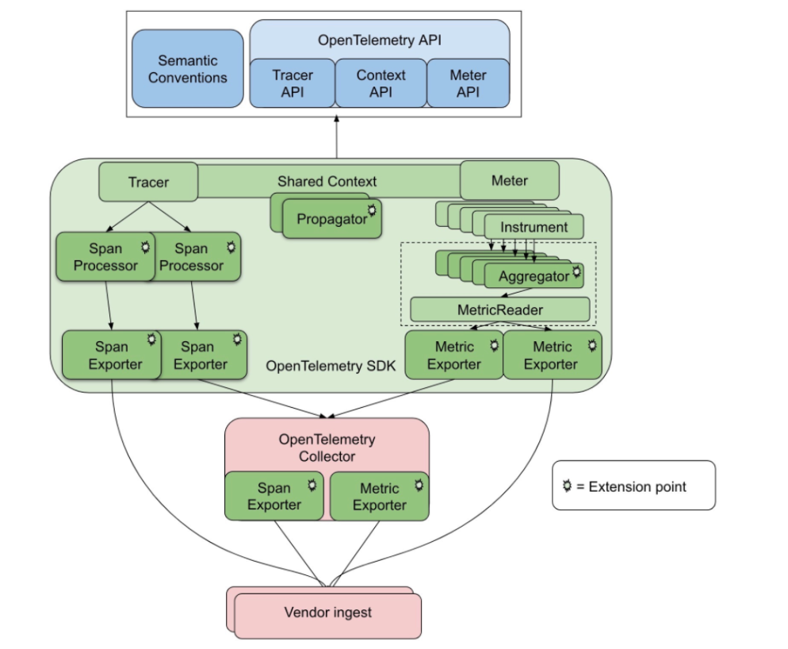

# OpenTelemetry 

## OpenTelemetry 诞生
OpenTelemetry 源于 OpenTracing 与 OpenCensus 两大开源社区的合并而来。OpenTracing 在 2016 年由 Ben Sigelman 发起，旨在解决开源 Tracing 实现重复开发监测客户端， 数据模型不统一， Tracing 后端兼容成本高的问题。
OpenCensus 则是由 Google 内部实践而来，结合了 Tracing 和 Metrics 的监测客户端开源工具包。

由于两大开源社区各自的影响力都不小，而存在两个或多个 Tracing 的标准这个事情本身跟社区组建的主旨相违背。于是两大开源社区一拍即合，成立了 OpenTelemetry。

### openTelemetry架构

组成： 

Specification：这个组件是语言无关的，主要是定义了规范，如 API 的规范，SDK 的开发规范，data数据规范。使用不同开发源于开发具体 SDK 的时候会按照标准开发，保证了规范性。

Proto：这个组件是语言无关的，主要是定义了 OpenTelemetry 的 OTLP 协议定义，OTLP 协议是 OpenTelemetry 中数据传输的重要部分。如 SDK 到Collector，Collector 到 Collector，Collector 到 Backend这些过程的数据传输都是遵循了 OTLP 协议。

Instrumentation Libraries：是根据 SDK 的开发规范开发的支持不同语言的 SDK，如 java，golang，c 等语言的 SDK。客户在构建观测性的时候，可以直接使用社区提供的已经开发好的 SDK 来构建观测能力。社区也在此基础上提供了一些工具，这些工具已经集成了常见软件的对接

Collector：负责收集观测数据，处理观测数据，导出观测数据。

架构介绍：

- Application： 一般的应用程序，同时使用了 OpenTelemetry 的 Library (实现了 API 的 SDK)。

- OTel Library：也称为 SDK，负责在客户端程序里采集观测数据，包括 metrics，traces，logs，对观测数据进行处理，之后观测数据按照 exporter 的不同方式，通过 OTLP 方式发送到 Collector 或者直接发送到 Backend 中

- OTel Collector：负责根据 OpenTelemetry 的协议收集数据的组件，以及将观测数据导出到外部系统。这里的协议指的是 OTLP (OpenTelemetry Protocol)。
  不同的提供商要想能让观测数据持久化到自己的产品里，需要按照 OpenTelemetry 的标准 exporter 的协议接受数据和存储数据。
  同时社区已经提供了常见开源软件的输出能力，如 Prometheus，Jaeger，Kafka，zipkin 等。图中看到的不同的颜色的 Collector，Agent Collector 是单机的部署方式，
  每一个机器或者容器使用一个，避免大规模的 Application 直接连接 Service Collector；Service Collector 是可以多副本部署的，可以根据负载进行扩容。
  
- Backend： 负责持久化观测数据，Collector 本身不会去负责持久化观测数据，需要外部系统提供，在 Collector 的 exporter 部分，需要将 OTLP 的数据格式转换成 Backend 能识别的数据格式。
  目前社区的已经集成的厂商非常多，除了上述的开源的，常见的厂商包括 AWS，阿里，Azure，Datadog，Dynatrace，Google，Splunk，VMWare 等都实现了 Collector 的 exporter 能力。
  

### 1. 收集、转换、转发遥测数据的工具 Collector

从架构层面来说，Collector 有两种模式。

1. 一种是把 Collector 部署在应用相同的主机内（如 K8S 的 DaemonSet）， 或者部署在应用相同的 Pod 里面 （如 K8S 中的 Sidecar），应用采集到的遥测数据，直接通过回环网络传递给 Collector。这种模式统称为 Agent 模式。

2. 另一种模式是把 Collector 当作一个独立的中间件，应用把采集到的遥测数据往这个中间件里面传递。这种模式称之为 Gateway 模式。

在 Collector 内部设计中，一套数据的流入、处理、流出的过程称为 pipeline。一个 pipeline 有三部分组件组合而成，它们分别是 receiver/ processor/ exporter。

- receiver:
  负责按照对应的协议格式监听接收遥测数据，并把数据转给一个或者多个 processor
- processor:
  负责做遥测数据加工处理，如丢弃数据，增加信息，转批处理等，并把数据传递给下一个 processor 或者传递给一个或多个 exporter
- exporter:
  负责把数据往下一个接收端发送（一般是遥测后端），exporter 可以定义同时从多个不同的 processor 中获取遥测数据

### 2. 自动监测客户端与第三方库 Instrumentation & Contrib
如果单纯使用监测客户端 API & SDK 包，许多的操作是需要修改应用代码的。
如添加 Tracing 监测点，记录字段信息，元数据在进程/服务间传递的装箱拆箱等。这种方式具有代码侵入性，不易解耦，而且操作成本高，增加用户使用门槛。
这个时候就可以利用公共组件的设计模式或语言特性等来降低用户使用门槛。

利用公共组件的设计模式，例如在 Golang 的 Gin 组件，实现了 Middleware 责任链设计模式。
我们可以引用 github.com/gin-gonic/gin 库，创建一个 otelgin.Middleware，手动添加到 Middleware 链中，实现 Gin 的快速监测，
    

## 代码案例 :svc1和svc2整合
### 链路描述

1. C代表客户端，S代表服务端，F代表方法
2. 会有两个服务端S代表代码中的svc1，S’代表代码中的svc2
3. S收到请求后会开协程调用Fa，然后调用Fb
4. Fb会去跨服务请求S’的接口
5. S’收到请求后执行Fc

## 参考文档
1. [官方文档链接](https://opentelemetry.io/docs/concepts/what-is-opentelemetry/)