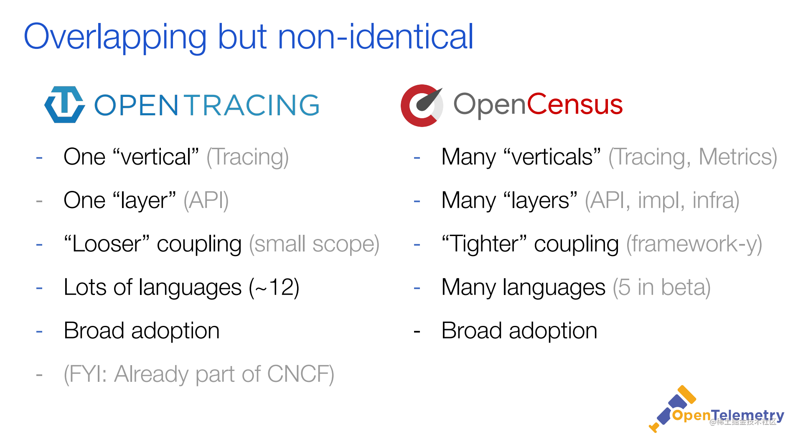

# 链路追踪(Distributed Tracing)
是一种用于分析和监控应用程序的方法，尤其是使用微服务架构构建的应用程序。分布式跟踪有助于精确定位故障发生的位置以及导致性能差的原因.

目前在Tracing技术这块比较有影响力的是两大开源技术框架：Netflix公司开源的 OpenTracing 和 Google 开源的 OpenCensus.

两大框架都拥有比较高的开发者群体。为形成统一的技术标准，两大框架最终磨合成立了OpenTelemetry项目，简称 "OTel".

## 常用的链路追踪系统
* SkyWalking：本土开源的基于字节码注入的调用链分析，以及应用监控分析工具。特点是支持多种插件，UI功能较强，接入端无代码侵入
* 阿里 鹰眼
* 大众点评 CAT:大众点评开源的基于编码和配置的调用链分析，应用监控分析，日志采集，监控报警等一系列的监控平台工具
* Twitter Zipkin：目前基于springcloud sleuth得到了广泛的使用，特点是轻量，使用部署简单
* Naver pinpoint：韩国人开源的基于字节码注入的调用链分析，以及应用监控分析工具。特点是支持多种插件，UI功能强大，接入端无代码侵入
* Uber Jaeger

## 链路监控组件要求
- 探针的性能消耗

  APM组件服务的影响应该做到足够小。在一些高度优化过的服务，即使一点点损耗也会很容易察觉到，而且有可能迫使在线服务的部署团队不得不将跟踪系统关停。

- 代码的侵入性

  对于应用的程序员来说，是不需要知道有跟踪系统这回事的。如果一个跟踪系统想生效，就必须需要依赖应用的开发者主动配合，那么这个跟踪系统也太脆弱了，往往由于跟踪系统在应用中植入代码的bug或疏忽导致应用出问题，这样才是无法满足对跟踪系统“无所不在的部署”这个需求。

- 可扩展性

  能够支持的组件越多当然越好。或者提供便捷的插件开发API，对于一些没有监控到的组件，应用开发者也可以自行扩展。

- 数据的分析

  数据的分析要快 ，分析的维度尽可能多。跟踪系统能提供足够快的信息反馈，就可以对生产环境下的异常状况做出快速反应。分析的全面，能够避免二次开发

## 分类
开源领域主要分为两派   

1. 一派是以 CNCF 技术委员会为主的 OpenTracing 的规范，例如 jaeger zipkin 都是遵循了OpenTracing 的规范。
2. 而另一派则是谷歌作为发起者的 OpenCensus，而且谷歌本身还是最早提出链路追踪概念的公司，后期连微软也加入了 OpenCensus.

## 参考链接
1. https://www.bookstack.cn/read/goframe-1.16-zh/549208391059b05d.md