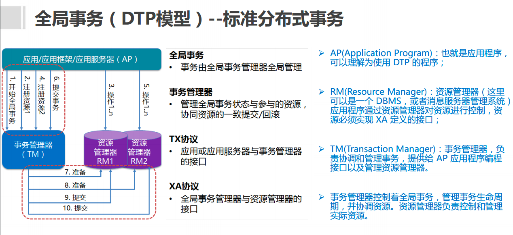
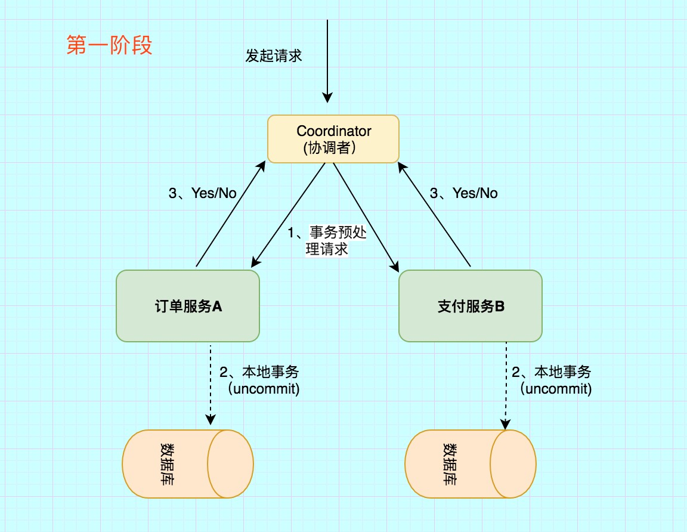
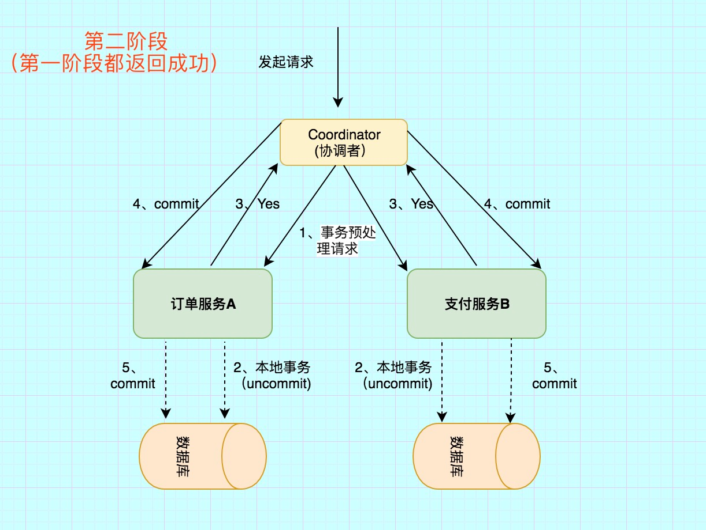
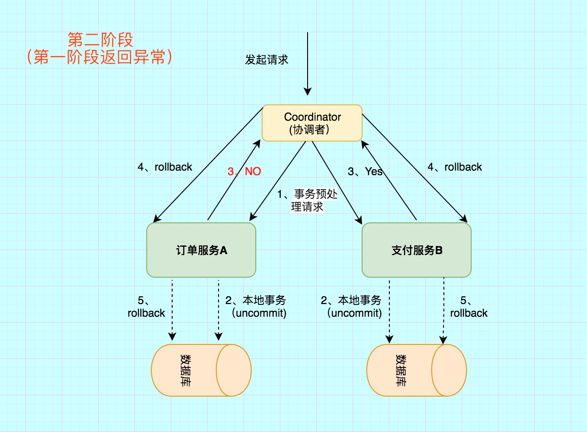

<!-- START doctoc generated TOC please keep comment here to allow auto update -->
<!-- DON'T EDIT THIS SECTION, INSTEAD RE-RUN doctoc TO UPDATE -->
**Table of Contents**  *generated with [DocToc](https://github.com/thlorenz/doctoc)*

- [两阶段提交(2PC)/XA](#%E4%B8%A4%E9%98%B6%E6%AE%B5%E6%8F%90%E4%BA%A42pcxa)
  - [应用](#%E5%BA%94%E7%94%A8)
  - [X/Open Distributed Transaction Processing (DTP标准分布式事务) Model (X/Open XA)](#xopen-distributed-transaction-processing-dtp%E6%A0%87%E5%87%86%E5%88%86%E5%B8%83%E5%BC%8F%E4%BA%8B%E5%8A%A1-model-xopen-xa)
    - [了解规范](#%E4%BA%86%E8%A7%A3%E8%A7%84%E8%8C%83)
  - [1、第一阶段：投票阶段](#1%E7%AC%AC%E4%B8%80%E9%98%B6%E6%AE%B5%E6%8A%95%E7%A5%A8%E9%98%B6%E6%AE%B5)
  - [2.第二阶段：提交/执行阶段](#2%E7%AC%AC%E4%BA%8C%E9%98%B6%E6%AE%B5%E6%8F%90%E4%BA%A4%E6%89%A7%E8%A1%8C%E9%98%B6%E6%AE%B5)
    - [成功流程](#%E6%88%90%E5%8A%9F%E6%B5%81%E7%A8%8B)
    - [失败流程](#%E5%A4%B1%E8%B4%A5%E6%B5%81%E7%A8%8B)
  - [2PC缺点](#2pc%E7%BC%BA%E7%82%B9)
  - [2pc代码参考案例](#2pc%E4%BB%A3%E7%A0%81%E5%8F%82%E8%80%83%E6%A1%88%E4%BE%8B)
  - [2PC 改进模型: NewSQL 阵营 Percolator](#2pc-%E6%94%B9%E8%BF%9B%E6%A8%A1%E5%9E%8B-newsql-%E9%98%B5%E8%90%A5-percolator)
    - [PreWrite 阶段](#prewrite-%E9%98%B6%E6%AE%B5)
    - [Commit阶段](#commit%E9%98%B6%E6%AE%B5)
- [三阶段提交](#%E4%B8%89%E9%98%B6%E6%AE%B5%E6%8F%90%E4%BA%A4)
  - [3PC 缺点](#3pc-%E7%BC%BA%E7%82%B9)
  - [参考](#%E5%8F%82%E8%80%83)

<!-- END doctoc generated TOC please keep comment here to allow auto update -->

# 两阶段提交(2PC)/XA    
2PC是一个非常经典的强一致、中心化的原子提交协议。

中心化是指协议中有两类节点：一个是中心化协调者节点（coordinator）和N个参与者节点（participant）

两个阶段：
1. 第一阶段（prepare 投票阶段）：即所有的参与者RM准备执行事务并锁住需要的 资源。参与者ready时，向TM报告已准备就绪。
2. 第二阶段 (commit/rollback 提交/执行阶段。)：当事务管理者(TM)确认所有参与者(RM)都ready后，向所有参与者发送commit命令。

## 应用
目前主流的数据库基本都支持XA事务，包括mysql、oracle、sqlserver、postgresql

## X/Open Distributed Transaction Processing (DTP标准分布式事务) Model (X/Open XA)

- XA是由X/Open组织提出的分布式事务的规范。 XA规范主要定义了(全局)事务管理器(TM)和(局 部)资源管理器(RM)之间的接口。主流的关系型 数据库产品都是实现了XA接口的。

- XA接口是双向的系统接口，在事务管理器 （TM）以及一个或多个资源管理器（RM）之 间形成通信桥梁。

- XA之所以需要引入事务管理器是因为，在分布 式系统中，从理论上讲两台机器理论上无法达 到一致的状态，需要引入一个单点进行协调。

- 由全局事务管理器管理和协调的事务，可以跨 越多个资源（如数据库或JMS队列）和进程。 全局事务管理器一般使用 XA 二阶段提交协议 与数据库进行交互。

资源管理器RM（resource manager）：用来管理系统资源，是通向事务资源的途径。数据库就是一种资源管理器。资源管理还应该具有管理事务提交或回滚的能力

### 了解规范
有个叫做 The Open Group 的组织，制定了一个叫做 X/Open Distributed Transaction Processing (DTP) Model，简称 X/Open XA ，（呃，这个组织的名字和这个缩写。。。），已经成为事实上的事务模型组件的行为标准。
这个标准里描述了 global transaction manager 和 local resource manager 之间的接口。。 XA 的目标是允许多个资源（数据库， 应用服务器， 消息队列， 事务缓存等）可以在一个事务中处理，同时跨应用满足 ACID 属性。
这里，其实就需要分两部分来描述清楚了。第一部分是关于这个模型，第二部分，是这个模型主要使用的两步提交算法（与之对应的，还有三步提交算法，TCC）

## 1、第一阶段：投票阶段

订单服务A，需要调用 支付服务B 去支付，支付成功则处理购物订单为待发货状态，否则就需要将购物订单处理为失败状态

1. 事务询问

协调者 向所有的 参与者 发送事务预处理请求，称之为Prepare，并开始等待各 参与者 的响应。

2. 执行本地事务

各个 参与者 节点执行本地事务操作,但在执行完成后并不会真正提交数据库本地事务，而是先向 协调者 报告说：“我这边可以处理了/我这边不能处理”。.

3. 各参与者向协调者反馈事务询问的响应

如果 参与者 成功执行了事务操作,那么就反馈给协调者 Yes 响应,表示事务可以执行,如果没有 参与者 成功执行事务,那么就反馈给协调者 No 响应,表示事务不可以执行

## 2.第二阶段：提交/执行阶段
### 成功流程

### 失败流程

## 2PC缺点

1. 性能问题

无论是在第一阶段的过程中,还是在第二阶段,所有的参与者资源和协调者资源都是被锁住的,只有当所有节点准备完毕，事务 协调者 才会通知进行全局提交，

参与者 进行本地事务提交后才会释放资源。这样的过程会比较漫长，对性能影响比较大。

2. 单节点故障

由于协调者的重要性，一旦 协调者 发生故障。参与者 会一直阻塞下去。尤其在第二阶段，协调者 发生故障，那么所有的 参与者 还都处于

锁定事务资源的状态中，而无法继续完成事务操作。（虽然协调者挂掉，可以重新选举一个协调者，但是无法解决因为协调者宕机导致的参与者处于阻塞状态的问题）
    
2PC出现单点问题的三种情况
    
    (1) 协调者正常,参与者宕机
    
     由于 协调者 无法收集到所有 参与者 的反馈，会陷入阻塞情况。
    
     解决方案:引入超时机制,如果协调者在超过指定的时间还没有收到参与者的反馈,事务就失败,向所有节点发送终止事务请求。
    
    (2) 协调者宕机,参与者正常
    
     无论处于哪个阶段，由于协调者宕机，无法发送提交请求，所有处于执行了操作但是未提交状态的参与者都会陷入阻塞情况.
    
     解决方案:引入协调者备份,同时协调者需记录操作日志.当检测到协调者宕机一段时间后，协调者备份取代协调者，并读取操作日志，向所有参与者询问状态。
    
    (3) 协调者和参与者都宕机
    
    1)发生在第一阶段： 因为第一阶段，所有参与者都没有真正执行commit，所以只需重新在剩余的参与者中重新选出一个协调者，新的协调者在重新执行第一阶段和第二阶段就可以了。

    2)发生在第二阶段 并且 挂了的参与者在挂掉之前没有收到协调者的指令。也就是上面的第4步挂了，这是可能协调者还没有发送第4步就挂了。这种情形下，新的协调者重新执行第一阶段和第二阶段操作。
    
    3)发生在第二阶段 并且 有部分参与者已经执行完commit操作。就好比这里订单服务A和支付服务B都收到协调者 发送的commit信息，开始真正执行本地事务commit,
    但突发情况，Acommit成功，B确挂了。这个时候目前来讲数据是不一致的。虽然这个时候可以再通过手段让他和协调者通信，再想办法把数据搞成一致的，但是，这段时间内他的数据状态已经是不一致的了！ 2PC 无法解决这个问题。

## 2pc代码参考案例

- MemoryQueue: 用于模拟消息队列，接收事件分发事件
- Worker: 模拟具体业务服务，接收消息，存入本地延迟更新存储，或者提交事务触发业务回调

## 2PC 改进模型: NewSQL 阵营 Percolator

Percolator是在Bigtable之上实现的，是为Bigtable定制的，它以Client library的方式实现。Percolator利用Bigtable的单行事务能力，仅仅依靠客户端侧的协议和一个全局的授时服务器TSO就实现了跨机器的多行事务。

### PreWrite 阶段

1. 随机取一个写操作作为primary，其他的写操作则自动成为secondary。Percolator总是先操作primary，“Percolator特色的2PC”会讨论到为什么总是先操作primary。
2. 冲突检测：
- 如果在start_ts之后，发现write列有数据，则说明有其他事务在当前事务开始之后提交了。这相当于2个事务的并发写冲突，所以需要将当前事务abort。
- 如果在任何timestamp上发现lock列有数据，则有可能有其他事务正在修改数据，也将当前事务abort。当然也有可能另一个事务已经因为崩溃而失败了，但lock列还在，对于这一问题后面的故障恢复会讨论到。
3. 锁定和写入：对于每一行每一列要写入的数据，先将它锁定（通过标记lock列，secondary的lock列会指向primary），然后将数据写入它的data列（timestamp就是start_ts）。此时，因为该数据的write列还没有被写入，所以其他事务看不到这次修改

### Commit阶段

1. 从TSO处获取一个timestamp作为事务的提交时间（后称为commit_ts）。
2. 提交primary, 如果失败，则abort事务：
3. 检查primary上的lock是否还存在，如果不存在，则abort。（其他事务有可能会认为当前事务已经失败，从而清理掉当前事务的lock）
4. 以commit_ts为timestamp, 写入write列，value为start_ts。清理lock列的数据。注意，此时为Commit Point。“写write列”和“清理lock列”由BigTable的单行事务保证ACID。
5. 一旦primary提交成功，则整个事务成功。此时已经可以给客户端返回成功了。secondary的数据可以异步的写入，即便发生了故障，此时也可以通过primary中数据的状态来判断出secondary的结果。具体分析可见故障恢复。

# 三阶段提交

为了解决两阶段提交的问题，三阶段提交做了改进：

- 在协调节点和事务参与者都引入了超时机制。
- 第一阶段的 prepare 阶段分成了两步，canCommit 和 preCommit。

## 3PC 缺点
多了一次交互，性能肯定会有所下降，而且也无法解决网络分区的问题：

假如事务参与者 `participant` 有 3 个，分别是 `p1`, `p2`, `p3`，协调者有一个 `c1`

- `p1`, `p2` 已经 `Precommit` 成功，p3 还未 `Precommit`, 这时候发生网络分区状况，`p3` 被单独隔离到一个网络分区

- `p1`, `p2`选举出 `coordinator` `c2`，`c2` 查询 `p1`、`p2` 状态是 `Precommit` 后，提交了事务

- `p3` 选举出 `c3`，`c3` 查询 `p3` 状态为 `Prepare` 状态，回滚了事务

- 事务的状态存在不一致的问题

## 参考

- [Percolator - 分布式事务的理解与分析](https://zhuanlan.zhihu.com/p/261115166)
- [tidb 描述 percolator](https://tikv.org/deep-dive/distributed-transaction/percolator/)