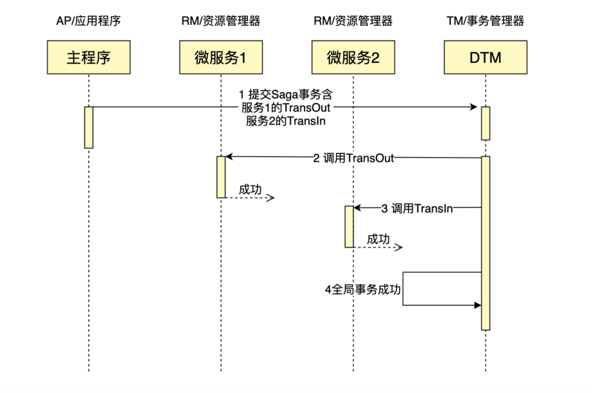
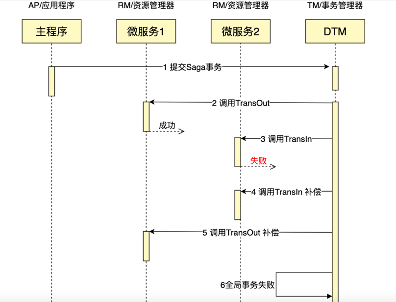

# saga事务
SAGA最初出现在1987年Hector Garcaa-Molrna & Kenneth Salem发表的论文SAGAS里。

其核心思想是将长事务拆分为多个短事务，由Saga事务协调器协调，如果每个短事务都成功提交完成，那么全局事务就正常完成，
如果某个步骤失败，则根据相反顺序一次调用补偿操作。

## 拆分子事务

例如我们要进行一个类似于银行跨行转账的业务，将A中的30元转给B，根据Saga事务的原理，我们将整个全局事务，切分为以下服务：

- 转出（TransOut）服务，这里转出将会进行操作A-30
- 转出补偿（TransOutCompensate）服务，回滚上面的转出操作，即A+30
- 转入（TransIn）服务，转入将会进行B+30
- 转入补偿（TransInCompensate）服务，回滚上面的转入操作，即B-30

整个SAGA事务的逻辑是：

执行转出成功=>执行转入成功=>全局事务完成

如果在中间发生错误，例如转入B发生错误，则会调用已执行分支的补偿操作，即：

执行转出成功=>执行转入失败=>执行转入补偿成功=>执行转出补偿成功=>全局事务回滚完成

