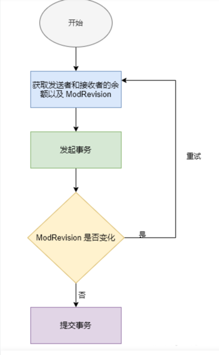

<!-- START doctoc generated TOC please keep comment here to allow auto update -->
<!-- DON'T EDIT THIS SECTION, INSTEAD RE-RUN doctoc TO UPDATE -->
**Table of Contents**  *generated with [DocToc](https://github.com/thlorenz/doctoc)*

- [分布式事务stm（Software Transactional Memory，软件事务内存）](#%E5%88%86%E5%B8%83%E5%BC%8F%E4%BA%8B%E5%8A%A1stmsoftware-transactional-memory%E8%BD%AF%E4%BB%B6%E4%BA%8B%E5%8A%A1%E5%86%85%E5%AD%98)
  - [etcd 事务的使用示例](#etcd-%E4%BA%8B%E5%8A%A1%E7%9A%84%E4%BD%BF%E7%94%A8%E7%A4%BA%E4%BE%8B)
  - [源码](#%E6%BA%90%E7%A0%81)

<!-- END doctoc generated TOC please keep comment here to allow auto update -->

# 分布式事务stm（Software Transactional Memory，软件事务内存）
etcd 实现了在一个事务中，原子地执行冲突检查、更新多个 keys 的值。除此之外，etcd 将底层 MVCC 机制的版本信息暴露出来，根据版本信息封装出了一套基于乐观锁的事务框架 STM，并实现了不同的隔离级别。

etcd 使用了不到四百行的代码实现了迷你事务，其对应的语法为If-Then-Else。etcd 允许用户在一次修改中批量执行多个操作，即这一组操作被绑定成一个原子操作，并共享同一个修订号。其写法类似 CAS，如下所示：
```go
Txn().If(cond1, cond2, ...).Then(op1, op2, ...,).Else(op1, op2)
```

根据上面的实现，其实很好理解事务实现的逻辑。如果 If 冲突判断语句为真，对应返回值为 true，Then 中的语句将会被执行，否则执行 Else 中的逻辑。


在 etcd 事务执行过程中，客户端与 etcd 服务端之间没有维护事务会话。冲突判断及其执行过程作为一个原子过程来执行，因此 etcd 事务不会发生阻塞，无论事务执行成功还是失败都会返回。当发生冲突导致执行失败时，需要应用进行重试，业务代码需要考虑这部分的重试逻辑。

## etcd 事务的使用示例

我们来演示一个转账的过程，发送者向接收者发起转账事务。etcd 的事务基于乐观锁检测冲突并重试，检测冲突时使用了ModRevision进行校验，该字段表示某个 key 上一次被更改时，全局的版本是多少。


```go
func txnTransfer(etcd *v3.Client, sender, receiver string, amount uint) error {
	// 失败重试
	for {
		if ok, err := doTxn(etcd, sender, receiver, amount); err != nil {
			return err
		} else if ok {
			return nil
		}
	}
}
func doTxn(etcd *v3.Client, sender, receiver string, amount uint) (bool, error) {
	// 第一个事务，利用事务的原子性，同时获取发送和接收者的余额以及 ModRevision
	getresp, err := etcd.Txn(context.TODO()).Then(v3.OpGet(sender), v3.OpGet(receiver)).Commit()
	if err != nil {
		return false, err
	}
	senderKV := getresp.Responses[0].GetResponseRange().Kvs[0]
	receiverKV := getresp.Responses[1].GetResponseRange().Kvs[1]
	senderNum, receiverNum := toUInt64(senderKV.Value), toUInt64(receiverKV.Value)
	// 验证账户余额是否充足
	if senderNum < amount {
		return false, fmt.Errorf("资金不足")
	}
	// 发起转账事务，冲突判断 ModRevision 是否发生变化
	txn := etcd.Txn(context.TODO()).If(
		v3.Compare(v3.ModRevision(sender), "=", senderKV.ModRevision),
		v3.Compare(v3.ModRevision(receiver), "=", receiverKV.ModRevision))
	txn = txn.Then(
		v3.OpPut(sender, fromUint64(senderNum-amount)), // 更新发送者账户余额
		v3.OpPut(receiver, fromUint64(receiverNum-amount))) // 更新接收者账户余额
    resp, err := txn.Commit()         // 提交事务
	if err != nil {
		return false, err
	}
	return resp.Succeeded, nil
}
```
etcd 事务的实现基于乐观锁，涉及两次事务操作，第一次事务利用原子性同时获取发送方和接收方的当前账户金额。
第二次事务发起转账操作，冲突检测 ModRevision 是否发生变化，如果没有变化则正常提交事务；若发生了冲突，则需要进行重试。


上述过程的实现较为烦琐，除了业务逻辑，还有大量的代码用来判断冲突以及重试。因此，etcd 社区基于事务特性，实现了一个简单的事务框架 STM， 构建了多种事务隔离级别，


## 源码

STM 是软件事务存储的接口。其中定义了 Get、Put、Rev、Del、commit、reset 等接口方法。
STM 的接口有两个实现类：stm 和 stmSerializable。具体选择哪一个，由我们指定的隔离级别决定。


```go
// NewSTM initiates a new STM instance, using serializable snapshot isolation by default.
func NewSTM(c *v3.Client, apply func(STM) error, so ...stmOption) (*v3.TxnResponse, error) {
	opts := &stmOptions{ctx: c.Ctx()}
	for _, f := range so {
		f(opts)
	}
	if len(opts.prefetch) != 0 {
		// 判断该事务是否存在预取的键值对
		f := apply
		apply = func(s STM) error {
			s.Get(opts.prefetch...)
			return f(s)
		}
	}
	return runSTM(mkSTM(c, opts), apply)
}
```

STM 的事务级别通过 stmOption 指定，位于 clientv3/concurrency/stm.go 中，
分别为 SerializableSnapshot、Serializable、RepeatableReads 和 ReadCommitted。
```go
func mkSTM(c *v3.Client, opts *stmOptions) STM {
   switch opts.iso {
   // 串行化快照
   case SerializableSnapshot:
      s := &stmSerializable{
         stm:      stm{client: c, ctx: opts.ctx},
         prefetch: make(map[string]*v3.GetResponse),
      }
      s.conflicts = func() []v3.Cmp {
         return append(s.rset.cmps(), s.wset.cmps(s.rset.first()+1)...)
      }
      return s
   // 串行化
   case Serializable:
      s := &stmSerializable{
         stm:      stm{client: c, ctx: opts.ctx},
         prefetch: make(map[string]*v3.GetResponse),
      }
      s.conflicts = func() []v3.Cmp { return s.rset.cmps() }
      return s
   // 可重复读   
   case RepeatableReads:
      s := &stm{client: c, ctx: opts.ctx, getOpts: []v3.OpOption{v3.WithSerializable()}}
      s.conflicts = func() []v3.Cmp { return s.rset.cmps() }
      return s
   // 已提交读
   case ReadCommitted:
      s := &stm{client: c, ctx: opts.ctx, getOpts: []v3.OpOption{v3.WithSerializable()}}
      s.conflicts = func() []v3.Cmp { return nil }
      return s
   default:
      panic("unsupported stm")
   }
}
```
从构建 SMT 的实现代码可以知道，etcd 隔离级别与一般的数据库隔离级别的差异是没有未提交读的隔离级别，
这是因为 etcd 通过 MVCC 机制实现读写不阻塞，并解决脏读的问题