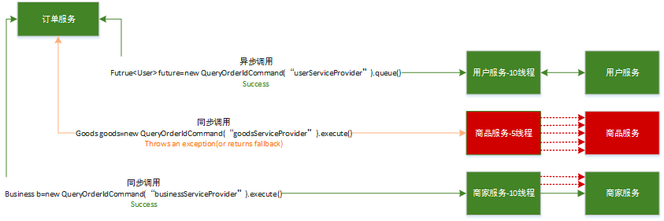
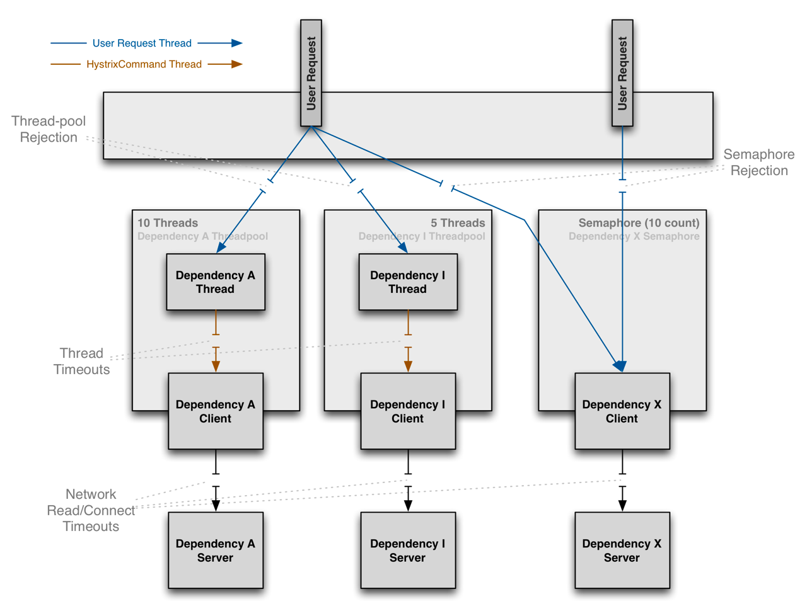
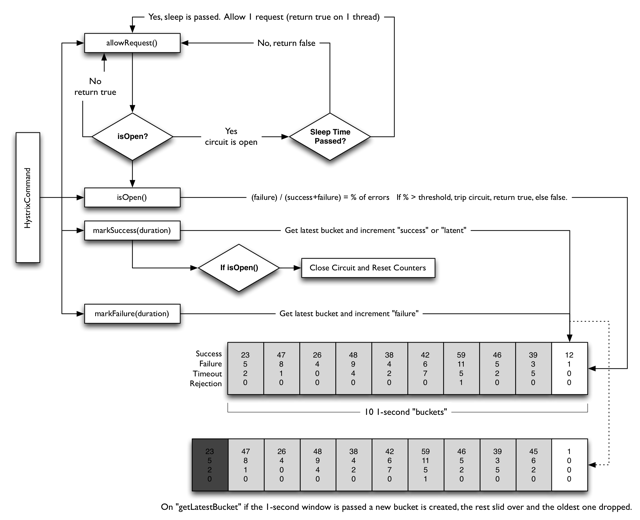
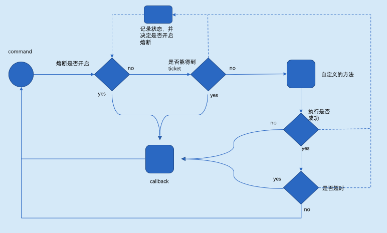
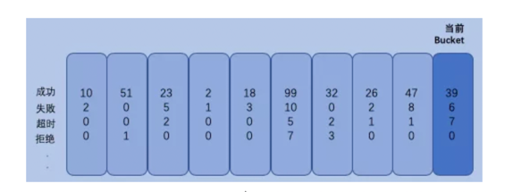

# 使用Hystrix解决同步等待的雪崩问题

Hystrix [hɪst'rɪks]，中文含义是豪猪，因其背上长满棘刺，从而拥有了自我保护的能力。
本文所说的Hystrix是Netflix开源的一款容错框架，同样具有自我保护能力.

## Hystrix设计目标：

- 对来自依赖的延迟和故障进行防护和控制——这些依赖通常都是通过网络访问的
- 阻止故障的连锁反应
- 快速失败并迅速恢复
- 回退并优雅降级
- 提供近实时的监控与告警

## Hystrix遵循的设计原则：

- 防止任何单独的依赖耗尽资源（线程）
- 过载立即切断并快速失败，防止排队
- 尽可能提供回退以保护用户免受故障
- 使用隔离技术（例如隔板，泳道和断路器模式）来限制任何一个依赖的影响
- 通过近实时的指标，监控和告警，确保故障被及时发现
- 通过动态修改配置属性，确保故障及时恢复
- 防止整个依赖客户端执行失败，而不仅仅是网络通信


## Hystrix如何实现这些设计目标
- 使用命令模式将所有对外部服务（或依赖关系）的调用包装在HystrixCommand或HystrixObservableCommand对象中，并将该对象放在单独的线程中执行；
- 每个依赖都维护着一个线程池（或信号量），线程池被耗尽则拒绝请求（而不是让请求排队）。
- 记录请求成功，失败，超时和线程拒绝。
- 服务错误百分比超过了阈值，熔断器开关自动打开，一段时间内停止对该服务的所有请求。
- 请求失败，被拒绝，超时或熔断时执行降级逻辑。
- 近实时地监控指标和配置的修改

## Hystrix容错
Hystrix的容错主要是通过添加容许延迟和容错方法，帮助控制这些分布式服务之间的交互。 还通过隔离服务之间的访问点，阻止它们之间的级联故障以及提供回退选项来实现这一点，从而提高系统的整体弹性。Hystrix主要提供了以下几种容错方法：

- 资源隔离
- 熔断
- 降级

### 1. 资源隔离
资源隔离主要指对线程的隔离。Hystrix提供了两种线程隔离方式：线程池和信号量。

#### 线程隔离-线程池

Hystrix通过命令模式对发送请求的对象和执行请求的对象进行解耦，将不同类型的业务请求封装为对应的命令请求。如订单服务查询商品，查询商品请求->商品Command；
商品服务查询库存，查询库存请求->库存Command。并且为每个类型的Command配置一个线程池，当第一次创建Command时，根据配置创建一个线程池，并放入ConcurrentHashMap，如商品Command：

通过将发送请求线程与执行请求的线程分离，可有效防止发生级联故障。当线程池或请求队列饱和时，Hystrix将拒绝服务，使得请求线程可以快速失败，从而避免依赖问题扩散

##### 线程池隔离优缺点
优点：
- 保护应用程序以免受来自依赖故障的影响，指定依赖线程池饱和不会影响应用程序的其余部分。
- 当引入新客户端lib时，即使发生问题，也是在本lib中，并不会影响到其他内容。
- 当依赖从故障恢复正常时，应用程序会立即恢复正常的性能。
- 当应用程序一些配置参数错误时，线程池的运行状况会很快检测到这一点（通过增加错误，延迟，超时，拒绝等），同时可以通过动态属性进行实时纠正错误的参数配置。
- 如果服务的性能有变化，需要实时调整，比如增加或者减少超时时间，更改重试次数，可以通过线程池指标动态属性修改，而且不会影响到其他调用请求。
- 除了隔离优势外，hystrix拥有专门的线程池可提供内置的并发功能，使得可以在同步调用之上构建异步门面（外观模式），为异步编程提供了支持（Hystrix引入了Rxjava异步框架）。
  注意：尽管线程池提供了线程隔离，我们的客户端底层代码也必须要有超时设置或响应线程中断，不能无限制的阻塞以致线程池一直饱和


缺点:

线程池的主要缺点是增加了计算开销。每个命令的执行都在单独的线程完成，增加了排队、调度和上下文切换的开销。因此，要使用Hystrix，就必须接受它带来的开销，以换取它所提供的好处。

通常情况下，线程池引入的开销足够小，不会有重大的成本或性能影响。但对于一些访问延迟极低的服务，如只依赖内存缓存，线程池引入的开销就比较明显了，这时候使用线程池隔离技术就不适合了，我们需要考虑更轻量级的方式，如信号量隔离

#### 线程隔离-信号量

上面提到了线程池隔离的缺点，当依赖延迟极低的服务时，线程池隔离技术引入的开销超过了它所带来的好处。这时候可以使用信号量隔离技术来代替，通过设置信号量来限制对任何给定依赖的并发调用量。

使用线程池时，发送请求的线程和执行依赖服务的线程不是同一个，而使用信号量时，发送请求的线程和执行依赖服务的线程是同一个，都是发起请求的线程

由于Hystrix默认使用线程池做线程隔离，使用信号量隔离需要显示地将属性execution.isolation.strategy设置为ExecutionIsolationStrategy.SEMAPHORE，同时配置信号量个数，默认为10。
客户端需向依赖服务发起请求时，首先要获取一个信号量才能真正发起调用，由于信号量的数量有限，当并发请求量超过信号量个数时，后续的请求都会直接拒绝，进入fallback流程。

信号量隔离主要是通过控制并发请求量，防止请求线程大面积阻塞，从而达到限流和防止雪崩的目的。

#### 总结


### 2.熔断

熔断器简介:
现实生活中，可能大家都有注意到家庭电路中通常会安装一个保险盒，当负载过载时，保险盒中的保险丝会自动熔断，以保护电路及家里的各种电器，这就是熔断器的一个常见例子。
Hystrix中的熔断器(Circuit Breaker)也是起类似作用，Hystrix在运行过程中会向每个commandKey对应的熔断器报告成功、失败、超时和拒绝的状态，熔断器维护并统计这些数据，并根据这些统计信息来决策熔断开关是否打开。
如果打开，熔断后续请求，快速返回。隔一段时间（默认是5s）之后熔断器尝试半开，放入一部分流量请求进来，相当于对依赖服务进行一次健康检查，如果请求成功，熔断器关闭

#### 熔断器配置
Circuit Breaker主要包括如下6个参数：

1、circuitBreaker.enabled
是否启用熔断器，默认是TRUE。

2、 circuitBreaker.forceOpen
熔断器强制打开，始终保持打开状态，不关注熔断开关的实际状态。默认值FLASE。

3、circuitBreaker.forceClosed
熔断器强制关闭，始终保持关闭状态，不关注熔断开关的实际状态。默认值FLASE。

4、circuitBreaker.errorThresholdPercentage
错误率，默认值50%，例如一段时间（10s）内有100个请求，其中有54个超时或者异常，那么这段时间内的错误率是54%，大于了默认值50%，这种情况下会触发熔断器打开。

5、circuitBreaker.requestVolumeThreshold
默认值20。含义是一段时间内至少有20个请求才进行errorThresholdPercentage计算。比如一段时间了有19个请求，且这些请求全部失败了，错误率是100%，但熔断器不会打开，总请求数不满足20。

6、circuitBreaker.sleepWindowInMilliseconds
半开状态试探睡眠时间，默认值5000ms。如：当熔断器开启5000ms之后，会尝试放过去一部分流量进行试探，确定依赖服务是否恢复

#### 工作原理

- 第一步，调用allowRequest()判断是否允许将请求提交到线程池

如果熔断器强制打开，circuitBreaker.forceOpen为true，不允许放行，返回。
如果熔断器强制关闭，circuitBreaker.forceClosed为true，允许放行。此外不必关注熔断器实际状态，也就是说熔断器仍然会维护统计数据和开关状态，只是不生效而已。
- 第二步，调用isOpen()判断熔断器开关是否打开

如果熔断器开关打开，进入第三步，否则继续；
如果一个周期内总的请求数小于circuitBreaker.requestVolumeThreshold的值，允许请求放行，否则继续；
如果一个周期内错误率小于circuitBreaker.errorThresholdPercentage的值，允许请求放行。否则，打开熔断器开关，进入第三步。
- 第三步，调用allowSingleTest()判断是否允许单个请求通行，检查依赖服务是否恢复

如果熔断器打开，且距离熔断器打开的时间或上一次试探请求放行的时间超过circuitBreaker.sleepWindowInMilliseconds的值时，熔断器器进入半开状态，允许放行一个试探请求；否则，不允许放行。
此外，为了提供决策依据，每个熔断器默认维护了10个bucket，每秒一个bucket，当新的bucket被创建时，最旧的bucket会被抛弃。
其中每个blucket维护了请求成功、失败、超时、拒绝的计数器，Hystrix负责收集并统计这些计数器。


### 3. 回退降级
降级，通常指务高峰期，为了保证核心服务正常运行，需要停掉一些不太重要的业务，或者某些服务不可用时，执行备用逻辑从故障服务中快速失败或快速返回，以保障主体业务不受影响。
Hystrix提供的降级主要是为了容错，保证当前服务不受依赖服务故障的影响，从而提高服务的健壮性。
要支持回退或降级处理，可以重写HystrixCommand的getFallBack方法或HystrixObservableCommand的resumeWithFallback方法

Hystrix在以下几种情况下会走降级逻辑：

- 执行construct()或run()抛出异常
- 熔断器打开导致命令短路
- 命令的线程池和队列或信号量的容量超额，命令被拒绝
- 命令执行超时


## Go-hystrix源码


配置熔断规则，否则将使用默认配置。可以调用的方法
```go
func Configure(cmds map[string]CommandConfig)
func ConfigureCommand(name string, config CommandConfig)
```
1. 定义依赖于外部系统的应用程序逻辑 - runFunc
2. 和服务中断期间执行的逻辑代码 - fallbackFunc

```go
func Do(name string, run runFunc, fallback fallbackFunc) error {
    runC := func(ctx context.Context) error {
        return run()
    }
    var fallbackC fallbackFuncC
    if fallback != nil {
        fallbackC = func(ctx context.Context, err error) error {
        return fallback(err)
    }
    }
    return DoC(context.Background(), name, runC, fallbackC)
}
```

DoC
```go
func DoC(ctx context.Context, name string, run runFuncC, fallback fallbackFuncC) error {
    done := make(chan struct{}, 1)
    
    r := func(ctx context.Context) error {
        err := run(ctx)
        if err != nil {
            return err
    }

    done <- struct{}{}
    return nil
    }

    f := func(ctx context.Context, e error) error {
        err := fallback(ctx, e)
        if err != nil {
            return err
    }
    
    done <- struct{}{}
        return nil
    }
    
    var errChan chan error
    if fallback == nil {
        errChan = GoC(ctx, name, r, nil)
    } else {
        errChan = GoC(ctx, name, r, f)
    }
    
    select {
    case <-done:
        return nil
    case err := <-errChan:
        return err
    }
}
```

其实方法Do和Go方法内部都是调用了hystrix.GoC方法
```go
func GoC(ctx context.Context, name string, run runFuncC, fallback fallbackFuncC) chan error {
    cmd := &command{
        run:      run,
        fallback: fallback,
        start:    time.Now(),
        errChan:  make(chan error, 1),
        finished: make(chan bool, 1),
    }

    // dont have methods with explicit params and returns
    // let data come in and out naturally, like with any closure
    // explicit error return to give place for us to kill switch the operation (fallback)
    
    // 得到断路器，不存在则创建
    circuit, _, err := GetCircuit(name)
    if err != nil {
        cmd.errChan <- err
        return cmd.errChan
    }
    cmd.circuit = circuit
    // 使用sync.NewCond创建一个条件变量，用来协调通知你可以归还令牌了
    ticketCond := sync.NewCond(cmd)
    ticketChecked := false
    // When the caller extracts error from returned errChan, it's assumed that
    // the ticket's been returned to executorPool. Therefore, returnTicket() can
    // not run after cmd.errorWithFallback().
    // 返还ticket
    returnTicket := func() {
        cmd.Lock()
        // Avoid releasing before a ticket is acquired.
        for !ticketChecked {
            ticketCond.Wait()
        }
        cmd.circuit.executorPool.Return(cmd.ticket)
        cmd.Unlock()
    }
    // Shared by the following two goroutines. It ensures only the faster
    // goroutine runs errWithFallback() and reportAllEvent().
    returnOnce := &sync.Once{}
    //  上报执行状态
    reportAllEvent := func() {
        err := cmd.circuit.ReportEvent(cmd.events, cmd.start, cmd.runDuration)
        if err != nil {
            log.Printf(err.Error())
            }
        }

    go func() {
        defer func() { cmd.finished <- true }()
        
        // Circuits get opened when recent executions have shown to have a high error rate.
        // Rejecting new executions allows backends to recover, and the circuit will allow
        // new traffic when it feels a healthly state has returned.
        // 查看断路器是否已打开
        if !cmd.circuit.AllowRequest() {
            cmd.Lock()
            // It's safe for another goroutine to go ahead releasing a nil ticket.
            ticketChecked = true
            ticketCond.Signal()
            cmd.Unlock()
            returnOnce.Do(func() {
                returnTicket()
                cmd.errorWithFallback(ctx, ErrCircuitOpen)
                reportAllEvent()
            })
        return
    }

    // As backends falter, requests take longer but don't always fail.
    //
    // When requests slow down but the incoming rate of requests stays the same, you have to
    // run more at a time to keep up. By controlling concurrency during these situations, you can
    // shed load which accumulates due to the increasing ratio of active commands to incoming requests.
    cmd.Lock()
    select {
    // 获取ticket 如果得不到就限流
    case cmd.ticket = <-circuit.executorPool.Tickets:
        ticketChecked = true
        ticketCond.Signal()
        cmd.Unlock()
    default:
        ticketChecked = true
        ticketCond.Signal()
        cmd.Unlock()
        returnOnce.Do(func() {
            returnTicket()
            cmd.errorWithFallback(ctx, ErrMaxConcurrency)
            reportAllEvent()
    })
    return
    }
    // 执行我们自已的方法，并上报执行信息
    runStart := time.Now()
    runErr := run(ctx)
    returnOnce.Do(func() {
        defer reportAllEvent()
        cmd.runDuration = time.Since(runStart)
        returnTicket()
        if runErr != nil {
            cmd.errorWithFallback(ctx, runErr)
            return
        }
        cmd.reportEvent("success")
    })
    }()
    // 等待context是否被结束，或执行者超时，并上报
    go func() {
        timer := time.NewTimer(getSettings(name).Timeout)
        defer timer.Stop()
    
        select {
        case <-cmd.finished:
        // returnOnce has been executed in another goroutine
        case <-ctx.Done():
            returnOnce.Do(func() {
            returnTicket()
            cmd.errorWithFallback(ctx, ctx.Err())
            reportAllEvent()
            })
            return
        case <-timer.C:
            returnOnce.Do(func() {
            returnTicket()
            cmd.errorWithFallback(ctx, ErrTimeout)
            reportAllEvent()
            })
            return
        }
    }()
    
    return cmd.errChan
}
```

command的数据结构：
```go
type command struct {
    sync.Mutex
    
    ticket      *struct{} //用来做最大并发量控制，这个就是一个令牌
    start       time.Time //记录command执行的开始时间
    errChan     chan error  // 记录command执行错误
    finished    chan bool  //标志command执行结束，用来做协程同步
    circuit     *CircuitBreaker  //存储熔断器相关信息
    run         runFuncC  // 应用程序
    fallback    fallbackFuncC //应用程序执行失败后要执行的函数
    runDuration time.Duration //记录command执行消耗时间
    events      []string //events主要是存储事件类型信息，比如执行成功的success，或者失败的timeout、context_canceled等
}
```
熔断器结构
```go
type CircuitBreaker struct {
    Name                   string  //熔断器的名字，其实就是创建的command名字
    open                   bool //判断熔断器是否打开的标志
    forceOpen              bool //手动触发熔断器的开关，单元测试使用
    mutex                  *sync.RWMutex //使用读写锁保证并发安全
    openedOrLastTestedTime int64 //记录上一次打开熔断器的时间，因为要根据这个时间和SleepWindow时间来做恢复尝试
    
    executorPool *executorPool //用来做流量控制，因为我们有一个最大并发量控制，就是根据这个来做的流量控制，每次请求都要获取令牌
    metrics      *metricExchange //用来上报执行状态的事件，通过它把执行状态信息存储到实际熔断器执行各个维度状态 (成功次数，失败次数，超时……) 的数据集合中。
}
```

获取熔断器
```go
func GetCircuit(name string) (*CircuitBreaker, bool, error) {
    circuitBreakersMutex.RLock()
    _, ok := circuitBreakers[name]
    if !ok {
        circuitBreakersMutex.RUnlock()
        circuitBreakersMutex.Lock()
        defer circuitBreakersMutex.Unlock()
        // because we released the rlock before we obtained the exclusive lock,
        // we need to double check that some other thread didn't beat us to
        // creation.
        if cb, ok := circuitBreakers[name]; ok {
        return cb, false, nil
        }
    // 初始化熔断器
        circuitBreakers[name] = newCircuitBreaker(name)
    } else {
        defer circuitBreakersMutex.RUnlock()
    }
    
    return circuitBreakers[name], !ok, nil
}
```
创建熔断器
```go
// newCircuitBreaker creates a CircuitBreaker with associated Health
func newCircuitBreaker(name string) *CircuitBreaker {
    c := &CircuitBreaker{}
    c.Name = name
    c.metrics = newMetricExchange(name) // 统计信息
    c.executorPool = newExecutorPool(name)  // 限流器
    c.mutex = &sync.RWMutex{}

return c
}
```
创建统计控制器
```go
func newMetricExchange(name string) *metricExchange {
    m := &metricExchange{}
    m.Name = name
    
    m.Updates = make(chan *commandExecution, 2000)
    m.Mutex = &sync.RWMutex{}
    m.metricCollectors = metricCollector.Registry.InitializeMetricCollectors(name)
    m.Reset()
    
    go m.Monitor()
    
    return m
}
```

```go
package metricCollector

import (
	"sync"
	"time"
)

// Registry is the default metricCollectorRegistry that circuits will use to
// collect statistics about the health of the circuit.
var Registry = metricCollectorRegistry{
	lock: &sync.RWMutex{},
	registry: []func(name string) MetricCollector{
		newDefaultMetricCollector,
	},
}

type metricCollectorRegistry struct {
	lock     *sync.RWMutex
	registry []func(name string) MetricCollector
}
func newDefaultMetricCollector(name string) MetricCollector {
	m := &DefaultMetricCollector{}
	m.mutex = &sync.RWMutex{}
	m.Reset()
	return m
}
```

统计控制器:
每一个 Command 都会有一个默认统计控制器，当然也可以添加多个自定义的控制器。默认的统计控制器DefaultMetricCollector保存着熔断器的所有状态，调用次数，失败次数，被拒绝次数等等
```go
type DefaultMetricCollector struct {
    mutex *sync.RWMutex
    
    numRequests *rolling.Number
    errors      *rolling.Number
    
    successes               *rolling.Number
    failures                *rolling.Number
    rejects                 *rolling.Number
    shortCircuits           *rolling.Number
    timeouts                *rolling.Number
    contextCanceled         *rolling.Number
    contextDeadlineExceeded *rolling.Number
    
    fallbackSuccesses *rolling.Number
    fallbackFailures  *rolling.Number
    totalDuration     *rolling.Timing
    runDuration       *rolling.Timing
}

```

rolling.Number

```go
type Number struct {
    Buckets map[int64]*numberBucket // Key保存的是当前时间
    Mutex   *sync.RWMutex
}
type numberBucket struct {
    Value float64
}
```
如何保证只保存 10 秒内的数据的。每一次对熔断器的状态进行修改时，Number都要先得到当前的时间(秒级)的Bucket不存在则创建。
```go
func (r *Number) getCurrentBucket() *numberBucket {
    now := time.Now().Unix()
    var bucket *numberBucket
    var ok bool
    
    if bucket, ok = r.Buckets[now]; !ok {
        bucket = &numberBucket{}
        r.Buckets[now] = bucket
    }
    
    return bucket
}
```
修改完后去掉 10 秒外的数据
```go
func (r *Number) removeOldBuckets() {
    now := time.Now().Unix() - 10
    
    for timestamp := range r.Buckets {
        // TODO: configurable rolling window
        if timestamp <= now {
            delete(r.Buckets, timestamp)
        }
    }
}
```

### 流量控制
用了一个简单的令牌算法，能得到令牌的就可以执行后继的工作，执行完后要返还令牌。得不到令牌就拒绝，
拒绝后调用用户设置的callback方法，如果没有设置就不执行。结构体executorPool就是hystrix-go 流量控制的具体实现。字段Max就是每秒最大的并发值。

```go
type executorPool struct {
    Name    string
    Metrics *poolMetrics
    Max     int
    Tickets chan *struct{}
}
```
```go
func newExecutorPool(name string) *executorPool {
	p := &executorPool{}
	p.Name = name
	p.Metrics = newPoolMetrics(name)
	p.Max = getSettings(name).MaxConcurrentRequests

	p.Tickets = make(chan *struct{}, p.Max)
	for i := 0; i < p.Max; i++ {
		p.Tickets <- &struct{}{}
	}

	return p
}
```

### 流量控制上报状态
Metrics 他用于统计执行数量，比如：执行的总数量,最大的并发数
```go
func (p *executorPool) Return(ticket *struct{}) {
	if ticket == nil {
		return
	}

	p.Metrics.Updates <- poolMetricsUpdate{
		activeCount: p.ActiveCount(),
	}
	p.Tickets <- ticket
}
// 使用的ticket
func (p *executorPool) ActiveCount() int {
    return p.Max - len(p.Tickets)
}
```
