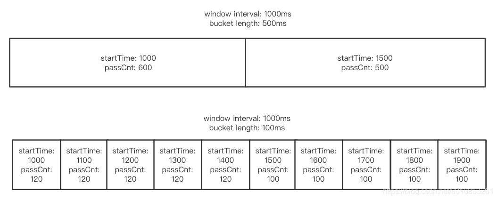
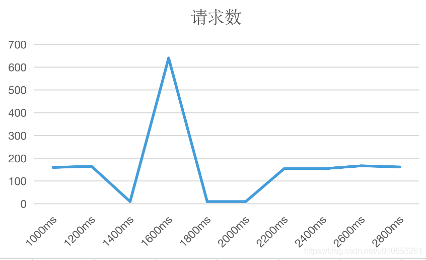
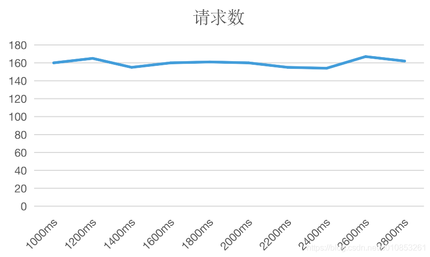

# 背景
分布式系统环境下，服务间类似依赖非常常见，一个业务调用通常依赖多个基础服务。
对于同步调用，当库存服务不可用时，商品服务请求线程被阻塞，当有大批量请求调用库存服务时，最终可能导致整个商品服务资源耗尽，无法继续对外提供服务。并且这种不可用可能沿请求调用链向上传递，这种现象被称为雪崩效应。

## 雪崩效应常见场景
- 硬件故障：如服务器宕机，机房断电，光纤被挖断等。
- 流量激增：如异常流量，重试加大流量等。
- 缓存穿透：一般发生在应用重启，所有缓存失效时，以及短时间内大量缓存失效时。大量的缓存不命中，使请求直击后端服务，造成服务提供者超负荷运行，引起服务不可用。
- 程序BUG：如程序逻辑导致内存泄漏，JVM长时间FullGC等。
- 同步等待：服务间采用同步调用模式，同步等待造成的资源耗尽。

### 雪崩效应应对策略
- 硬件故障：多机房容灾、异地多活等。
- 流量激增：服务自动扩容、流量控制（限流、关闭重试）等。
- 缓存穿透：缓存预加载、缓存异步加载等。
- 程序BUG：修改程序bug、及时释放资源等。
- 同步等待：资源隔离、MQ解耦、不可用服务调用快速失败等。资源隔离通常指不同服务调用采用不同的线程池；不可用服务调用快速失败一般通过熔断器模式结合超时机制实现


## 解决方式

在高并发业务场景下，保护系统时，常用的"三板斧"有："熔断、降级和限流"

限流算法常用的几种实现方式有如下四种：
1. 计数器
2. 滑动窗口
3. 漏桶 Uber公司开源的限流器uber-go/ratelimit是漏桶算法实现的
4. 令牌桶


## 2. 滑动窗口

### 滑动时间窗口有两个很重要设置：

（1）滑动窗口的统计周期：表示滑动窗口的统计周期，一个滑动窗口有一个或多个窗口。

（2）滑动窗口中每个窗口长度：每个窗口(也叫格子，后文格子都是指一个窗口)的统计周期。

### 举例

这里先假设我的滑动时间窗口长度是1000ms，每个窗口统计时间长是200ms，那么就会有5个窗口。
假设我一个窗口记录的起始时间是第1000ms，那么一个基本的滑动窗口的示意图如下图：

（注意，这里忽略了每个格子里面具体的统计结构)


（1）滑动窗口里面每个格子都是一个统计结构，可以理解成一个抽象的结构(比如Java的Object或则Go的interface{})，用户可以自己决定统计的具体数据结构。
（2）每个格子都会有自己的统计开始时间，在 [开始时间，开始时间+格子长度)这个时间范围内，所有统计都会落到这个格子里面。

怎么计算当前时间在哪一个格子里面呢？ 这里假设滑动窗口长度是 interval 表示，每个格子长度是 bucketLength 表示，当前时间是 now，前面的数值都是毫秒单位。那么计算方式就是：

当前时间所在格子计算方式 index = (now/bucketLength)%interval

也就是说我们知道当前时间就能知道当前时间对应在滑动窗口的第几个格子。举一些例子来说明：

1. 假设当前时间是1455ms，那么经过计算，index 就是 2，也就是第三个格子。
2. 假设当前时间是1455000000000 ms，那么经过计算，index 就是 0，也就是第一个格子。

### 滑动窗口的周期和格子长度怎么设置？

滑动窗口的设置主要是两个参数：

1. 滑动窗口的长度；
2. 滑动窗口每个格子的长度。
那么这两个设置应该怎么设置呢？
    
这里主要考虑点是：抗脉冲流量的能力和精确度之间的平衡。

1. 如果格子长度设置的小那么统计就会更加精确，但是格子太多，会增加竞争的可能性，因为窗口滑动必须是并发安全的，这里会有竞争。
2. 如果滑动窗口长度越长，对脉冲的平滑能力就会越强。


在[1000,1500) 区间统计都是600，[1500, 2000) 之间统计都是500。我们获取滑动窗口的统计时候，两者的统计总和都是1100。


从上图可以看出来，到覆盖第一个格子时候，两个滑动窗口的统计结果就完全不一样了：
    
1. 第一个滑动窗口第一个格子(500ms长度)清零了，整个统计总计数变成了 501；
2. 第二个滑动窗口第一个格子(100ms长度)清零了，整个统计总计数变成了 981；

结论：在滑动窗口统计周期一样情况下，格子划分的越多，那么统计的精度就越高



结论就是：滑动窗口的长度设置的越长，整体统计的结果抗脉冲能力会越强；滑动窗口的长度设置的越短，整体统计结果对脉冲的抵抗能力越弱。

### 固定时间窗口限流

使用场景比如：

* 每个手机号每天只能发5条验证码短信

* 每个用户每小时只能连续尝试3次密码

* 每个会员每天只能领3次福利

#### 工作原理
从某个时间点开始每次请求过来请求数+1，同时判断当前时间窗口内请求数是否超过限制，超过限制则拒绝该请求，然后下个时间窗口开始时计数器清零等待请求。

#### 代码实现
使用 redis 过期时间来模拟固定时间窗口

lua脚本
```lua
-- KYES[1]:限流器key
-- ARGV[1]:qos,单位时间内最多请求次数
-- ARGV[2]:单位限流窗口时间
-- 请求最大次数,等于p.quota
local limit = tonumber(ARGV[1])
-- 窗口即一个单位限流周期,这里用过期模拟窗口效果,等于p.permit
local window = tonumber(ARGV[2])
-- 请求次数+1,获取请求总数
local current = redis.call("INCRBY",KYES[1],1)
-- 如果是第一次请求,则设置过期时间并返回 成功
if current == 1 then
  redis.call("expire",KYES[1],window)
  return 1
-- 如果当前请求数量小于limit则返回 成功
elseif current < limit then
  return 1
-- 如果当前请求数量==limit则返回 最后一次请求
elseif current == limit then
  return 2
-- 请求数量>limit则返回 失败
else
  return 0
end
```
lua返回值
0：表示错误，比如可能是 redis 故障、过载
1：允许
2：允许但是当前窗口内已到达上限，如果是跑批业务的话此时可以休眠 sleep 一下等待下个窗口（作者考虑的非常细致）
3：拒绝

固定时间窗口限流器定义
```go
type (
  // PeriodOption defines the method to customize a PeriodLimit.
  // go中常见的option参数模式
  // 如果参数非常多，推荐使用此模式来设置参数
  PeriodOption func(l *PeriodLimit)

  // A PeriodLimit is used to limit requests during a period of time.
  // 固定时间窗口限流器
  PeriodLimit struct {
    // 窗口大小，单位s
    period     int
    // 请求上限
    quota      int
    // 存储
    limitStore *redis.Redis
    // key前缀
    keyPrefix  string
    // 线性限流，开启此选项后可以实现周期性的限流
    // 比如quota=5时，quota实际值可能会是5.4.3.2.1呈现出周期性变化
    align      bool
  }
)
```

```go
// Take requests a permit, it returns the permit state.
// 执行限流
// 注意一下返回值：
// 0：表示错误，比如可能是redis故障、过载
// 1：允许
// 2：允许但是当前窗口内已到达上限
// 3：拒绝
func (h *PeriodLimit) Take(key string) (int, error) {
  // 执行lua脚本
  resp, err := h.limitStore.Eval(periodScript, []string{h.keyPrefix + key}, []string{
    strconv.Itoa(h.quota),
    strconv.Itoa(h.calcExpireSeconds()),
  })
  
  if err != nil {
    return Unknown, err
  }

  code, ok := resp.(int64)
  if !ok {
    return Unknown, ErrUnknownCode
  }

  switch code {
  case internalOverQuota:
    return OverQuota, nil
  case internalAllowed:
    return Allowed, nil
  case internalHitQuota:
    return HitQuota, nil
  default:
    return Unknown, ErrUnknownCode
  }
}
```

```go
// 计算过期时间也就是窗口时间大小
// 如果align==true
// 线性限流，开启此选项后可以实现周期性的限流
// 比如quota=5时，quota实际值可能会是5.4.3.2.1呈现出周期性变化
func (h *PeriodLimit) calcExpireSeconds() int {
  if h.align {
    now := time.Now()
    _, offset := now.Zone()
    unix := now.Unix() + int64(offset)
    return h.period - int(unix%int64(h.period))
  }

  return h.period
}
```


### 4. 令牌桶介绍


令牌桶是反向的"漏桶"，它是以恒定的速度往木桶里加入令牌，木桶满了则不再加入令牌。
服务收到请求时尝试从木桶中取出一个令牌，如果能够得到令牌则继续执行后续的业务逻辑。如果没有得到令牌，
直接返回访问频率超限的错误码或页面等，不继续执行后续的业务逻辑。

#### 特点

由于木桶内只要有令牌，请求就可以被处理，所以令牌桶算法可以支持突发流量。同时由于往木桶添加令牌的速度是恒定的，且木桶的容量有上限，
所以单位时间内处理的请求书也能够得到控制，起到限流的目的。假设加入令牌的速度为 1token/10ms，桶的容量为500，
在请求比较的少的时候（小于每10毫秒1个请求）时，木桶可以先"攒"一些令牌（最多500个）。当有突发流量时，
一下把木桶内的令牌取空，也就是有500个在并发执行的业务逻辑，之后要等每10ms补充一个新的令牌才能接收一个新的请求