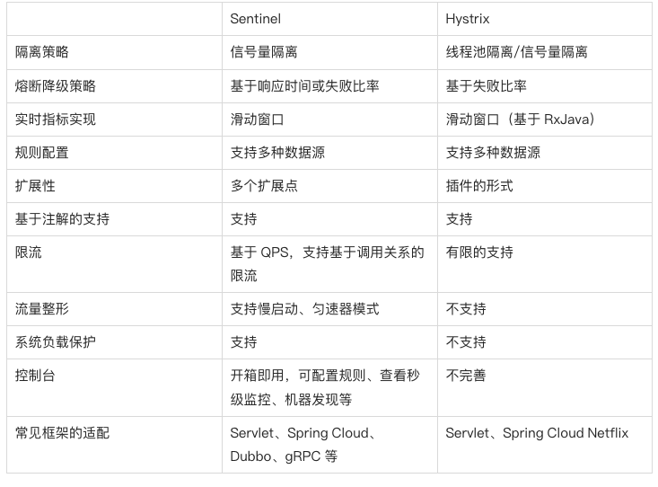
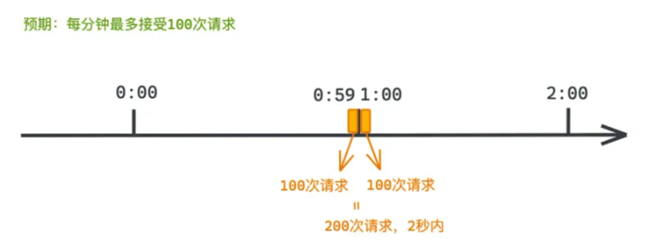
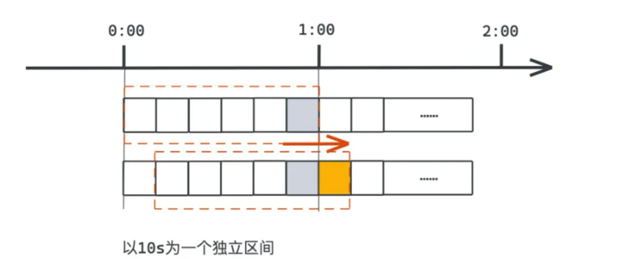
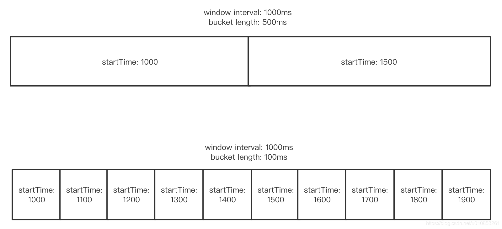
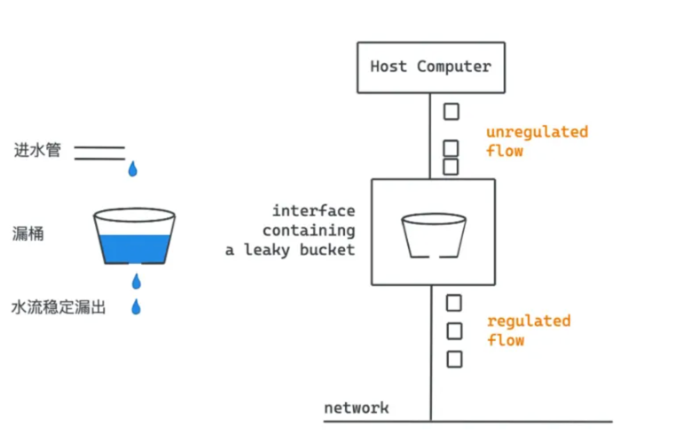
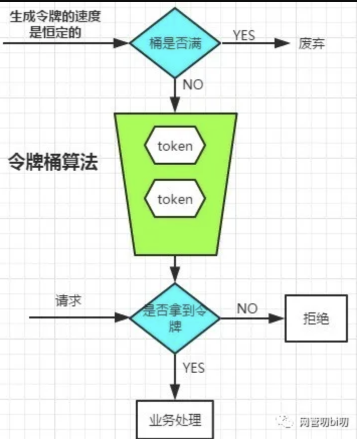

<!-- START doctoc generated TOC please keep comment here to allow auto update -->
<!-- DON'T EDIT THIS SECTION, INSTEAD RE-RUN doctoc TO UPDATE -->
**Table of Contents**  *generated with [DocToc](https://github.com/thlorenz/doctoc)*

- [背景](#%E8%83%8C%E6%99%AF)
  - [雪崩效应常见场景](#%E9%9B%AA%E5%B4%A9%E6%95%88%E5%BA%94%E5%B8%B8%E8%A7%81%E5%9C%BA%E6%99%AF)
    - [雪崩效应应对策略](#%E9%9B%AA%E5%B4%A9%E6%95%88%E5%BA%94%E5%BA%94%E5%AF%B9%E7%AD%96%E7%95%A5)
  - [业务限频 和 服务限频](#%E4%B8%9A%E5%8A%A1%E9%99%90%E9%A2%91-%E5%92%8C-%E6%9C%8D%E5%8A%A1%E9%99%90%E9%A2%91)
  - [保护系统解决方式](#%E4%BF%9D%E6%8A%A4%E7%B3%BB%E7%BB%9F%E8%A7%A3%E5%86%B3%E6%96%B9%E5%BC%8F)
  - [限流算法](#%E9%99%90%E6%B5%81%E7%AE%97%E6%B3%95)
    - [1. 计数器](#1-%E8%AE%A1%E6%95%B0%E5%99%A8)
      - [优点](#%E4%BC%98%E7%82%B9)
      - [缺点](#%E7%BC%BA%E7%82%B9)
    - [2. 滑动窗口](#2-%E6%BB%91%E5%8A%A8%E7%AA%97%E5%8F%A3)
      - [举例](#%E4%B8%BE%E4%BE%8B)
      - [滑动窗口的周期和格子长度怎么设置？](#%E6%BB%91%E5%8A%A8%E7%AA%97%E5%8F%A3%E7%9A%84%E5%91%A8%E6%9C%9F%E5%92%8C%E6%A0%BC%E5%AD%90%E9%95%BF%E5%BA%A6%E6%80%8E%E4%B9%88%E8%AE%BE%E7%BD%AE)
      - [固定时间窗口限流](#%E5%9B%BA%E5%AE%9A%E6%97%B6%E9%97%B4%E7%AA%97%E5%8F%A3%E9%99%90%E6%B5%81)
      - [工作原理](#%E5%B7%A5%E4%BD%9C%E5%8E%9F%E7%90%86)
      - [代码实现](#%E4%BB%A3%E7%A0%81%E5%AE%9E%E7%8E%B0)
      - [优点](#%E4%BC%98%E7%82%B9-1)
      - [缺点](#%E7%BC%BA%E7%82%B9-1)
    - [3. 漏桶算法](#3-%E6%BC%8F%E6%A1%B6%E7%AE%97%E6%B3%95)
      - [工作原理](#%E5%B7%A5%E4%BD%9C%E5%8E%9F%E7%90%86-1)
      - [优点](#%E4%BC%98%E7%82%B9-2)
      - [缺点](#%E7%BC%BA%E7%82%B9-2)
    - [4. 令牌桶](#4-%E4%BB%A4%E7%89%8C%E6%A1%B6)
      - [工作原理：](#%E5%B7%A5%E4%BD%9C%E5%8E%9F%E7%90%86)
      - [优点](#%E4%BC%98%E7%82%B9-3)
      - [缺点](#%E7%BC%BA%E7%82%B9-3)
  - [参考](#%E5%8F%82%E8%80%83)

<!-- END doctoc generated TOC please keep comment here to allow auto update -->

# 背景
分布式系统环境下，服务间类似依赖非常常见，一个业务调用通常依赖多个基础服务。
对于同步调用，当库存服务不可用时，商品服务请求线程被阻塞，当有大批量请求调用库存服务时，最终可能导致整个商品服务资源耗尽，无法继续对外提供服务。并且这种不可用可能沿请求调用链向上传递，这种现象被称为雪崩效应。

## 雪崩效应常见场景
- 硬件故障：如服务器宕机，机房断电，光纤被挖断等。
- 流量激增：如异常流量，重试加大流量等。
- 缓存穿透：一般发生在应用重启，所有缓存失效时，以及短时间内大量缓存失效时。大量的缓存不命中，使请求直击后端服务，造成服务提供者超负荷运行，引起服务不可用。
- 程序BUG：如程序逻辑导致内存泄漏，JVM长时间FullGC等。
- 同步等待：服务间采用同步调用模式，同步等待造成的资源耗尽。

### 雪崩效应应对策略
- 硬件故障：多机房容灾、异地多活等。
- 流量激增：服务自动扩容、流量控制（限流、关闭重试）等。
- 缓存穿透：缓存预加载、缓存异步加载等。
- 程序BUG：修改程序bug、及时释放资源等。
- 同步等待：资源隔离、MQ解耦、不可用服务调用快速失败等。资源隔离通常指不同服务调用采用不同的线程池；不可用服务调用快速失败一般通过熔断器模式结合超时机制实现


## 业务限频 和 服务限频
业务限频则是动态的uid、ip、cookie值、甚至地区等，服务限频只能起到保证整体的后端服务可用，不能防止恶意用户刷频，比如某接口限频100次/分钟，用户A访问刷频了99次，那么其他所有用户该分钟內只能访问1次了，

## 保护系统解决方式

在高并发业务场景下，保护系统时，常用的"三板斧"有："熔断、降级和限流"

## 限流算法

主要如下

1. 计数器:  Lyft 公司 github.com/envoyproxy/ratelimit, kong 
2. 滑动窗口 Sliding Window: sentinel 和 hystrix
3. 漏桶 leaky-bucket:  Uber公司开源的限流器 github.com/uber-go/ratelimit
4. 令牌桶: 官方扩展库限流算法 golang.org/x/time/rate





### 1. 计数器

这种算法的基本思想是通过维护一个计数器，在特定的时间窗口内累计接收到的请求次数，当请求次数达到预设的阈值时，后续的请求会被限流或直接拒绝。


工作原理：

1. 在一个固定的时间窗口（如1分钟）内，系统初始化一个计数器count为0。
1. 每当一个新的请求到达时，计数器增加1。
1. 当计数器的值超过了预先设定的限流阈值时，后续的请求会被限制。
1. 时间窗口结束后（即过了1分钟），不管当前计数器的数值如何，都会重置为0，下一个时间窗口开始重新计数。


#### 优点
- 实现简单：它是最简单的限流算法之一，只需要维护一个计数器变量，每来一个请求就进行计数操作，无需复杂的逻辑设计
- 直观易懂：设置明确的阈值，比如规定每秒允许100个请求，易于理解和配置
- 实时性好：当请求到达时能够迅速做出是否允许的决策，不需要等待额外的信号或者状态变化
- 资源消耗少：对于单机应用而言，仅需基本的内存空间来保存计数器即可，无需额外的队列或其他复杂数据结构


#### 缺点

- 突刺现象（毛刺效应） ：在时间窗口切换时，若前一个窗口内的请求未满额，而后一个窗口一开始即有大量的请求涌入，则可能导致服务器瞬间压力过大。例如，如果1秒内允许100个请求，但在某秒的最后时刻突然来了100个请求，然后下一秒又是100个请求，即使总的请求并未超出每秒100次的限制，但连续两个窗口之间并没有均匀分配请求，从而造成服务压力波动。
- 无法平滑限流：固定窗口计数器无法平滑控制请求流量，即无法很好地处理突发流量和平均流量之间的平衡。
- 对周期较长的时间窗口效果不佳：长时间窗口内的限流可能会因为请求分布不均而导致服务器负载忽高忽低。

### 2. 滑动窗口

基于滑动窗口的限流算法是一种较为先进且灵活的流量控制技术，用于限制在一定时间窗口内某个资源的访问次数或流量。
相较于简单的固定窗口计数器限流，滑动窗口算法能更好地处理请求的均匀分布和平滑限流，减少因为窗口切换带来的不连续性和峰值问题。

有两个很重要设置

（1）滑动窗口的统计周期：表示滑动窗口的统计周期，一个滑动窗口有一个或多个窗口。

（2）滑动窗口中每个窗口长度：每个窗口(也叫格子，后文格子都是指一个窗口)的统计周期。

#### 举例

这里先假设我的滑动时间窗口长度是1000ms，每个窗口统计时间长是200ms，那么就会有5个窗口。
假设我一个窗口记录的起始时间是第1000ms，那么一个基本的滑动窗口的示意图如下图：

（注意，这里忽略了每个格子里面具体的统计结构)




（1）滑动窗口里面每个格子都是一个统计结构，可以理解成一个抽象的结构(比如Java的Object或则Go的interface{})，用户可以自己决定统计的具体数据结构。
（2）每个格子都会有自己的统计开始时间，在 [开始时间，开始时间+格子长度)这个时间范围内，所有统计都会落到这个格子里面。

怎么计算当前时间在哪一个格子里面呢？ 这里假设滑动窗口长度是 interval 表示，每个格子长度是 bucketLength 表示，当前时间是 now，前面的数值都是毫秒单位。那么计算方式就是：

当前时间所在格子计算方式 index = (now/bucketLength)%interval

也就是说我们知道当前时间就能知道当前时间对应在滑动窗口的第几个格子。举一些例子来说明：

1. 假设当前时间是1455ms，那么经过计算，index 就是 2，也就是第三个格子。
2. 假设当前时间是1455000000000 ms，那么经过计算，index 就是 0，也就是第一个格子。

#### 滑动窗口的周期和格子长度怎么设置？

滑动窗口的设置主要是两个参数：

1. 滑动窗口的长度；
2. 滑动窗口每个格子的长度。
那么这两个设置应该怎么设置呢？
    
这里主要考虑点是：抗脉冲流量的能力和精确度之间的平衡。

1. 如果格子长度设置的小那么统计就会更加精确，但是格子太多，会增加竞争的可能性，因为窗口滑动必须是并发安全的，这里会有竞争。
2. 如果滑动窗口长度越长，对脉冲的平滑能力就会越强。


在[1000,1500) 区间统计都是600，[1500, 2000) 之间统计都是500。我们获取滑动窗口的统计时候，两者的统计总和都是1100。


从上图可以看出来，到覆盖第一个格子时候，两个滑动窗口的统计结果就完全不一样了：
    
1. 第一个滑动窗口第一个格子(500ms长度)清零了，整个统计总计数变成了 501；
2. 第二个滑动窗口第一个格子(100ms长度)清零了，整个统计总计数变成了 981；

结论：在滑动窗口统计周期一样情况下，格子划分的越多，那么统计的精度就越高


结论就是：滑动窗口的长度设置的越长，整体统计的结果抗脉冲能力会越强；滑动窗口的长度设置的越短，整体统计结果对脉冲的抵抗能力越弱。

#### 固定时间窗口限流

使用场景比如：

* 每个手机号每天只能发5条验证码短信

* 每个用户每小时只能连续尝试3次密码

* 每个会员每天只能领3次福利

#### 工作原理
从某个时间点开始每次请求过来请求数+1，同时判断当前时间窗口内请求数是否超过限制，超过限制则拒绝该请求，然后下个时间窗口开始时计数器清零等待请求。

#### 代码实现
使用 redis 过期时间来模拟固定时间窗口

lua脚本
```lua
-- KYES[1]:限流器key
-- ARGV[1]:qos,单位时间内最多请求次数
-- ARGV[2]:单位限流窗口时间
-- 请求最大次数,等于p.quota
local limit = tonumber(ARGV[1])
-- 窗口即一个单位限流周期,这里用过期模拟窗口效果,等于p.permit
local window = tonumber(ARGV[2])
-- 请求次数+1,获取请求总数
local current = redis.call("INCRBY",KYES[1],1)
-- 如果是第一次请求,则设置过期时间并返回 成功
if current == 1 then
  redis.call("expire",KYES[1],window)
  return 1
-- 如果当前请求数量小于limit则返回 成功
elseif current < limit then
  return 1
-- 如果当前请求数量==limit则返回 最后一次请求
elseif current == limit then
  return 2
-- 请求数量>limit则返回 失败
else
  return 0
end
```
lua返回值
* 0：表示错误，比如可能是 redis 故障、过载
* 1：允许
* 2：允许但是当前窗口内已到达上限，如果是跑批业务的话此时可以休眠 sleep 一下等待下个窗口（作者考虑的非常细致）
* 3：拒绝

固定时间窗口限流器定义
```go
type (
  // PeriodOption defines the method to customize a PeriodLimit.
  // go中常见的option参数模式
  // 如果参数非常多，推荐使用此模式来设置参数
  PeriodOption func(l *PeriodLimit)

  // A PeriodLimit is used to limit requests during a period of time.
  // 固定时间窗口限流器
  PeriodLimit struct {
    // 窗口大小，单位s
    period     int
    // 请求上限
    quota      int
    // 存储
    limitStore *redis.Redis
    // key前缀
    keyPrefix  string
    // 线性限流，开启此选项后可以实现周期性的限流
    // 比如quota=5时，quota实际值可能会是5.4.3.2.1呈现出周期性变化
    align      bool
  }
)
```

```go
// Take requests a permit, it returns the permit state.
// 执行限流
// 注意一下返回值：
// 0：表示错误，比如可能是redis故障、过载
// 1：允许
// 2：允许但是当前窗口内已到达上限
// 3：拒绝
func (h *PeriodLimit) Take(key string) (int, error) {
  // 执行lua脚本
  resp, err := h.limitStore.Eval(periodScript, []string{h.keyPrefix + key}, []string{
    strconv.Itoa(h.quota),
    strconv.Itoa(h.calcExpireSeconds()),
  })
  
  if err != nil {
    return Unknown, err
  }

  code, ok := resp.(int64)
  if !ok {
    return Unknown, ErrUnknownCode
  }

  switch code {
  case internalOverQuota:
    return OverQuota, nil
  case internalAllowed:
    return Allowed, nil
  case internalHitQuota:
    return HitQuota, nil
  default:
    return Unknown, ErrUnknownCode
  }
}
```

```go
// 计算过期时间也就是窗口时间大小
// 如果align==true
// 线性限流，开启此选项后可以实现周期性的限流
// 比如quota=5时，quota实际值可能会是5.4.3.2.1呈现出周期性变化
func (h *PeriodLimit) calcExpireSeconds() int {
  if h.align {
    now := time.Now()
    _, offset := now.Zone()
    unix := now.Unix() + int64(offset)
    return h.period - int(unix%int64(h.period))
  }

  return h.period
}
```


#### 优点
- 平滑限流：滑动窗口算法能够在一定程度上平滑地控制流量，因为它不是基于固定时间间隔进行重置计数，而是随着时间的推移逐步更新窗口内的请求计数，这样可以有效避免固定窗口算法在窗口切换时出现的“突刺现象”，即短时间内流量集中涌入。
- 灵活性：可以灵活地控制时间窗口的粒度，例如将其划分为多个小窗口，这样可以根据实际业务需求调整限流策略的灵敏度和精度。
- 即时性：滑动窗口能够即时反应系统的实时负载状况，每当一个窗口过去，新的窗口立刻生效，所以限流策略能够更快地响应系统负载的变化。
- 适应突发流量：对于短期的突发流量，滑动窗口限流算法相比于固定窗口更能合理地分配流量，因为它考虑到的是过去一段时间内整体的请求量，而非单一窗口内的绝对数量


####  缺点
- 复杂性提高：相较于固定窗口计数器，滑动窗口算法在实现上更为复杂，需要维护多个窗口及其计数器的状态，增加了系统的复杂性和实现成本。
- 空间占用：随着窗口粒度的细化，需要存储的数据结构（如队列或哈希表）所占用的内存空间也会相应增大。特别是在高并发和长时间跨度的情况下，可能需要更大的内存来支持多窗口的计数。
- 处理突发流量局限性：虽然相比固定窗口有所改善，但如果突发流量非常猛烈且持续时间超过一个窗口的长度，滑动窗口限流仍可能无法完全消除流量尖峰对系统的影响。

### 3. 漏桶算法


基于漏桶（Leaky Bucket）的限流算法是一种在网络传输和系统资源管理中广泛应用的流量整形和控制技术。
该算法的核心理念是模拟一个带有小孔的桶，其中水代表流入系统的请求或数据包，桶则象征系统的处理能力。


#### 工作原理

- 桶容量：漏桶有一个固定容量，代表着系统能够暂时缓冲的最大请求量。不过，不同于令牌桶算法，漏桶的实际容量并不直接影响限流速率，只是决定了系统能够承受多大的突发流量。
- 漏水速率：漏桶上有固定速率的漏水口，这个速率代表了系统能够处理请求的恒定速度。无论桶内有多少水（请求），系统都按此速率向外处理请求。
- 流入请求：请求像水滴一样源源不断地进入漏桶，不论请求的速率有多快，漏桶都会接收所有的请求。
- 流量控制：如果请求的速率超过了漏水速率，那么漏桶内部的水量将会逐渐积累起来。当桶满时，新来的请求将被丢弃或拒绝，以此来限制流入系统的总体流量。
- 无突发处理能力：漏桶算法的一个显著特点是它不具备处理突发流量的能力。即使桶内没有水（请求空闲期），漏水速率也不会因此加快，这意味着系统的处理速率始终保持恒定


#### 优点
- 流量整形：漏桶算法能够强制将流量塑造成稳定的涓流，确保系统处理请求的速率恒定，这对于保护系统免受突发流量冲击，保持稳定性能非常重要。
- 公平性：所有进入漏桶的请求都会按照预定的速率被处理，无论请求何时到达，都能得到公平对待，不存在请求间的竞争关系。
- 易于实现：漏桶算法的概念和实现相对简单，可以用一个队列加上定时任务来模拟漏桶的行为，便于快速实施和调试。
- 防止系统过载：当系统无法处理过多的请求时，漏桶可以作为一个缓存区，暂时存储部分请求，但由于漏水速率恒定，一旦桶满，超出的部分会被丢弃或拒绝，从而保护系统不被过度压垮。


#### 缺点
- 无法处理突发流量：漏桶算法最大的缺点是无法应对合理的突发流量需求。无论系统当前负载如何，只要漏桶的漏水速率不变，即使是系统有能力处理更多的请求时，也无法加速处理突发的大量请求。
- 资源利用率不高：在流量较低时，漏桶算法可能导致系统资源利用率不足。即使系统此时有足够的处理能力，也无法增加处理速率，这可能导致在某些时段内系统性能未能充分利用。
- 缺乏弹性：对于那些希望系统能在负载较低时积攒一定的处理能力以应对未来可能的突发请求的场景，漏桶算法并不能提供这样的弹性伸缩特性。
- 无法区分优先级：漏桶算法对所有请求一视同仁，不考虑请求的优先级，所有请求都按相同的速率流出，不利于实现基于优先级的流量控制。 

### 4. 令牌桶


基于令牌桶（Token Bucket）的限流算法是一种在网络传输、系统资源调度和API调用限速等领域广泛应用的流量控制策略。该算法通过模拟一个不断填充令牌的桶来决定哪些请求可以被执行。


#### 工作原理：

1. 令牌生成：系统按照一个恒定的速率生成令牌并存入令牌桶中。这个速率体现了系统允许的最大处理速率。
1. 令牌桶容量：令牌桶具有一个固定的容量上限，当桶内令牌数量达到容量上限时，多余的令牌将被丢弃。
1. 请求处理：当请求到达时，必须从令牌桶中获取一个或多个令牌（取决于请求所需的成本或权重）。只有当桶中有足够的令牌可供消费时，请求才会被允许执行。
1. 突发处理：令牌桶的一个重要特性是可以积累令牌，因此在请求较少时，令牌会不断累积在桶内。这样一来，当后续有突发请求时，桶内已经累积的令牌可以快速满足这些请求，使得系统在一定程度上能够应对短期内的流量高峰。
1. 流量控制：通过控制令牌生成速率和桶的容量，系统可以实现对请求处理速率的限制。如果令牌桶为空并且系统还在按照限速速率填充令牌，后续的请求将不得不等待令牌生成后再处理，从而实现了限流目的。


#### 优点
- 允许突发流量：令牌桶算法能够在规定了平均发送速率的同时，允许某种程度的突发请求。当令牌桶中有足够令牌积累时，短时间内大量请求可以被迅速处理，这有利于应对系统的峰值负载。
- 平滑限流：虽然令牌桶本身并不直接平滑输出流量，但它能通过持续且均匀地向桶中添加令牌来维持一个稳定的平均处理速率。因为令牌可以预先积累，所以对于短期的超额流量有一定的容忍度。
- 灵活配置：令牌桶算法可以根据需要调整令牌生成速率（即限流速率）和桶的容量（即最大突发容量），从而灵活地适应不同应用场景下的流量控制要求。
- 响应及时性：只要令牌桶中有令牌，请求就能立即得到处理，减少了延迟，提升了用户体验。

#### 缺点
- 无法严格限制瞬时流量：尽管令牌桶算法能在一定程度上抑制突发流量，但如果桶的容量较大，短时间内仍可能允许超出平均速率的流量通过。
- 实现复杂度：相比于简单的固定速率控制机制，令牌桶算法的实现相对复杂，需要设计和维护令牌的生产和消费过程。
- 无法精确匹配特定时间窗口内的绝对限流：在一些需要严格保证每个时间窗口内请求总量不超过某一阈值的场景下，令牌桶可能无法做到完全精确控制。
- 内存消耗：令牌桶需要存储令牌的数量信息，大规模分布式系统中可能会带来额外的内存开销。

## 参考

- [常见限流算法及其实现](https://developer.aliyun.com/article/1451838)
- [对限频限流的思考](http://thomaslau.xyz/2020/05/10/2020-05-10-on_ratelimiter/)
- https://konghq.com/blog/engineering/how-to-design-a-scalable-rate-limiting-algorithm 
- [Sentinel 与 Hystrix 的对比](https://github.com/alibaba/Sentinel/wiki/Sentinel-%E4%B8%8E-Hystrix-%E7%9A%84%E5%AF%B9%E6%AF%94)