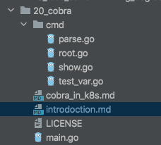

<!-- START doctoc generated TOC please keep comment here to allow auto update -->
<!-- DON'T EDIT THIS SECTION, INSTEAD RE-RUN doctoc TO UPDATE -->
**Table of Contents**  *generated with [DocToc](https://github.com/thlorenz/doctoc)*

- [Cobra](#cobra)
  - [主要功能](#%E4%B8%BB%E8%A6%81%E5%8A%9F%E8%83%BD)
  - [基本操作](#%E5%9F%BA%E6%9C%AC%E6%93%8D%E4%BD%9C)
    - [1. 通过命令初始化项目](#1-%E9%80%9A%E8%BF%87%E5%91%BD%E4%BB%A4%E5%88%9D%E5%A7%8B%E5%8C%96%E9%A1%B9%E7%9B%AE)
    - [2. 通过命令生成动作](#2-%E9%80%9A%E8%BF%87%E5%91%BD%E4%BB%A4%E7%94%9F%E6%88%90%E5%8A%A8%E4%BD%9C)
    - [3. 为 Command 添加选项(flags)](#3-%E4%B8%BA-command-%E6%B7%BB%E5%8A%A0%E9%80%89%E9%A1%B9flags)
      - [4. 添加子命令](#4-%E6%B7%BB%E5%8A%A0%E5%AD%90%E5%91%BD%E4%BB%A4)
      - [5. 编译](#5-%E7%BC%96%E8%AF%91)
  - [执行流程](#%E6%89%A7%E8%A1%8C%E6%B5%81%E7%A8%8B)
  - [应用](#%E5%BA%94%E7%94%A8)

<!-- END doctoc generated TOC please keep comment here to allow auto update -->

# Cobra
Cobra 是一个非常实用(流行)的golang包，很多优秀的开源应用都在使用它，包括 Docker 和 Kubernetes 等，
它提供了简单的接口来创建命令行程序。同时，Cobra 也是一个应用程序，用来生成应用框架，从而开发以 Cobra 为基础的应用。

  

在cobra中，所有的命令会组成一个树的结构，必然有一个根命令，我们应用的每次执行，都是从这个根命令开始的，官方文档也说过，基于cobra的应用的main包中的代码是很简单的，几乎没有额外的操作，仅有的操作其实就是执行我们的根命令。

Cobra 建立在 commands、arguments 和 flags 结构之上。commands 代表命令，arguments 代表非选项参数，flags 代表选项参数（也叫标志）。一个好的应用程序应该是易懂的，用户可以清晰地知道如何去使用这个应用程序。

## 主要功能

* 简易的子命令行模式，如 app server， app fetch 等等
* 完全兼容 posix 命令行模式
* 嵌套子命令 subcommand
* 支持全局，局部，串联 flags
* 使用 cobra 很容易的生成应用程序和命令，使用 cobra create - appname 和 cobra add cmdname
* 如果命令输入错误，将提供智能建议，如 app srver，将提示 srver 没有，是不是 app server
* 自动生成 commands 和 flags 的帮助信息
* 自动生成详细的 help 信息，如 app help
* 自动识别帮助 flag -h，--help
* 自动生成应用程序在 bash 下命令自动完成功能
* 自动生成应用程序的 man 手册
* 命令行别名
* 自定义 help 和 usage 信息
* 可选的与 viper apps 的紧密集成

## 基本操作
需求：
- （1）show 查看当前时间
- （2）parse 指定时间格式 --format，parse为show的子命令。

### 1. 通过命令初始化项目
```shell script
cobra init --pkg-name go_package_example/20_cobra
```
### 2. 通过命令生成动作
```shell script
cobra add serve
cobra add config
cobra add create -p 'configCmd'
```
cobra的三个概念：
* commands 行为
* arguments 数值
* flags 对行为的改变


应用程序通常遵循如下模式：APPNAME VERB NOUN --ADJECTIVE或者APPNAME COMMAND ARG --FLAG，例如

执行命令行程序时的一般格式为:  
`[appName] [command] [arguments] --[flag]`  
  eg:
```shell script
git clone URL --bare # clone 是一个命令，URL是一个非选项参数，bare是一个选项参数
```
这里，VERB 代表动词，NOUN 代表名词，ADJECTIVE 代表形容词。
  
执行命令，我们可以看到time命令的帮助信息，在usage中我们可以看到，当前有两个command一个是默认的help另一个就是我们刚才创建的show，
Flags也有两个，这是初始化的时候自带的，后面我们可以自己进行修改.  

### 3. 为 Command 添加选项(flags)  

选项的作用范围，可以把选项分为两类：  
* persistent 既可以设置给该 Command，又可以设置给该 Command 的子 Command
* local  
```shell script
ls --help
Usage: ls [OPTION]... [FILE]...
```  
解释：其中的 OPTION 对应本文中介绍的 flags，以 - 或 – 开头；
而 FILE 则被称为参数(arguments)或位置参数。一般的规则是参数在所有选项的后面，上面的 … 表示可以指定多个选项和多个参数

#### 4. 添加子命令
```shell script
cobra add parse -p showCmd  
# 终端返回： parse created at /Users/python/Desktop/go_package_example/20_cobra
```
解释： 给showCmd命令添加子命令parse


#### 5. 编译
```shell script
$ go build -o time main.go
``` 


## 执行流程
```go
func Execute() {
  rootCmd.Execute()
}
func (c *Command) Execute() error {
	_, err := c.ExecuteC()
	return err
}
```

## 应用
1 [k8s中应用](20_cli_frame/01_cobra/cobra_in_k8s.md)