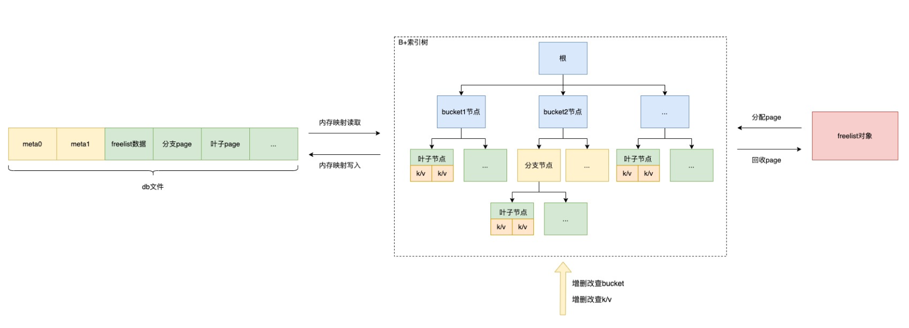
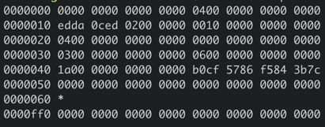
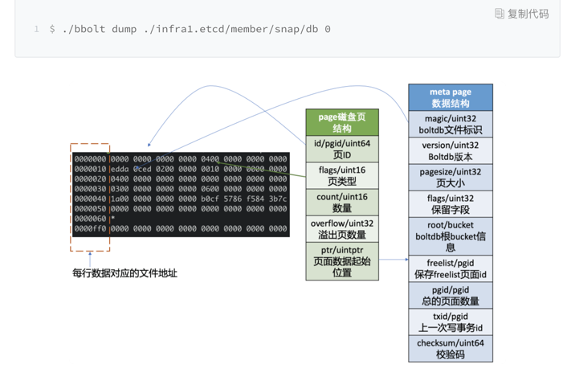
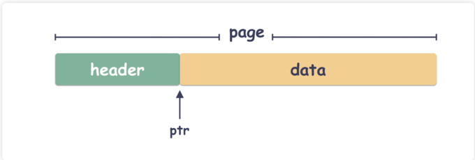
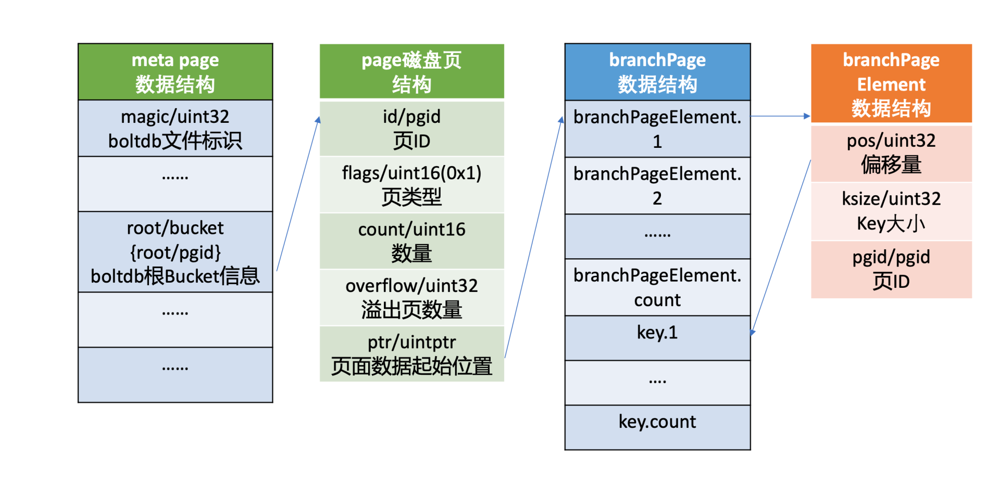
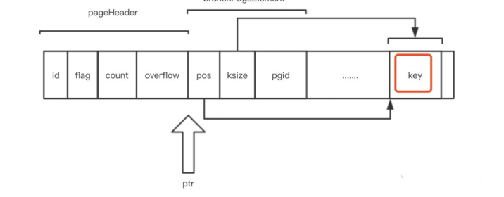
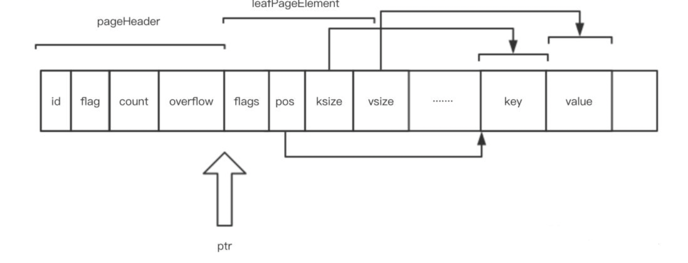
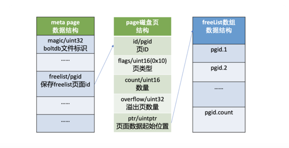
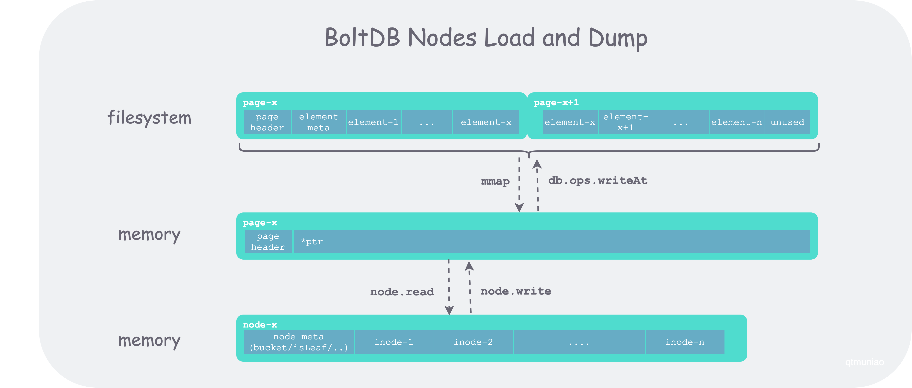
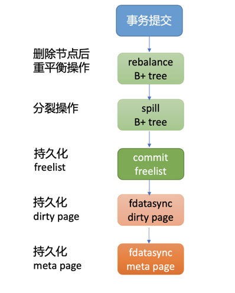

<!-- START doctoc generated TOC please keep comment here to allow auto update -->
<!-- DON'T EDIT THIS SECTION, INSTEAD RE-RUN doctoc TO UPDATE -->
**Table of Contents**  *generated with [DocToc](https://github.com/thlorenz/doctoc)*

- [boltdb](#boltdb)
  - [特点](#%E7%89%B9%E7%82%B9)
  - [缺点](#%E7%BC%BA%E7%82%B9)
  - [db 文件磁盘布局](#db-%E6%96%87%E4%BB%B6%E7%A3%81%E7%9B%98%E5%B8%83%E5%B1%80)
  - [磁盘数据分析](#%E7%A3%81%E7%9B%98%E6%95%B0%E6%8D%AE%E5%88%86%E6%9E%90)
  - [page 磁盘页结构](#page-%E7%A3%81%E7%9B%98%E9%A1%B5%E7%BB%93%E6%9E%84)
    - [从物理层面来说](#%E4%BB%8E%E7%89%A9%E7%90%86%E5%B1%82%E9%9D%A2%E6%9D%A5%E8%AF%B4)
    - [从逻辑层面来说](#%E4%BB%8E%E9%80%BB%E8%BE%91%E5%B1%82%E9%9D%A2%E6%9D%A5%E8%AF%B4)
    - [1. meta page 数据结构](#1-meta-page-%E6%95%B0%E6%8D%AE%E7%BB%93%E6%9E%84)
      - [为什么会有两个 meta 页？](#%E4%B8%BA%E4%BB%80%E4%B9%88%E4%BC%9A%E6%9C%89%E4%B8%A4%E4%B8%AA-meta-%E9%A1%B5)
    - [branch page](#branch-page)
    - [leaf page](#leaf-page)
    - [freelist](#freelist)
  - [boltdb 的B+ 树](#boltdb-%E7%9A%84b-%E6%A0%91)
    - [node](#node)
  - [添加数据](#%E6%B7%BB%E5%8A%A0%E6%95%B0%E6%8D%AE)
  - [事务提交](#%E4%BA%8B%E5%8A%A1%E6%8F%90%E4%BA%A4)
  - [Open函数](#open%E5%87%BD%E6%95%B0)
  - [参考链接](#%E5%8F%82%E8%80%83%E9%93%BE%E6%8E%A5)

<!-- END doctoc generated TOC please keep comment here to allow auto update -->

# boltdb

## 特点

1. 整个数据库就一个 db 文件，贼简单；
2. 基于 B+ 树的索引，读效率高效且稳定；
3. 读事务可多个并发，写事务只能串行；

## 缺点
1. 事务的实现贼简单，但是写的开销太大；
2. boltdb 写事务不能并发，只能靠批量操作来缓解性能问题；


## db 文件磁盘布局


图中的左边部分你可以看到，文件的内容由若干个 page 组成，一般情况下 page size 为 4KB。

page 按照功能可分为元数据页 (meta page)、B+ tree 索引节点页 (branch page)、B+ tree 叶子节点页 (leaf page)、空闲页管理页 (freelist page)、空闲页 (free page)

- 文件最开头的两个 page 是固定的 db 元数据 meta page

- 空闲页管理页记录了 db 中哪些页是空闲、可使用的

- 索引节点页保存了 B+ tree 的内部节点，如图中的右边部分所示，它们记录了 key 值，叶子节点页记录了 B+ tree 中的 key-value 和 bucket 数据。

## 磁盘数据分析

上图中十六进制输出的是 db 文件的 page 0 页结构，左边第一列表示此行十六进制内容对应的文件起始地址，每行 16 个字节。

结合 page 磁盘页和 meta page 数据结构我们可知，
- 第一行前 8 个字节描述 pgid(忽略第一列) 是 0。
  接下来 2 个字节描述的页类型， 其值为 0x04 表示 meta page， 说明此页的数据存储的是 meta page 内容，因此 ptr 开始的数据存储的是 meta page 内容。

- 第二行首先含有一个 4 字节的 magic number(0xED0CDAED)，通过它来识别当前文件是否 boltdb.
  接下来是四个字节描述 boltdb 的版本号 0x2,
  然后是四个字节的 page size 大小，0x1000 表示 4096 个字节，
  四个字节的 flags 为 0。

- 第三行对应的就是meta page 的 root bucket 结构（16 个字节），它描述了 boltdb 的 root bucket 信息，比如一个 db 中有哪些 bucket， bucket 里面的数据存储在哪里。
  root bucket 指向的 page id 为 4。我们可以通过如下 bbolt pages 命令看看各个 page 类型和元素数量，从下图结果可知，4 号页面为 leaf page。
```shell

$ ./bbolt pages  ./infra1.etcd/member/snap/db
ID       TYPE       ITEMS  OVRFLW
======== ========== ====== ======
0        meta       0
1        meta       0
2        free
3        freelist   2
4        leaf       10
5        free
```


- 第四行中前面的 8 个字节，0x3 表示 freelist 页面 ID，此页面记录了 db 当前哪些页面是空闲的。后面 8 个字节，0x6 表示当前 db 总的页面数。
```shell

$ ./bbolt page  ./infra1.etcd/member/snap/db 3
page ID:    3
page Type:  freelist
Total Size: 4096 bytes
Item Count: 2
Overflow: 0

2
5
```

- 第五行前面的 8 个字节，0x1a 表示上一次的写事务 ID，后面的 8 个字节表示校验码，用于检测文件是否损坏.

## page 磁盘页结构


page 磁盘页结构由页 ID(id)、页类型 (flags)、数量 (count)、溢出页数量 (overflow)、页面数据起始位置 (ptr) 字段组成
```go
type pgid uint64

type page struct {
	id       pgid // 是给page的编号
	flags    uint16 //是指的此页中保存的具体数据类型
	count    uint16 // 记录具体数据类型中的计数,仅在页类型为 leaf 和 branch 时生效
	overflow uint32 //用来记录是否有跨页,标明后面是不是还有连续的页跟着
	ptr      uintptr //页面数据起始位置指向 page 的载体数据,比如 meta page、branch/leaf 等 page 的内容,这就是个用来定界的
}
```

### 从物理层面来说
boltdb 的 db 文件来说就是由这样一个个 page 组成的。举个例子，如果是一个 32K 的文件，那么就由 8 个 page 组成，每个 page 都有自己的唯一编号（ pgid ），从 0 到 7 。

### 从逻辑层面来说
boltdb 把这一个个 page 组成了一个树形结构，它们之间通过 page id 关联起来。我们再往下思考：
- 第一个点：树自然会有个源头，比如从那个 page 开始索引，还有一些最关键的元数据（ meta 数据 ）；
- 第二个点：既然是一颗树，那么自然有中间节点、叶子节点；
- 第三个点：既然是空间管理，那么自然要知道哪些是存储了用户数据 page ，哪些是空闲的 page

上面提到的三个点都指向一个结论：page 的用途是不一样的。也就是说，虽然大家都是 page，但是身份不一样。有的是叶子节点，有的是中间节点，有的是 meta 节点，有的是 free 节点。这个由 page.flag 来标识。


页类型目前有如下四种
```go
const (
	branchPageFlag   = 0x01 // 分支节点
	leafPageFlag     = 0x02 // 叶子节点
	metaPageFlag     = 0x04
	freelistPageFlag = 0x10
)
```

### 1. meta page 数据结构
元数据的 page ，这可太重要了。对于 boltdb 来说，meta 的 page 位置是固定的，就在 page 0，page 1 这两个位置（ 也就是前两个 4k 页 ）的位置。

```go
type meta struct {
	magic    uint32 // 文件标识
	version  uint32 // 版本号
	pageSize uint32 //页大小 
	flags    uint32
	root     bucket // boltdb 的根 bucket 信息
	freelist pgid // freelist 页面 ID
	pgid     pgid // 总的页面数量
	txid     txid // 事务编号， 上一次写事务 ID，（写事务的时候，事务号会递增）；
	checksum uint64 // 校验码
}

// bucket represents the on-file representation of a bucket.
// This is stored as the "value" of a bucket key. If the bucket is small enough,
// then its root page can be stored inline in the "value", after the bucket
// header. 内联bucket, the "root" 为 0.
type bucket struct {
	root     pgid   // root 表示该 bucket 根节点的 page id
	sequence uint64 // monotonically incrementing, used by NextSequence()
}

type txid uint64

```
```go
// Save references to the meta pages.
db.meta0 = db.page(0).meta()
db.meta1 = db.page(1).meta()
```
第 0、1 页我们知道它是固定存储 db 元数据的页 (meta page),
它由 boltdb 的文件标识 (magic)、版本号 (version)、页大小 (pagesize)、boltdb 的根 bucket 信息 (root bucket)、
freelist 页面 ID(freelist)、总的页面数量 (pgid)、上一次写事务 ID(txid)、校验码 (checksum) 组成。

#### 为什么会有两个 meta 页？
这是一个非常重要的设计，在 boltdb 里有一个非常重要的设计：没有覆盖写，也就是不会原地更新数据。这个是 boltdb 实现 ACID 事务的秘密。

以前也提过，覆盖写是数据损坏的根源之一。因为写数据的时候可能会出现任何异常，比如写部分成功，部分失败 这种就不符合事务的 ACID 原则。

但由于 meta 是 boltdb 一切的源头，所以它必须是固定位置（ 不然就找不到它 ）。但为什么会有 paid 0，1 两个位置呢？


诀窍就在于：通过轮转写来解决覆盖写的问题。 每次 meta 的更新都不会直接更新最新的位置，而是写上上次的位置
```go
// Page id is either going to be 0 or 1 which we can determine by the transaction ID.
// 计算 page id 的位置
p.id = pgid(m.txid % 2)
```
举个例子：

- 事务 0 写 page 0 ；
- 事务 1 写 page 1 ；
- 事务 2 写 page 0 ；
- 事务 3 写 page 1 ；


### branch page




```go
type branchPageElement struct {
	pos   uint32 // pos是key的真实存储位置相对于该branchPageElement结构体的偏移。
	ksize uint32 // key的长度，单位为字节
	pgid  pgid // 子节点的 page id
}
```
只包含有key数据集合，没有value。每一个key是其指向的下一级节点的第一个key值(这就意味着其所指向的下一级节点中的所有key值都大于或等于该key)

当前节点的所有branchPageElement会保存在连续的空间内。紧接其后的就是真实的key数据了。同样，如果页面后面还有剩余空间，那就只能浪费了，别的节点无法利用。

根据偏移量和 key 大小，我们就可以方便地从 branch page 中解析出所有 key，然后二分搜索匹配 key，
获取其子节点 page id，递归搜索，直至从 bucketLeafFlag 类型的 leaf page 中找到目的 bucket name。

### leaf page

```go
const (
    bucketLeafFlag = 0x01 // 当 flag 为 bucketLeafFlag(0x01) 时，表示存储的是 bucket 数据，否则存储的是 key-value 数据
)

// leafPageElement represents a node on a leaf page.
type leafPageElement struct {
	flags uint32
	pos   uint32 // 相对的偏移
	ksize uint32
	vsize uint32
}
```
bbolt为每一个key-value对分配一个leafPageElement结构体，会保存在文件中。

当前节点的所有leafPageElement会保存在连续的空间内。紧接其后的就是真实的key-value数据了。如果页面后面还有剩余空间，那就只能浪费了，别的节点无法利用。

- 当 flag 不是 bucketLeafFlag(0x01) 时，表示存储的是 key-value 数据，
  leafPageElement 它含有 key-value 的读取偏移量，key-value 大小，根据偏移量和 key-value 大小，我们就可以方便地从 leaf page 中解析出所有 key-value 对。

- 当存储的是 bucket 数据的时候，key 是 bucket 名称，value 则是 bucket 结构信息。
  bucket 结构信息含有 root page 信息，通过 root page（基于 B+ tree 查找算法），你可以快速找到你存储在这个 bucket 下面的 key-value 数据所在页面。


每个子 bucket 至少需要一个 page 来存储其下面的 key-value 数据，如果子 bucket 数据量很少，就会造成磁盘空间的浪费。
实际上 boltdb 实现了 inline bucket，在满足一些条件限制的情况下，可以将小的子 bucket 内嵌在它的父亲叶子节点上，友好的支持了大量小 bucket

Note: 一个节点内的所有key-value数据是按key升序排列的。因为对于bbolt来说，所有的key、value都是[]byte，所以是用bytes.Compare来比较key的大小。


### freelist


freelist page 中记录了哪些页是空闲的。当你在 boltdb 中删除大量数据的时候，其对应的 page 就会被释放，页 ID 存储到 freelist 所指向的空闲页中。
当你写入数据的时候，就可直接从空闲页中申请页面使用。
```go
type freelist struct {
	ids     []pgid          // all free and available free page ids.
	pending map[txid][]pgid // mapping of soon-to-be free page ids by tx.
	cache   map[pgid]bool   // fast lookup of all free and pending page ids.
}
```


第三个页面(编号为2)的页面用来保存这些空闲页面的ID。flag:0x10表示当前页面用于保存空闲页面的ID。count表示空闲页面的数量。如果空闲页面很多，一个页面保存不下，就会申请几个连续的页面来保存；这时就要用到字段overflow了。

假设总共需要3个连续的页面的空间来保存所有的空闲页面ID，那么pgid就是第一个页面的ID，overflow的值就是2；例如pgid的值是6，那么就是编号为6、7、8的这三个页面。

## boltdb 的B+ 树

都说 boltdb 用的是 B+ 树的形式，说的也是对的，但是 boltdb 的 B+ 树有些变异，几点差异如下：

- 节点的分支个数不是固定值；
- 叶子节点不相互感知，它们之间不存在相互的指向引用；
- 并不保证所有的叶子节点在同一层；

划重点：boltdb 它用的是一个不一样的 B+ 树。 除了上面的，索引查找和数据组织形式都是 B+ 树的样子。

在 boltdb 里面有几个封装的概念：

- Bucket ：这是一个 boltdb 封装的一个抽象概念，但本质上呢它就是个命名空间，就是一些 key/value 的集合，不同的 Bucket 可以有同名的 key/value ；
- node ：B+ 树节点的抽象封装，可以说 page 是磁盘物理的概念，node 则是逻辑上的抽象了；

### node

对应关系如下，node为内存中数据的存储模式，page是磁盘中存储格式。

boltdb 在内存中使用了一个名为 node 的数据结构，来保存 page 反序列化的结果.

B+ 树的基本构成单元是节点（node），对应在文件系统中存储的页（page），节点包括两种类型，分支节点（branch node）和叶子节点（leaf node）。
但在实现时，他们复用了同一个结构体，并通过一个标志位 isLeaf 来区分
```go
// node represents an in-memory, deserialized page.
// node 表示内存中一个反序列化后的 page
type node struct {
	bucket     *Bucket // 是更上层的数据结构，类似于数据中的表的概念，一个bucket中包含了很多node
	isLeaf     bool // 叶子节点flag

	// 调整、维持 B+ 树时使用
	unbalanced bool  // 是否需要进行合并
	spilled    bool  // 是否需要进行拆分和落盘
	key        []byte  // 所含第一个元素的 key
	pgid       pgid // 对应的 page 的 id
	parent     *node // 父节点指针
	children   nodes //  孩子节点指针（只包含加载到内存中的部分孩子）
	inodes     inodes // 存储key value的结构,所存元素的元信息；对于分支节点是 key+pgid 数组，对于叶子节点是 kv 数组
}
```
数据
```go
type inode struct {
	//  共有变量
	flags uint32
	key   []byte

	// 分支节点使用
	pgid  pgid  // 指向的分支/叶子节点的 page id


    // 叶子节点使用
	value []byte  // 叶子节点所存的数据
}

type inodes []inode
```
inode 会在 B+ 树中进行路由 —— 二分查找时使用


从磁盘中的page，加载到内存中的node

```go
// read 函数通过 mmap 读取 page，并转换为 node
func (n *node) read(p *page) {
    // 初始化元信息
   n.pgid = p.id
   n.isLeaf = ((p.flags & leafPageFlag) != 0)
   n.inodes = make(inodes, int(p.count))

    // 加载所包含元素 inodes
   for i := 0; i < int(p.count); i++ {
      inode := &n.inodes[i]
      if n.isLeaf {
         elem := p.leafPageElement(uint16(i))
         inode.flags = elem.flags
         inode.key = elem.key()
         inode.value = elem.value()
      } else {
         elem := p.branchPageElement(uint16(i))
         inode.pgid = elem.pgid
         inode.key = elem.key()
      }
   }
    // Save first key so we can find the node in the parent when we spill.
	// 用第一个元素的 key 作为该 node 的 key，以便父节点以此作为索引进行查找和路由
    if len(n.inodes) > 0 {
        n.key = n.inodes[0].key
        _assert(len(n.key) > 0, "read: zero-length node key")
    } else {
        n.key = nil
    }
```


## 添加数据
所有的数据新增都发生在叶子节点，如果新增数据后 B+ 树不平衡，之后会通过 node.spill 来进行拆分调整

1. 创建bucket
   - 它首先是根据 meta page 中记录 root bucket 的 root page，按照 B+ tree 的查找算法，从 root page 递归搜索到对应的叶子节点 page 面，返回 key 名称、leaf 类型。
   - 如果 leaf 类型为 bucketLeafFlag，且 key 相等，那么说明已经创建过，不允许 bucket 重复创建，结束请求。否则往 B+ tree 中添加一个 flag 为 bucketLeafFlag 的 key，key 名称为 bucket name，value 为 bucket 的结构。 
    
```go
func (b *Bucket) CreateBucket(key []byte) (*Bucket, error) {
	if b.tx.db == nil {
		return nil, ErrTxClosed
	} else if !b.tx.writable {
		return nil, ErrTxNotWritable
	} else if len(key) == 0 {
		return nil, ErrBucketNameRequired
	}

	// 移动到正确的位置.
	c := b.Cursor()
	k, _, flags := c.seek(key)

	// Return an error if there is an existing key.
	if bytes.Equal(key, k) {
		// key已经存在
		if (flags & bucketLeafFlag) != 0 {
			return nil, ErrBucketExists
		}
		return nil, ErrIncompatibleValue
	}

	// Create empty, inline bucket.
	var bucket = Bucket{
		bucket:      &bucket{},
		rootNode:    &node{isLeaf: true},
		FillPercent: DefaultFillPercent,
	}
	var value = bucket.write()

	// Insert into node.
	key = cloneBytes(key)
	c.node().put(key, key, value, 0, bucketLeafFlag)

	// Since subbuckets are not allowed on inline buckets, we need to
	// dereference the inline page, if it exists. This will cause the bucket
	// to be treated as a regular, non-inline bucket for the rest of the tx.
	b.page = nil

	return b.Bucket(key), nil
}

```

利用B+树查询
```go
func (c *Cursor) seek(seek []byte) (key []byte, value []byte, flags uint32) {
    // ..

	// Start from root page/node and traverse to correct page.
	c.stack = c.stack[:0]
	c.search(seek, c.bucket.root)
	ref := &c.stack[len(c.stack)-1]

	// If the cursor is pointing to the end of page/node then return nil.
	if ref.index >= ref.count() {
		return nil, nil, 0
	}

	// If this is a bucket then return a nil value.
	return c.keyValue()
}

// 递归二分查找
func (c *Cursor) search(key []byte, pgid pgid) {
	p, n := c.bucket.pageNode(pgid)
	if p != nil && (p.flags&(branchPageFlag|leafPageFlag)) == 0 {
		panic(fmt.Sprintf("invalid page type: %d: %x", p.id, p.flags))
	}
	e := elemRef{page: p, node: n}
	c.stack = append(c.stack, e)

	// If we're on a leaf page/node then find the specific node.
	if e.isLeaf() {
		c.nsearch(key)
		return
	}

	if n != nil {
		c.searchNode(key, n)
		return
	}
	c.searchPage(key, p)
}

// nsearch searches the leaf node on the top of the stack for a key.
func (c *Cursor) nsearch(key []byte) {
	e := &c.stack[len(c.stack)-1]
	p, n := e.page, e.node

	// If we have a node then search its inodes.
	if n != nil {
		index := sort.Search(len(n.inodes), func(i int) bool {
			return bytes.Compare(n.inodes[i].key, key) != -1
		})
		e.index = index
		return
	}

	// If we have a page then search its leaf elements.
	inodes := p.leafPageElements()
	index := sort.Search(int(p.count), func(i int) bool {
		return bytes.Compare(inodes[i].key(), key) != -1
	})
	e.index = index
}
```

## 事务提交

```go
func (tx *Tx) Commit() error {
	_assert(!tx.managed, "managed tx commit not allowed")
	if tx.db == nil {
		return ErrTxClosed
	} else if !tx.writable {
		return ErrTxNotWritable
	}

	// TODO(benbjohnson): Use vectorized I/O to write out dirty pages.

	// Rebalance nodes which have had deletions.
	// 重平衡
	var startTime = time.Now()
	tx.root.rebalance()
	if tx.stats.Rebalance > 0 {
		tx.stats.RebalanceTime += time.Since(startTime)
	}

	// spill data onto dirty pages.
	// 分裂
	startTime = time.Now()
	if err := tx.root.spill(); err != nil {
		tx.rollback()
		return err
	}
	tx.stats.SpillTime += time.Since(startTime)

	// Free the old root bucket.
	tx.meta.root.root = tx.root.root

	opgid := tx.meta.pgid

	// 释放 free page
	// Free the freelist and allocate new pages for it. This will overestimate
	// the size of the freelist but not underestimate the size (which would be bad).
	tx.db.freelist.free(tx.meta.txid, tx.db.page(tx.meta.freelist))
	p, err := tx.allocate((tx.db.freelist.size() / tx.db.pageSize) + 1)
	if err != nil {
		tx.rollback()
		return err
	}
	if err := tx.db.freelist.write(p); err != nil {
		tx.rollback()
		return err
	}
	tx.meta.freelist = p.id

	// If the high water mark has moved up then attempt to grow the database.
	if tx.meta.pgid > opgid {
		if err := tx.db.grow(int(tx.meta.pgid+1) * tx.db.pageSize); err != nil {
			tx.rollback()
			return err
		}
	}

	// 将 client 更新操作产生的 dirty page 通过 fdatasync 系统调用，持久化存储到磁盘中。.
	startTime = time.Now()
	if err := tx.write(); err != nil {
		tx.rollback()
		return err
	}

	// If strict mode is enabled then perform a consistency check.
	// Only the first consistency error is reported in the panic.
	if tx.db.StrictMode {
		ch := tx.Check()
		var errs []string
		for {
			err, ok := <-ch
			if !ok {
				break
			}
			errs = append(errs, err.Error())
		}
		if len(errs) > 0 {
			panic("check fail: " + strings.Join(errs, "\n"))
		}
	}

	// 执行写事务过程中，meta page 的 txid、freelist 等字段会发生变化，因此事务的最后一步就是持久化 meta page
	if err := tx.writeMeta(); err != nil {
		tx.rollback()
		return err
	}
	tx.stats.WriteTime += time.Since(startTime)

	// Finalize the transaction.
	tx.close()

	// Execute commit handlers now that the locks have been removed.
	for _, fn := range tx.commitHandlers {
		fn()
	}

	return nil
}
```

## Open函数
```go
func Open(path string, mode os.FileMode, options *Options) (*DB, error) {
	var db = &DB{opened: true}

	// Set default options if no options are provided.
	if options == nil {
		options = DefaultOptions
	}
	db.NoGrowSync = options.NoGrowSync
	db.MmapFlags = options.MmapFlags

	// 设置默认值.
	db.MaxBatchSize = DefaultMaxBatchSize
	db.MaxBatchDelay = DefaultMaxBatchDelay
	db.AllocSize = DefaultAllocSize

	flag := os.O_RDWR
	if options.ReadOnly {
		flag = os.O_RDONLY
		db.readOnly = true
	}

	// Open data file and separate sync handler for metadata writes.
	db.path = path
	var err error
	if db.file, err = os.OpenFile(db.path, flag|os.O_CREATE, mode); err != nil {
		_ = db.close()
		return nil, err
	}

	// 增加文件锁,LOCK_SH 建立共享锁定。多个进程可同时对同一个文件作共享锁定。
	// The database file is locked using the shared lock (more than one process may
	// hold a lock at the same time) otherwise (options.ReadOnly is set).
	if err := flock(db, mode, !db.readOnly, options.Timeout); err != nil {
		_ = db.close()
		return nil, err
	}

	// Default values for test hooks
	db.ops.writeAt = db.file.WriteAt

	// Initialize the database if it doesn't exist.
	if info, err := db.file.Stat(); err != nil {
		return nil, err
	} else if info.Size() == 0 {
		// 文件初始化.
		if err := db.init(); err != nil {
			return nil, err
		}
	} else {
		// Read the first meta page to determine the page size.
		var buf [0x1000]byte
		if _, err := db.file.ReadAt(buf[:], 0); err == nil {
			m := db.pageInBuffer(buf[:], 0).meta()
			if err := m.validate(); err != nil {
				// If we can't read the page size, we can assume it's the same
				// as the OS -- since that's how the page size was chosen in the
				// first place.
				//
				// If the first page is invalid and this OS uses a different
				// page size than what the database was created with then we
				// are out of luck and cannot access the database.
				db.pageSize = os.Getpagesize()
			} else {
				db.pageSize = int(m.pageSize)
			}
		}
	}

	// Initialize page pool.
	db.pagePool = sync.Pool{
		New: func() interface{} {
			return make([]byte, db.pageSize)
		},
	}

	// 通过 mmap 机制将 db 文件映射到内存中，内部并读取两个 meta page 到 db 对象实例中
	if err := db.mmap(options.InitialMmapSize); err != nil {
		_ = db.close()
		return nil, err
	}

	// Read in the freelist.
	db.freelist = newFreelist()
	db.freelist.read(db.page(db.meta().freelist))

	// Mark the database as opened and return.
	return db, nil
}
```


## 参考链接
1. https://www.modb.pro/db/159598
2. https://www.qtmuniao.com/2020/12/14/bolt-index-design/