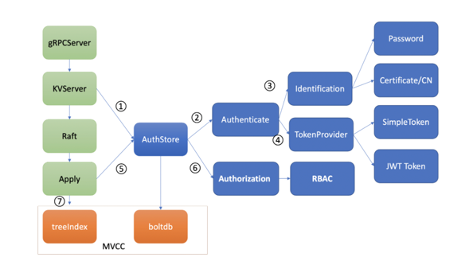

<!-- START doctoc generated TOC please keep comment here to allow auto update -->
<!-- DON'T EDIT THIS SECTION, INSTEAD RE-RUN doctoc TO UPDATE -->
**Table of Contents**  *generated with [DocToc](https://github.com/thlorenz/doctoc)*

- [etcd鉴权](#etcd%E9%89%B4%E6%9D%83)
  - [控制面](#%E6%8E%A7%E5%88%B6%E9%9D%A2)
  - [数据面](#%E6%95%B0%E6%8D%AE%E9%9D%A2)
  - [认证](#%E8%AE%A4%E8%AF%81)
    - [密码认证](#%E5%AF%86%E7%A0%81%E8%AE%A4%E8%AF%81)
    - [证书认证](#%E8%AF%81%E4%B9%A6%E8%AE%A4%E8%AF%81)
  - [授权](#%E6%8E%88%E6%9D%83)

<!-- END doctoc generated TOC please keep comment here to allow auto update -->

# etcd鉴权

etcd 鉴权体系架构由控制面和数据面组成.

## 控制面

上图是是 etcd 鉴权体系控制面，你可以通过客户端工具 etcdctl 和鉴权 API 动态调整认证、鉴权规则，AuthServer 收到请求后，为了确保各节点间鉴权元数据一致性，会通过 Raft 模块进行数据同步。

当对应的 Raft 日志条目被集群半数以上节点确认后，Apply 模块通过鉴权存储 (AuthStore) 模块，执行日志条目的内容，将规则存储到 boltdb 的一系列“鉴权表”里面。

## 数据面


数据面鉴权流程，由认证和授权流程组成。
1. 认证的目的是检查 client 的身份是否合法、防止匿名用户访问等。目前 etcd 实现了两种认证机制，分别是密码认证和证书认证。
认证通过后，为了提高密码认证性能，会分配一个 Token（类似我们生活中的门票、通信证）给 client，client 后续其他请求携带此 Token，server 就可快速完成 client 的身份校验工作。

实现分配 Token 的服务也有多种，这是 TokenProvider 所负责的，目前支持 SimpleToken 和 JWT 两种。
通过认证后，在访问 MVCC 模块之前，还需要通过授权流程。

2. 授权的目的是检查 client 是否有权限操作你请求的数据路径，etcd 实现了 RBAC 机制，支持为每个用户分配一个角色，为每个角色授予最小化的权限。


## 认证
如何防止匿名用户访问你的 etcd 数据呢？解决方案当然是认证用户身份。

etcd 目前实现了两种机制，分别是用户密码认证和证书认证

### 密码认证

etcd 支持为每个用户分配一个账号名称、密码。密码认证在我们生活中无处不在，从银行卡取款到微信、微博 app 登录，再到核武器发射，密码认证应用及其广泛，是最基础的鉴权的方式。

但密码认证存在两大难点，它们分别是如何*保障密码安全性*和*提升密码认证性能*。

保障密码安全性: 会使用 bcrpt 库的 blowfish 算法，基于明文密码、随机分配的 salt、自定义的 cost、迭代多次计算得到一个 hash 值，并将加密算法版本、salt 值、cost、hash 值组成一个字符串，作为加密后的密码

提升密码认证性能: 当 etcd server 验证用户密码成功后，它就会返回一个 Token 字符串给 client，用于表示用户的身份。后续请求携带此 Token，就无需再次进行密码校验，实现了通信证的效果。

etcd 目前支持两种 Token，分别为 Simple Token 和 JWT Token。


扩展： etcd 的另外一种高性能、更安全的鉴权方案，x509 证书认证

### 证书认证
证书认证在稳定性、性能上都优于密码认证。
- 稳定性上，它不存在 Token 过期、使用更加方便、会让你少踩坑，避免了不少 Token 失效而触发的 Bug。
- 性能上，证书认证无需像密码认证一样调用昂贵的密码认证操作 (Authenticate 请求)，此接口支持的性能极低，后面实践篇会和你深入讨论


密码认证一般使用在 client 和 server 基于 HTTP 协议通信的内网场景中。当对安全有更高要求的时候，你需要使用 HTTPS 协议加密通信数据，防止中间人攻击和数据被篡改等安全风险。

HTTPS 是利用非对称加密实现身份认证和密钥协商，因此使用 HTTPS 协议的时候，你需要使用 CA 证书给 client 生成证书才能访问。那么一个 client 证书包含哪些信息呢？

使用证书认证的时候，etcd server 如何知道你发送的请求对应的用户名称？我们可以使用下面的 openssl 命令查看 client 证书的内容，

下图是一个 x509 client 证书的内容，它含有证书版本、序列号、签名算法、签发者、有效期、主体名等信息，我们重点要关注的是主体名中的 CN 字段。在 etcd 中，如果你使用了 HTTPS 协议并启用了 client 证书认证 (--client-cert-auth)，它会取 CN 字段作为用户名

## 授权
开启鉴权后，put 请求命令在应用到状态机前，etcd 还会对发出此请求的用户进行权限检查， 判断其是否有权限操作请求的数据。常用的权限控制方法有 ACL(Access Control List)、ABAC(Attribute-based access control)、RBAC(Role-based access control)，etcd 实现的是 RBAC 机制。

```shell script

$ #创建一个admin role 
etcdctl role add admin  --user root:root
Role admin created
# #分配一个可读写[hello，helly]范围数据的权限给admin role
$ etcdctl role grant-permission admin readwrite hello helly --user root:root
Role admin updated
# 将用户alice和admin role关联起来，赋予admin权限给user
$ etcdctl user grant-role alice admin --user root:root
Role admin is granted to user alice
```
然后当你再次使用 etcdctl 执行 put hello 命令时，鉴权模块会从 boltdb 查询 alice 用户对应的权限列表。因为有可能一个用户拥有成百上千个权限列表，etcd 为了提升权限检查的性能，引入了区间树，检查用户操作的 key 是否在已授权的区间，时间复杂度仅为 O(logN)
 