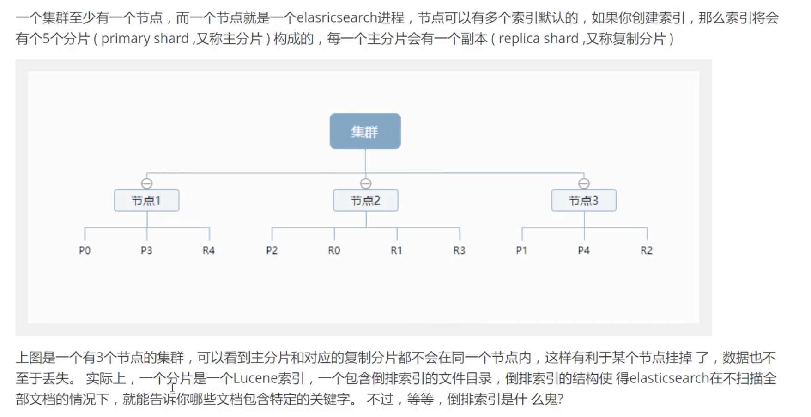
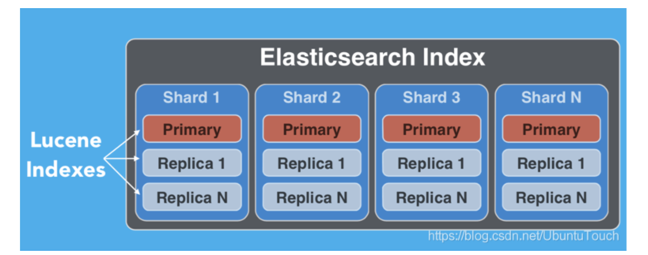
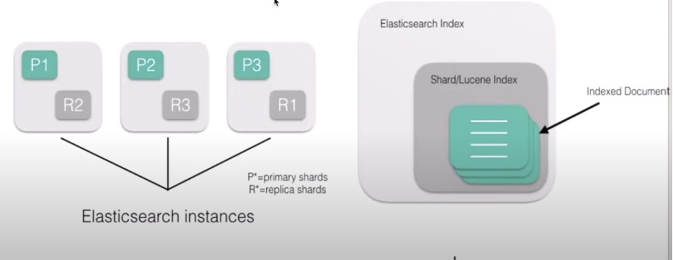
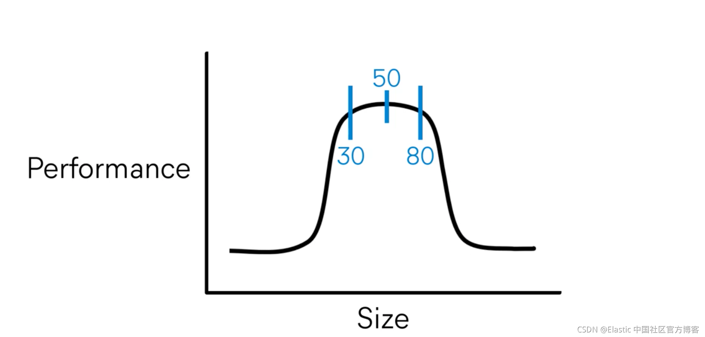
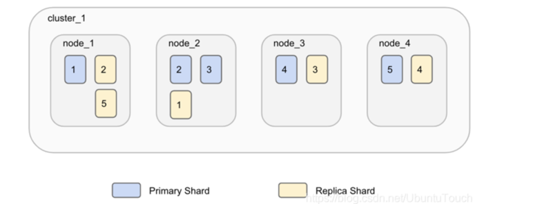
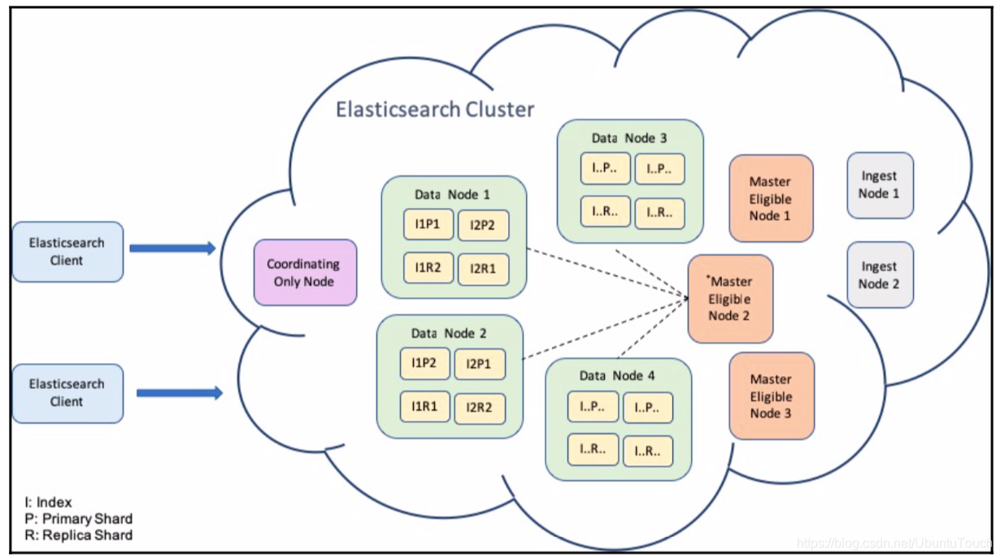
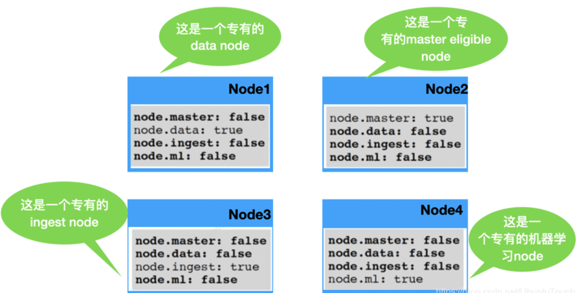
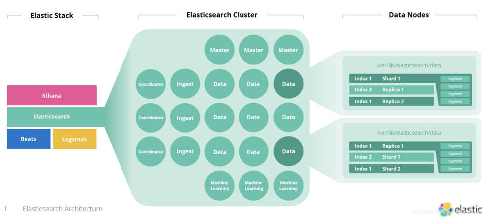

<!-- START doctoc generated TOC please keep comment here to allow auto update -->
<!-- DON'T EDIT THIS SECTION, INSTEAD RE-RUN doctoc TO UPDATE -->
**Table of Contents**  *generated with [DocToc](https://github.com/thlorenz/doctoc)*

- [ElasticSearch](#elasticsearch)
  - [es架构](#es%E6%9E%B6%E6%9E%84)
  - [es倒排索引原理](#es%E5%80%92%E6%8E%92%E7%B4%A2%E5%BC%95%E5%8E%9F%E7%90%86)
  - [CRUD增删改查](#crud%E5%A2%9E%E5%88%A0%E6%94%B9%E6%9F%A5)
  - [基本概念](#%E5%9F%BA%E6%9C%AC%E6%A6%82%E5%BF%B5)
    - [对比关系型数据库](#%E5%AF%B9%E6%AF%94%E5%85%B3%E7%B3%BB%E5%9E%8B%E6%95%B0%E6%8D%AE%E5%BA%93)
    - [Document 文档](#document-%E6%96%87%E6%A1%A3)
    - [type](#type)
    - [index](#index)
    - [Shards分片](#shards%E5%88%86%E7%89%87)
    - [Replicas副本](#replicas%E5%89%AF%E6%9C%AC)
  - [集群cluster](#%E9%9B%86%E7%BE%A4cluster)
    - [node](#node)
  - [存储架构](#%E5%AD%98%E5%82%A8%E6%9E%B6%E6%9E%84)
    - [写入流程](#%E5%86%99%E5%85%A5%E6%B5%81%E7%A8%8B)
  - [查询架构](#%E6%9F%A5%E8%AF%A2%E6%9E%B6%E6%9E%84)
    - [计算引擎](#%E8%AE%A1%E7%AE%97%E5%BC%95%E6%93%8E)
    - [数据扫描](#%E6%95%B0%E6%8D%AE%E6%89%AB%E6%8F%8F)
  - [参考资料](#%E5%8F%82%E8%80%83%E8%B5%84%E6%96%99)

<!-- END doctoc generated TOC please keep comment here to allow auto update -->

# ElasticSearch
## es架构



## es倒排索引原理

默认情况下，Elasticsearch 在文档中的所有字段上构建一个反向索引，指向该字段所在的 Elasticsearch 文档。
也就是说在每个 Elasticsearch 的 Lucene里，有一个位置存放这个 inverted index。如果你的索引包含包含五个全文字段的文档，你将有五个反向索引。

## CRUD增删改查


## 基本概念
### 对比关系型数据库


### Document 文档

Elasticsearch 是面向文档的，这意味着你索引或搜索的最小数据单元是文档.
文档通常是数据的 JSON 表示形式。
-  它是独立的。文档包含字段（名称）及其值。
-  它可以是分层的。可以将其视为文档中的文档。字段的值可以很简单，就像位置字段的值可以是字符串一样。它还可以包含其他字段和值。例如，位置字段可能包含城市和街道地址。
-  结构灵活。你的文档不依赖于预定义的架构。例如，并非所有事件都需要描述值，因此可以完全省略该字段。但它可能需要新的字段，例如位置的纬度和经度

### type
类型是文档的逻辑容器，类似于表是行的容器。 你将具有不同结构（模式）的文档放在不同类型中。 例如，你可以使用一种类型来定义聚合组，并在人们聚集时为事件定义另一种类型。
每种类型的字段定义称为映射。 例如，name 将映射为字符串，但 location 下的 geolocation 字段将映射为特殊的 geo_point 类型。 每种字段的处理方式都不同。
例如，你在名称字段中搜索单词，然后按位置搜索组以查找位于你居住地附近的组。

很多人认为 Elasticsearch 是 schema-less 的。大家都甚至认为 Elasticsearch 中的数据库是不需要 mapping 的。
其实这是一个错误的概念。schema-less 在 Elasticsearch 中正确的理解是，我们不需要事先定义一个类型关系数据库中的 table 才使用数据库。
在 Elasticsearch 中，我们可以不开始定义一个 mapping，而直接写入到我们指定的 index 中。这个 index 的 mapping 是动态生成的 （当然我们也可以禁止这种行为）。
其中的数据项的每一个数据类型是动态识别的。比如时间，字符串等，虽然有些的数据类型还是需要我们手动调整，比如 geo_point 等地理位置数据。
另外，它还有一个含义，同一个 type，我们在以后的数据输入中，可能增加新的数据项，从而生产新的 mapping。这个也是动态调整的。

Elasticsearch 具有 schema-less 的能力，这意味着无需显式指定如何处理文档中可能出现的每个不同字段即可对文档建立索引。 
启用动态映射后，Elasticsearch 自动检测并向索引添加新字段。
这种默认行为使索引和浏览数据变得容易-只需开始建立索引文档，Elasticsearch 就会检测布尔值，浮点数和整数值，日期和字符串并将其映射到适当的 Elasticsearch 数据类型。

由于一些原因，在 Elasticsearch 6.0 以后，一个 Index 只能含有一个 type。
这其中的原因是：相同 index 的不同映射 type 中具有相同名称的字段是相同；
在 Elasticsearch 索引中，不同映射 type 中具有相同名称的字段在 Lucene 中被同一个字段支持。
在默认的情况下是 _doc。在未来8.0的版本中，type 将被彻底删除。

### index


在 Elasticsearch 中，索引是文档的集合。


Elasticsearch 起源于 Apache Lucene 。一个 Elasticsearch 的 index 分布于一个或多长 shard 之中，而每个 shard 相应于一个 Aache Lucene 的 index。
每个 Index 一个或许多的 documents 组成，并且这些 document 可以分布于不同的 shard 之中。

### Shards分片
索引可以存储大量的数据，这些数据可能超过单个节点的硬件限制。例如，十亿个文件占用磁盘空间1TB的单指标可能不适合对单个节点的磁盘或可能太慢服务仅从单个节点的搜索请求。
为了解决这个问题，Elasticsearch 提供了将索引划分成多份的能力，这些份就叫做分片（shard）.

为了解决这一问题，Elasticsearch提供细分你的指标分成多个块称为分片的能力。当你创建一个索引，你可以简单地定义你想要的分片数量。
每个分片本身是一个全功能的、独立的“指数”，可以托管在集群中的任何节点.
1. 分片允许你水平拆分或缩放内容的大小
2. 分片允许你分配和并行操作的碎片（可能在多个节点上）从而提高性能/吞吐量 这个机制中的碎片是分布式的以及其文件汇总到搜索请求是完全由ElasticSearch管理，对用户来说是透明的.

有两种类型的分片：primary shard 和 replica shard。
- Primary shard: 每个文档都存储在一个Primary shard。 索引文档时，它首先在 Primary shard上编制索引，然后在此分片的所有副本上（replica）编制索引。索引可以包含一个或多个主分片。 此数字确定索引相对于索引数据大小的可伸缩性。 创建索引后，无法更改索引中的主分片数。
- Replica shard: 每个主分片可以具有零个或多个副本。 副本是主分片的副本，有两个目的：
  - 增加故障转移：如果主要故障，可以将副本分片提升为主分片。即使你失去了一个 node，那么副本分片还是拥有所有的数据
  - 提高性能：get 和 search 请求可以由主 shard 或副本 shard 处理。


一个 shard 的性能会随着它的大下而改变  

如上图所示，我们建议 50G 为索引的大小以求得最好的性能。在我们实际的 Beats 的使用中，默认的 ILM 索引大小就是 50G。


上图表示的是一个 index 有5个 shard 及1个 replica.

### Replicas副本
在同一个集群网络或云环境上，故障是任何时候都会出现的，拥有一个故障转移机制以防分片和节点因为某些原因离线或消失是非常有用的，并且被强烈推荐。
为此，Elasticsearch允许你创建一个或多个拷贝，你的索引分片进入所谓的副本或称作复制品的分片，简称Replicas.

默认情况下，Elasticsearch 为每个索引创建一个主分片和一个副本。这意味着每个索引将包含一个主分片，每个分片将具有一个副本。

1. 副本为分片或节点失败提供了高可用性。为此，需要注意的是，一个副本的分片不会分配在同一个节点作为原始的或主分片，副本是从主分片那里复制过来的。
2. 副本允许用户扩展你的搜索量或吞吐量，因为搜索可以在所有副本上并行执行

默认情况下，每个主分片都有一个副本，但可以在现有索引上动态更改副本数。我们可以通过如下的方法来动态修改副本数：
```shell
PUT my_index/_settings
{
    "number_of_replicas": 2
}
```

我们可以通过如下的接口来获得一个 index 的健康情况：

shard 健康

- 红色：集群中未分配至少一个主分片
- 黄色：已分配所有主副本，但未分配至少一个副本
- 绿色：分配所有分片


## 集群cluster



### node

根据 node 的作用，可以分为如下的几种
* master-eligible：可以作为主 node。一旦成为主 node，它可以管理整个 cluster 的设置及变化：
  * 创建，更新，删除 index；添加或删除 node；
  * 为 node 分配 shard，应用的集群设置，其他与管理相关的人物等。
  * master 节点角色通常不是非常占用资源，因此，一个主节点就足够整个集群，并且可以共同位于在较小集群中运行其他角色的节点上。如果这个主节点崩溃，集群将选择其他节点之一作为主节点，这样接力棒就会继续。 主节点不参与文档的 CRUD 操作，但主节点仍然知道文档的位置

* data：数据 node。数据节点是实际的索引、搜索、删除和其他与文档相关的操作发生的地方。 这些节点托管索引文档。 一旦收到索引请求，它们就会通过调用 Lucene 段上的编写器来将文档保存到其索引中。 可以想象，它们在 CRUD 操作期间经常与磁盘通信，因此它们是磁盘 I/O 和内存密集型操作。在最新的 Elastic Stack 发布版中 (7.9 之后），当我们部署多层（multi-tier）部署时，将使用数据节点角色的特定变体。 它们是 data_hot、data_cold、data_warm 和 data_frozen 角色

* ingest: 数据接入（比如 pipepline)


Elasticsearch 的主要目标是索引、搜索和分析，但通常需要在将文档存储到 Elasticsearch 之前对其进行修改或增强。以下是这种情况下最常见的情况：

* machine learning (Gold/Platinum License)
* coordinating node：严格来说，这个不是一个种类的节点。它甚至可以是上面的任何一种节点。顾名思义，协调节点负责端到端地处理客户端的请求。这种节点通常是接受客户端的 HTTP 请求的。当向 Elasticsearch 提出请求时，其中一个节点（协调节点）会接收该请求并戴上协调员的帽子。 在接受请求后，协调器请求集群中的其他节点处理请求。 它在收集和整理结果并将它们发送回客户端之前等待响应。




你也可以让一个 node 做专有的功能及角色。如果配置文件（Elasticsearch.yml）上面 node 配置参数没有任何配置，那么我们可以认为这个 node 是作为一个 coordination node。
在这种情况下，它可以接受外部的请求，并转发到相应的节点来处理。针对 master node，有时我们需要设置 cluster.remote.connect: false。

在有些情况中，我们可以通过设置 node.voting_only 为 true 从而使得一个 node 在 node.master 为真的情况下，只作为参加 voting 的功能，而不当选为 master node。
这种情况为了避免脑裂情况发生。它通常可以使用一个 CPU 性能较低的 node 来担当。

数据节点和集群的关系(适用于 Elastic Stack 7.9 发布版以前)：



## 存储架构
### 写入流程

写入吞吐能力是大数据场景下的一项核心指标，用户对大数据产品的要求不光是要存的下，还要写得快。
这里首先介绍Elasticsearch的实时写入链路设计：在Elasticsearch的每一个Shard中，写入流程分为两部分，先写入Lucene，再写入TransLog。
写入请求到达Shard后，先写Lucene内存索引，此时数据还在内存里面，接着去写TransLog，写完TransLog后，刷新TransLog数据到磁盘上，写磁盘成功后，请求返回给用户。

这里有几个关键点，一是把写Lucene放在了最前面，主要是防止用户的写入请求包含“非法”的数据。
二是写Lucene索引后，并不是可被搜索的，需要通过refresh把内存的对象转成完整的Segment后，然后再次reopen后才能被搜索，这个refresh时间间隔是用户可设定的。

可以看出Lucene索引并没有写入实时可见的能力，所以Elasticsearch是一个近实时（Near Real Time）的系统。
最后是每隔一段比较长的时间，比如30分钟后，Lucene会把内存中生成的新Segment刷新到磁盘上，刷新后索引文件已经持久化了，历史的TransLog就没用了，才会清空掉旧的TransLog。


Segment完全就是Lucene索引的存储格式，Lucene索引在倒排文件上的存储毋庸置疑是做到极致的，Lucene索引同时也提供了行存、列存等不同格式的原数据存储。
Elasticsearch默认都会把原数据存两份，一份在行存里，一份在列存里。Elasticsearch会根据查询的pattern，选择扫描的合适的存储文件。


## 查询架构

### 计算引擎
Elasticsearch的搜索引擎支持三种不同模式的搜索方式：query_and_fetch，query_then_fetch，dfs_query_then_fetch。

第一种模式很简单，每个分布式节点独立搜索然后把得到的结果返回给客户端，

第二种模式是每个分布式存储节点先搜索到各自TopN的记录Id和对应的score，汇聚到查询请求节点后做重排得到最终的TopN结果，最后再请求存储节点去拉取明细数据。
这里设计成两轮请求的目的就是尽量减少拉取明细的数量，也就是磁盘扫描的次数。

最后一种方式是为了均衡各个存储节点打分的标准，先统计全局的TF（Term Frequency）和DF（Document Frequency），再进行query_then_fetch。
Elasticsearch的搜索引擎完全不具备数据库计算引擎的流式处理能力，它是完全回合制的request-response数据处理。
当用户需要返回的数据量很大时，就很容易出现查询失败，或者触发GC。一般来说Elasticsearch的搜索引擎能力上限就是两阶段的查询，像多表关联这种查询是完全超出其能力上限的。

### 数据扫描
Elasticsearch的数据扫描主要发生在query和fetch阶段。
其中query阶段主要是扫描Lucene的索引文件获取查询命中的DocId，也包括扫描列存文件进行聚合计算。
而fetch阶段主要是点查Lucene索引中的行存文件读取明细结果。表达式计算和聚合计算在两个阶段都有可能发生，其计算逻辑都是以行为单位进行运算。

总的来说Elasticsearch的数据扫描和计算都没有向量化的能力，而且是以二级索引结果为基础，当二级索引返回的命中行数特别大时（涉及大量数据的分析查询），其搜索引擎就会暴露出数据处理能力不足的短板


## 参考资料

1. [es 官方中文目录](https://elasticstack.blog.csdn.net/article/details/102728604)
