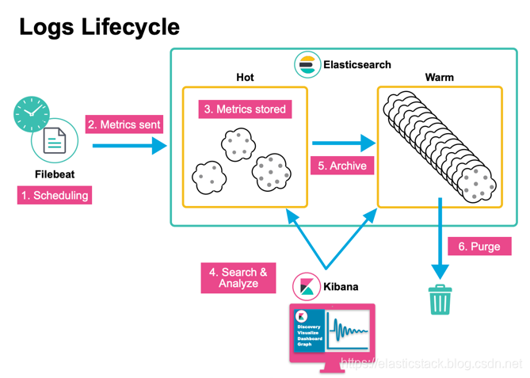

# ElasticSearch
## VS 关系型数据库

## es架构

## es倒排索引原理

## CRUD增删改查


## 索引简介
对于日志或指标（metric）类时序性强的ES索引，因为数据量大，并且写入和查询大多都是近期时间内的数据。

    我们可以采用hot-warm-cold架构将索引数据切分成hot/warm/cold的索引。hot索引负责最新数据的读写，可使用内存存储；
    warm索引负责较旧数据的读取，可使用内存或SSD存储；cold索引很少被读取，可使用大容量磁盘存储

### ES从6.7版本推出了索引生命周期管理（Index Lifecycle Management ，简称ILM)机制，能帮我们自动管理一个索引策略（Policy）下索引集群的生命周期。

索引生命周期由五个阶段（phases）组成：hot，warm，cold，frozen 及 delete。

* Hot：索引可写入，也可查询。你可能 rollover 一个 alias 从而每两个星期就生成一个新的索引，避免太大的索引数据。在这个阶段你可以做导入数据，并允许繁重的搜索
* Warm：索引不可写入，但可查询。你可能把索引变成 read-only，并把索引保留于这个阶段一个星期。在这个阶段，不可以导入数据，但是可以进行适度的搜索
* Cold：索引不可写入，但很少被查询，查询的慢点也可接受。你可能 freeze 索引，并减少 replica 的数量，并保留于这个阶段三个星期。在这个阶段，不可以导入数据，但是可以进行极其少量的搜索，
* Delete：索引可被安全的删除.你可以删除超过6个星期的索引数据以节省成本

ILM 由一些策略（policies）组成，而这些策略可以触发一些 actions。这些 actions 可以为

| 动作action | 描述 |
| ------ | ------ |
|rollover       | 创建一个新的索引，基于数据的时间跨度，大小及文档的多少       |     
|shrink       |减少 primary shards 的数目       |     
|force merge       |合并 shard 的 segments      |
|freeze       |针对鲜少使用的索引进行冻结以节省内存      |
|delete       |永久地删除一个索引      | 


#### 操作
建立 ILM policy
```json
// PUT _ilm/policy/logs_policy
{
  "policy": {
    "phases": {
      "hot": {
        "min_age": "0ms",
        "actions": {
          "rollover": {
            "max_size": "50gb",
            "max_age": "30d",
            "max_docs": 10000
          },
          "set_priority": {
            "priority": 100
          }
        }
      },
      "delete": {
        "min_age": "90d",
        "actions": {
          "delete": {}
        }
      }
    }
  }
}

```
这里定义的一个 policy 意思是：

- 如果一个 index 的大小超过 50GB，那么自动 rollover
- 如果一个 index 日期已在30天前创建索引后，那么自动 rollover
- 如果一个 index 的文档数超过10000，那么也会自动 rollover
- 当一个 index 创建的时间超过90天，那么也自动删除

设置 Index template
```json
//PUT _template/datastream_template
{
  "index_patterns": ["logs*"],                 
  "settings": {
    "number_of_shards": 1,
    "number_of_replicas": 1,
    "index.lifecycle.name": "logs_policy", 
    "index.routing.allocation.require.data": "hot",
    "index.lifecycle.rollover_alias": "logs"    
  }
}
```

这里的意思是所有以 logs 开头的 index 都需要遵循这个规律。这里定义了 rollover 的 alias 为 “logs”。这在我们下面来定义。
同时也需要注意的是 "index.routing.allocation.require.data": "hot"。这个定义了我们需要 indexing 的 node 的属性是 hot。
请看一下我们上面的 policy 里定义的有一个叫做 phases 里的，它定义的是 "hot"。在这里我们把所有的 logs* 索引都置于 hot 属性的 node 里。
在实际的使用中，hot 属性的 index 一般用作 indexing。我们其实还可以定义一些其它 phase，比如 warm，这样可以把我们的用作搜索的 index 置于 warm 的节点中。

定义 Index alias
```json
//PUT logs-000001
{
  "aliases": {
    "logs": {
      "is_write_index": true
    }
  }
}
```
在这里定义了一个叫做 logs 的 alias，它指向 logs-00001 索引。注意这里的 is_write_index 为 true。如果有 rollover 发生时，这个alias会自动指向最新 rollover 的 index。


