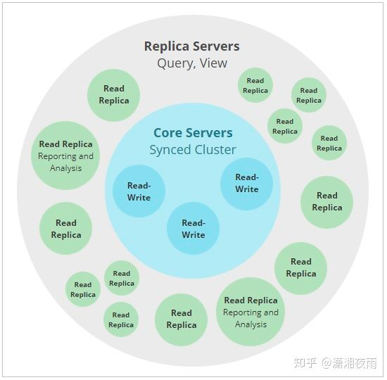

# graph database图数据库-neo4j
## 市场上的图数据
图数据库常规的有：neo4j（支持超多语言）、JanusGraph/Titan（分布式）、Orientdb，google也开源了图数据库Cayley（Go语言构成）、PostgreSQL存储RDF格式数据。

## 集群模式 
NEO4J提供了两种集群模式，一种是HA（主备模式），在neo4j 4.0之后就废弃了；另外一种是因果集群模式(causal cluster),它们的架构和特点如下。
### 因果集群


角色
#### Core Servers
核心服务器的主要责任是保护数据。 核心服务器通过使用Raft协议复制所有事务来做到这一点。 在确认向最终用户应用程序提交事务之前，Raft确保数据安全持久。 在实际环境中，这意味着一旦集群（N / 2 + 1）中的大多数核心服务器都接受了事务，安全性要求会影响写入延迟。 隐式写入将以最快的多数Core Servers被确认，但是随着群集中核心服务器数量的增加，确认一次写入所需的Core Servers的数量也会增加。实际上，这意味着典型的Core Server集群中需要一定数量的服务器，足以为特定部署提供足够的容错能力。 这是使用公式M = 2F +1计算的，其中M是容忍F故障所需的核心服务器数量。 例如：

* 为了容忍两个发生故障的核心服务器，我们需要部署五个核心的集群。
* 最小的容错群集（一个可以容忍一个故障的群集）必须具有三个内核。
* 也可以创建仅包含两个核心的因果集群。 但是，该群集不是容错的。 如果两个服务器之一发生故障，其余服务器将变为只读。
请注意，如果Core Server集群遭受足够的故障而无法处理写入，则它将变为只读状态以保持安全。

#### Read Replicas

只读副本的主要职责是扩展图数据负载能力（密码查询，过程等）。 只读副本的作用类似于Core Server保护的数据的缓存，但它们不是简单的键值缓存。 
实际上，只读副本是功能齐全的Neo4j数据库，能够完成任意（只读）图数据查询和过程。

只读副本是通过事务日志传送从Core Servers异步复制的。 只读副本将定期（通常在ms范围内）轮询核心服务器以查找自上次轮询以来已处理的任何新事务，并且核心服务器会将这些事务发送到只读副本。
可以从相对较少的Core Server中馈送许多只读副本数据，从而使查询工作量大为增加，从而扩大规模。

但是，与核心服务器不同，只读副本不参与有关群集拓扑的决策。 只读副本通常应以相对较大的数量运行，并视为一次性使用。 
丢失只读副本不会影响群集的可用性，除了丢失其图表查询吞吐量的一部分。 它不会影响群集的容错能力

## 测试:简单docker安装
```shell
docker run \
    --name testneo4j \
    -p7474:7474 -p7687:7687 \
    -d \
    -v $HOME/neo4j/data:/data \
    -v $HOME/neo4j/logs:/logs \
    -v $HOME/neo4j/import:/var/lib/neo4j/import \
    -v $HOME/neo4j/plugins:/plugins \
    --env NEO4J_AUTH=neo4j/chuanzhi \
    neo4j:latest
```