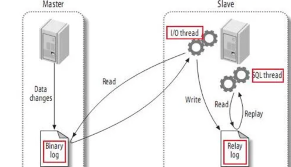

# mysql的binlog二进制日志((归档日志)

## MySQL的主从复制

1. master将改变记录到二进制日志(binary log)中（这些记录叫做二进制日志事件，binary log events，可以通过show binlog events进行查看）；
2. slave将master的binary log events拷贝到它的中继日志(relay log)；
3. slave重做中继日志中的事件，将改变反映它自己的数据

## 常用的Binlog操作命令
```shell
# 是否启用binlog日志
show variables like 'log_bin';

# 查看详细的日志配置信息
show global variables like '%log%';

# mysql数据存储目录
show variables like '%dir%';

# 查看binlog的目录
show global variables like "%log_bin%";

# 事件查询命令
# IN 'log_name' ：指定要查询的binlog文件名(不指定就是第一个binlog文件)
# FROM pos ：指定从哪个pos起始点开始查起(不指定就是从整个文件首个pos点开始算)
# LIMIT [offset,] ：偏移量(不指定就是0)
# row_count ：查询总条数(不指定就是所有行)
show binlog events [IN 'log_name'] [FROM pos] [LIMIT [offset,] row_count];


# 删除当前的binlog文件
reset master; 

# 删除slave的中继日志
reset slave;

# 删除指定日期前的日志索引中binlog日志文件
purge master logs before '2019-03-09 14:00:00';

# 删除指定日志文件
purge master logs to 'master.000003';
```
查看bin_log格式:   
 

获取binlog文件列表:   
   

查看当前正在写入的binlog文件:    
  

GTID即全局事务ID (global transaction identifier)

查看指定binlog文件的内容
- 只查看第一个binlog文件的内容
show binlog events;

- 查看具体一个binlog文件的内容 （in 后面为binlog的文件名）
show binlog events in 'binlog.000003';   


查看master上的binlog   
   

查看log过期时间
    
设置binlog文件保存事件，过期删除，单位天
set global expire_logs_days=3;

## Binlog 文件以及扩展
binlog日志包括两类文件:
- 二进制日志索引文件（文件名后缀为.index）用于记录所有有效的的二进制文件
- 二进制日志文件（文件名后缀为.00000*）记录数据库所有的DDL和DML语句事件

binlog是一个二进制文件集合，每个binlog文件以一个4字节的魔数开头，接着是一组Events:
- 魔数：0xfe62696e对应的是0xfebin；
- Event：每个Event包含header和data两个部分；header提供了Event的创建时间，哪个服务器等信息，data部分提供的是针对该Event的具体信息，如具体数据的修改；
- 第一个Event用于描述binlog文件的格式版本，这个格式就是event写入binlog文件的格式；
- 其余的Event按照第一个Event的格式版本写入；
- 最后一个Event用于说明下一个binlog文件；
- binlog的索引文件是一个文本文件，其中内容为当前的binlog文件列表

当遇到以下3种情况时，MySQL会重新生成一个新的日志文件，文件序号递增：

- MySQL服务器停止或重启时
- 使用 flush logs 命令；
- 当 binlog 文件大小超过 max_binlog_size 变量的值时

Note:

    max_binlog_size 的最小值是4096字节，最大值和默认值是 1GB (1073741824字节)。
    事务被写入到binlog的一个块中，所以它不会在几个二进制日志之间被拆分。
    因此，如果你有很大的事务，为了保证事务的完整性，不可能做切换日志的动作，只能将该事务的日志都记录到当前日志文件中，直到事务结束，
    你可能会看到binlog文件大于 max_binlog_size 的情况。

## Binlog 的日志格式
记录在二进制日志中的事件的格式取决于二进制记录格式。支持三种格式类型：

- STATEMENT：基于SQL语句的复制（statement-based replication, SBR）
- ROW：基于行的复制（row-based replication, RBR）
- MIXED：混合模式复制（mixed-based replication, MBR

在 MySQL 5.7.7 之前，默认的格式是 STATEMENT，在 MySQL 5.7.7 及更高版本中，默认值是 ROW。
日志格式通过 binlog-format 指定，如 binlog-format=STATEMENT、binlog-format=ROW、binlog-format=MIXED

### 1. statement
每一条会修改数据的sql都会记录在binlog中。

优点：不需要记录每一行的变化，减少了binlog日志量，节约了IO，提高性能。

缺点：由于记录的只是执行语句，为了这些语句能在slave上正确运行，因此还必须记录每条语句在执行的时候的一些相关信息，以保证所有语句能在slave得到和在master端执行时候相同 的结果。
另外mysql 的复制,像一些特定函数功能，slave可与master上要保持一致会有很多相关问题。

ps：相比row能节约多少性能与日志量，这个取决于应用的SQL情况，正常同一条记录修改或者插入row格式所产生的日志量还小于Statement产生的日志量，
但是考虑到如果带条件的update操作，以及整表删除，alter表等操作，ROW格式会产生大量日志，因此在考虑是否使用ROW格式日志时应该跟据应用的实际情况，其所产生的日志量会增加多少，以及带来的IO性能问题。

### 2. row

5.1.5版本的MySQL才开始支持row level的复制,它不记录sql语句上下文相关信息，仅保存哪条记录被修改。

优点： binlog中可以不记录执行的sql语句的上下文相关的信息，仅需要记录那一条记录被修改成什么了。
所以rowlevel的日志内容会非常清楚的记录下每一行数据修改的细节。而且不会出现某些特定情况下的存储过程，或function，以及trigger的调用和触发无法被正确复制的问题.

缺点:所有的执行的语句当记录到日志中的时候，都将以每行记录的修改来记录，这样可能会产生大量的日志内容。

ps:新版本的MySQL中对row level模式也被做了优化，并不是所有的修改都会以row level来记录，像遇到表结构变更的时候就会以statement模式来记录，如果sql语句确实就是update或者delete等修改数据的语句，那么还是会记录所有行的变更

### 3. mixed
从5.1.8版本开始，MySQL提供了Mixed格式，实际上就是Statement与Row的结合。

在Mixed模式下，一般的语句修改使用statment格式保存binlog，如一些函数，statement无法完成主从复制的操作，则采用row格式保存binlog，MySQL会根据执行的每一条具体的sql语句来区分对待记录的日志形式，也就是在Statement和Row之间选择一种


