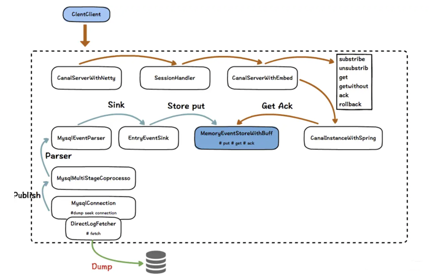
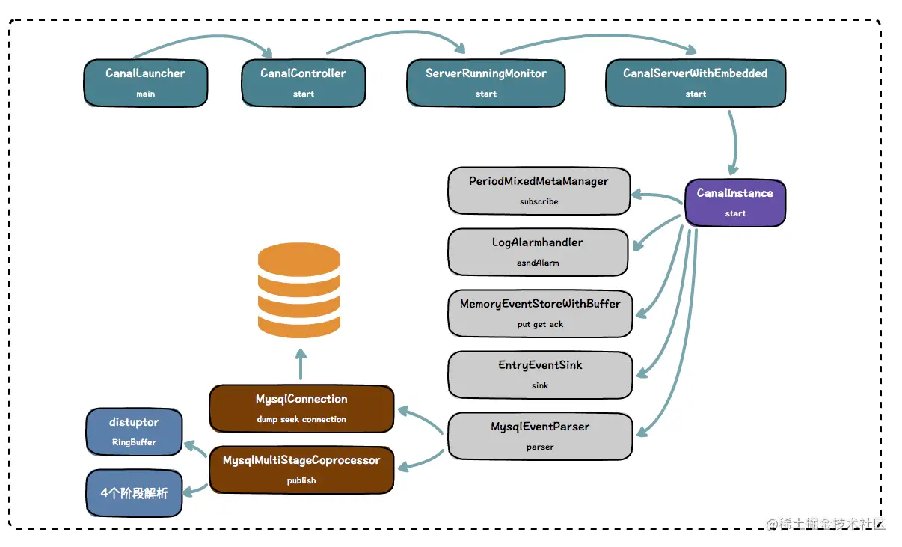
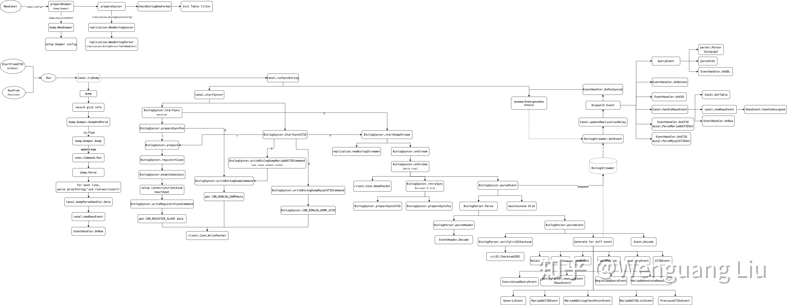

# Canal
canal [kə'næl]，译意为水道/管道/沟渠，主要用途是基于 MySQL 数据库增量日志解析，提供增量数据 订阅 和 消费。
应该是阿里云DTS（Data Transfer Service）的开源版本。

阿里巴巴mysql数据库binlog的增量订阅&消费组件

## 能力
Canal与DTS提供的功能基本相似：
1. 基于Mysql的Slave协议实时dump binlog流，解析为事件发送给订阅方。
2. 单Canal instance，单DTS数据订阅通道均只支持订阅一个RDS，提供给一个消费者。
3. 可以使用canal-client客户端进行消息消费。
4. 也可以通过简单配置，也可以不需要自行使用canal-client消费，可以选择直接投递到kafka或者RocketMQ集群，用户只需要使用消息队列的consumer消费即可。
5. 成功消费消息后需要进行Ack，以确保一致性，服务端则会维护客户端目前的消费位点。

## 原理

1. canal模拟 MySQL slave 的交互协议，伪装自己为 MySQL slave ，向 MySQL master 发送 dump 协议；
2. MySQL master 收到 dump 请求，开始推送 binary log 给 slave (即 canal )；
3. canal 解析 binary log 对象(原始为 byte 流)

## Canal架构

###  admin版本整体架构

canal 1.1.4开始支持admin管理，通过canal-admin为canal提供整体配置管理、节点运维等面向运维的功能，提供相对友好的WebUI操作界面，
方便更多用户快速和安全的操作，替代了过去繁琐的配置文件管理。

- 多个canal-server可以组成集群模式，每个instance任务通过zookeeper在集群中实现高可用
- 通过多个集群，可以实现同步资源的物理隔离
- 可以直接抓取消费投递MQ，可以实现生产/消费解耦、消息堆积、消息回溯
- 可以抓取消费投递给canal-client，在用户的服务中进行消息处理，减少中间过程

### canal-server架构

- server代表一个canal-server运行实例，对应于一个jvm
- instance对应于一个数据队列，是真正的变更抓取的实体 （1个server可以对应多个instance)

Instance模块
- EventParser解析 ：数据源接入，模拟slave协议和master进行交互，协议解析
- EventSink过滤 ：Parser和Store链接器，进行数据过滤，加工，分发的工作
- EventStore存储 ：数据存储
- MetaManager元数据管理：增量订阅&消费信息管理器
- Alarm 报警


#### 1. EventParser子模块
主要有两个核心组件组成：

- CanalLogPositionManager：用来记录最新解析成功的binlog position信息，在canal重启后，作为起始位点
- CanalHAController：支持Mysql主备，基于Heartbeat判断当前数据库连接的有效性，一旦主库失去心跳，就切换连接备库

EventParser从CanalHAController确定连接mysql的位置，然后通过LogPositionManager确定binlog解析位点的起点，最后便通过dump协议拉取binlog进行解析,把解析后的消息存入EventSink

#### 2. EventSink子模块
目前只提供了一个带有实际作用的实现：GroupEventSink.

GroupEventSink用于将多个instance上的数据进行归并，常用于分库后的多数据源归并

#### 3. EventStore子模块
目前只实现了基于内存存储的MemoryEventStoreWithBuffer.

MemoryEventStoreWIthBuffer内部采用的是一个RingBuffer，我们可以理解为基于内存的高性能消息队列。如果使用canal-client直接消费canal-server的数据，那么只能通过这个消息队列做一定程度的消息堆积。

- Put : Sink模块进行数据存储的最后一次写入位置
- Get : 数据订阅获取的最后一次提取位置
- Ack : 数据消费成功的最后一次消费位置

这些位点信息通过MetaManager进行管理。这也解释了为什么一个canal instance只能支撑一个消费者：EventStore的RingBuffer只为一个消费者维护信息。

## Canal 启动流程
canal 代码量目前有 6 万多行，去除 2 个 ProtocolBuffer 生成类大概 1.7 万行，也还有 4.3 万行，代码还是不少的。


## Canal 数据流向



## 客户端使用
Canal和DTS客户端 
```css
拉取事件 -> 消费 -> 消费成功后ACK
```
这样的消费模式，并支持消费不成功时进行rollback，重新消费该数据。

## 优点
1）性能优异、功能全面
- canal 1.1.x 版本（release_note）,性能与功能层面有较大的突破,重要提升包括:
- 整体性能测试&优化,提升了150%. #726
- 原生支持prometheus监控 #765
- 原生支持kafka消息投递 #695
- 原生支持aliyun rds的binlog订阅 (解决自动主备切换/oss binlog离线解析) （无法拒绝它的理由！）
- 原生支持docker镜像 #801

2）运维方便
- canal 1.1.4版本，迎来最重要的WebUI能力，引入canal-admin工程，支持面向WebUI的canal动态管理能力，支持配置、任务、日志等在线白屏运维能力
- Standalone的一体化解决方案，无外部服务依赖，运维更简单，在某种程度上也意味着更稳定。
- 开箱即用，节约开发与定制成本。
- 有良好的管理控制平台与监控系统（如果你已经有promethus监控，可以秒接canal监控）

3）多语言支持
- canal 特别设计了 client-server 模式，交互协议使用 protobuf 3.0 , client 端可采用不同语言实现不同的消费逻辑
- canal 作为 MySQL binlog 增量获取和解析工具，可将变更记录投递到 MQ 系统中，比如 Kafka/RocketMQ，可以借助于 MQ 的多语言能力

## 缺点
- 单instance/订阅通道只支持订阅单个数据库，并只能支持单客户端消费。每当我们需要新增一个消费端->MySQL的订阅：对于Canal而言，就要给MySQL接一个“Slave”，可能会对主库有一定影响。
- 消息的Schema很弱，所有消息的Schema均相同，客户端需要提前知道各个表消息的Schema与各字段的上下文才能正确消费


## go-mysql@v1.3.0/canal源码分析


实际处理的handler

```go
// /Users/xiaxin/go/pkg/mod/github.com/go-mysql-org/go-mysql@v1.3.0/canal/handler.go
package canal

import (
	"github.com/go-mysql-org/go-mysql/mysql"
	"github.com/go-mysql-org/go-mysql/replication"
)

type EventHandler interface {
	// 当产生新的binlog日志后触发(在达到内存的使用限制后（默认为 1GB），会开启另一个文件，每个新文件的名称后都会有一个增量。
	OnRotate(roateEvent *replication.RotateEvent) error


	// 创建、更改、重命名或删除表时触发，通常会需要清除与表相关的数据，如缓存。在ddl前触发
	OnTableChanged(schema string, table string) error
	// (删除当前表再新建一个一模一样的表结构)
	OnDDL(nextPos mysql.Position, queryEvent *replication.QueryEvent) error
	
	// 监听数据记录

	OnRow(e *RowsEvent) error
	OnXID(nextPos mysql.Position) error
	OnGTID(gtid mysql.GTIDSet) error
	
	// OnPosSynced Use your own way to sync position. When force is true, sync position immediately.
	// //监听binlog日志的变化文件与记录的位置
	OnPosSynced(pos mysql.Position, set mysql.GTIDSet, force bool) error
	
	String() string
}

// DummyEventHandler 默认实现
type DummyEventHandler struct {
}

func (h *DummyEventHandler) OnRotate(*replication.RotateEvent) error          { return nil }
func (h *DummyEventHandler) OnTableChanged(schema string, table string) error { return nil }
func (h *DummyEventHandler) OnDDL(nextPos mysql.Position, queryEvent *replication.QueryEvent) error {
	return nil
}

// 实际处理行数据，官方推荐用这个 
// 原因：You must use ROW format for binlog, full binlog row image is preferred, because we may meet some errors when primary key changed in update for minimal or noblob row image
func (h *DummyEventHandler) OnRow(*RowsEvent) error     { return nil }
func (h *DummyEventHandler) OnXID(mysql.Position) error { return nil }
func (h *DummyEventHandler) OnGTID(mysql.GTIDSet) error { return nil }

// 更新position
func (h *DummyEventHandler) OnPosSynced(mysql.Position, mysql.GTIDSet, bool) error { return nil }

func (h *DummyEventHandler) String() string { return "DummyEventHandler" }

// `SetEventHandler` registers the sync handler, you must register your
// own handler before starting Canal.
func (c *Canal) SetEventHandler(h EventHandler) {
	c.eventHandler = h
}

```


### 流程分析

初始化canal结构体
```go
func NewCanal(cfg *Config) (*Canal, error) {
	c := new(Canal)
	c.cfg = cfg

	c.ctx, c.cancel = context.WithCancel(context.Background())

	c.dumpDoneCh = make(chan struct{})
	// 使用默认事件处理器，不处理
	c.eventHandler = &DummyEventHandler{}
	c.parser = parser.New()
	c.tables = make(map[string]*schema.Table)
	if c.cfg.DiscardNoMetaRowEvent {
		c.errorTablesGetTime = make(map[string]time.Time)
	}
	c.master = &masterInfo{}

	c.delay = new(uint32)

	var err error

	// 全量数据dumper
	if err = c.prepareDumper(); err != nil {
		return nil, errors.Trace(err)
	}

	// 增量数据binlogSyncer
	if err = c.prepareSyncer(); err != nil {
		return nil, errors.Trace(err)
	}

	// 检查binlog格式，必须row格式
	if err := c.checkBinlogRowFormat(); err != nil {
		return nil, errors.Trace(err)
	}

	// init 表过滤器
	if n := len(c.cfg.IncludeTableRegex); n > 0 {
		c.includeTableRegex = make([]*regexp.Regexp, n)
		for i, val := range c.cfg.IncludeTableRegex {
			reg, err := regexp.Compile(val)
			if err != nil {
				return nil, errors.Trace(err)
			}
			c.includeTableRegex[i] = reg
		}
	}

	if n := len(c.cfg.ExcludeTableRegex); n > 0 {
		c.excludeTableRegex = make([]*regexp.Regexp, n)
		for i, val := range c.cfg.ExcludeTableRegex {
			reg, err := regexp.Compile(val)
			if err != nil {
				return nil, errors.Trace(err)
			}
			c.excludeTableRegex[i] = reg
		}
	}

	if c.includeTableRegex != nil || c.excludeTableRegex != nil {
		c.tableMatchCache = make(map[string]bool)
	}

	return c, nil
}
```


开始调用
```go
// /Users/xiaxin/go/pkg/mod/github.com/go-mysql-org/go-mysql@v1.3.0/canal/canal.go

// RunFrom will sync from the binlog position directly, ignore mysqldump.
func (c *Canal) RunFrom(pos mysql.Position) error {
	c.master.Update(pos)

	return c.Run()
}
```
Note：RunFrom 会更改master的position
```go
// /Users/xiaxin/go/pkg/mod/github.com/go-mysql-org/go-mysql@v1.3.0/canal/master.go
func (m *masterInfo) Update(pos mysql.Position) {
	log.Debugf("update master position %s", pos)

	m.Lock()
	m.pos = pos
	m.Unlock()
}
```

```go
func (c *Canal) Run() error {
    return c.run()
}
func (c *Canal) run() error {
    // ...
    
	
    if !c.dumped {
        c.dumped = true
        // 开始dump数据
        err := c.tryDump()
        close(c.dumpDoneCh)
        
    if err != nil {
        log.Errorf("canal dump mysql err: %v", err)
        return errors.Trace(err)
        }
    }
    
    // 开始监听增量数据
    if err := c.runSyncBinlog(); err != nil {
        if errors.Cause(err) != context.Canceled {
            log.Errorf("canal start sync binlog err: %v", err)
            return errors.Trace(err)
        }
    }
}
```

1. 一次数据
```go

// Dump all data from MySQL master `mysqldump`, ignore sync binlog.
func (c *Canal) Dump() error {
	if c.dumped {
		return errors.New("the method Dump can't be called twice")
	}
	c.dumped = true
	defer close(c.dumpDoneCh)
	return c.dump()
}

// /Users/xiaxin/go/pkg/mod/github.com/go-mysql-org/go-mysql@v1.3.0/canal/dump.go
func (c *Canal) dump() error {
	//...
	// 解析binlog
	if err := c.dumper.DumpAndParse(h); err != nil {}
	// ...
	// 更新position
	if err := c.eventHandler.OnPosSynced(pos, c.master.GTIDSet(), true); err != nil {
        return errors.Trace(err)
    }
    //...
}
```

dumper需要处理的逻辑
```go
// DumpAndParse: Dump MySQL and parse immediately
func (d *Dumper) DumpAndParse(h ParseHandler) error {
	r, w := io.Pipe()

	done := make(chan error, 1)
	go func() {
		// 实际解析
		err := Parse(r, h, !d.masterDataSkipped)
		_ = r.CloseWithError(err)
		done <- err
	}()

	err := d.Dump(w)
	_ = w.CloseWithError(err)

	err = <-done

	return errors.Trace(err)
}
```
```go
///Users/xiaxin/go/pkg/mod/github.com/go-mysql-org/go-mysql@v1.3.0/dump/parser.go
func Parse(r io.Reader, h ParseHandler, parseBinlogPos bool) error {
	rb := bufio.NewReaderSize(r, 1024*16)

	var db string
	var binlogParsed bool

	for {
        // ...

		if m := valuesExp.FindAllStringSubmatch(line, -1); len(m) == 1 {
			table := m[0][1]

			values, err := parseValues(m[0][2])
			if err != nil {
				return errors.Errorf("parse values %v err", line)
			}

			// 数据处理
			if err = h.Data(db, table, values); err != nil && err != ErrSkip {
				return errors.Trace(err)
			}
		}
	}

	return nil
}
```
2.增量数据
```go
func (c *Canal) runSyncBinlog() error {
	s, err := c.startSyncer()
	if err != nil {
		return err
	}

	savePos := false
	force := false

	// The name of the binlog file received in the fake rotate event.
	// It must be preserved until the new position is saved.
	fakeRotateLogName := ""

	for {
		ev, err := s.GetEvent(c.ctx)
		if err != nil {
			return errors.Trace(err)
		}
        // ...
        
		switch e := ev.Event.(type) {
		case *replication.RotateEvent:
			pos.Name = string(e.NextLogName)
			pos.Pos = uint32(e.Position)
			log.Infof("rotate binlog to %s", pos)
			savePos = true
			force = true
			if err = c.eventHandler.OnRotate(e); err != nil {
				return errors.Trace(err)
			}
		case *replication.RowsEvent:
			// we only focus row based event
			// 我们主要关注行数据变化
			err = c.handleRowsEvent(ev)
			if err != nil {
				e := errors.Cause(err)
				// if error is not ErrExcludedTable or ErrTableNotExist or ErrMissingTableMeta, stop canal
				if e != ErrExcludedTable &&
					e != schema.ErrTableNotExist &&
					e != schema.ErrMissingTableMeta {
					log.Errorf("handle rows event at (%s, %d) error %v", pos.Name, curPos, err)
					return errors.Trace(err)
				}
			}
			continue
			// ...
	}

	return nil
}

func (c *Canal) handleRowsEvent(e *replication.BinlogEvent) error {
	ev := e.Event.(*replication.RowsEvent)

	// Caveat: table may be altered at runtime.
	schema := string(ev.Table.Schema)
	table := string(ev.Table.Table)

	// 根据之前定义的表过滤器进行过滤
	t, err := c.GetTable(schema, table)
	if err != nil {
		return err
	}
	var action string
	switch e.Header.EventType {
	case replication.WRITE_ROWS_EVENTv1, replication.WRITE_ROWS_EVENTv2:
		action = InsertAction
	case replication.DELETE_ROWS_EVENTv1, replication.DELETE_ROWS_EVENTv2:
		action = DeleteAction
	case replication.UPDATE_ROWS_EVENTv1, replication.UPDATE_ROWS_EVENTv2:
		action = UpdateAction
	default:
		return errors.Errorf("%s not supported now", e.Header.EventType)
	}
	events := newRowsEvent(t, action, ev.Rows, e.Header)
	return c.eventHandler.OnRow(events)
}
```


binlog处理:/Users/xiaxin/go/pkg/mod/github.com/go-mysql-org/go-mysql@v1.3.0/canal/dump.go
```go

func (h *dumpParseHandler) Data(db string, table string, values []string) error {
	if err := h.c.ctx.Err(); err != nil {
		return err
	}

	tableInfo, err := h.c.GetTable(db, table)
	if err != nil {
		e := errors.Cause(err)
		if e == ErrExcludedTable ||
			e == schema.ErrTableNotExist ||
			e == schema.ErrMissingTableMeta {
			return nil
		}
		log.Errorf("get %s.%s information err: %v", db, table, err)
		return errors.Trace(err)
	}
    // ...

	events := newRowsEvent(tableInfo, InsertAction, [][]interface{}{vs}, nil)
	// 写完调用自定义的事件OnRow方法
	return h.c.eventHandler.OnRow(events)
}
```

处理后的event结构体


