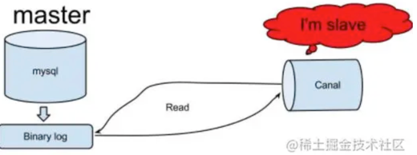
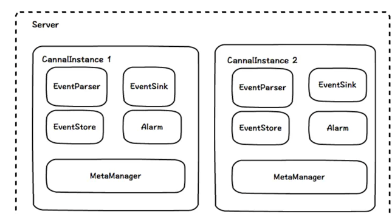

# Canal
canal [kə'næl]，译意为水道/管道/沟渠，主要用途是基于 MySQL 数据库增量日志解析，提供增量数据 订阅 和 消费。
应该是阿里云DTS（Data Transfer Service）的开源版本。

阿里巴巴mysql数据库binlog的增量订阅&消费组件

## 能力
Canal与DTS提供的功能基本相似：
1. 基于Mysql的Slave协议实时dump binlog流，解析为事件发送给订阅方。
2. 单Canal instance，单DTS数据订阅通道均只支持订阅一个RDS，提供给一个消费者。
3. 可以使用canal-client客户端进行消息消费。
4. 也可以通过简单配置，也可以不需要自行使用canal-client消费，可以选择直接投递到kafka或者RocketMQ集群，用户只需要使用消息队列的consumer消费即可。
5. 成功消费消息后需要进行Ack，以确保一致性，服务端则会维护客户端目前的消费位点。

## 原理

1. canal模拟 MySQL slave 的交互协议，伪装自己为 MySQL slave ，向 MySQL master 发送 dump 协议；
2. MySQL master 收到 dump 请求，开始推送 binary log 给 slave (即 canal )；
3. canal 解析 binary log 对象(原始为 byte 流)

## Canal架构

###  admin版本整体架构

canal 1.1.4开始支持admin管理，通过canal-admin为canal提供整体配置管理、节点运维等面向运维的功能，提供相对友好的WebUI操作界面，
方便更多用户快速和安全的操作，替代了过去繁琐的配置文件管理。

- 多个canal-server可以组成集群模式，每个instance任务通过zookeeper在集群中实现高可用
- 通过多个集群，可以实现同步资源的物理隔离
- 可以直接抓取消费投递MQ，可以实现生产/消费解耦、消息堆积、消息回溯
- 可以抓取消费投递给canal-client，在用户的服务中进行消息处理，减少中间过程

### canal-server架构

- server代表一个canal-server运行实例，对应于一个jvm
- instance对应于一个数据队列，是真正的变更抓取的实体 （1个server可以对应多个instance)

Instance模块
- EventParser解析 ：数据源接入，模拟slave协议和master进行交互，协议解析
- EventSink过滤 ：Parser和Store链接器，进行数据过滤，加工，分发的工作
- EventStore存储 ：数据存储
- MetaManager元数据管理：增量订阅&消费信息管理器
- Alarm 报警


#### 1. EventParser子模块
主要有两个核心组件组成：

- CanalLogPositionManager：用来记录最新解析成功的binlog position信息，在canal重启后，作为起始位点
- CanalHAController：支持Mysql主备，基于Heartbeat判断当前数据库连接的有效性，一旦主库失去心跳，就切换连接备库

EventParser从CanalHAController确定连接mysql的位置，然后通过LogPositionManager确定binlog解析位点的起点，最后便通过dump协议拉取binlog进行解析,把解析后的消息存入EventSink

#### 2. EventSink子模块
目前只提供了一个带有实际作用的实现：GroupEventSink.

GroupEventSink用于将多个instance上的数据进行归并，常用于分库后的多数据源归并

#### 3. EventStore子模块
目前只实现了基于内存存储的MemoryEventStoreWithBuffer.

MemoryEventStoreWIthBuffer内部采用的是一个RingBuffer，我们可以理解为基于内存的高性能消息队列。如果使用canal-client直接消费canal-server的数据，那么只能通过这个消息队列做一定程度的消息堆积。

- Put : Sink模块进行数据存储的最后一次写入位置
- Get : 数据订阅获取的最后一次提取位置
- Ack : 数据消费成功的最后一次消费位置

这些位点信息通过MetaManager进行管理。这也解释了为什么一个canal instance只能支撑一个消费者：EventStore的RingBuffer只为一个消费者维护信息。

## Canal 启动流程
canal 代码量目前有 6 万多行，去除 2 个 ProtocolBuffer 生成类大概 1.7 万行，也还有 4.3 万行，代码还是不少的。


## Canal 数据流向


## 客户端使用
Canal和DTS客户端 
```css
拉取事件 -> 消费 -> 消费成功后ACK
```
这样的消费模式，并支持消费不成功时进行rollback，重新消费该数据。

## 优点
1）性能优异、功能全面
- canal 1.1.x 版本（release_note）,性能与功能层面有较大的突破,重要提升包括:
- 整体性能测试&优化,提升了150%. #726
- 原生支持prometheus监控 #765
- 原生支持kafka消息投递 #695
- 原生支持aliyun rds的binlog订阅 (解决自动主备切换/oss binlog离线解析) （无法拒绝它的理由！）
- 原生支持docker镜像 #801

2）运维方便
- canal 1.1.4版本，迎来最重要的WebUI能力，引入canal-admin工程，支持面向WebUI的canal动态管理能力，支持配置、任务、日志等在线白屏运维能力
- Standalone的一体化解决方案，无外部服务依赖，运维更简单，在某种程度上也意味着更稳定。
- 开箱即用，节约开发与定制成本。
- 有良好的管理控制平台与监控系统（如果你已经有promethus监控，可以秒接canal监控）

3）多语言支持
- canal 特别设计了 client-server 模式，交互协议使用 protobuf 3.0 , client 端可采用不同语言实现不同的消费逻辑
- canal 作为 MySQL binlog 增量获取和解析工具，可将变更记录投递到 MQ 系统中，比如 Kafka/RocketMQ，可以借助于 MQ 的多语言能力

## 缺点
- 单instance/订阅通道只支持订阅单个数据库，并只能支持单客户端消费。每当我们需要新增一个消费端->MySQL的订阅：对于Canal而言，就要给MySQL接一个“Slave”，可能会对主库有一定影响。
- 消息的Schema很弱，所有消息的Schema均相同，客户端需要提前知道各个表消息的Schema与各字段的上下文才能正确消费


