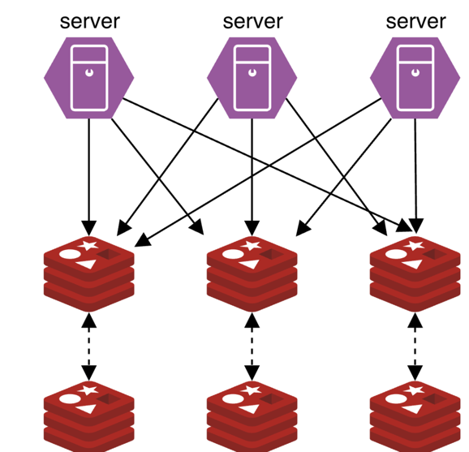

# 分布式锁

## 应用场景
- 很多应用场景是需要系统保证幂等性的（如api服务或消息消费者），并发情况下或消息重复很容易造成系统重入，那么分布式锁是保障幂等的一个重要手段。

- 另一方面，很多抢单场景或者叫交易撮合场景，如dd司机抢单或唯一商品抢拍等都需要用一把“全局锁”来解决并发造成的问题。在防止并发情况下造成库存超卖的场景，也常用分布式锁来解决。


## 实现分布式锁方案

这里介绍常见两种：redis锁、zookeeper锁
## redis实现
### 单点场景
#### 加锁
各节点通过set key value nx ex即可，如果set执行成功，则表明加锁成功，否则失败，其中value为随机串，用来判断是否是当前应用实例加的锁；nx用来判断该key是否存在以实现排他特性，ex用来指定锁的过期时间，避免死锁。


#### 解锁
向redis服务发送并执行一段lua脚本，脚本如下，也很好理解，如果是自己加的锁，那么安全释放，否则什么也不做。
```lua
if redis.call("get",KEYS[1]) == ARGV[1] then
    return redis.call("del",KEYS[1])
else
    return 0
end
```
如果redis采用了主备的部署方式，存在一种场景，master上set成功后宕机，而set的key没有来得及同步到slave的话，会存在不一致的场景，可以通过redis持久化和fsync=always的方式来保持一致，但是有性能损耗。

### 集群场景


设集群有N个redis节点，那么，redlock算法约定，任意应用实例在半数以上（N/2 + 1）的redis节点上执行set成功，就认为当前应用实例成功持有锁.

这里面有几个问题需要考虑：网络延迟、超时处理、节点宕机、新增节点
- 网络延迟
  由于set时指定了ex参数，官方称为TTL，所以锁本身就是有生命周期的。而应用实例又需要与多个redis实例通信，网络io的耗时不能无视，官方给出的建议值是，如果ex参数设置为10s，那么请求单个实例的超时时间应在5-50ms以内，换算下来，就是5‰ - 0.5‰

- 超时处理
  由于TTL中包含了网络传输耗时、各及节点的耗时差异，所以加锁成功后，应用实例有效的持有锁时长 = TTL - （最晚执行set成功的response时间 - 最早执行set成功的response时间） - Clock drift，讲真，这里clock drift我没理解，网上讲这是时钟频率的差异？或者可能是部署在不同时区时，服务之间的时区差值。

  
- 节点宕机
当一个应用实例持有锁时，如果一个持有key的redis实例宕机了，且没有配置主备同步策略，那么锁状态依然可能会出现不一致情形。官方有两个解决方案：一个是像单redis实例一样，对每个实例配置主备同步持久化，并采用fsync=always策略进行主从同步，这会带来性能损耗。另一个不依赖持久化策略，令宕机redis实例延迟启动，延迟启动的作用，就是使宕机节点已经持有的key超时掉，迫使这个节点变为一个未持有key的节点，但这引入一个风险，就是当大多数redis节点同时宕机时，会使分布式锁不可用。

- 新增节点
官方文档没有提及，但是这里有坑，我的理解是，用于实现分布式锁的redis集群，需要显式的配置节点地址，如果采用动态的redis服务发现策略，那么追加节点可能会导致锁状态的不一致。

### redsync(redis官方推荐的go版本分布式锁实现) 源码分析

结构体
```go
// A Mutex is a distributed mutual exclusion lock.
type Mutex struct {
	name         string                 // 锁在redis上的key
	expiry       time.Duration          // 超时时间
	tries        int                    // 重试次数
	delayFunc    DelayFunc              // 延时函数，用于在每两次重试之间的休眠期，避免大量请求拥塞
	factor       float64                // 时钟偏移因子
	quorum       int                    // 成功获取锁需要set成功的最少redis节点数，N/2+1
	genValueFunc func() (string, error) // 用于生成随机value的方法
	value        string                 // 锁在热地上的value值
	until        time.Time              // 持有锁的deadline时间
	pools        []redis.Pool           // redis连接池
}

```
方法
```go
func (m *Mutex) Lock() error 										// 
func (m *Mutex) Unlock() (bool, error)
func (m *Mutex) LockContext(ctx context.Context) error
func (m *Mutex) UnlockContext(ctx context.Context) (bool, error)
func (m *Mutex) Extend() (bool, error)
func (m *Mutex) ExtendContext(ctx context.Context) (bool, error)
func (m *Mutex) Valid() (bool, error)
func (m *Mutex) ValidContext(ctx context.Context) (bool, error)

```
带有context的可以通过应用层控制获取或释放锁的过程。Extend簇函数用来重置key的超时时间，Valid用来验证当前节点是否持有锁。

#### 与redis通信
redsync与redis集群通信时，采用了并发访问方式，并发过程在actOnPoolsAsync函数中，其参数传入的是与单个节点通信的实现函数地址
```go
func (m *Mutex) actOnPoolsAsync(actFn func(redis.Pool) (bool, error)) (int, error) {
	type result struct {
		Status bool
		Err    error
	}

	// 创建用于收集所有redis节点返回值的chan
	ch := make(chan result)
	for _, pool := range m.pools {
		// 并发请求所有redis节点，结果写入chan
		go func(pool redis.Pool) {
			r := result{}
			r.Status, r.Err = actFn(pool)
			ch <- r
		}(pool)
	}
	// 校验所有redis节点的返回值，并返回成功节点数量
	n := 0
	var err error
	// 特殊语法糖-省略
	for range m.pools {
		r := <-ch
		if r.Status {
			n++
		} else if r.Err != nil {
			err = multierror.Append(err, r.Err)
		}
	}
	return n, err
}


```

#### 获取锁
```go
func (m *Mutex) LockContext(ctx context.Context) error {
	// 生成随机value
	value, err := m.genValueFunc()
	if err != nil {
		return err
	}

	// 循环重试
	for i := 0; i < m.tries; i++ {
		if i != 0 {
			time.Sleep(m.delayFunc(i))
		}

		start := time.Now()

		// 并发在所有redis节点上获取锁
		n, err := m.actOnPoolsAsync(func(pool redis.Pool) (bool, error) {
			return m.acquire(ctx, pool, value)
		})
		if n == 0 && err != nil {
			return err
		}

		now := time.Now()
		until := now.Add(m.expiry - now.Sub(start) - time.Duration(int64(float64(m.expiry)*m.factor)))
		// 如果成功在半数以上节点set成功，并且在锁的有效时间内，则说明加锁成功
		if n >= m.quorum && now.Before(until) {
			m.value = value
			m.until = until
			return nil
		}

		// 加锁失败，清除所有set成功的节点上的key
		_, _ = m.actOnPoolsAsync(func(pool redis.Pool) (bool, error) {
			return m.release(ctx, pool, value)
		})
	}

	return ErrFailed
}

```

#### 释放锁

```go
func (m *Mutex) UnlockContext(ctx context.Context) (bool, error) {
	// 并发执行delete lua脚本
	n, err := m.actOnPoolsAsync(func(pool redis.Pool) (bool, error) {
		return m.release(ctx, pool, m.value)
	})
	// 执行成功的节点数小于约定的加锁成功节点数，则说明有节点删除失败了，那么释放锁就会失败
	if n < m.quorum {
		return false, err
	}
	return true, nil
}

```

需要注意的是，在分布式锁场景中，无论获取还是释放锁，与操作系统的锁相比，执行失败会是常态，所以一定要检查Lock、Unlock的返回值。

#### multierror库
在actOnPoolsAsync方法中，在处理所有redis节点的返回时，引用了multierror库，这个库自定义了Error结构，用于保存多个error，当你的处理过程中在多个位置可能会返回不同error信息，但是返回值又只有一个error时，可以通过multierror.Append方法将这些error合成一个返回。内部创建了一个[]error来保存这些error，保留了层层弹栈返回时，各层的错误信息。代码很少但却很实用
