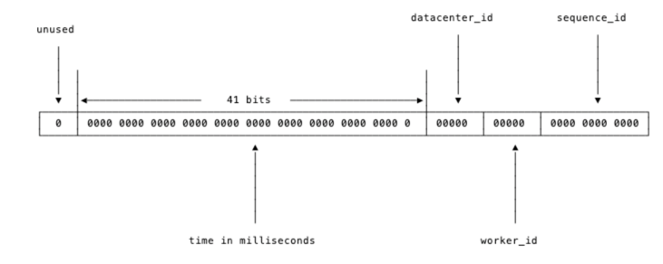

# 分布式Id
雪花算法一般用在分布式 ID，但是单机也可以使用，早使用可方便拓展业务
## 一般分布式 ID 的特点：

全局唯一性
不能出现有重复的ID标识，这是基本要求。

2. 递增性

确保生成ID对于用户或业务是递增的。

3. 高可用性

确保任何时候都能生成正确的ID。

4. 高性能性

在高并发的环境下依然表现良好。

## twitter的snowflake算法

首先确定我们的数值是64位，int64类型，被划分为四部分，不含开头的第一个bit，因为这个bit是符号位。

1. 雪花算法生成的 ID 是 64 位，是 twitter 开源的。
2. 时间戳（timestamp）：41 位。单位为毫秒，总共可以容纳约 69 年的时间。这里的时间戳只是相对于某个时间点的增量.当然，我们的时间毫秒计数不会真的从1970年开始记，那样我们的系统跑到2039/9/7 23:47:35就不能用了，
   所以这里的timestamp只是相对于某个时间的增量，比如我们的系统上线是2018-08-01，那么我们可以把这个timestamp当作是从2018-08-01 00:00:00.000的偏移量。
3. ⼯作机器 id （instance）占⽤ 10bit，其中⾼位 5bit 是数据中⼼ ID，低位 5bit 是⼯作节点 ID，最多可以容纳1024个节点。即可用于 1024 台机器的分布式系统使用。
4. 序列号 占用 12bit，⽤来记录同毫秒内产⽣的不同 id。最后是12位的循环自增id（到达1111,1111,1111后会归0）.每个节点每毫秒 0 开始不断累加，最多可以累加到 4095（即 0 - 4095）， 1 毫秒内可以产⽣ 4096 个ID.

这样的机制可以支持我们在同一台机器上，同一毫秒内产生2 ^ 12 = 4096条消息。一秒共409.6万条消息。从值域上来讲完全够用了.

数据中心加上实例id共有10位，可以支持我们每数据中心部署32台机器，所有数据中心共1024台实例。


timestamp，datacenter_id，worker_id和sequence_id这四个字段中，timestamp和sequence_id是由程序在运行期生成的。
但datacenter_id和worker_id需要我们在部署阶段就能够获取得到，并且一旦程序启动之后，就是不可更改的了


### 源码github.com/bwmarrin/snowflake

```go
var(
// Epoch is set to the twitter snowflake epoch of Nov 04 2010 01:42:54 UTC in milliseconds
	// You may customize this to set a different epoch for your application.
	Epoch int64 = 1288834974657   // 对应的是41bit的毫秒时间戳，默认的是Nov 04 2010 01:42:54 UTC的毫秒时间戳，

	// NodeBits holds the number of bits to use for Node
	// 节点id和自增id总共占用22个bit，可以根据节点数自行调整
	NodeBits uint8 = 10    // 节点id占用8个bit

	// StepBits holds the number of bits to use for Step
	// 节点id和自增id总共占用22个bit，可以根据节点数自行调整
	StepBits uint8 = 12    // 自增id占用12个bit
)

```
节点结构体定义
```go
type Node struct {
	mu    sync.Mutex
	epoch time.Time    
	time  int64
	node  int64  
	step  int64

	nodeMax   int64   // 节点的最大id值
	nodeMask  int64   // 节点掩码
	stepMask  int64   // 自增id掩码
	timeShift uint8    // 时间戳移位位数
	nodeShift uint8     // 节点移位位数
}

```
生成节点函数：
```go
func NewNode(node int64) (*Node, error) {
	// 输入的node值为节点id值。
	// re-calc in case custom NodeBits or StepBits were set
	// DEPRECATED: the below block will be removed in a future release.
	mu.Lock()
	nodeMax = -1 ^ (-1 << NodeBits) 
	nodeMask = nodeMax << StepBits 
	stepMask = -1 ^ (-1 << StepBits)  
	timeShift = NodeBits + StepBits   
	nodeShift = StepBits  
	mu.Unlock()

	n := Node{}
	n.node = node
	n.nodeMax = -1 ^ (-1 << NodeBits)//求节点id最大值，当notebits为10时，nodemax值位1023
	n.nodeMask = n.nodeMax << StepBits// 节点id掩码
	n.stepMask = -1 ^ (-1 << StepBits)// 自增id掩码
	n.timeShift = NodeBits + StepBits//时间戳左移的位数
	n.nodeShift = StepBits// 节点id左移的位数

	if n.node < 0 || n.node > n.nodeMax {
		return nil, errors.New("Node number must be between 0 and " + strconv.FormatInt(n.nodeMax, 10))
	}

	var curTime = time.Now()
	// 这里n.epoch的值为默认epoch值，但单掉时间为一个负数，表示当前时间到默认事件的差值。
	n.epoch = curTime.Add(time.Unix(Epoch/1000, (Epoch%1000)*1000000).Sub(curTime))

	return &n, nil
}

```
节点生成id的方法:
```go
func (n *Node) Generate() ID {

	n.mu.Lock()

	now := time.Since(n.epoch).Nanoseconds() / 1000000 
    //求出当前时间，使用的是单调时间
	
    // 如果在同一个时间单位内，就对自增id进行+1操作
	if now == n.time {
		n.step = (n.step + 1) & n.stepMask
		// 当step达到最大值，再加1，就为0。即表示再这个时间单位内，不能再生成更多的id了，需要等待到下一个时间单位内。
		if n.step == 0 {
			for now <= n.time {
				now = time.Since(n.epoch).Nanoseconds() / 1000000
			}
		}
	} else {
        // 反之 自增id设为0
		n.step = 0
	}
	// 将now值赋值给n.time
	n.time = now
	// 合成id，将3部分移位并做或操作
	r := ID((now)<<n.timeShift |(n.node << n.nodeShift) |(n.step),)

	n.mu.Unlock()
	return r
}

```

## 优缺点
原生的Snowflake算法是完全依赖于时间的，如果有时钟回拨的情况发生，会生成重复的ID，市场上的解决方案也是非常多的：

- 最简单的方案，就是关闭生成唯一ID机器的时间同步。
- 使用阿里云的的时间服务器进行同步，2017年1月1日的闰秒调整，阿里云服务器NTP系统24小时“消化”闰秒，完美解决了问题。
- 如果发现有时钟回拨，时间很短比如5毫秒,就等待，然后再生成。或者就直接报错，交给业务层去处理。
- 可以找2bit位作为时钟回拨位，发现有时钟回拨就将回拨位加1，达到最大位后再从0开始进行循环。

## sonyFlake

索尼公司的Sonyflake对原生的Snowflake进行改进，重新分配了各部分的bit位。

- 39bit 来保存时间戳，但时间的单位变成了10ms，所以理论上比41位表示的时间还要久(174年)。
```go
const sonyflakeTimeUnit = 1e7 // nsec, i.e. 10 msec
func toSonyflakeTime(t time.Time) int64 {
	return t.UTC().UnixNano() / sonyflakeTimeUnit
}
func currentElapsedTime(startTime int64) int64 {
	return toSonyflakeTime(time.Now()) - startTime
}

```

- 8bit 做为序列号，每10毫最大生成256个，1秒最多生成25600个，比原生的Snowflake少好多，如果感觉不够用，目前的解决方案是跑多个实例生成同一业务的ID来弥补。
- 16bit 做为机器号，默认的是当前机器的私有IP的最后两位.
```go
sf.machineID, err = lower16BitPrivateIP()

```
```go
func lower16BitPrivateIP() (uint16, error) {
	ip, err := privateIPv4()
	if err != nil {
		return 0, err
	}
	return uint16(ip[2])<<8 + uint16(ip[3]), nil
}

```

### 源码
启动阶段的配置参数：
```go
func NewSonyflake(st Settings) *Sonyflake
```

```go
type Settings struct {
    StartTime      time.Time
    MachineID      func() (uint16, error)
    CheckMachineID func(uint16) bool
}
```
- StartTime选项和我们之前的Epoch差不多，如果不设置的话，默认是从2014-09-01 00:00:00 +0000 UTC开始。

- MachineID可以由用户自定义的函数，如果用户不定义的话，会默认将本机IP的低16位作为machine id。

- CheckMachineID是由用户提供的检查MachineID是否冲突的函数。这里的设计还是比较巧妙的，
如果有另外的中心化存储并支持检查重复的存储，那我们就可以按照自己的想法随意定制这个检查MachineID是否冲突的逻辑。如果公司有现成的Redis集群，那么我们可以很轻松地用Redis的集合类型来检查冲突。
```shell
redis 127.0.0.1:6379> SADD base64_encoding_of_last16bits MzI0Mgo=
(integer) 1
redis 127.0.0.1:6379> SADD base64_encoding_of_last16bits MzI0Mgo=
(integer) 0
```
### Sony 关于时间回拨问题：

- 只有当current大于elapsedTime，才会将current赋值给elapsedTime，也就是说elapsedTime是一直增大的，即使时钟回拨，也不会改变elapsedTime。
- 如果没有发生时间回拨，就是sf.elapsedTime = current，自增id满了以后，这个单位时间内不能再生成id了，就需要睡眠一下，等到下一个时间单位。
- 当发生时间回拨，sequence自增加1。当sequence加满，重新变为0后，为了防止重复id，将elapsedTime+1，这个时候elapsedTime还大于current，睡眠一会儿。

对于时间回拨的问题Sonyflake简单暴力，就是直接等待
```go
func (sf *Sonyflake) NextID() (uint64, error) {
	const maskSequence = uint16(1<<BitLenSequence - 1)
	sf.mutex.Lock()
	defer sf.mutex.Unlock()
	current := currentElapsedTime(sf.startTime)
	if sf.elapsedTime < current {
		sf.elapsedTime = current
		sf.sequence = 0
	} else { // sf.elapsedTime >= current
		sf.sequence = (sf.sequence + 1) & maskSequence
		if sf.sequence == 0 {
			sf.elapsedTime++
			overtime := sf.elapsedTime - current
			time.Sleep(sleepTime((overtime)))
		}
	}	
	return sf.toID()
}

```