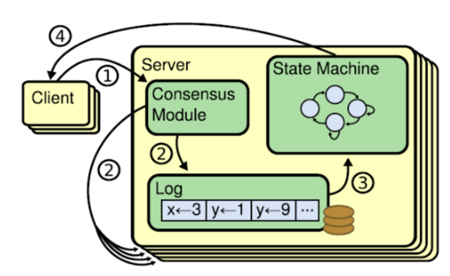
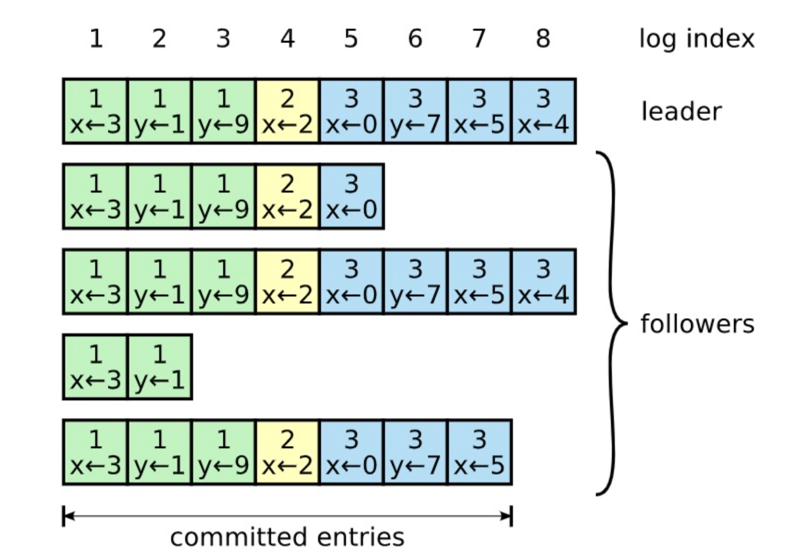
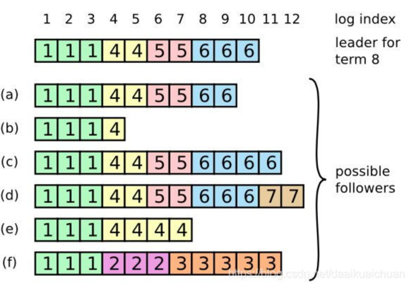
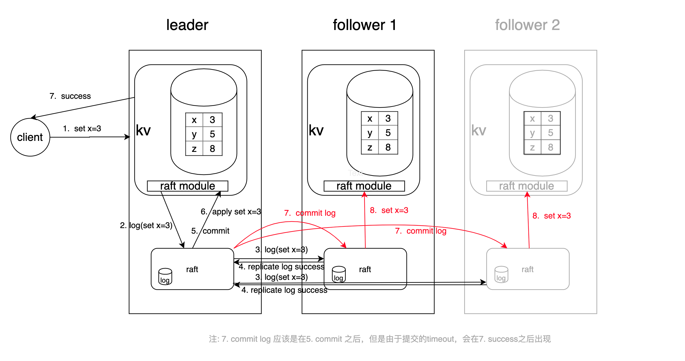

# raft协议

官方参考链接：https://raft.github.io/#implementations

Raft是一个用于管理日志一致性的协议。它将分布式一致性分解为多个子问题：Leader选举（Leader election）、日志复制（Log replication）、安全性（Safety）、日志压缩（Log compaction）等。

## 背景：如何避免单点故障

为了解决单点问题，软件系统工程师引入了数据复制技术，实现多副本。通过数据复制方案，一方面我们可以提高服务可用性，避免单点故障。
另一方面，多副本可以提升读吞吐量、甚至就近部署在业务所在的地理位置，降低访问延迟。

## 多副本常用的技术方案

### 主从复制，又分为全同步复制、异步复制、半同步复制，比如 MySQL/Redis 单机主备版就基于主从复制实现的。

1. 全同步复制是指主收到一个写请求后，必须等待全部从节点确认返回后，才能返回给客户端成功。因此如果一个从节点故障，整个系统就会不可用。
这种方案为了保证多副本的一致性，而牺牲了可用性，一般使用不多。

2. 异步复制是指主收到一个写请求后，可及时返回给 client，异步将请求转发给各个副本，若还未将请求转发到副本前就故障了，则可能导致数据丢失，但是可用性是最高的。

3. 半同步复制介于全同步复制、异步复制之间，它是指主收到一个写请求后，至少有一个副本接收数据后，就可以返回给客户端成功，在数据一致性、可用性上实现了平衡和取舍

### 中心化复制

它是指在一个 n 副本节点集群中，任意节点都可接受写请求，但一个成功的写入需要 w 个节点确认，读取也必须查询至少 r 个节点。
根据实际业务场景对数据一致性的敏感度，设置合适 w/r 参数。比如你希望每次写入后，任意 client 都能读取到新值，如果 n 是 3 个副本，
你可以将 w 和 r 设置为 2，这样当你读两个节点时候，必有一个节点含有最近写入的新值，这种读我们称之为法定票数读（quorum read）。

AWS 的 Dynamo 系统就是基于去中心化的复制算法实现的。它的优点是节点角色都是平等的，降低运维复杂度，可用性更高。
但是缺陷是去中心化复制，势必会导致各种写入冲突，业务需要关注冲突处理

#### 如何解决以上复制算法的困境呢？

共识算法

##### 复制状态机的结构（引用自 Raft paper）

它由共识模块、日志模块、状态机组成。通过共识模块保证各个节点日志的一致性，然后各个节点基于同样的日志、顺序执行指令，最终各个复制状态机的结果实现一致。

## Raft 算法

raft的理论基础是Replicated State Machine，Replicated State Machine需要满足如下的条件：
一个server可以有多个state，多个server从同一个start状态出发，都执行相同的command序列，最终到达的state是一样的。



如上图，一般使用replicated log来记录command序列，client的请求被leader转化成log entry，然后通过一致性模块把log同步到各个server，让各个server的log一致。
每个server都有state Machine，从start出发，执行完这些log中的command后，server处于相同的state。所以raft协议的关键就是保证各个server的log一致，然后每个server通过执行相同的log来达到一致的状态

    
复杂的共识问题拆分成三个子问题    
    
1. Leader 选举，Leader 故障后集群能快速选出新 Leader；
2. 日志复制， 集群只有 Leader 能写入日志， Leader 负责复制日志到 Follower 节点，并强制 Follower 节点与自己保持相同；
3. 安全性，一个任期内集群只能产生一个 Leader、已提交的日志条目在发生 Leader 选举时，

一定会存在更高任期的新 Leader 日志中、各个节点的状态机应用的任意位置的日志条目内容应一样.


### 1. 选举

- 选举过程图1（单个节点视角）


Raft 算法中服务器节点之间通信使用远程过程调用（RPC），并且基本的一致性算法只需要两种类型的 RPC，为了在服务器之间传输快照增加了第三种 RPC。

【RPC有三种】：

    1. RequestVote RPC：候选人在选举期间发起。

    2. AppendEntries RPC：领导人发起的一种心跳机制，复制日志也在该命令中完成。

    3. InstallSnapshot RPC: 领导者使用该RPC来发送快照给太落后的追随者
  
- 选举过程图2（整体视角）

  
监听事件-->源码实现

```go
func (r *Raft) run() {
	for {
		// Check if we are doing a shutdown
		select {
		case <-r.shutdownCh:
			// Clear the leader to prevent forwarding
			r.setLeader("")
			return
		default:
		}

		switch r.getState() {
		case Follower:
			r.runFollower()
		case Candidate:
			r.runCandidate()
		case Leader:
			r.runLeader()
		}
	}
}
```
  

### 2. 日志复制

日志格式：日志由有序编号（log index）的日志条目组成。每个日志条目包含它被创建时的任期号（term）和用于状态机执行的命令。
如果一个日志条目被复制到大多数服务器上，就被认为可以提交（commit）了。
    
term + index + cmd + type，对应源码

```go
// /Users/python/go/pkg/mod/github.com/hashicorp/raft@v1.3.5/log.go
type Log struct {
	// Index holds the index of the log entry.
	Index uint64

	// Term holds the election term of the log entry.
	Term uint64

	// Type holds the type of the log entry.
	Type LogType

	// Data holds the log entry's type-specific data.
	Data []byte
	
	// ....
}
```




#### 1. 日志复制的两条保证
如果不同日志中的两个条目有着相同的索引和任期号，则它们所存储的命令是相同的（原因：leader 最多在一个任期里的一个日志索引位置创建一条日志条目，日志条目在日志的位置从来不会改变）。

如果不同日志中的两个条目有着相同的索引和任期号，则它们之前的所有条目都是完全一样的（原因：每次 RPC 发送附加日志时，leader 会把这条日志条目的前面的日志的下标和任期号一起发送给 follower，如果 follower 发现和自己的日志不匹配，那么就拒绝接受这条日志，这个称之为一致性检查）。

#### 2. 日志的不正常情况

一般情况下，Leader和Followers的日志保持一致，因此 AppendEntries 一致性检查通常不会失败。然而，Leader崩溃可能会导致日志不一致：旧的Leader可能没有完全复制完日志中的所有条目。

下图阐述了一些Followers可能和新的Leader日志不同的情况。一个Follower可能会丢失掉Leader上的一些条目，也有可能包含一些Leader没有的条目，也有可能两者都会发生。丢失的或者多出来的条目可能会持续多个任期。

#### 3.如何保证日志的正常复制
Leader通过强制Followers复制它的日志来处理日志的不一致，Followers上的不一致的日志会被Leader的日志覆盖。Leader为了使Followers的日志同自己的一致，Leader需要找到Followers同它的日志一致的地方，然后覆盖Followers在该位置之后的条目。

具体的操作是：Leader会从后往前试，每次AppendEntries失败后尝试前一个日志条目，直到成功找到每个Follower的日志一致位置点（基于上述的两条保证），然后向后逐条覆盖Followers在该位置之后的条目。

总结一下就是：当 leader 和 follower 日志冲突的时候，leader 将校验 follower 最后一条日志是否和 leader 匹配，如果不匹配，将递减查询，直到匹配，匹配后，删除冲突的日志。这样就实现了主从日志的一致性


详细流程 


### 3. 安全性
Raft增加了如下两条限制以保证安全性：

- 拥有最新的已提交的log entry的Follower才有资格成为leader。

- Leader只能推进commit index来提交当前term的已经复制到大多数服务器上的日志，旧term日志的提交要等到提交当前term的日志来间接提交（log index 小于 commit index的日志被间接提交）