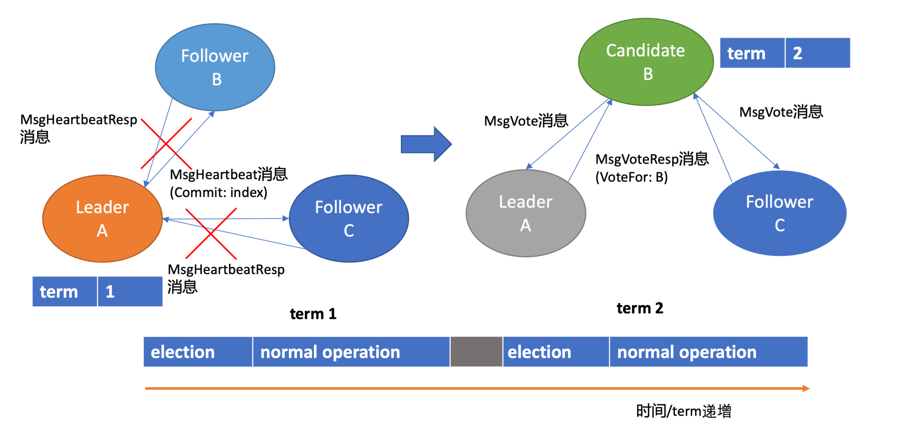
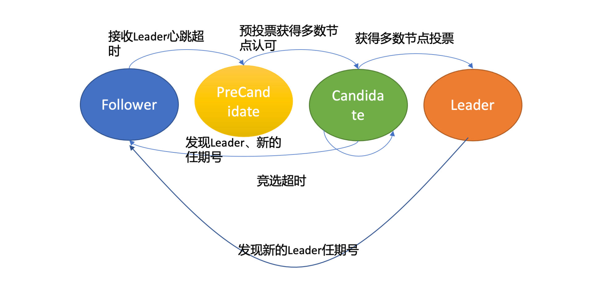
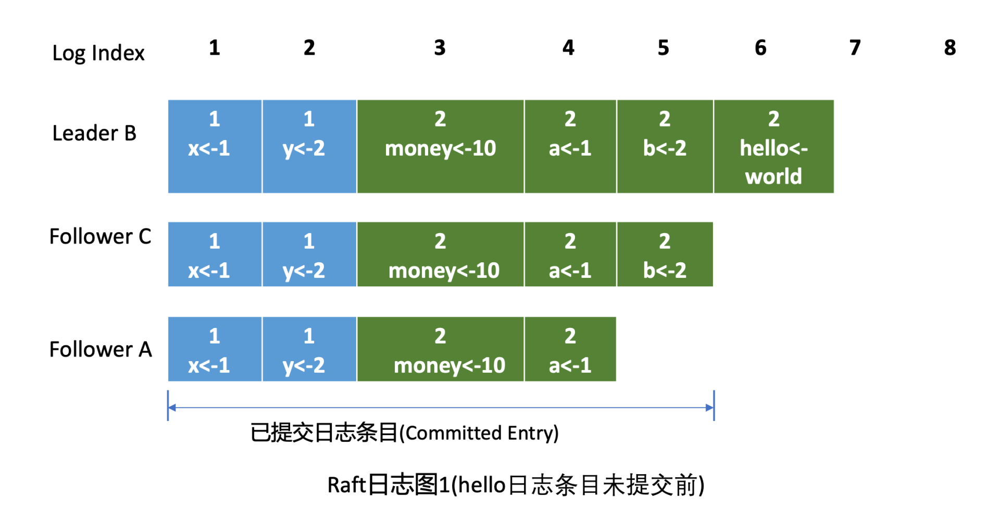

# raft应用-->etcd

## 1. etcd Leader 选举原理

假设集群总共 3 个节点，A 节点为 Leader，B、C 节点为 Follower.  

如上 Leader 选举图右边部分所示，当 Leader 节点异常后，Follower 节点会接收 Leader 的心跳消息超时，当超时时间大于竞选超时时间后，它们会进入 Candidate 状态.
etcd 默认心跳间隔时间（heartbeat-interval）是 100ms， 默认竞选超时时间（election timeout）是 1000ms， 你需要根据实际部署环境、业务场景适当调优，
否则就很可能会频繁发生 Leader 选举切换，导致服务稳定性下降.

C 节点收到 Follower B 节点竞选 Leader 消息后，这时候可能会出现如下两种情况

1. 第一种情况是 C 节点判断 B 节点的数据至少和自己一样新、B 节点任期号大于 C 当前任期号、并且 C 未投票给其他候选者，就可投票给 B。
    这时 B 节点获得了集群多数节点支持，于是成为了新的 Leader。

2. 第二种情况是，恰好 C 也心跳超时超过竞选时间了，它也发起了选举，并投票给了自己，那么它将拒绝投票给 B，这时谁也无法获取集群多数派支持，只能等待竞选超时，
    开启新一轮选举。Raft 为了优化选票被瓜分导致选举失败的问题，引入了随机数，每个节点等待发起选举的时间点不一致，优雅的解决了潜在的竞选活锁，同时易于理解。

### 特殊情况

A 节点 crash 后，再次启动成为 Follower，假设因为网络问题无法连通 B、C 节点，这时候根据状态图，我们知道它将不停自增任期号，发起选举。
等 A 节点网络异常恢复后，那么现有 Leader 收到了新的任期号，就会触发新一轮 Leader 选举，影响服务的可用性。

然而 A 节点的数据是远远落后 B、C 的，是无法获得集群 Leader 地位的，发起的选举无效且对集群稳定性有伤害

如何避免以上场景中的无效的选举呢？

在 etcd 3.4 中，etcd 引入了一个 PreVote 参数（默认 false），可以用来启用 PreCandidate 状态解决此问题，如下图所示。
Follower 在转换成 Candidate 状态前，先进入 PreCandidate 状态，不自增任期号， 发起预投票。若获得集群多数节点认可，
确定有概率成为 Leader 才能进入 Candidate 状态，发起选举流程

## 2. 日志复制

首先 Leader 收到 client 的请求后，etcdserver 的 KV 模块会向 Raft 模块提交一个 put hello 为 world 提案消息（流程图中的序号 2 流程）， 
它的消息类型是 MsgProp.

Leader 的 Raft 模块获取到 MsgProp 提案消息后，为此提案生成一个日志条目，追加到未持久化、不稳定的 Raft 日志中，随后会遍历集群 Follower 列表和进度信息，
为每个 Follower 生成追加（MsgApp）类型的 RPC 消息，此消息中包含待复制给 Follower 的日志条目

### 两个疑问

1. Leader 是如何知道从哪个索引位置发送日志条目给 Follower，以及 Follower 已复制的日志最大索引是多少呢？

2. 日志条目什么时候才会追加到稳定的 Raft 日志中呢？Raft 模块负责持久化吗？

1. 第一个疑问

Leader 会维护两个核心字段来追踪各个 Follower 的进度信息，一个字段是 NextIndex， 它表示 Leader 发送给 Follower 节点的下一个日志条目索引。
一个字段是 MatchIndex， 它表示 Follower 节点已复制的最大日志条目的索引，比如上面的日志图 1 中 C 节点的已复制最大日志条目索引为 5，A 节点为 4。
   
2. 第二个疑问

etcd Raft 模块设计实现上抽象了网络、存储、日志等模块，它本身并不会进行网络、存储相关的操作，上层应用需结合自己业务场景选择内置的模块或自定义实现网络、存储、日志等模块

上层应用通过 Raft 模块的输出接口（如 Ready 结构），获取到待持久化的日志条目和待发送给 Peer 节点的消息后（如上面的 MsgApp 日志消息），
需持久化日志条目到自定义的 WAL 模块，通过自定义的网络模块将消息发送给 Peer 节点。

etcd Raft 模块提供了一个内置的内存存储（MemoryStorage）模块实现，etcd 使用的就是它，Raft 日志条目保存在内存中。
网络模块并未提供内置的实现，etcd 基于 HTTP 协议实现了 peer 节点间的网络通信，并根据消息类型，支持选择 pipeline、stream 等模式发送，显著提高了网络吞吐量、降低了延时

Raft 模块输入是 Msg 消息，输出是一个 Ready 结构，它包含待持久化的日志条目、发送给 peer 节点的消息、已提交的日志条目内容、线性查询结果等 Raft 输出核心信息。
etcdserver 模块通过 channel 从 Raft 模块获取到 Ready 结构后（流程图中的序号 3 流程），因 B 节点是 Leader，

它首先会通过基于 HTTP 协议的网络模块将追加日志条目消息（MsgApp）广播给 Follower，并同时将待持久化的日志条目持久化到 WAL 文件中（流程图中的序号 4 流程），
最后将日志条目追加到稳定的 Raft 日志存储中（流程图中的序号 5 流程）。

各个 Follower 收到追加日志条目（MsgApp）消息，并通过安全检查后，它会持久化消息到 WAL 日志中，并将消息追加到 Raft 日志存储，
随后会向 Leader 回复一个应答追加日志条目（MsgAppResp）的消息，告知 Leader 当前已复制的日志最大索引（流程图中的序号 6 流程）。

Leader 收到应答追加日志条目（MsgAppResp）消息后，会将 Follower 回复的已复制日志最大索引更新到跟踪 Follower 进展的 Match Index 字段，
如下面的日志图 2 中的 Follower C MatchIndex 为 6，Follower A 为 5，日志图 2 描述的是 hello 日志条目提交后的各节点 Raft 日志状态。

在我们这个案例中日志图里 6 号索引位置之前的日志条目已被多数节点复制，那么他们状态都可被设置为已提交。Leader 可通过在发送心跳消息（MsgHeartbeat）给 Follower 节点时，告知它已经提交的日志索引位置。

最后各个节点的 etcdserver 模块，可通过 channel 从 Raft 模块获取到已提交的日志条目（流程图中的序号 7 流程），应用日志条目内容到存储状态机（流程图中的序号 8 流程），返回结果给 client

## 3. 安全性

Raft 通过给 *选举* 和 *日志复制* 增加一系列规则，来实现 Raft 算法的安全.

如果在上面的日志图 2 中，Leader B 在应用日志指令 put hello 为 world 到状态机，并返回给 client 成功后，突然 crash 了，那么 Follower A 和 C 是否都有资格选举成为 Leader 呢？

从日志图 2 中我们可以看到，如果 A 成为了 Leader 那么就会导致数据丢失，因为它并未含有刚刚 client 已经写入成功的 put hello 为 world 指令。

Raft 算法如何确保面对这类问题时不丢数据和各节点数据一致性呢？这就是 Raft 的第三个子问题需要解决的。Raft 通过给选举和日志复制增加一系列规则，来实现 Raft 算法的安全性

### 选举规则
当节点收到选举投票的时候，需检查候选者的最后一条日志中的任期号，若小于自己则拒绝投票。如果任期号相同，日志却比自己短，也拒绝为其投票。

比如在日志图 2 中，Follower A 和 C 任期号相同，但是 Follower C 的数据比 Follower A 要长，那么在选举的时候，Follower C 将拒绝投票给 A， 因为它的数据不是最新的。

### 日志复制规则

#### 问题
在日志图 2 中，Leader B 返回给 client 成功后若突然 crash 了，此时可能还并未将 6 号日志条目已提交的消息通知到 Follower A 和 C，那么如何确保 6 号日志条目不被新 Leader 删除呢？

同时在 etcd 集群运行过程中，Leader 节点若频繁发生 crash 后，可能会导致 Follower 节点与 Leader 节点日志条目冲突，如何保证各个节点的同 Raft 日志位置含有同样的日志条目？
#### 解决方式

通过 Raft 算法中的*Leader 完全特性* 和 *只附加原则* 、*日志匹配* 等安全机制来保证的。

- Leader 完全特性是指如果某个日志条目在某个任期号中已经被提交，那么这个条目必然出现在更大任期号的所有 Leader 中。

- Leader 只能追加日志条目，不能删除已持久化的日志条目（只附加原则），因此 Follower C 成为新 Leader 后，会将前任的 6 号日志条目复制到 A 节点。

- 为了保证各个节点日志一致性，Raft 算法在追加日志的时候，引入了一致性检查。Leader 在发送追加日志 RPC 消息时，会把新的日志条目紧接着之前的条目的索引位置和任期号包含在里面。
Follower 节点会检查相同索引位置的任期号是否与 Leader 一致，一致才能追加，这就是日志匹配特性。