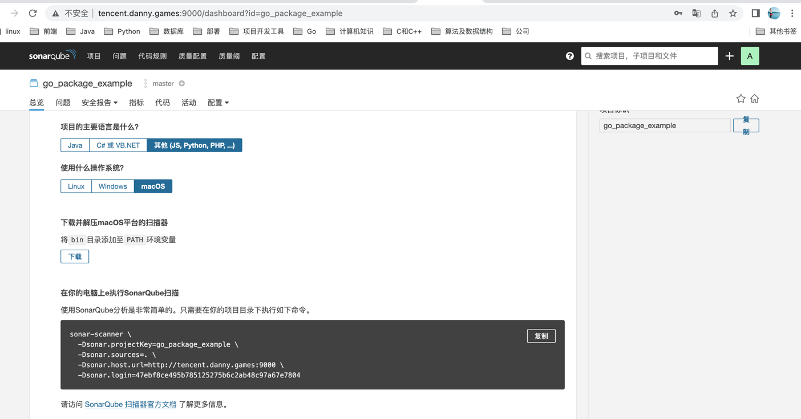
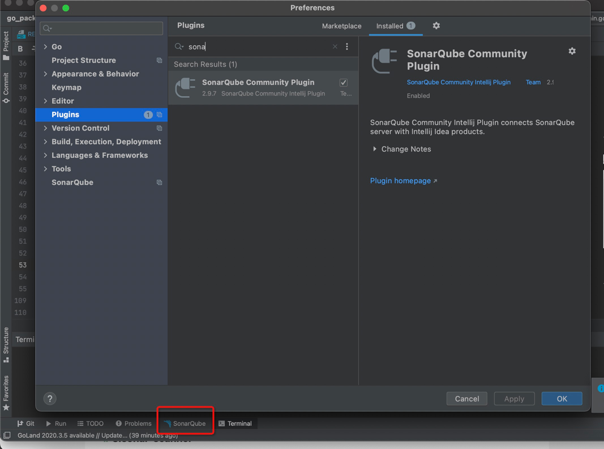
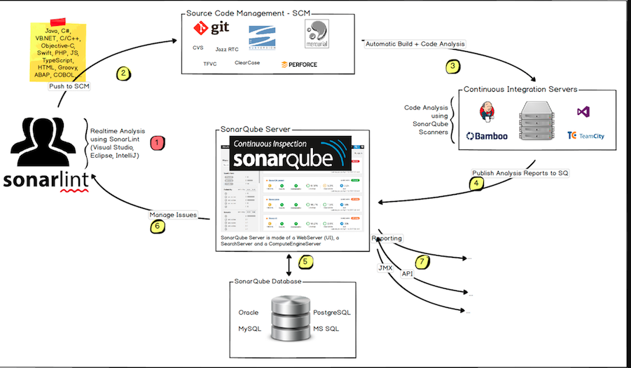

# sonar

sonar是一款静态代码质量分析工具，支持Java、Python、PHP、JavaScript、CSS等25种以上的语言，而且能够集成在IDE、Jenkins、Git等服务中，方便随时查看代码质量分析报告；

## sonarQube能带来什么？

1. 重复:显然程序中包含大量复制粘贴的代码是质量低下的

2. 缺乏单元测试: sonar可以很方便地统计并展示单元测试覆盖率

3. 没有足够的或者过多的注释

## Sonar的客户端共有四种
- Sonar-Scanner。一个独立的扫描器，通过简单的命令就能对项目进行静态扫描，并将扫描结果上传至SonarQube。
- sonar maven插件。一个maven插件，能通过maven命令执行静态扫描。
- sonar ant插件。ant上的插件。
- sonar IDE插件。可以直接集成到IDE中(比如IntelliJ)。


## sonar的组成

一个sonar项目主要有以下四个组件构成：

1. 一台SonarQube Server启动3个主要过程：
- Web服务器，供开发人员，管理人员浏览高质量的快照并配置SonarQube实例
- 基于Elasticsearch的Search Server从UI进行后退搜索
- Compute Engine服务器，负责处理代码分析报告并将其保存在SonarQube数据库中

2. 一个SonarQube数据库要存储：
- SonarQube实例的配置（安全性，插件设置等）
- 项目，视图等的质量快照。

3. 服务器上安装了多个SonarQube插件，可能包括语言，SCM，集成，身份验证和管理插件

4. 在构建/持续集成服务器上运行一个或多个SonarScanner，以分析项目


## 平台要求
> The SonarQube server require Java version 11 and the SonarQube scanners require Java version 11 or 17.
1. 服务端java11
2. 客户端scanners Java11或则17

## 搭建服务端

```shell
docker run --name db -e POSTGRES_USER=sonar -e POSTGRES_PASSWORD=sonar -d postgres
docker run --name sq --link db -e SONARQUBE_JDBC_URL=jdbc:postgresql://db:5432/sonar -p 9000:9000 -d docker.io/lu566/sonarqube-zh:7.7
```

login: admin
password: admin

## 搭建客户端
1. 命令行 sonar-scanner
```shell
sonar-scanner \
  -Dsonar.projectKey=go_package_example \
  -Dsonar.sources=. \
  -Dsonar.host.url=http://tencent.danny.games:9000 \
  -Dsonar.login=admin \
  -Dsonar.password=admin \
  -Dsonar.language=go
```


2. golang插件:sonarqube

   

## 与Go工具对比

### 1. 单元测试
```shell
go test -v xxx -json > test.json
```
sonar的项目配置文件sonar-project.properties中添加如下配置：
```properties
sonar.go.tests.reportPaths=xx/xx/xx
```

### 2. 覆盖率 
```shell
go test -coverprofile=covprofile
```

sonar的项目配置文件sonar-project.properties中添加如下配置：
```properties
sonar.go.coverage.reportPaths=xx/xx/xx
```

### 3. 静态扫描

```shell
go vet -n xxx 2> report.out
```

sonar的项目配置文件sonar-project.properties中添加如下配置：
```properties
sonar.go.govet.reportPaths=xx/xx/xx
```

### 4. 外部规则

#### 常用的Linter介绍

- deadcode : 未使用且未导出的函数(比如：首字母小写且未被调用的方法)

- errcheck : 返回的error未处理

- structcheck : 检测结构体中未使用的字段

- unused:  方法中方法名首字母小写(未导出)并且未使用的方法

- gosimple: 代码中有需要优化的地方

- ineffassign ： 检查是否有未使⽤的代码

- varcheck - 未使⽤的全局变量和常量检查


#### golint ：官方，deprecated
golint生成覆盖率统计报告
```shell
golint xx/xx > golint
```

sonar的项目配置文件sonar-project.properties中添加如下配置
```shell
sonar.go.golint.reportPaths=xx/xx/xx
```

#### gometalinter:不维护了
```shell
gometalinter xx/xx > gometalinter
```

sonar的项目配置文件sonar-project.properties中添加如下配置
```properties
sonar.go.gometalinter.reportPaths=xx/xx/xx
```

#### golangci-lint
Golang常用的checkstyle有golangci-lint和golint，golangci-lint用于许多开源项目中，比如kubernetes、Prometheus、TiDB等都使用golangci-lint用于代码检查，
TIDB的makefile中的check-static使用golangci-lint进行代码检查，可参考：https://github.com/pingcap/tidb/blob/master/Makefile

#### 特点
- 速度快：基于gometalinter开发，但平均速度比他快5倍，主要原因是：可以并行检查，可以复用go build缓存，会缓存分析结果
- 可配置：支持yaml格式
- IDE继承：可以支持vscode,goland等
- linter聚合器：1.41.1版本集成了76个linter,还支持自定义。
- 良好的输出：结果带颜色，代码行号和linter标识，易于查看和定位。


#### golangci-lint使用

1. 检查当前目录下所有的文件
```shell
golangci-lint run  等同于  golangci-lint run ./...
```


2. 可以指定某个目录和文件

```shell
golangci-lint run dir1 dir2/... dir3/file1.go
```


检查dir1和dir2目录下的代码及dir3目录下的file1.go文件


3. 可以通过--enable/-E开启指定Linter，也可以通--disable/-D关闭指定Linter
```shell
golangci-lint run --no-config --disable-all -E errcheck ./...

```

4. 根据指定配置⽂件，进⾏静态代码检查
```shell
golangci-lint run -c .golangci.yaml ./...
```

## 工作流转


1. 开发人员在其IDE中进行编码，并使用SonarLint(sonarlint是idea的插件)运行本地分析。
2. 开发人员将其代码推送到他们最喜欢的SCM(source code management)中：git，SVN，TFVC等
3. Continuous Integration Server会触发自动构建，并执行运行SonarQube分析所需的SonarScanner。
4. 分析报告将发送到SonarQube服务器进行处理。
5. SonarQube Server处理分析报告结果并将其存储在SonarQube数据库中，并在UI中显示结果
6. 开发人员通过SonarQube UI审查，评论，挑战他们的问题，以管理和减少技术债务。
7. 经理从分析中接收报告。Ops使用API自动执行配置并从SonarQube提取数据。运维人员使用JMX监视SonarQube Server。


## 参考连接
1. 官网：https://docs.sonarqube.org/latest/user-guide/concepts/