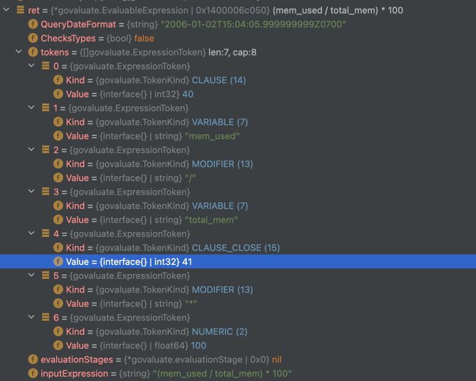

<!-- START doctoc generated TOC please keep comment here to allow auto update -->
<!-- DON'T EDIT THIS SECTION, INSTEAD RE-RUN doctoc TO UPDATE -->
**Table of Contents**  *generated with [DocToc](https://github.com/thlorenz/doctoc)*

- [govaluate](#govaluate)
  - [源码分析](#%E6%BA%90%E7%A0%81%E5%88%86%E6%9E%90)
  - [参考](#%E5%8F%82%E8%80%83)

<!-- END doctoc generated TOC please keep comment here to allow auto update -->

#  govaluate


## 源码分析

结构体
```go
type EvaluableExpression struct {

	/*
		Represents the query format used to output dates. Typically only used when creating SQL or Mongo queries from an expression.
		Defaults to the complete ISO8601 format, including nanoseconds.
	*/
	QueryDateFormat string

	/*
		Whether or not to safely check types when evaluating.
		If true, this library will return error messages when invalid types are used.
		If false, the library will panic when operators encounter types they can't use.

		This is exclusively for users who need to squeeze every ounce of speed out of the library as they can,
		and you should only set this to false if you know exactly what you're doing.
	*/
	ChecksTypes bool

	tokens           []ExpressionToken
	evaluationStages *evaluationStage
	inputExpression  string // 原始的表达式
}
```

初始化 
```go
// github.com/!knetic/govaluate@v3.0.1-0.20171022003610-9aa49832a739+incompatible/EvaluableExpression.go
func NewEvaluableExpressionWithFunctions(expression string, functions map[string]ExpressionFunction) (*EvaluableExpression, error) {

	var ret *EvaluableExpression
	var err error

	ret = new(EvaluableExpression)
	ret.QueryDateFormat = isoDateFormat
	ret.inputExpression = expression

	// 解析 token 
	ret.tokens, err = parseTokens(expression, functions)
	if err != nil {
		return nil, err
	}

	
	// 语法分析
	// 检查括号
	err = checkBalance(ret.tokens)
	if err != nil {
		return nil, err
	}

	// check当前的token是否是上一个token的合法值，合法值是预设的
	err = checkExpressionSyntax(ret.tokens)
	if err != nil {
		return nil, err
	}

	ret.tokens, err = optimizeTokens(ret.tokens)
	if err != nil {
		return nil, err
	}

	// 执行计划解析
	ret.evaluationStages, err = planStages(ret.tokens)
	if err != nil {
		return nil, err
	}

	ret.ChecksTypes = true
	return ret, nil
}
```


解析成 token 
```go
type ExpressionToken struct {
	Kind  TokenKind
	Value interface{}
}


type TokenKind int

const (
	UNKNOWN TokenKind = iota

	PREFIX
	NUMERIC
	BOOLEAN
	STRING
	PATTERN
	TIME
	VARIABLE
	FUNCTION
	SEPARATOR
	ACCESSOR

	COMPARATOR
	LOGICALOP
	MODIFIER

	CLAUSE
	CLAUSE_CLOSE

	TERNARY
)


// 对应的类型 前缀
var prefixSymbols = map[string]OperatorSymbol{
	"-": NEGATE,
	"!": INVERT,
	"~": BITWISE_NOT,
}
```

"(mem_used / total_mem) * 100" parseToken 后的一堆token:


```go
func checkExpressionSyntax(tokens []ExpressionToken) error {

	var state lexerState
	var lastToken ExpressionToken
	var err error

	state = validLexerStates[0]

	for _, token := range tokens {

		if !state.canTransitionTo(token.Kind) {
			// 判断合法性
		}


		lastToken = token
	}

	if !state.isEOF {
		return errors.New("Unexpected end of expression")
	}
	return nil
}
```

比如  lexerState NUMERIC 类型
```go
lexerState{

		kind:       NUMERIC,
		isEOF:      true,
		isNullable: false,
		validNextKinds: []TokenKind{

			MODIFIER,
			COMPARATOR,
			LOGICALOP,
			CLAUSE_CLOSE,
			TERNARY,
			SEPARATOR,
		},
	},
```

## 参考

- https://github.com/jianfengye/inside-go/tree/master/govaluate-3.0.0
- [用规则引擎让你一天上线十个需求](https://zhuanlan.zhihu.com/p/456838412)